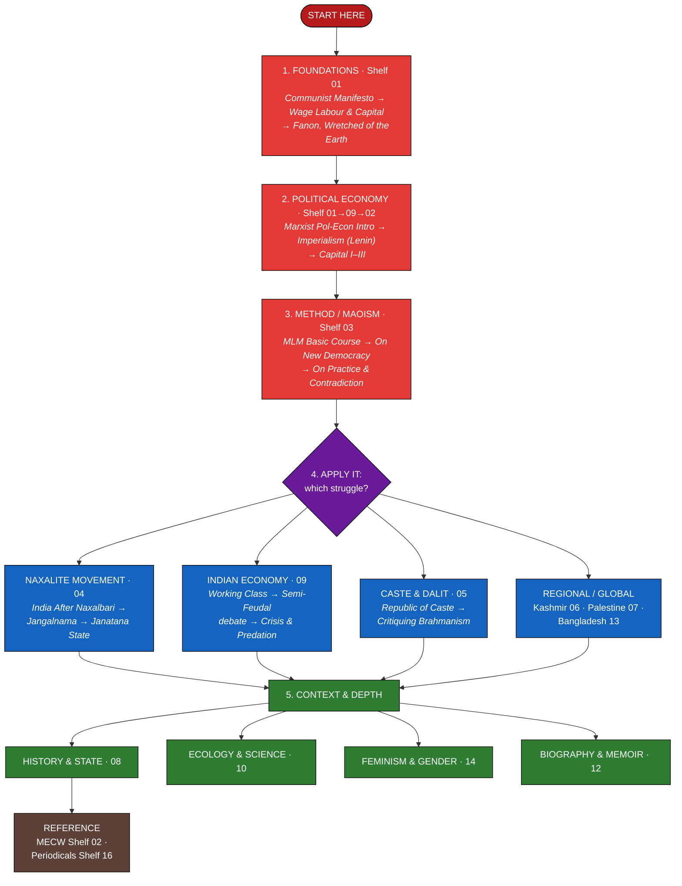

# পাঠশালা — একটি চলমান গ্রন্থাগার

মার্কসবাদ, ভারত ও বাংলাদেশের কমিউনিস্ট ও নকশাল আন্দোলন, জাতপাত, কাশ্মীর, প্যালেস্টাইন, ইতিহাস, রাজনৈতিক অর্থনীতি, বাস্তুতন্ত্র, বাংলা ও বিশ্বসাহিত্য — এবং একটি স্বতন্ত্র সাইবার-নিরাপত্তা তাক নিয়ে সাজানো **385 টি পিডিএফ বই, পুস্তিকা ও পত্রিকার** একটি গ্রন্থাগার।

প্রতিটি ফাইলকে এর প্রকৃত শিরোনামে নতুন নাম দেওয়া হয়েছে, বিষয়ভিত্তিক তাকে সাজানো হয়েছে, একটি **পাঠ-স্তর** দেওয়া হয়েছে এবং সংক্ষিপ্ত সারসংক্ষেপ যোগ করা হয়েছে। **এই পাতার ইংরেজি সংস্করণ: [README.md](README.md)।**

> ## 📥 বইগুলো ডাউনলোড করুন
> ফাইলগুলো GitHub-এর জন্য অনেক বড় (~৬.৫ গিগাবাইট), তাই পুরো গ্রন্থাগারটি **Google Drive-এ সবার জন্য উন্মুক্ত** রাখা হয়েছে:
> 
> ### ➤ **[Google Drive-এ গ্রন্থাগার খুলুন](https://drive.google.com/drive/folders/1kIpTbRnVZQIO8AFEYrJ9ySVf8qcGhFAc?usp=sharing)**
> 
> **নিচের তালিকার প্রতিটি বইয়ের শিরোনাম সরাসরি Google Drive-এ সেই PDF-এর সঙ্গে লিঙ্ক করা** — শিরোনামে ক্লিক করলেই বইটি খুলবে বা নামানো যাবে; অথবা উপরের ফোল্ডার লিঙ্ক থেকে একসঙ্গে সব নিন।

**ভাষা:** 221 ইংরেজি, 164 বাংলা &nbsp;•&nbsp; **স্তর:** 83 প্রাথমিক, 166 মধ্যম, 79 উন্নত, 50 রেফারেন্স

> বেশিরভাগ বই বামপন্থী/মৌলবাদী ধারার; *(বন্ধনীতে)* বাংলা বইয়ের ইংরেজি শিরোনাম দেওয়া আছে। কিছু স্ক্যান করা ফাইলে কোনো তথ্য না থাকায় সেগুলো সততার সঙ্গে *Unidentified* হিসেবে চিহ্নিত।

> **নোট:** বইয়ের সারসংক্ষেপগুলো আপাতত ইংরেজিতে রাখা হয়েছে; বাকি সব নির্দেশনা বাংলায়।

**পাঠ-স্তর সংকেত** — 🟢 **প্রাথমিক** (কোনো পূর্বজ্ঞান লাগে না) · 🟡 **মধ্যম** (সামান্য প্রস্তুতি কাজে দেয়) · 🔴 **উন্নত** (জটিল / পাণ্ডিত্যপূর্ণ) · 📘 **রেফারেন্স** (খুঁজে দেখার জন্য, শুরু-থেকে-শেষ পড়ার জন্য নয়)।

---

## তাকসমূহ

| # | তাক | সংখ্যা | কী আছে |
|---|-----|------:|--------|
| 01 | [মার্কসবাদী ও সমালোচনামূলক তত্ত্বের ক্লাসিক](#০১--মরকসবদ-ও-সমলচনমলক-তততবর-কলসক) | 36 | মার্ক্স, এঙ্গেলস, লেনিন, মাও ও সমালোচনামূলক তত্ত্ব - ভিত্তি |
| 02 | [মার্ক্স-এঙ্গেলস রচনাসমগ্র (MECW)](#০২--মরকসএঙগলস-রচনসমগর-mecw) | 50 | ৫০ খণ্ডের রচনাসমগ্র (*ক্যাপিটাল* ১-৩ সহ) |
| 03 | [মাওবাদ ও জনযুদ্ধ](#০৩--মওবদ-ও-জনযদধ) | 28 | মাও, জনযুদ্ধ ও আধুনিক এমএলএম ধারা |
| 04 | [ভারতীয় কমিউনিস্ট ও নকশাল আন্দোলন](#০৪--ভরতয-কমউনসট-ও-নকশল-আনদলন) | 35 | নকশালবাড়ি থেকে দণ্ডকারণ্য - ভারতের মাওবাদী আন্দোলন |
| 05 | [জাতপাত, দলিত ও সামাজিক ন্যায়](#০৫--জতপত-দলত-ও-সমজক-নযয) | 11 | জাতপাত, দলিত ইতিহাস ও জাতপাত-বিরোধী তত্ত্ব |
| 06 | [কাশ্মীর](#০৬--কশমর) | 13 | কাশ্মীর - ইতিহাস, জাতীয়তাবাদ, মানবাধিকার |
| 07 | [প্যালেস্টাইন ও পশ্চিম এশিয়া](#০৭--পযলসটইন-ও-পশচম-এশয) | 7 | প্যালেস্টাইন - ইতিহাস, কর্মসূচি, নির্বাসনের সাহিত্য |
| 08 | [ইতিহাস, রাষ্ট্র ও রাজনীতি](#০৮--ইতহস-রষটর-ও-রজনত) | 54 | বিস্তৃত ইতিহাস, রাজনীতি, মিডিয়া, আইন ও রাষ্ট্র |
| 09 | [রাজনৈতিক অর্থনীতি ও বিশ্বায়ন](#০৯--রজনতক-অরথনত-ও-বশবযন) | 21 | পুঁজিবাদ, সাম্রাজ্যবাদ, ঋণ ও ভারতীয় অর্থনীতি |
| 10 | [বাস্তুতন্ত্র, বিজ্ঞান ও সমাজ](#১০--বসততনতর-বজঞন-ও-সমজ) | 13 | বাস্তুতন্ত্র, বিজ্ঞানের দর্শন ও যুক্তিবাদ |
| 11 | [সাহিত্য ও শিল্পকলা](#১১--সহতয-ও-শলপকল) | 45 | কথাসাহিত্য, কবিতা, গান, নাটক - বাংলা ও বিশ্ব |
| 12 | [জীবনী ও স্মৃতিকথা](#১২--জবন-ও-সমতকথ) | 18 | বিপ্লবীদের স্মৃতিকথা ও জীবনী |
| 13 | [বাংলাদেশ - ইতিহাস ও রাজনীতি](#১৩--বলদশ--ইতহস-ও-রজনত) | 12 | পূর্ববঙ্গ/বাংলাদেশ - ১৯৫২, ১৯৭১, ভাসানী, সিকদার |
| 14 | [নারীবাদ ও লিঙ্গ](#১৪--নরবদ-ও-লঙগ) | 7 | বিপ্লবে নারী ও মুক্তির তত্ত্ব |
| 15 | [সাইবার নিরাপত্তা ও হ্যাকিং](#১৫--সইবর-নরপতত-ও-হযক) | 17 | নৈতিক হ্যাকিং, পেন-টেস্টিং ও ডার্ক ওয়েব (স্বতন্ত্র) |
| 16 | [সাময়িকী, পুস্তিকা ও প্রতিবেদন](#১৬--সমযক-পসতক-ও-পরতবদন) | 18 | পত্রিকা, বুলেটিন, পুস্তিকা ও সরকারি প্রতিবেদন |

---

## পাঠ-মানচিত্র — কোথা থেকে শুরু করবেন

গ্রন্থাগারে চলার তিনটি স্বতন্ত্র পথ। যেটি আপনাকে টানে তার সংখ্যাযুক্ত মূল ধারা অনুসরণ করুন; পাশের শাখাগুলো ঐচ্ছিক, যেকোনো ক্রমে পড়তে পারেন। *(মানচিত্রের লেখা ইংরেজিতে, কারণ বইয়ের শিরোনামও ইংরেজিতে।)*

### 🚩 মানচিত্র ১ — রাজনীতি, তত্ত্ব ও ইতিহাস

সংগ্রহের মূল স্রোত। **ভিত্তি** দিয়ে শুরু করুন, **পদ্ধতি** আয়ত্ত করুন, তারপর একটি **সংগ্রাম** বেছে নিন, এরপর **প্রেক্ষাপটে** ছড়িয়ে পড়ুন।

### 🔐 মানচিত্র ২ — সাইবার নিরাপত্তা ও হ্যাকিং

একটি স্বতন্ত্র কারিগরি পথ। সংখ্যাযুক্ত ধারা বেয়ে উঠুন (পরিচিতি → ল্যাব → পদ্ধতি → হাতে-কলমে কোর্স), **তারপর** একটি বিশেষায়ন বেছে নিন। ডার্ক-ওয়েব বইগুলো অ-কারিগরি সচেতনতামূলক পাঠ।

```mermaid
flowchart TD
    S([" Beginner<br/>START HERE "]):::s
    S --> A1["1. Hacking - Computer Hacking,<br/>Security &amp; Pen-Testing (Gary Hall)<br/><i>plain-English overview</i>"]:::a
    A1 --> A2["2. Beginning Ethical Hacking<br/>with Kali Linux (Sanjib Sinha)<br/><i>build your lab</i>"]:::a
    A2 --> A3["3. The Basics of Hacking and<br/>Penetration Testing (Engebretson)<br/><i>the methodology</i>"]:::a
    A3 --> A4["4. Penetration Testing - A Hands-On<br/>Introduction (Georgia Weidman)<br/><i>full hands-on course</i>"]:::a
    A4 --> PICK{"Now pick a<br/>specialty"}:::q
    PICK --> WEB["WEB &amp; APIs · intermediate→adv<br/>Hacking APIs (Ball) →<br/>Black Hat GraphQL"]:::b
    PICK --> WIFI["WIRELESS · beginner<br/>Hacking Wireless<br/>Networks for Dummies"]:::b
    PICK --> MOB["MOBILE / ANDROID · advanced<br/>Android Security Internals →<br/>Android Hacker&#39;s Handbook →<br/>The Android Malware Handbook"]:::b
    PICK --> HW["HARDWARE · advanced<br/>The Hardware<br/>Hacking Handbook"]:::b
    WEB --> ADV["CAPSTONE · advanced<br/>From Day Zero to Zero Day<br/><i>find your own 0-days</i>"]:::c
    MOB --> ADV
    HW --> ADV
    DARK["DARK-WEB AWARENESS · read any time, non-technical<br/>Surface / Deep / Dark Web → The Dark Web for the Rational →<br/>The Dark Secrets of Search Engines → The Darkest Web"]:::e
    CURIO["The Anarchist Cookbook — historical curio only, not a syllabus"]:::g
    S -.->|"context / awareness"| DARK
    classDef s fill:#b71c1c,stroke:#000,color:#fff;
    classDef a fill:#37474f,stroke:#000,color:#fff;
    classDef q fill:#6a1b9a,stroke:#000,color:#fff;
    classDef b fill:#1565c0,stroke:#000,color:#fff;
    classDef c fill:#2e7d32,stroke:#000,color:#fff;
    classDef e fill:#455a64,stroke:#000,color:#fff;
    classDef g fill:#5d4037,stroke:#000,color:#fff;
```

### 📖 মানচিত্র ৩ — সাহিত্য ও শিল্পকলা

মাঝের মূল ধারা ধরে পড়ুন (সহজ → ছোটগল্প → উপন্যাস → পরীক্ষামূলক), আর কবিতা, গান ও শিল্পচর্চার পাশের পথগুলোতে যখন খুশি ঢুঁ মারুন।

```mermaid
flowchart TD
    S([" New reader<br/>START HERE "]):::s
    S --> EASY["1. THE EASY WAY IN · beginner<br/><i>Totto-chan</i> (memoir) ·<br/><i>Animal Farm</i> (Bangla) ·<br/><i>Soccer in Sun and Shadow</i>"]:::a
    EASY --> SHORT["2. SHORT STORIES · beginner<br/><i>Best 100 of O. Henry</i> →<br/><i>Best Urdu Stories</i> →<br/><i>Draupadi</i> (Mahasweta Devi)"]:::a
    SHORT --> NOV["3. NOVELS · intermediate<br/><i>Mother</i> (Gorky) →<br/>Best Novels of Manik Bandyopadhyay →<br/><i>From Volga to Ganga</i>"]:::a
    NOV --> HARD["4. ADVANCED / EXPERIMENTAL<br/>Akhtaruzzaman Elias (Collected) →<br/>Subimal Misra Anti-Stories 1, 3, 4"]:::d
    S --> POE["POETRY TRACK · beginner→int<br/>Sukanta Samagra →<br/>Birendra Chattopadhyay →<br/>Subhash Mukhopadhyay →<br/>Bengali Poetry Anthology (Sukumar Sen)"]:::b
    S --> SONG["SONG &amp; MUSIC · beginner<br/>Sumaner Gaan (Kabir Suman) ·<br/>Kon Pothe Gelo Gaan ·<br/>Songs of Revolution"]:::c
    S --> CRAFT["CRAFT &amp; STUDY · intermediate<br/>Creating a Role (Stanislavski) +<br/>An Actor&#39;s Rebirth I–II ·<br/>Jhumur O Charyapad (study)"]:::c
    classDef s fill:#4a148c,stroke:#000,color:#fff;
    classDef a fill:#6a1b9a,stroke:#000,color:#fff;
    classDef b fill:#00695c,stroke:#000,color:#fff;
    classDef c fill:#1565c0,stroke:#000,color:#fff;
    classDef d fill:#ad1457,stroke:#000,color:#fff;
```

> *নোট:* চারটি *Unidentified Bengali Volume* স্ক্যান এবং কয়েকটি এক-শব্দের শিরোনাম (*বাবর*, *বাজল ভেরী*, *লাল তমসুক*) বিষয়বস্তু নিশ্চিত না হওয়া পর্যন্ত সাহিত্য-মানচিত্রের বাইরে রাখা হয়েছে।

---

## গ্রন্থতালিকা

প্রতিটি তাকে বইয়ের সঙ্গে আছে **স্তর**, **ধরন**, **পৃষ্ঠা** এবং বইটিতে আসলে কী আছে তার **সারসংক্ষেপ**। শিরোনামে ক্লিক করলে ফাইল খুলবে।

### ০১ - মার্কসবাদী ও সমালোচনামূলক তত্ত্বের ক্লাসিক

*ভিত্তি - মার্ক্স, এঙ্গেলস, লেনিন, স্ট্যালিন ও মাও তাঁদের নিজের ভাষায়, সঙ্গে দর্শন ও রাজনৈতিক অর্থনীতি।*

| # | শিরোনাম | ভাষা | স্তর | ধরন | পৃষ্ঠা | সারসংক্ষেপ |
|--:|---------|------|------|------|------:|-----------|
| 1 | [Capital, Volume III - Karl Marx](https://drive.google.com/file/d/1mqQjW-pwON4otOSdrexhpz7vd5188fA7/view?usp=sharing) | ইংরেজি | 🔴 উন্নত | Marxist theory | 645 | Marx's third volume of Capital on capitalist production as a whole (ed. Engels). |
| 2 | [Che Guevara on Socialism and Internationalism](https://drive.google.com/file/d/1p4AC58ZCde78V08O7EzUoZD4GFvTUm9x/view?usp=sharing) | ইংরেজি | 🟡 মধ্যম | Politics | 94 | Collection of Che Guevara's writings on socialism and internationalism. |
| 3 | [Fascism and Social Revolution - R. Palme Dutt](https://drive.google.com/file/d/1yaYb96-RexDIHbEtde4wlWzg4ddL59BC/view?usp=sharing) | ইংরেজি | 🔴 উন্নত | Marxist theory | 207 | R. Palme Dutt's classic Marxist analysis of fascism as capitalism in decay. |
| 4 | [Grundrisse - Karl Marx](https://drive.google.com/file/d/1IerldvMzE8oH5PIhDBFBxARU9BUsBDQ3/view?usp=sharing) | ইংরেজি | 🔴 উন্নত | Marxist theory | 862 | Marx's 1857-61 notebooks, foundations of the critique of political economy. |
| 5 | [History of the Communist Party of the Soviet Union (Bolsheviks), 1939 - Short Course](https://drive.google.com/file/d/1sfMrkAiJcJM5N9oQ6LruKwnEsONz7bx2/view?usp=sharing) | ইংরেজি | 🟡 মধ্যম | History | 392 | The 1939 Short Course official history of the CPSU(B). |
| 6 | [Idealism as Modernism - Hegelian Variations - Robert Pippin](https://drive.google.com/file/d/1U3Ul9rn31uKn8AemF6irF0yUsyKeh48J/view?usp=sharing) | ইংরেজি | 🔴 উন্নত | Philosophy | 481 | Pippin's essays defending Hegelian idealism as the core of philosophical modernity. |
| 7 | [Lenin on Trade Unions](https://drive.google.com/file/d/1YMQLdN2Pc8kt403QDA9oi7nwVYdNmIVY/view?usp=sharing) | ইংরেজি | 🔴 উন্নত | Marxist theory | 580 | Anthology of Lenin's writings on trade unions. |
| 8 | [Marxism on Vedanta (CPI Conference, 1975)](https://drive.google.com/file/d/1aRIjesb4d7aIFJIlVr0-5d-CS66UpdkZ/view?usp=sharing) | ইংরেজি | 🔴 উন্নত | Philosophy | 312 | CPI conference papers critiquing Bani Deshpande's The Universe of Vedanta. |
| 9 | [Marxist Political Economy - An Introductory Course](https://drive.google.com/file/d/1P5RMT7Md2m3qa8YEWkLAFYGPKiuzqQQK/view?usp=sharing) | ইংরেজি | 🟢 প্রাথমিক | Political economy | 140 | Primer course on Marxist political economy from value to imperialism. |
| 10 | [Mastering Bolshevism - Joseph Stalin](https://drive.google.com/file/d/1JX2pm93jxQoVw0zrQKC8aQC0eJdwaoeI/view?usp=sharing) | ইংরেজি | 🔴 উন্নত | Marxist theory | 51 | Stalin's 1937 report on party cadres and vigilance. |
| 11 | [On Communist Society - Marx, Engels, Lenin (Progress, 1978)](https://drive.google.com/file/d/1tkx4--sU2kvm6Rfj9uhgAjAB-B2-oihc/view?usp=sharing) | ইংরেজি | 🔴 উন্নত | Marxist theory | 86 | Progress Publishers anthology on the future communist society. |
| 12 | [On the Struggle Against Revisionism - Lenin (Peking, 1960)](https://drive.google.com/file/d/1rqiu0swvNz17LhqNVu_FxDBghv3TIoM7/view?usp=sharing) | ইংরেজি | 🔴 উন্নত | Marxist theory | 59 | Lenin texts on combating revisionism, issued for his 90th anniversary. |
| 13 | [Political Economy - A Textbook (USSR Academy of Sciences)](https://drive.google.com/file/d/1Wa_XRjTDz56roaGdjNYLY4GKH-AtWoBl/view?usp=sharing) | ইংরেজি | 🔴 উন্নত | Political economy | 623 | The classic 1954 Soviet textbook of political economy. |
| 14 | [Storming the Gates of Heaven](https://drive.google.com/file/d/1MVDIbzKNoB6VXTIhDcOs1yiHUG0KUv7e/view?usp=sharing) | ইংরেজি | 🟡 মধ্যম | History | 580 | Large radical-history volume; specific subject not recorded in file metadata. |
| 15 | [The Condition of the Working Class in England - Friedrich Engels](https://drive.google.com/file/d/1uOXMnn4_NWeSG-QRa9c8S4L-362FVgKA/view?usp=sharing) | ইংরেজি | 🔴 উন্নত | Marxist theory | 206 | Engels's 1845 investigation of industrial working-class life in England. |
| 16 | [The Housing Question - Friedrich Engels](https://drive.google.com/file/d/1jwD-eTIbJNJUqXzIRngG--5NbamNnTOv/view?usp=sharing) | ইংরেজি | 🔴 উন্নত | Marxist theory | 110 | Engels's 1872 critique of bourgeois and Proudhonist solutions to housing. |
| 17 | [The Wretched of the Earth - Frantz Fanon](https://drive.google.com/file/d/1PSIM4fP7pnJbrIbOa2oBpg-BZFAB6w2r/view?usp=sharing) | ইংরেজি | 🔴 উন্নত | Anti-colonial theory | 315 | Fanon's foundational text on decolonisation, violence and national liberation. |
| 18 | [অর্থনীতিবাদ প্রসঙ্গে - লেনিন (Lenin on Economism)](https://drive.google.com/file/d/1q0UpDrz7kcZ01_jOvfKec2qdlMl02fFo/view?usp=sharing) | বাংলা | 🔴 উন্নত | Marxist theory | 7 | Lenin on economism, in Bengali. |
| 19 | [কমিউনিস্ট পার্টির সংগঠন (Organisation of the Communist Party)](https://drive.google.com/file/d/1cjbt1O65psJgszR29ng1rx3UCW3sbI7I/view?usp=sharing) | বাংলা | 🟡 মধ্যম | Politics | 72 | Bengali manual on communist party organisation. |
| 20 | [কমিউনিস্ট ম্যানিফেস্টো ও সংগ্রামের দিশা (The Communist Manifesto)](https://drive.google.com/file/d/1TiJ0BcjGLZ0KccmKf4AjAtcqjMBVI02Q/view?usp=sharing) | বাংলা | 🟢 প্রাথমিক | Marxist theory | 53 | Bengali edition of the Communist Manifesto with commentary. |
| 21 | [ধর্ম প্রসঙ্গে - লেনিন (Lenin on Religion)](https://drive.google.com/file/d/1t60e1RfBi60o2vV2gLPnoJTVJh5pA-Kp/view?usp=sharing) | বাংলা | 🔴 উন্নত | Marxist theory | 48 | Lenin's writings on religion, in Bengali. |
| 22 | [পরিবার, ব্যক্তিগত মালিকানা ও রাষ্ট্রের উৎপত্তি - ফ্রিডরিখ এঙ্গেলস (The Origin of the Family, Private Property and the State)](https://drive.google.com/file/d/18A2xaSwzisv9ilO5Aav4-beEyHRNUeLQ/view?usp=sharing) | বাংলা | 🟡 মধ্যম | Marxist theory | 218 | Bengali edition (Progoti Prokashoni) of Engels's classic tracing how class society, the patriarchal family and the state all arose from changes in property and the mode of production - a cornerstone of Marxist anthropology and feminism. |
| 23 | [প্রকৃতির দ্বান্দ্বিকতা - ফ্রেডরিক এঙ্গেলস (Dialectics of Nature)](https://drive.google.com/file/d/1fYE46oL5-4DVryfm_xa97UCfh3OpPVi4/view?usp=sharing) | বাংলা | 🔴 উন্নত | Marxist theory | 220 | Bengali translation of Engels's Dialectics of Nature. |
| 24 | [ফ্যাসিজমের বিরুদ্ধে - ম্যাক্সিম গোর্কি (Against Fascism)](https://drive.google.com/file/d/1RGgG2BFZRparLnVovznc5I2Ru28Smcg2/view?usp=sharing) | বাংলা | 🟡 মধ্যম | Essays | 8 | Maxim Gorky's anti-fascist writings, in Bengali. |
| 25 | [মজুরি-শ্রম ও পুঁজি - কার্ল মার্কস (Wage Labour and Capital)](https://drive.google.com/file/d/1RHD6_n2hrnqBoKe5CFHtq6T_EU26iJrI/view?usp=sharing) | বাংলা | 🟢 প্রাথমিক | Marxist theory | 35 | Bengali translation of Marx's short, lucid lectures explaining wages, labour-power, exploitation and capital in everyday terms - one of the easiest doors into his economics, ideal before tackling Capital. |
| 26 | [মার্ক্স-এঙ্গেলস রচনা সংকলন ১ (Marx-Engels Selected Works, Vol.1)](https://drive.google.com/file/d/1AG9NTmcraC3L0J5vJBbtaljnV9UdMgjC/view?usp=sharing) | বাংলা | 🔴 উন্নত | Marxist theory | 345 | Bengali selected works of Marx and Engels, vol.1. |
| 27 | [মার্ক্স-এঙ্গেলস রচনা সংকলন ২ (Marx-Engels Selected Works, Vol.2)](https://drive.google.com/file/d/1zsc1KHtOUF5aObA_0AgBBnIQ45nY5dB5/view?usp=sharing) | বাংলা | 🔴 উন্নত | Marxist theory | 347 | Bengali selected works of Marx and Engels, vol.2. |
| 28 | [মার্ক্সের ক্যাপিটাল - সুপ্রকাশ রায় (Marx's Capital, explained)](https://drive.google.com/file/d/1rT04O0jVO-4pEZhioiqGnfP83YOHQss6/view?usp=sharing) | বাংলা | 🔴 উন্নত | Marxist theory | 48 | Suprakash Ray's Bengali exposition of Marx's Capital. |
| 29 | [মাস লাইন - অমূল্য সেন (The Mass Line)](https://drive.google.com/file/d/1e2VT1331r76vv4I0QCI1zw_9BY0R6zd_/view?usp=sharing) | বাংলা | 🟡 মধ্যম | Politics | 11 | Amulya Sen's Bengali essay on the communist mass line. |
| 30 | [রুশ বিপ্লব (The Russian Revolution)](https://drive.google.com/file/d/1uxGCViFHIq3OhjEG7FcmIFOA3MW6UWvj/view?usp=sharing) | বাংলা | 🟡 মধ্যম | History | 468 | Bengali history of the 1917 Russian Revolution. |
| 31 | [লেনিন - সমাজতান্ত্রিক বিপ্লব (Lenin on Socialist Revolution)](https://drive.google.com/file/d/1ygwrQsrUx8gDb3Wy0hdkhxy4MoSkJPij/view?usp=sharing) | বাংলা | 🔴 উন্নত | Marxist theory | 674 | Bengali collection of Lenin on the socialist revolution. |
| 32 | [সমাজ ও সভ্যতার ক্রমবিকাশ - রেবতী বর্মণ (Evolution of Society and Civilisation)](https://drive.google.com/file/d/1oLcTB--xl_-FBelTXjwEU8v2V6RT_9Wp/view?usp=sharing) | বাংলা | 🔴 উন্নত | Marxist theory | 201 | Rebati Barman's Bengali primer on historical materialism. |
| 33 | [সমাজতন্ত্র কেন? (Why Socialism?)](https://drive.google.com/file/d/1wriAls2KYXUqqJlCsq_whKNA_fWiv3X2/view?usp=sharing) | বাংলা | 🟢 প্রাথমিক | Essay | 18 | A short Bengali pamphlet that argues, in plain language, why socialism answers the failures of capitalism - a quick, persuasive read for newcomers to the idea. |
| 34 | [সাম্রাজ্যবাদ - পুঁজিবাদের সর্বোচ্চ পর্যায় - লেনিন (Imperialism)](https://drive.google.com/file/d/1TdyU4EDa1kZE8ZR70-E3yGi25TFQR6VR/view?usp=sharing) | বাংলা | 🔴 উন্নত | Marxist theory | 116 | Bengali edition of Lenin's Imperialism, the Highest Stage of Capitalism. |
| 35 | [সাম্রাজ্যবাদ - পুঁজিবাদের সর্বোচ্চ পর্যায় - লেনিন (মূল লেখা ও সূচিসহ সংস্করণ)](https://drive.google.com/file/d/1VLY6mzDRQM1XoOo-38TN2fA2vctia37m/view?usp=sharing) | বাংলা | 🔴 উন্নত | Marxist theory | 59 | Bengali edition of Lenin's Imperialism, the Highest Stage of Capitalism, carrying the full core text with contents - his account of how monopoly, finance capital and the carve-up of the world turn capitalism into imperialism. |
| 36 | [সোভিয়েত সমাজের ইতিহাস (History of Soviet Society)](https://drive.google.com/file/d/1UVkn0nIvYrLf6M_0JtbLfwirlnVfTBUE/view?usp=sharing) | বাংলা | 🟡 মধ্যম | History | 649 | Bengali history of Soviet society. |

### ০২ - মার্ক্স-এঙ্গেলস রচনাসমগ্র (MECW)

*ল্যরেন্স অ্যান্ড উইশার্টের সম্পূর্ণ ৫০ খণ্ডের *মার্ক্স-এঙ্গেলস রচনাসমগ্র* - রেফারেন্স তাক। ৩৫-৩৭ খণ্ড *ক্যাপিটাল* ১-৩।*

| # | শিরোনাম | ভাষা | স্তর | ধরন | পৃষ্ঠা | সারসংক্ষেপ |
|--:|---------|------|------|------|------:|-----------|
| 1 | [Marx-Engels Collected Works, Vol. 01 - Marx 1835-1843](https://drive.google.com/file/d/1fRbpeWsJYriSEt6O5RFgzNjBAZlUY5_c/view?usp=sharing) | ইংরেজি | 📘 রেফারেন্স | Marxist theory | 839 | Volume 1 of the 50-volume Lawrence and Wishart Collected Works of Marx and Engels. |
| 2 | [Marx-Engels Collected Works, Vol. 02 - Engels 1838-1842](https://drive.google.com/file/d/1l2MOEodd3GXFRdHP8sxOvCJfTWX40E3O/view?usp=sharing) | ইংরেজি | 📘 রেফারেন্স | Marxist theory | 702 | Volume 2 of the 50-volume Lawrence and Wishart Collected Works of Marx and Engels. |
| 3 | [Marx-Engels Collected Works, Vol. 03 - Marx 1843-1844 (incl. 1844 Manuscripts)](https://drive.google.com/file/d/1oiC6_UnU_--c9pRj9_cxYImHl-5Yf_F7/view?usp=sharing) | ইংরেজি | 📘 রেফারেন্স | Marxist theory | 693 | Volume 3 of the 50-volume Lawrence and Wishart Collected Works of Marx and Engels. |
| 4 | [Marx-Engels Collected Works, Vol. 04 - Marx and Engels 1844-1845 (The Holy Family)](https://drive.google.com/file/d/1-p8EWYf5nPyqRVHtpLB8MHqun3lhGLgP/view?usp=sharing) | ইংরেজি | 📘 রেফারেন্স | Marxist theory | 805 | Volume 4 of the 50-volume Lawrence and Wishart Collected Works of Marx and Engels. |
| 5 | [Marx-Engels Collected Works, Vol. 05 - 1845-1847 (The German Ideology)](https://drive.google.com/file/d/1y2a5ebqS0G4vNwv9ByqH5vcQ78FkOuOz/view?usp=sharing) | ইংরেজি | 📘 রেফারেন্স | Marxist theory | 684 | Volume 5 of the 50-volume Lawrence and Wishart Collected Works of Marx and Engels. |
| 6 | [Marx-Engels Collected Works, Vol. 06 - 1845-1848 (Poverty of Philosophy)](https://drive.google.com/file/d/14zSvp4-utZ9RMB5bYIU4qbl1h7etfHZA/view?usp=sharing) | ইংরেজি | 📘 রেফারেন্স | Marxist theory | 805 | Volume 6 of the 50-volume Lawrence and Wishart Collected Works of Marx and Engels. |
| 7 | [Marx-Engels Collected Works, Vol. 07 - 1848 (The Communist Manifesto era)](https://drive.google.com/file/d/1q2WqAnrm4_XGZr1KNADz0CfITQmVHVoW/view?usp=sharing) | ইংরেজি | 📘 রেফারেন্স | Marxist theory | 748 | Volume 7 of the 50-volume Lawrence and Wishart Collected Works of Marx and Engels. |
| 8 | [Marx-Engels Collected Works, Vol. 08 - 1848-1849](https://drive.google.com/file/d/1CHkEjk2A39xKMLbVHG0UCGFM-xPcSBkD/view?usp=sharing) | ইংরেজি | 📘 রেফারেন্স | Marxist theory | 687 | Volume 8 of the 50-volume Lawrence and Wishart Collected Works of Marx and Engels. |
| 9 | [Marx-Engels Collected Works, Vol. 09 - 1849](https://drive.google.com/file/d/1bjRvLQybfKanyDoPX4diIn2MmdIFBCi1/view?usp=sharing) | ইংরেজি | 📘 রেফারেন্স | Marxist theory | 692 | Volume 9 of the 50-volume Lawrence and Wishart Collected Works of Marx and Engels. |
| 10 | [Marx-Engels Collected Works, Vol. 10 - 1849-1851](https://drive.google.com/file/d/1glTiOHszejBuBBqbLSp_nzvSOfhUeRYB/view?usp=sharing) | ইংরেজি | 📘 রেফারেন্স | Marxist theory | 811 | Volume 10 of the 50-volume Lawrence and Wishart Collected Works of Marx and Engels. |
| 11 | [Marx-Engels Collected Works, Vol. 11 - 1851-1853 (18th Brumaire)](https://drive.google.com/file/d/1DfogCdH_HJd8IFE1kf0cakR5i2AlanB7/view?usp=sharing) | ইংরেজি | 📘 রেফারেন্স | Marxist theory | 796 | Volume 11 of the 50-volume Lawrence and Wishart Collected Works of Marx and Engels. |
| 12 | [Marx-Engels Collected Works, Vol. 12 - 1853-1854](https://drive.google.com/file/d/1N20fyV_GxqTaZ4uvhWam39YzblhU3td5/view?usp=sharing) | ইংরেজি | 📘 রেফারেন্স | Marxist theory | 814 | Volume 12 of the 50-volume Lawrence and Wishart Collected Works of Marx and Engels. |
| 13 | [Marx-Engels Collected Works, Vol. 13 - 1854-1855](https://drive.google.com/file/d/1k4YBdMj7m3r64YOPDEyDLH4DVCngJV7u/view?usp=sharing) | ইংরেজি | 📘 রেফারেন্স | Marxist theory | 831 | Volume 13 of the 50-volume Lawrence and Wishart Collected Works of Marx and Engels. |
| 14 | [Marx-Engels Collected Works, Vol. 14 - 1855-1856](https://drive.google.com/file/d/1O5T1XMlZ2XLxcO_NnDIkfY0SsBfK8cWp/view?usp=sharing) | ইংরেজি | 📘 রেফারেন্স | Marxist theory | 863 | Volume 14 of the 50-volume Lawrence and Wishart Collected Works of Marx and Engels. |
| 15 | [Marx-Engels Collected Works, Vol. 15 - 1856-1858](https://drive.google.com/file/d/1X9KkBsmF4cA3tPRho9GvC2-lHoGpmVLr/view?usp=sharing) | ইংরেজি | 📘 রেফারেন্স | Marxist theory | 807 | Volume 15 of the 50-volume Lawrence and Wishart Collected Works of Marx and Engels. |
| 16 | [Marx-Engels Collected Works, Vol. 16 - 1858-1860](https://drive.google.com/file/d/1ON-_CL55R795SWTCoU9vKh-5CuebGIBu/view?usp=sharing) | ইংরেজি | 📘 রেফারেন্স | Marxist theory | 799 | Volume 16 of the 50-volume Lawrence and Wishart Collected Works of Marx and Engels. |
| 17 | [Marx-Engels Collected Works, Vol. 17 - 1859-1860](https://drive.google.com/file/d/1iWw_9IQITc7td0Rz1z58C1yFr_WrW32v/view?usp=sharing) | ইংরেজি | 📘 রেফারেন্স | Marxist theory | 703 | Volume 17 of the 50-volume Lawrence and Wishart Collected Works of Marx and Engels. |
| 18 | [Marx-Engels Collected Works, Vol. 18 - 1857-1862](https://drive.google.com/file/d/11BEf8v5_N1XDxmOfVJ0KBXocAbTXkxHY/view?usp=sharing) | ইংরেজি | 📘 রেফারেন্স | Marxist theory | 707 | Volume 18 of the 50-volume Lawrence and Wishart Collected Works of Marx and Engels. |
| 19 | [Marx-Engels Collected Works, Vol. 19 - 1861-1864](https://drive.google.com/file/d/1w6OAs0sqBof21RyjJvjaJWKRP0XAxxyz/view?usp=sharing) | ইংরেজি | 📘 রেফারেন্স | Marxist theory | 483 | Volume 19 of the 50-volume Lawrence and Wishart Collected Works of Marx and Engels. |
| 20 | [Marx-Engels Collected Works, Vol. 20 - 1864-1868](https://drive.google.com/file/d/1MKvqenoyXqZxTKnSbjBKt5Tp1up4G0ab/view?usp=sharing) | ইংরেজি | 📘 রেফারেন্স | Marxist theory | 614 | Volume 20 of the 50-volume Lawrence and Wishart Collected Works of Marx and Engels. |
| 21 | [Marx-Engels Collected Works, Vol. 21 - 1867-1870](https://drive.google.com/file/d/1iEFL6Ly_uZqPJggedytP0C1nOdKD3Nvh/view?usp=sharing) | ইংরেজি | 📘 রেফারেন্স | Marxist theory | 645 | Volume 21 of the 50-volume Lawrence and Wishart Collected Works of Marx and Engels. |
| 22 | [Marx-Engels Collected Works, Vol. 22 - 1870-1871 (The Civil War in France)](https://drive.google.com/file/d/1LbfWJunNdKnNgqZRUF8XeL6DkSRZQ3Ue/view?usp=sharing) | ইংরেজি | 📘 রেফারেন্স | Marxist theory | 818 | Volume 22 of the 50-volume Lawrence and Wishart Collected Works of Marx and Engels. |
| 23 | [Marx-Engels Collected Works, Vol. 23 - 1871-1874](https://drive.google.com/file/d/1W-DQ_UFP9R4eGlUprEfNw40Mct6162vt/view?usp=sharing) | ইংরেজি | 📘 রেফারেন্স | Marxist theory | 843 | Volume 23 of the 50-volume Lawrence and Wishart Collected Works of Marx and Engels. |
| 24 | [Marx-Engels Collected Works, Vol. 24 - 1874-1883 (Critique of the Gotha Programme)](https://drive.google.com/file/d/1MOmhTg4zeliY2Os73lLglCmi_qN1muhH/view?usp=sharing) | ইংরেজি | 📘 রেফারেন্স | Marxist theory | 774 | Volume 24 of the 50-volume Lawrence and Wishart Collected Works of Marx and Engels. |
| 25 | [Marx-Engels Collected Works, Vol. 25 - Engels (Anti-Duhring, Dialectics of Nature)](https://drive.google.com/file/d/1ZmD40GtUgjKG6h8Yq_PIXgrD5op31dKi/view?usp=sharing) | ইংরেজি | 📘 রেফারেন্স | Marxist theory | 775 | Volume 25 of the 50-volume Lawrence and Wishart Collected Works of Marx and Engels. |
| 26 | [Marx-Engels Collected Works, Vol. 26 - Engels 1882-1889 (Origin of the Family)](https://drive.google.com/file/d/1aoYVlP0Mr5C3x6Ajj5QMMgzjoML4tX9X/view?usp=sharing) | ইংরেজি | 📘 রেফারেন্স | Marxist theory | 797 | Volume 26 of the 50-volume Lawrence and Wishart Collected Works of Marx and Engels. |
| 27 | [Marx-Engels Collected Works, Vol. 27 - Engels 1890-1895](https://drive.google.com/file/d/1CfOXn5PBpxx6AUVMbHXPKALcVJS3B28i/view?usp=sharing) | ইংরেজি | 📘 রেফারেন্স | Marxist theory | 726 | Volume 27 of the 50-volume Lawrence and Wishart Collected Works of Marx and Engels. |
| 28 | [Marx-Engels Collected Works, Vol. 28 - Marx 1857-1861 (Economic Manuscripts)](https://drive.google.com/file/d/18ObEC1uXZ3JUjIbSULSnX9OkLJf1LRsG/view?usp=sharing) | ইংরেজি | 📘 রেফারেন্স | Marxist theory | 615 | Volume 28 of the 50-volume Lawrence and Wishart Collected Works of Marx and Engels. |
| 29 | [Marx-Engels Collected Works, Vol. 29 - Marx 1857-1861](https://drive.google.com/file/d/1yHHcY0cFiWEHU0edG-vKNCLBbUI9A66Q/view?usp=sharing) | ইংরেজি | 📘 রেফারেন্স | Marxist theory | 615 | Volume 29 of the 50-volume Lawrence and Wishart Collected Works of Marx and Engels. |
| 30 | [Marx-Engels Collected Works, Vol. 30 - Marx 1861-1863](https://drive.google.com/file/d/1GsoHARnt9d59Pz9CU6qxZdnAFYsFQBu5/view?usp=sharing) | ইংরেজি | 📘 রেফারেন্স | Marxist theory | 538 | Volume 30 of the 50-volume Lawrence and Wishart Collected Works of Marx and Engels. |
| 31 | [Marx-Engels Collected Works, Vol. 31 - Marx 1861-1863](https://drive.google.com/file/d/19SXFIbFyOHUG3phv_AqQkfOry3cRkxvm/view?usp=sharing) | ইংরেজি | 📘 রেফারেন্স | Marxist theory | 622 | Volume 31 of the 50-volume Lawrence and Wishart Collected Works of Marx and Engels. |
| 32 | [Marx-Engels Collected Works, Vol. 32 - Marx 1861-1863](https://drive.google.com/file/d/1dM_aFjWllxOSqTPa9QJKFG9WNnZRIbq2/view?usp=sharing) | ইংরেজি | 📘 রেফারেন্স | Marxist theory | 587 | Volume 32 of the 50-volume Lawrence and Wishart Collected Works of Marx and Engels. |
| 33 | [Marx-Engels Collected Works, Vol. 33 - Marx 1861-1863](https://drive.google.com/file/d/1dPodMqp2wgHimfmRlRsRkgwvHXisho9K/view?usp=sharing) | ইংরেজি | 📘 রেফারেন্স | Marxist theory | 550 | Volume 33 of the 50-volume Lawrence and Wishart Collected Works of Marx and Engels. |
| 34 | [Marx-Engels Collected Works, Vol. 34 - Marx 1861-1864](https://drive.google.com/file/d/1mtevaZXkyQUxnqn1uefYLV9DIMN0R8bs/view?usp=sharing) | ইংরেজি | 📘 রেফারেন্স | Marxist theory | 558 | Volume 34 of the 50-volume Lawrence and Wishart Collected Works of Marx and Engels. |
| 35 | [Marx-Engels Collected Works, Vol. 35 - Capital, Volume I](https://drive.google.com/file/d/1mmLWLOryZ3v9BlQsKoLIJ21rsdo22p39/view?usp=sharing) | ইংরেজি | 📘 রেফারেন্স | Marxist theory | 864 | Volume 35 of the 50-volume Lawrence and Wishart Collected Works of Marx and Engels. |
| 36 | [Marx-Engels Collected Works, Vol. 36 - Capital, Volume II](https://drive.google.com/file/d/1mecPGTeSkb489ICD-ShduO1nEbJZJGqy/view?usp=sharing) | ইংরেজি | 📘 রেফারেন্স | Marxist theory | 554 | Volume 36 of the 50-volume Lawrence and Wishart Collected Works of Marx and Engels. |
| 37 | [Marx-Engels Collected Works, Vol. 37 - Capital, Volume III](https://drive.google.com/file/d/1c9vR6ggB1SUJ8kyWUTAnB9gOYJVVs668/view?usp=sharing) | ইংরেজি | 📘 রেফারেন্স | Marxist theory | 992 | Volume 37 of the 50-volume Lawrence and Wishart Collected Works of Marx and Engels. |
| 38 | [Marx-Engels Collected Works, Vol. 38 - Letters 1844-1851](https://drive.google.com/file/d/1mvaW3caTjk-qdsqQiPXAwwJMBPUDEi0P/view?usp=sharing) | ইংরেজি | 📘 রেফারেন্স | Marxist theory | 747 | Volume 38 of the 50-volume Lawrence and Wishart Collected Works of Marx and Engels. |
| 39 | [Marx-Engels Collected Works, Vol. 39 - Letters 1852-1855](https://drive.google.com/file/d/1KX7iogIq8djaKnBnuFI9P1Rcal5w06F6/view?usp=sharing) | ইংরেজি | 📘 রেফারেন্স | Marxist theory | 796 | Volume 39 of the 50-volume Lawrence and Wishart Collected Works of Marx and Engels. |
| 40 | [Marx-Engels Collected Works, Vol. 40 - Letters 1856-1859](https://drive.google.com/file/d/10oYZ7yhj0gupv8KEqVPMT1n00A8RFAz6/view?usp=sharing) | ইংরেজি | 📘 রেফারেন্স | Marxist theory | 778 | Volume 40 of the 50-volume Lawrence and Wishart Collected Works of Marx and Engels. |
| 41 | [Marx-Engels Collected Works, Vol. 41 - Letters 1860-1864](https://drive.google.com/file/d/1se7tkNEmEdAddLqdkbDjXDCs2m0nsUGR/view?usp=sharing) | ইংরেজি | 📘 রেফারেন্স | Marxist theory | 783 | Volume 41 of the 50-volume Lawrence and Wishart Collected Works of Marx and Engels. |
| 42 | [Marx-Engels Collected Works, Vol. 42 - Letters 1864-1868](https://drive.google.com/file/d/1xlvzeCrhBVE_babiLrmgmM4xqDjyQE5u/view?usp=sharing) | ইংরেজি | 📘 রেফারেন্স | Marxist theory | 807 | Volume 42 of the 50-volume Lawrence and Wishart Collected Works of Marx and Engels. |
| 43 | [Marx-Engels Collected Works, Vol. 43 - Letters 1868-1870](https://drive.google.com/file/d/16SQQyG8FklwmuG9p4ye321A51E-ClG6x/view?usp=sharing) | ইংরেজি | 📘 রেফারেন্স | Marxist theory | 797 | Volume 43 of the 50-volume Lawrence and Wishart Collected Works of Marx and Engels. |
| 44 | [Marx-Engels Collected Works, Vol. 44 - Letters 1870-1873](https://drive.google.com/file/d/147GWQrIf17707QvaqpDqf7iV7X-h5HCW/view?usp=sharing) | ইংরেজি | 📘 রেফারেন্স | Marxist theory | 821 | Volume 44 of the 50-volume Lawrence and Wishart Collected Works of Marx and Engels. |
| 45 | [Marx-Engels Collected Works, Vol. 45 - Letters 1874-1879](https://drive.google.com/file/d/1Xvc0eIHdqGX3Y220nSY-3iYafcFqr3ck/view?usp=sharing) | ইংরেজি | 📘 রেফারেন্স | Marxist theory | 622 | Volume 45 of the 50-volume Lawrence and Wishart Collected Works of Marx and Engels. |
| 46 | [Marx-Engels Collected Works, Vol. 46 - Letters 1880-1883](https://drive.google.com/file/d/1tyJIxR9aI7KG_L7pa-ZLFZoWiYyaS-XY/view?usp=sharing) | ইংরেজি | 📘 রেফারেন্স | Marxist theory | 633 | Volume 46 of the 50-volume Lawrence and Wishart Collected Works of Marx and Engels. |
| 47 | [Marx-Engels Collected Works, Vol. 47 - Letters 1883-1886](https://drive.google.com/file/d/1vXt_NqovmZ8HKcHWIEGG802Yw-3ChiCa/view?usp=sharing) | ইংরেজি | 📘 রেফারেন্স | Marxist theory | 746 | Volume 47 of the 50-volume Lawrence and Wishart Collected Works of Marx and Engels. |
| 48 | [Marx-Engels Collected Works, Vol. 48 - Letters 1887-1890](https://drive.google.com/file/d/1f1S0eN0LkPCNweCk7-WIDGzgJC2lddjQ/view?usp=sharing) | ইংরেজি | 📘 রেফারেন্স | Marxist theory | 669 | Volume 48 of the 50-volume Lawrence and Wishart Collected Works of Marx and Engels. |
| 49 | [Marx-Engels Collected Works, Vol. 49 - Letters 1890-1892](https://drive.google.com/file/d/1zZjtimeVhkvX6wHxfoXCwitPMwqQtUXo/view?usp=sharing) | ইংরেজি | 📘 রেফারেন্স | Marxist theory | 742 | Volume 49 of the 50-volume Lawrence and Wishart Collected Works of Marx and Engels. |
| 50 | [Marx-Engels Collected Works, Vol. 50 - Letters 1892-1895](https://drive.google.com/file/d/18hKUwh1EG9n1Jbndlxryzb_9x-Jplk8K/view?usp=sharing) | ইংরেজি | 📘 রেফারেন্স | Marxist theory | 684 | Volume 50 of the 50-volume Lawrence and Wishart Collected Works of Marx and Engels. |

### ০৩ - মাওবাদ ও জনযুদ্ধ

*মাও সে-তুং, জনযুদ্ধের তত্ত্ব এবং চীন থেকে ফিলিপাইন, তুরস্ক ও পেরু পর্যন্ত আধুনিক মাওবাদী (এমএলএম) ধারা।*

| # | শিরোনাম | ভাষা | স্তর | ধরন | পৃষ্ঠা | সারসংক্ষেপ |
|--:|---------|------|------|------|------:|-----------|
| 1 | [A Mirror for Revisionists (CPC, 1963)](https://drive.google.com/file/d/1-CVwqbcKgKcO2PMgn6RJxJ04rczgZuyo/view?usp=sharing) | ইংরেজি | 🟡 মধ্যম | Political document | 20 | Chinese Communist Party polemic against Soviet revisionism. |
| 2 | [Activist Study (Araling Aktibista / ARAK)](https://drive.google.com/file/d/1gqljD8m3OVerqYc0WVtMuKqoPIb152cg/view?usp=sharing) | ইংরেজি | 🟢 প্রাথমিক | Political education | 160 | CPP activist study course, FLP edition. |
| 3 | [Basic Principles of Marxism-Leninism - A Primer - Jose Maria Sison](https://drive.google.com/file/d/1juhZEGABhiGXOmQ2j5J9FQ9OZqWvJNOK/view?usp=sharing) | ইংরেজি | 🟢 প্রাথমিক | Political theory | 176 | Sison's primer on the basic principles of Marxism-Leninism (FLP). |
| 4 | [For the Liberation of Brazil - Carlos Marighella](https://drive.google.com/file/d/1Zmci5JeNJSq_qMDaoP96IhMTaoscReIf/view?usp=sharing) | ইংরেজি | 🔴 উন্নত | Political theory | 96 | Marighella's writings, including the Minimanual of the Urban Guerrilla. |
| 5 | [Mao and People's War](https://drive.google.com/file/d/1rmTgezEpm9Y6N_NGHauuFygvV-8P8DWG/view?usp=sharing) | ইংরেজি | 🔴 উন্নত | Political theory | 32 | Short work on Mao Zedong's theory of people's war. |
| 6 | [Mao on Education](https://drive.google.com/file/d/1X8-aQgwH1Wj1ROzbSdpEIjr497lFEn90/view?usp=sharing) | ইংরেজি | 🔴 উন্নত | Political theory | 28 | Selection of Mao Zedong's writings and remarks on education. |
| 7 | [Maoist Economics and the Revolutionary Road to Communism - The Shanghai Textbook](https://drive.google.com/file/d/1sGbJEM4LrqMoYUTD_XRF82YKCoWq2cTc/view?usp=sharing) | ইংরেজি | 🔴 উন্নত | Political economy | 404 | The Shanghai Textbook of socialist political economy, ed. Raymond Lotta. |
| 8 | [Marxism-Leninism-Maoism Basic Course (Revised) - CPI (Maoist)](https://drive.google.com/file/d/1YmMzlCD9N4Gv5uxxGMECjOYUoblucR4_/view?usp=sharing) | ইংরেজি | 🟢 প্রাথমিক | Political education | 256 | The MLM Basic Course study text (FLP edition). |
| 9 | [Marxism-Leninism-Maoism Study Readings (MLM 603)](https://drive.google.com/file/d/1mTQQs8D8qD4RYDml5LZ6EMNqwPoGMQlY/view?usp=sharing) | ইংরেজি | 🔴 উন্নত | Political theory | 434 | Compilation of core Marxism-Leninism-Maoism study readings. |
| 10 | [On Chinese Fascism - Zhou Enlai](https://drive.google.com/file/d/13FmW6ke4GzNYU5XlEGZKF5QuBiKL1Cq-/view?usp=sharing) | ইংরেজি | 🟡 মধ্যম | Political document | 17 | Zhou Enlai's text analysing fascism in China. |
| 11 | [On the Question of Stalin (Peking, 1963)](https://drive.google.com/file/d/1xjGbK1_Iaw7Xrc9aMDTd8YpTkyXMDx1M/view?usp=sharing) | ইংরেজি | 🟡 মধ্যম | Political document | 17 | CPC polemic replying to the CPSU's open letter. |
| 12 | [Selected Military Writings of Mao Tse-tung (1963)](https://drive.google.com/file/d/1eDSSb0ZH8ubh9iEneLBhy43hEdap00fK/view?usp=sharing) | ইংরেজি | 🔴 উন্নত | Political theory | 415 | Mao's selected military writings (Peking, 1963). |
| 13 | [Selected Readings of Jose Maria Sison](https://drive.google.com/file/d/1G42ehIQpa4o5337pmqb-FC-6k8r_0OTY/view?usp=sharing) | ইংরেজি | 🔴 উন্নত | Political theory | 496 | Selected writings of the founder of the Communist Party of the Philippines. |
| 14 | [Selected Works of Ibrahim Kaypakkaya](https://drive.google.com/file/d/1peiQ0sjOrcojl46GeQXNtbOu5udphTKX/view?usp=sharing) | ইংরেজি | 🔴 উন্নত | Political theory | 219 | Writings of Ibrahim Kaypakkaya, founder of the Turkish TKP/ML. |
| 15 | [Specific Characteristics of Our People's War - Jose Maria Sison](https://drive.google.com/file/d/1EexYXAjGleOnMCjrxmoimfounVjyDnSV/view?usp=sharing) | ইংরেজি | 🔴 উন্নত | Political theory | 80 | Sison on applying people's war to Philippine conditions (FLP). |
| 16 | [The Science of Revolution - Lenny Wolff](https://drive.google.com/file/d/1zB1oYcjH4khAeCbDVlDDIvAXX7HVAtYH/view?usp=sharing) | ইংরেজি | 🔴 উন্নত | Political theory | 254 | Wolff's exposition of revolutionary communist theory (RCP-USA). |
| 17 | [Which East Is Red? - The Maoist Presence in the USSR and Eastern Europe - Andrew Smith](https://drive.google.com/file/d/1VDbmTAwpHNPdvRKuiRgsqSWEewIi4ZtI/view?usp=sharing) | ইংরেজি | 🟡 মধ্যম | History | 80 | FLP study of pro-Mao currents in the Soviet bloc, 1956-1980. |
| 18 | [ঐতিহাসিক চীন বিপ্লব (The Historic Chinese Revolution)](https://drive.google.com/file/d/1w5kEPwWeGkv-CtfYdd1Y-iE4czm3arSC/view?usp=sharing) | বাংলা | 🟡 মধ্যম | History | 77 | Bengali account of the Chinese revolution. |
| 19 | [চীন: সমাজতান্ত্রিক অর্থনীতির বিকাশ (China - Development of the Socialist Economy)](https://drive.google.com/file/d/1reddEHKXvrtbFRmnLk1UB3tI8SQRhtB8/view?usp=sharing) | বাংলা | 🔴 উন্নত | Political economy | 44 | Bengali study of the development of the socialist economy in China. |
| 20 | [চীন বিপ্লব প্রসঙ্গে (On the Chinese Revolution - essay)](https://drive.google.com/file/d/1inTsws6J1soPbeUNHTcKR92dcQap03y1/view?usp=sharing) | বাংলা | 🟡 মধ্যম | Essay | 40 | Bengali essay on the Chinese revolution. |
| 21 | [নয়া গণতন্ত্র, ১ম পর্ব - মাও সেতুং (On New Democracy, Part 1)](https://drive.google.com/file/d/1dXJ3fA1HU3b6p4Azd25HM6Kfrao0Oct3/view?usp=sharing) | বাংলা | 🔴 উন্নত | Political theory | 8 | Bengali edition of Mao's On New Democracy, part 1. |
| 22 | [নয়াগণতন্ত্র প্রসঙ্গে - মাও সেতুং (On New Democracy)](https://drive.google.com/file/d/10YzK71IGPwW_If5lf5N0L_XGDTLgzGsj/view?usp=sharing) | বাংলা | 🔴 উন্নত | Political theory | 45 | Mao's On New Democracy, in Bengali. |
| 23 | [পেরুতে সূর্য (Sun Over Peru)](https://drive.google.com/file/d/1MXGFY4u8lyGKKOEwMv3oVd5iqoAztA9c/view?usp=sharing) | বাংলা | 🟡 মধ্যম | History | 321 | Bengali account of the Communist Party of Peru and the Peruvian people's war. |
| 24 | [মাও - অনুশীলন ও দ্বন্দ্ব (Mao - On Practice and Contradiction)](https://drive.google.com/file/d/1fDzviKha-diFTctLCdfCklwxEdOXgy8r/view?usp=sharing) | বাংলা | 🔴 উন্নত | Political theory | 30 | Bengali edition of Mao's On Practice and On Contradiction. |
| 25 | [মাও রেডবুক (Quotations from Chairman Mao - Little Red Book)](https://drive.google.com/file/d/1gd8VfwJByMMpS2igJCToBkHiXQEL2rB8/view?usp=sharing) | বাংলা | 🟢 প্রাথমিক | Political theory | 191 | Bengali edition of Quotations from Chairman Mao Zedong. |
| 26 | [মাও সে-তুং নির্বাচিত রচনাবলী ১-৩ (Selected Works of Mao Zedong, Vols 1-3)](https://drive.google.com/file/d/12w-_aWjRr50X1rF1nuVwYAccAeXWSn_P/view?usp=sharing) | বাংলা | 🔴 উন্নত | Political theory | 1465 | Bengali edition of the Selected Works of Mao Zedong, volumes 1-3. |
| 27 | [মার্কসবাদ লেনিনবাদ মাওবাদ (Marxism-Leninism-Maoism)](https://drive.google.com/file/d/1D2zCEyS8YI9yxPNEjhPj3lsSjbcFPbaY/view?usp=sharing) | বাংলা | 🔴 উন্নত | Political theory | 122 | Bengali primer on the synthesised doctrine of Marxism-Leninism-Maoism. |
| 28 | [সোভিয়েত অর্থনীতির সমালোচনা - মাও সেতুং (A Critique of Soviet Economics)](https://drive.google.com/file/d/1BgoWgObkzW2oF-cqzpfUKCCDy0jVtQ22/view?usp=sharing) | বাংলা | 🔴 উন্নত | Political economy | 114 | Bengali edition of Mao's critique of Soviet economics. |

### ০৪ - ভারতীয় কমিউনিস্ট ও নকশাল আন্দোলন

*ভারতের কমিউনিস্ট ও নকশাল/মাওবাদী আন্দোলন - ১৯৪৮-এর থিসিস ও নকশালবাড়ি থেকে দণ্ডকারণ্য পর্যন্ত।*

| # | শিরোনাম | ভাষা | স্তর | ধরন | পৃষ্ঠা | সারসংক্ষেপ |
|--:|---------|------|------|------|------:|-----------|
| 1 | [Amar Bari Tomar Bari Naxalbari](https://drive.google.com/file/d/1vEO1ocQckvYMmjehH5_Zrk7T84xfQdYK/view?usp=sharing) | ইংরেজি | 🟡 মধ্যম | History | 162 | Illustrated account of the Naxalbari uprising and its legacy. |
| 2 | [APRSU - A Glorious Saga of Student Struggle](https://drive.google.com/file/d/1CdJ6608IWv-GVvsroKrnWFWOBErQy-9z/view?usp=sharing) | ইংরেজি | 🟡 মধ্যম | History | 82 | History of the Andhra Pradesh Radical Students' Union. |
| 3 | [Bhojpur - Naxalism in the Plains of Bihar - Mukherjee and Yadav](https://drive.google.com/file/d/1WLZl63b-9hKRjGqjRyKo3qvr0lmWSSxe/view?usp=sharing) | ইংরেজি | 🟡 মধ্যম | History | 176 | Study of the Naxalite armed peasant struggle in Bhojpur, Bihar. |
| 4 | [Conversion of Parliamentarism to Social Fascism - An Indian Experience - Siraj](https://drive.google.com/file/d/1MFlIgU2W_7ASK4nvNserNwX6LCI_6B0l/view?usp=sharing) | ইংরেজি | 🟡 মধ্যম | Politics | 152 | Critique of the CPI(M)'s parliamentary road in West Bengal. |
| 5 | [Days and Nights in the Heartland of Rebellion - Gautam Navlakha](https://drive.google.com/file/d/1rTAcxy1mwEklZx9o1kB6TJTBNDsSEJkZ/view?usp=sharing) | ইংরেজি | 🟡 মধ্যম | Reportage | 33 | Navlakha's first-hand account of travelling with Maoist guerrillas. |
| 6 | [India After Naxalbari - Unfinished History - Bernard D'Mello](https://drive.google.com/file/d/1S0VlskMaIOXiWz-FNySQDOTtvk07Zz3-/view?usp=sharing) | ইংরেজি | 🟡 মধ্যম | History | 434 | D'Mello's history of India's Naxalite/Maoist movement and its political context. |
| 7 | [Janatana State - The Maoists' Praxis in Dandakaranya - Pani](https://drive.google.com/file/d/1WU4F5PpT7g9p6R-_Nzjnmm2AH-DCRUDA/view?usp=sharing) | ইংরেজি | 🟡 মধ্যম | Reportage | 291 | Pani's account of the Maoist people's government in Dandakaranya. |
| 8 | [Jangalnama - Travels in a Maoist Guerrilla Zone - Satnam (Bharti tr.)](https://drive.google.com/file/d/19T7TBirQZt11I-wwP00-gXxv8IjlDRh8/view?usp=sharing) | ইংরেজি | 🟡 মধ্যম | Reportage | 215 | Vishav Bharti's English translation of Satnam's Jangalnama. |
| 9 | [Jangalnama - Travels in a Maoist Guerrilla Zone - Satnam](https://drive.google.com/file/d/1L0aen3vwZv9bTLyRJeZbcjRuHh1gmq2T/view?usp=sharing) | ইংরেজি | 🟡 মধ্যম | Reportage | 111 | Satnam's first-hand account of life among Maoist guerrillas in Dandakaranya. |
| 10 | [Naxalbari and the Chinese Press - A Select Anthology](https://drive.google.com/file/d/1Ws2cxb7R7lfqHZfrNmtIxFh1-C3o3GnP/view?usp=sharing) | ইংরেজি | 🟡 মধ্যম | History | 95 | Anthology of Chinese press coverage of the 1967 Naxalbari uprising. |
| 11 | [Naxalbari Is Not Just the Name of a Village! - 25 Years of the Naxalite Movement (AIRSF)](https://drive.google.com/file/d/13Mch_p9eo88zxzC3z6JuPdVfsyyHL0UZ/view?usp=sharing) | ইংরেজি | 🟡 মধ্যম | History | 116 | AIRSF retrospective marking 25 years of the Naxalite movement. |
| 12 | [Outline History of the Communist Party of India - Before Naxalbari](https://drive.google.com/file/d/1EINqyeNTpWOpMacGnt1CBFNkpElMMXaM/view?usp=sharing) | ইংরেজি | 🟡 মধ্যম | History | 288 | Survey history of the CPI up to the Naxalbari split. |
| 13 | [Parallel Government in Dandakaranya - C. Vanaja](https://drive.google.com/file/d/1l_hTJTBcF0-lVRALGennoMRgGdr3RL08/view?usp=sharing) | ইংরেজি | 🟡 মধ্যম | Reportage | 23 | Short study of the Maoist parallel government in Dandakaranya. |
| 14 | [Political Thesis 1948 - Communist Party of India](https://drive.google.com/file/d/1-1VAr5dsmDQipip3npLp3l_wJPmNI6hS/view?usp=sharing) | ইংরেজি | 🟡 মধ্যম | Party document | 65 | The CPI's 1948 (Ranadive-line) thesis calling for armed insurrection after independence. |
| 15 | [Red Hammer over Calcutta University 1984-1987 - Santosh Bhattacharyya](https://drive.google.com/file/d/1xF_C28uPa5YW5-Ln5RqFSaMDJxkBaqjh/view?usp=sharing) | ইংরেজি | 🟡 মধ্যম | Memoir and history | 722 | Account of leftist turmoil at Calcutta University, 1984-87. |
| 16 | [Singur - APDR Report](https://drive.google.com/file/d/1z83oNdjlUveOhv5U6Pe8lR5-sOP6qO9w/view?usp=sharing) | ইংরেজি | 🟢 প্রাথমিক | Report | 86 | Association for Protection of Democratic Rights report on Singur. |
| 17 | [Singur to Lalgarh via Nandigram - Amit Bhattacharyya](https://drive.google.com/file/d/128G8_I2vRCK0IUUN0UJZCtWn4irIiRdj/view?usp=sharing) | ইংরেজি | 🟡 মধ্যম | History | 67 | People's resistance to displacement at Singur, Nandigram and Lalgarh. |
| 18 | [Spring Thunder - Naxalbari and After](https://drive.google.com/file/d/1TV1L8ZBdCrViqRbVOdB7vmOgBp4jePwQ/view?usp=sharing) | ইংরেজি | 🟡 মধ্যম | History | 100 | Account of the Naxalbari Spring Thunder uprising and its aftermath. |
| 19 | [The World Turned Upside Down - Imperialist vs People's Development - Amit Bhattacharyya](https://drive.google.com/file/d/1VKraXKpPNDNH8jCsni8Vn-IK_wBYMfXT/view?usp=sharing) | ইংরেজি | 🔴 উন্নত | Political economy | 288 | Contrasts imperialist and people's models of development (FLP). |
| 20 | [Three Writings (Naxalite movement)](https://drive.google.com/file/d/14YZ4-5NAJK1B-Vx1Ld87BZMzCs7HhrgP/view?usp=sharing) | ইংরেজি | 🟡 মধ্যম | Political document | 34 | Pamphlet collecting three revolutionary writings. |
| 21 | [আজাদ - একটি হত্যা (Azad - A Killing)](https://drive.google.com/file/d/1o-HYI73xGe3mW1VXul4z5ifwMNxjNW2X/view?usp=sharing) | বাংলা | 🟡 মধ্যম | Politics | 106 | Bengali account of the killing of Maoist leader Cherukuri Rajkumar Azad. |
| 22 | [ওয়ারলি কৃষকদের বিদ্রোহ (The Warli Peasants' Revolt)](https://drive.google.com/file/d/1zenZigdmffPEXI0ZSsTgtFBeZ2DyvUKO/view?usp=sharing) | বাংলা | 🟡 মধ্যম | History | 246 | History of the Warli adivasi peasant revolt led by communists in 1940s Maharashtra. |
| 23 | [কমরেড সুশীল রায়ের চিঠি বুদ্ধদেব ভট্টাচার্যকে](https://drive.google.com/file/d/1yu_A7md3cS00ja86yeZqalrcHKpNfX3c/view?usp=sharing) | বাংলা | 🟡 মধ্যম | Politics | 15 | Open letter from imprisoned Maoist leader Sushil Roy to the West Bengal CM. |
| 24 | [গ্রামে চলো - স্বর্ণ মিত্র (Go to the Villages)](https://drive.google.com/file/d/17Fq6jRyIg5XOAE8HDPQ1Wqbx1-9Uji5L/view?usp=sharing) | বাংলা | 🟡 মধ্যম | Politics | 128 | Swarna Mitra's Bengali call to revolutionary village work. |
| 25 | [চারু মজুমদার রচনা সংগ্রহ (Collected Writings of Charu Majumdar)](https://drive.google.com/file/d/1-USwyyxchusknZfcDcA_h5YJyBJWuzsF/view?usp=sharing) | বাংলা | 🟡 মধ্যম | Politics | 323 | Collected writings of Charu Majumdar, founder of CPI(ML). |
| 26 | [জনতন রাজ্য - দন্ডকারণ্যে মাওবাদীদের অনুশীলন (Janatana Sarkar - Bengali)](https://drive.google.com/file/d/1eEYsiHGoG5GAOsXgUL7bepJqO0a10ZIF/view?usp=sharing) | বাংলা | 🟡 মধ্যম | Reportage | 145 | Bengali edition of Pani's account of the Maoist people's government in Dandakaranya. |
| 27 | [তেলেঙ্গানা বিপ্লব (The Telangana Armed Struggle)](https://drive.google.com/file/d/1eU7H5fadvLtUu5vejJHdPnlPjaB_CkGd/view?usp=sharing) | বাংলা | 🟡 মধ্যম | History | 66 | Bengali history of the 1946-51 Telangana peasant armed struggle. |
| 28 | [পায়ে পায়ে কমরেডদের সঙ্গে (Step by Step with the Comrades)](https://drive.google.com/file/d/1QKOLOaoVChVu1_bknejOlt3z1_g97l_F/view?usp=sharing) | বাংলা | 🟡 মধ্যম | Reportage | 57 | Bengali memoir of time spent with revolutionary comrades. |
| 29 | [বাংলায় বিপ্লব (Revolution in Bengal)](https://drive.google.com/file/d/1Uk6eT8iLZSUypfBKXB4gDgVw5TvyePUj/view?usp=sharing) | বাংলা | 🟡 মধ্যম | History | 380 | Bengali history of revolutionary movements in Bengal. |
| 30 | [ভিয়েতনাম ও কলকাতা (Vietnam and Calcutta)](https://drive.google.com/file/d/1FNcxerjRuTnUJERgojcggqwMF-YEdnWI/view?usp=sharing) | বাংলা | 🟡 মধ্যম | History | 41 | Bengali account linking Vietnam solidarity and Calcutta's radical 1960s-70s. |
| 31 | [রক্তে লেখা ইতিহাস - কাশীপুর-বরানগর হত্যাকাণ্ড](https://drive.google.com/file/d/1UGEvpaRiygGPvP5l1epD4I_v9QHbO2wN/view?usp=sharing) | বাংলা | 🟡 মধ্যম | History | 24 | Bengali account of the 1971 Cossipore-Baranagar massacre of Naxalites. |
| 32 | [সরোজ দত্ত রচনা সংকলন ১ (Collected Works of Saroj Dutta, Vol.1)](https://drive.google.com/file/d/1twoG39rkP4ahHhZblrLZbYUuJH3BUI5J/view?usp=sharing) | বাংলা | 🟢 প্রাথমিক | Anthology | 103 | Writings of Naxalite poet-ideologue Saroj Dutta, vol.1. |
| 33 | [সাতে সত্তরে নদীয়া (Nadia in the Seventies)](https://drive.google.com/file/d/11uzQ9cvSVy8XtOkBKpMQbTtL6kv1cO94/view?usp=sharing) | বাংলা | 🟡 মধ্যম | History | 256 | Local history of the Naxalite upsurge and state repression in Nadia district, West Bengal, in the 1970s. |
| 34 | [সি এম-এর রাজনীতি (The Politics of Charu Majumdar)](https://drive.google.com/file/d/1zCUjOSWHlYHClsq1n6YcZhDfWgyMkGuB/view?usp=sharing) | বাংলা | 🟡 মধ্যম | Politics | 12 | Bengali essay on the politics of Charu Majumdar. |
| 35 | [সেন্দ্রা - কে শিকার, কে শিকারি (Sendra)](https://drive.google.com/file/d/1btR5gel4uT2vUcDdGFdCFYOQlbAv5TrC/view?usp=sharing) | বাংলা | 🟡 মধ্যম | Reportage | 16 | Bengali account of the adivasi Sendra hunt festival and who is hunter or hunted. |

### ০৫ - জাতপাত, দলিত ও সামাজিক ন্যায়

*ভারতীয় সামাজিক নিপীড়নের অক্ষ হিসেবে জাতপাত - দলিত ইতিহাস, তত্ত্ব ও আত্মকথন।*

| # | শিরোনাম | ভাষা | স্তর | ধরন | পৃষ্ঠা | সারসংক্ষেপ |
|--:|---------|------|------|------|------:|-----------|
| 1 | [Caste, Class and Politics in West Bengal](https://drive.google.com/file/d/1bzrLsZxqcbB2dJYEqW-lei76rROEUNO8/view?usp=sharing) | ইংরেজি | 🟡 মধ্যম | Sociology | 7 | Study of the interlinkage of caste, class and politics in a West Bengal village. |
| 2 | [Critiquing Brahmanism - K. Murali (Ajith)](https://drive.google.com/file/d/15iXGtJ_2K76Jhc8jOE6Mi8jHCIdWqtAj/view?usp=sharing) | ইংরেজি | 🔴 উন্নত | Caste studies | 128 | Ajith's essays on Brahminism, caste and the Indian revolution (FLP). |
| 3 | [For the Solution of the Caste Question - Ranganayakamma](https://drive.google.com/file/d/1BGD6qokFiCI_56f7Mw6AlMmyKAHC1VsB/view?usp=sharing) | ইংরেজি | 🔴 উন্নত | Caste studies | 432 | Marxist examination of caste and the path to its abolition. |
| 4 | [Republic of Caste - Anand Teltumbde](https://drive.google.com/file/d/1mFbEDStXx9z8o7gqot_JdVG5YLgXfraU/view?usp=sharing) | ইংরেজি | 🔴 উন্নত | Caste studies | 219 | Teltumbde on caste, neoliberalism and the failure of anti-caste politics in India. |
| 5 | [The Persistence of Caste - The Khairlanji Murders and India's Hidden Apartheid - Anand Teltumbde](https://drive.google.com/file/d/1MPaDuEpKVyD7Iocq9gChI9oloovOZzLZ/view?usp=sharing) | ইংরেজি | 🔴 উন্নত | Caste studies | 98 | Teltumbde's anatomy of the Khairlanji massacre and caste atrocity. |
| 6 | [Why Did the Brahmins Give Up Beef-Eating? - D. N. Jha](https://drive.google.com/file/d/1urn1pHowyL3Zx-Vv1upxTy2fOhYMPu6h/view?usp=sharing) | ইংরেজি | 🟡 মধ্যম | History | 36 | D. N. Jha on beef-eating in ancient India and the making of the sacred cow. |
| 7 | [অপ্রকাশিত মরিচঝাঁপি (Marichjhapi - The Untold Story)](https://drive.google.com/file/d/1D-maH9Mxkc9b60KK9q3M07-ajuCsch3i/view?usp=sharing) | বাংলা | 🟡 মধ্যম | History | 430 | Bengali account of the 1979 Marichjhapi massacre of Dalit refugees in the Sundarbans. |
| 8 | [ইতিবৃত্তে চণ্ডাল জীবন - মনোরঞ্জন ব্যাপারী (Interrogating My Chandal Life)](https://drive.google.com/file/d/1D0p0gf9rUc2XguAG1sEPdEQSlQIRhKN5/view?usp=sharing) | বাংলা | 🟢 প্রাথমিক | Memoir | 661 | Manoranjan Byapari's celebrated Dalit autobiography. |
| 9 | [জাতিসাম্যে মার্কসবাদ (Marxism on Caste Equality)](https://drive.google.com/file/d/1Y6yqOQZguV5jwM7I4pVKZN-1OEm5hlC4/view?usp=sharing) | বাংলা | 🟡 মধ্যম | Caste and theory | 24 | Bengali Marxist treatment of caste and the struggle for equality. |
| 10 | [নমশূদ্রের ইতিহাস - বিপুল কুমার রায় (History of the Namasudras)](https://drive.google.com/file/d/1auYHk2SHppVlzk5hi3L3XTFGjd0rFaaH/view?usp=sharing) | বাংলা | 🟡 মধ্যম | Caste and history | 121 | History of the Namasudra Dalit community of Bengal. |
| 11 | [প্রশ্নোত্তরে জাতি-বর্ণ ব্যবস্থা ও সংরক্ষণ (Caste and Reservation, in Q&A)](https://drive.google.com/file/d/1xrDysg6XZCOQJlqZN9PhUVY4-z0zwI7T/view?usp=sharing) | বাংলা | 🔴 উন্নত | Caste studies | 23 | Bengali question-and-answer primer on caste and reservations. |

### ০৬ - কাশ্মীর

*কাশ্মীর - এর প্রাচীন ইতিহাস, জাতীয়তাবাদ ও সংঘাতের মানবাধিকার সাহিত্য।*

| # | শিরোনাম | ভাষা | স্তর | ধরন | পৃষ্ঠা | সারসংক্ষেপ |
|--:|---------|------|------|------|------:|-----------|
| 1 | [Framing Geelani, Hanging Afzal - Nandita Haksar](https://drive.google.com/file/d/11rT5yVm7kW2YtsRM4nCE3geKBkx2LhfX/view?usp=sharing) | ইংরেজি | 🟡 মধ্যম | Politics and law | 350 | Haksar on the Parliament-attack case, Afzal Guru and the politics of patriotism. |
| 2 | [JKLF - Jammu Kashmir Ideology (Document I)](https://drive.google.com/file/d/1nGBvQtlfMhz0cGXzYSdoMOEU5YfZozPe/view?usp=sharing) | ইংরেজি | 🟢 প্রাথমিক | Pamphlet | 24 | Jammu Kashmir Liberation Front document on its nationalist ideology. |
| 3 | [JKLF - Jammu Kashmir Ideology (Document II)](https://drive.google.com/file/d/1GTQq2iw6yOFC3sJAsY3p0XzGGQ5N2Rog/view?usp=sharing) | ইংরেজি | 🟢 প্রাথমিক | Pamphlet | 42 | Jammu Kashmir Liberation Front statement of its ideology and aims. |
| 4 | [JKLF - Statement (Team JKLF)](https://drive.google.com/file/d/1H0HpGu9yoo5yUNsrgot2ua8B1ExynFTR/view?usp=sharing) | ইংরেজি | 🟢 প্রাথমিক | Pamphlet | 4 | Short Jammu Kashmir Liberation Front published statement. |
| 5 | [Kings of Kashmira (Rajatarangini), Vol. 1 - Kalhana](https://drive.google.com/file/d/1wRXt4spmYOGAt0xM0D3Df-GwA3eorG_V/view?usp=sharing) | ইংরেজি | 🟡 মধ্যম | History | 336 | English translation of Kalhana's classical chronicle of Kashmir's kings, vol.1. |
| 6 | [Kings of Kashmira (Rajatarangini), Vol. 3 - Kalhana](https://drive.google.com/file/d/1_KS9TlpL8KQcLTwQ8Cvhil2YbBNq9pNa/view?usp=sharing) | ইংরেজি | 🟡 মধ্যম | History | 464 | English translation of Kalhana's Rajatarangini, vol.3. |
| 7 | [Of Gardens and Graves - Kashmir, Poetry, Politics - Suvir Kaul](https://drive.google.com/file/d/15UcUldH-9zPJecinFMNZX-eFLjdoLg94/view?usp=sharing) | ইংরেজি | 🟡 মধ্যম | Essays and poetry | 257 | Essays plus translated Kashmiri poems on militarisation, grief and politics in the Valley. |
| 8 | [Paradise on Fire - Syed Ali Geelani and the Struggle for Freedom in Kashmir - Abdul Hakeem](https://drive.google.com/file/d/1dfZEhCWQRuKJru7r5ybI-DQkhbO8QUPo/view?usp=sharing) | ইংরেজি | 🟡 মধ্যম | Biography and politics | 190 | Biographical political account of Kashmiri leader Syed Ali Geelani. |
| 9 | [Shabir Shah - The Voice of Conscience](https://drive.google.com/file/d/1YaWCfrnqzXwGCIuPY2Zc7gXoNmEMmnx2/view?usp=sharing) | ইংরেজি | 🟡 মধ্যম | Biography | 289 | Biographical political account of Kashmiri leader Shabir Shah. |
| 10 | [The Hanging of Afzal Guru and the Attack on the Indian Parliament - Arundhati Roy (ed.)](https://drive.google.com/file/d/1vi5Wnsu0Pxa_11lzMJJa1t4CstHqjIFi/view?usp=sharing) | ইংরেজি | 🟡 মধ্যম | Politics and law | 265 | Essays questioning the trial and execution of Afzal Guru. |
| 11 | [The Many Faces of Kashmiri Nationalism - Nandita Haksar](https://drive.google.com/file/d/1T14LBx70vvr-oiA9xMJJjmUBCqz_SzB1/view?usp=sharing) | ইংরেজি | 🟡 মধ্যম | History | 361 | Kashmiri nationalism through the lives of Sampat Prakash and Afzal Guru. |
| 12 | [কাশ্মীর - সিদ্ধার্থ গুহ (Kashmir)](https://drive.google.com/file/d/1WNyIuVAhcU38orWDt2_tMRzkFXdTB1Nn/view?usp=sharing) | বাংলা | 🟡 মধ্যম | Politics and history | 201 | Siddhartha Guha's Bengali book on Kashmir. |
| 13 | [কাশ্মীরের কৃষক ও শ্রমিক আন্দোলন (Kashmir - Peasant and Worker Movements)](https://drive.google.com/file/d/1fiaeyGUnpiOmuL8Cl8ZTH0XNaKBe4DSR/view?usp=sharing) | বাংলা | 🟡 মধ্যম | History | 7 | Bengali short history of Kashmir and its peasant-worker movements. |

### ০৭ - প্যালেস্টাইন ও পশ্চিম এশিয়া

*প্যালেস্টাইন ও পশ্চিম এশিয়া - ইতিহাস, রাজনৈতিক কর্মসূচি ও নির্বাসনের সাহিত্য।*

| # | শিরোনাম | ভাষা | স্তর | ধরন | পৃষ্ঠা | সারসংক্ষেপ |
|--:|---------|------|------|------|------:|-----------|
| 1 | [Politics and Palestinian Literature in Exile - Joseph R. Farag](https://drive.google.com/file/d/1kImhiUV3glRJJgf7dgENQ0sVzFGZPkYh/view?usp=sharing) | ইংরেজি | 🟡 মধ্যম | Literary study | 272 | Farag on exile, politics and the Palestinian short story. |
| 2 | [Strategy for the Liberation of Palestine - PFLP (1969)](https://drive.google.com/file/d/1Mo7sR2G6OVsfaU1Q71CESqq_7XOQiWjl/view?usp=sharing) | ইংরেজি | 🟡 মধ্যম | Political document | 75 | The PFLP's 1969 strategic programme for the Palestinian revolution. |
| 3 | [The Folktales of Palestine - Cultural Identity and Memory - Farah Aboubakr](https://drive.google.com/file/d/1A7lM-URhk412GH8_O5CQdRM5aSHIR0XT/view?usp=sharing) | ইংরেজি | 🟡 মধ্যম | Cultural studies | 257 | Palestinian folktales as vehicles of cultural identity and memory. |
| 4 | [The Hundred Years' War on Palestine - Rashid Khalidi](https://drive.google.com/file/d/1ZCzTFKU1RKExtEIiI0sIhH8vNDn37J53/view?usp=sharing) | ইংরেজি | 🟡 মধ্যম | History | 324 | Khalidi's history of settler colonialism and resistance in Palestine, 1917-2017. |
| 5 | [প্যালেস্টাইনের গল্প, কবিতা, প্রবন্ধ (Palestinian Stories, Poems and Essays)](https://drive.google.com/file/d/1R7naSErXNVrUO4v0pte_RfYVufcP1bVG/view?usp=sharing) | বাংলা | 🟢 প্রাথমিক | Anthology | 128 | Bengali anthology of Palestinian fiction, poetry and essays. |
| 6 | [প্রোটোকলস অব জায়োনিজম (On Zionism)](https://drive.google.com/file/d/11i-P6C0S4DW_iZ_51aOWasry6cJxsyrd/view?usp=sharing) | বাংলা | 🟡 মধ্যম | Politics | 168 | Bengali book critically examining Zionism and its politics. |
| 7 | [বনি ইসরায়েল থেকে আজকের ইহুদি (From the Children of Israel to Today's Jews)](https://drive.google.com/file/d/1kMEQ50PiCfRQrJ5WUJv5Y4q6JnMhU5tn/view?usp=sharing) | বাংলা | 🟡 মধ্যম | History | 155 | Bengali history of the Jewish people from antiquity to the present. |

### ০৮ - ইতিহাস, রাষ্ট্র ও রাজনীতি

*বিস্তৃত ইতিহাস ও রাজনীতি - ভারত ও বিশ্ব, সাম্প্রদায়িকতা, মিডিয়া, আইন ও রাষ্ট্র।*

| # | শিরোনাম | ভাষা | স্তর | ধরন | পৃষ্ঠা | সারসংক্ষেপ |
|--:|---------|------|------|------|------:|-----------|
| 1 | [A Feast of Vultures - The Hidden Business of Democracy in India - Josy Joseph](https://drive.google.com/file/d/1BHyD-rD8h-8dCZfhAdANC6TUFEDK11Qm/view?usp=sharing) | ইংরেজি | 🟡 মধ্যম | Investigative journalism | 196 | Josy Joseph exposes corruption and crony networks beneath Indian democracy. |
| 2 | [Communalisation of Education - The History Textbooks Controversy - Delhi Historians' Group](https://drive.google.com/file/d/1znTEWp68_iQTBsqAhc-ji5eCT6I57CYo/view?usp=sharing) | ইংরেজি | 🟡 মধ্যম | Education and history | 66 | Historians' rebuttal to the saffronisation of NCERT history textbooks. |
| 3 | [Constitution of the Workers' and Peasants' Party of Bengal (1928)](https://drive.google.com/file/d/1HcrzrpcZXQpvk8q38uuB9NxLQ_MdBEFb/view?usp=sharing) | ইংরেজি | 🟡 মধ্যম | Party document | 6 | The 1928 constitution of an early Indian left formation, the WPP of Bengal. |
| 4 | [Development Challenges in Extremist Affected Areas (Planning Commission, 2008)](https://drive.google.com/file/d/19i166vVGndCdKxL9_5sd7-jJvLixdEAT/view?usp=sharing) | ইংরেজি | 🟡 মধ্যম | Government report | 95 | Indian Planning Commission expert-group report on the roots of Naxalite conflict. |
| 5 | [Fraud, Famine and Fascism - The Ukrainian Genocide Myth - Douglas Tottle](https://drive.google.com/file/d/19rdcsm7jqTEO3kuYP-szKkNkBvVsmYu3/view?usp=sharing) | ইংরেজি | 🟡 মধ্যম | History | 176 | Tottle's contested book challenging the Holodomor genocide narrative. |
| 6 | [Gujarat Files - Anatomy of a Cover Up - Rana Ayyub](https://drive.google.com/file/d/1LFQIdUhleu6ahONIWiRgjf5FJgIavKvX/view?usp=sharing) | ইংরেজি | 🟡 মধ্যম | Investigative journalism | 167 | Rana Ayyub's sting investigation into the 2002 Gujarat violence. |
| 7 | [India Waits - Jan Myrdal](https://drive.google.com/file/d/1v1s-Dk2_ajtxfiFLkmmIq8vow_XJ-cEr/view?usp=sharing) | ইংরেজি | 🟡 মধ্যম | Reportage | 408 | Jan Myrdal's reflective travelogue and political portrait of India. |
| 8 | [India, Pictorial and Descriptive](https://drive.google.com/file/d/1YI2EOl_IQP31DrbUD7AVpAPU9wBFvGrq/view?usp=sharing) | ইংরেজি | 🟡 মধ্যম | History and travel | 236 | Illustrated 19th-century descriptive account of India. |
| 9 | [Interview Volume (SB, January)](https://drive.google.com/file/d/1D4jwN7egBfmdFQG672ILqCcxT0HsmGT9/view?usp=sharing) | ইংরেজি | 🟡 মধ্যম | Interview | 316 | Long interview transcript volume; subject not recorded in the file metadata. |
| 10 | [Khaki and the Ethnic Violence in India](https://drive.google.com/file/d/1HXvPjl-OBk7BZzR2bHBh3K2rSoL9M0B_/view?usp=sharing) | ইংরেজি | 🟡 মধ্যম | Politics | 141 | Study of the police/paramilitary role in communal and ethnic violence in India. |
| 11 | [Making History - Karnataka's People and Their Past, Vol. I - Saki](https://drive.google.com/file/d/1htkAGhlMZM63HZ7qXZRLj5yLpAmde2OF/view?usp=sharing) | ইংরেজি | 🟡 মধ্যম | History | 634 | People's history of Karnataka, volume I. |
| 12 | [Making History - Karnataka's People and Their Past, Vol. II - Saki](https://drive.google.com/file/d/1Cm75j4mpxl5FN8P0hLSSHlgGUjWZSC3P/view?usp=sharing) | ইংরেজি | 🟡 মধ্যম | History | 255 | People's history of Karnataka, vol. II: colonial shock and armed struggle (1800-1857). |
| 13 | [Manufacturing Consent - Herman and Chomsky](https://drive.google.com/file/d/1467uytNeda25k-4DPKTkVfb1crVFMNU_/view?usp=sharing) | ইংরেজি | 🟡 মধ্যম | Media studies | 407 | Herman and Chomsky's propaganda model of the mass media. |
| 14 | [Notes on Indian History (664-1858) - Karl Marx](https://drive.google.com/file/d/1bLP2WhMb8kwobPCacBDbpMbPVud78wHN/view?usp=sharing) | ইংরেজি | 🟡 মধ্যম | History | 186 | Marx's chronological notes on Indian history. |
| 15 | [Southern India](https://drive.google.com/file/d/1_Hy92FDGp8HJuhneT3cZAAX1ky_K5qff/view?usp=sharing) | ইংরেজি | 🟡 মধ্যম | History and travel | 361 | Early 20th-century descriptive volume on southern India. |
| 16 | [The Civilization of India - Romesh Chunder Dutt](https://drive.google.com/file/d/1pijwnGSTzSw8Hg1CuJVMZToQ97HllQ0R/view?usp=sharing) | ইংরেজি | 🟡 মধ্যম | History | 160 | R. C. Dutt's classic survey of Indian civilisation. |
| 17 | [The Culture of Terrorism - Noam Chomsky](https://drive.google.com/file/d/13oRouw0C1LJcLsMncZfa5OEK3Q15Q-Nh/view?usp=sharing) | ইংরেজি | 🟡 মধ্যম | Politics | 333 | Chomsky on US foreign policy, Iran-Contra and state terror. |
| 18 | [The Globalization of World Politics - Baylis, Smith and Owens](https://drive.google.com/file/d/1lw7OHkDy_B49iDRotpPnL0KDuz_65ar1/view?usp=sharing) | ইংরেজি | 🔴 উন্নত | International relations | 1278 | Standard textbook introduction to international relations. |
| 19 | [The History of Albania - A Brief Survey - Kristo Frasheri](https://drive.google.com/file/d/1U_8efKFPWMb04kcp_oVUccgPhL1pa1fK/view?usp=sharing) | ইংরেজি | 🟡 মধ্যম | History | 175 | Concise survey history of Albania (Tirana, 1964). |
| 20 | [The Huey P. Newton Reader](https://drive.google.com/file/d/1YiUm20ZGPWopABnyfecr0dNV_s9oBLTp/view?usp=sharing) | ইংরেজি | 🟡 মধ্যম | Politics | 351 | Selected writings and speeches of Black Panther co-founder Huey P. Newton. |
| 21 | [The Italian Resistance - Fascists, Guerrillas and the Allies - Tom Behan](https://drive.google.com/file/d/1AAvzj1PaokHR-myOLcPpEhD0JJzWgDR3/view?usp=sharing) | ইংরেজি | 🟡 মধ্যম | History | 273 | Tom Behan's history of the Italian partisan resistance. |
| 22 | [The Penguin History of Early India - Romila Thapar](https://drive.google.com/file/d/1T3diKoZToldXlvVfUqRgKJKG86NQm86v/view?usp=sharing) | ইংরেজি | 🟡 মধ্যম | History | 599 | Thapar's authoritative history of India from its origins to 1300 CE. |
| 23 | [The Political Writings of Bhagat Singh - ed. Chaman Lal](https://drive.google.com/file/d/1XdfqituEbn4op01ocOvV5NOLmSwWJwhu/view?usp=sharing) | ইংরেজি | 🟡 মধ্যম | Politics | 273 | Bhagat Singh's essays and prison writings. |
| 24 | [The Right to Information Act, 2005](https://drive.google.com/file/d/1YFqcOLDHhL-_nLAYw0dprP48wsYi_nRh/view?usp=sharing) | ইংরেজি | 🟡 মধ্যম | Law | 32 | Text of India's Right to Information Act, 2005. |
| 25 | [The Tragic Partition of Bengal - Suniti Kumar Ghosh](https://drive.google.com/file/d/15WumSkAeuc5c5Cm8Ax1WHF-9Z5wmXJZ6/view?usp=sharing) | ইংরেজি | 🟡 মধ্যম | History | 430 | Suniti Kumar Ghosh on the politics of Bengal's partition. |
| 26 | [অপ্রকাশিত রাজনৈতিক ইতিহাস - ভূপেন্দ্রনাথ দত্ত (Unpublished Political History)](https://drive.google.com/file/d/1v4uQGA4fPVtOKXbv4Su3MjXdVjaI69c0/view?usp=sharing) | বাংলা | 🟡 মধ্যম | History | 376 | Bhupendranath Dutta's unpublished political history of India's freedom struggle. |
| 27 | [অরুন্ধতী রায়-এর পরমানন্দ ও আজকের ভারত (On Arundhati Roy and Today's India)](https://drive.google.com/file/d/1xPPeLsrKXsRhkPSurpTXhdL43i7U8hbK/view?usp=sharing) | বাংলা | 🟡 মধ্যম | Essay | 10 | Bengali cultural-magazine essay on Arundhati Roy and contemporary India. |
| 28 | [আজকের এ ভারত (India Today)](https://drive.google.com/file/d/1sOgueUL92UzHL9PxDKiWBo4DqZV1kvzG/view?usp=sharing) | বাংলা | 🟡 মধ্যম | Politics | 35 | Bengali political commentary on contemporary India. |
| 29 | [আধুনিক ভারত (Modern India, 1885-1947)](https://drive.google.com/file/d/1jUQ4gJ3vDFunsOnKY1uK0ROmMcN_PXq0/view?usp=sharing) | বাংলা | 🟡 মধ্যম | History | 405 | Bengali survey history of modern India from 1885. |
| 30 | [আপনাকে বলছি স্যার - সলিল বিশ্বাস](https://drive.google.com/file/d/1PDhtiy8g0VqMDSTv1dy_OZryBo6QmfiZ/view?usp=sharing) | বাংলা | 🟡 মধ্যম | Essays | 132 | Salil Biswas's Bengali essays addressed to authority. |
| 31 | [কর্পোরেট মিডিয়ার যুদ্ধ ও তথ্য বাণিজ্য (Corporate Media's War and the Information Trade)](https://drive.google.com/file/d/1v13tb5s_-HtdaOUAWii9CMyH33RIsVq_/view?usp=sharing) | বাংলা | 🟡 মধ্যম | Media studies | 213 | Bengali critique of corporate media, propaganda and the information business. |
| 32 | [কাকে বলে ইতিহাস (What Is History?)](https://drive.google.com/file/d/19momxDUcndPiYjeGh92okFjqu5IyFtOW/view?usp=sharing) | বাংলা | 🟡 মধ্যম | History and theory | 210 | Bengali treatment of the philosophy of history. |
| 33 | [কালাপানির হাতছানি - বিলেতে বাঙালির ইতিহাস (History of Bengalis in Britain)](https://drive.google.com/file/d/1DKwazVdeXBbHBouE7fxAcRngZNeNoKZB/view?usp=sharing) | বাংলা | 🟡 মধ্যম | History | 315 | Bengali history of Bengali migrants and travellers in Britain. |
| 34 | [গান্ধীবাদের স্বরূপ (The Nature of Gandhism)](https://drive.google.com/file/d/1os8d9wLxloyKl50q_Q6HG6NXjlpPtnfO/view?usp=sharing) | বাংলা | 🟡 মধ্যম | Political essay | 81 | Critical Marxist examination of Gandhian ideology and its class character. |
| 35 | [তরুণের আহ্বান - নেতাজী সুভাষচন্দ্র বসু (The Call of Youth)](https://drive.google.com/file/d/1iDRyjb6SRivadbDDAVXraKjbahfyUNxI/view?usp=sharing) | বাংলা | 🟡 মধ্যম | Politics | 149 | Netaji Subhas Chandra Bose's The Call of Youth. |
| 36 | [পঞ্চাশের মন্বন্তর ও চার্চিলের ষড়যন্ত্র - মধুশ্রী মুখোপাধ্যায় (Churchill's Secret War)](https://drive.google.com/file/d/17M2ajqdDdedj-3xVx8gWIl4yEllZOCxB/view?usp=sharing) | বাংলা | 🟡 মধ্যম | History | 352 | Bengali edition of Madhusree Mukerjee on Churchill and the 1943 Bengal famine. |
| 37 | [পুরাকাল ও পক্ষপাত - রোমিলা থাপর (The Past and Prejudice)](https://drive.google.com/file/d/1f1jjwa8ocVXSYVp4GtN2_7RYBSGKRhhM/view?usp=sharing) | বাংলা | 🟡 মধ্যম | History | 72 | Bengali translation of Romila Thapar's The Past and Prejudice. |
| 38 | [প্রাচীন ভারতে গণিকা - সুকুমারী ভট্টাচার্য (Courtesans in Ancient India)](https://drive.google.com/file/d/1WgeasJBJY8WY6JU5tj3WJEL62nWrhtX-/view?usp=sharing) | বাংলা | 🟡 মধ্যম | History | 20 | Sukumari Bhattacharji on courtesans in ancient India. |
| 39 | [বাংলা বিভাজনের অর্থনীতি-রাজনীতি (Economy and Politics of Bengal's Partition)](https://drive.google.com/file/d/1UyHiUXy5rITZc8PAxxuj9P79HzKE6EIh/view?usp=sharing) | বাংলা | 🟡 মধ্যম | History | 190 | Bengali study of the forces behind the partition of Bengal. |
| 40 | [বাল্মীকির রাম - ফিরে দেখা (Valmiki's Rama Revisited)](https://drive.google.com/file/d/1Cqy6pPKljEJurj8I4PnYi85-WTkBaV7w/view?usp=sharing) | বাংলা | 🟡 মধ্যম | Literature and history | 38 | Bengali critical re-reading of Rama in Valmiki's Ramayana. |
| 41 | [বিদ্যাসাগর - নানা প্রসঙ্গ - রামকৃষ্ণ ভট্টাচার্য](https://drive.google.com/file/d/1yldboxkPX-0jBtVxeuiqoXOrk5bvM-fs/view?usp=sharing) | বাংলা | 🟡 মধ্যম | Biography and essays | 167 | Ramkrishna Bhattacharya's essays on Ishwar Chandra Vidyasagar. |
| 42 | [ভারতের কৃষক-বিদ্রোহ ও গণতান্ত্রিক সংগ্রাম - সুপ্রকাশ রায়](https://drive.google.com/file/d/1cNYr75UQ_lQWqLneBBa3VNeSZX1WSsbJ/view?usp=sharing) | বাংলা | 🟡 মধ্যম | History | 480 | Suprakash Ray's classic Bengali history of Indian peasant revolts. |
| 43 | [ভারতের দ্বিতীয় স্বাধীনতার সংগ্রাম, খণ্ড ১ - ভূপেন্দ্রনাথ দত্ত](https://drive.google.com/file/d/1aIew43CekgwS-b0IGfCiD94b8Lxxtlj-/view?usp=sharing) | বাংলা | 🟡 মধ্যম | History | 242 | Bhupendranath Dutta's political history of India's second freedom struggle, vol.1. |
| 44 | [ভারতের শ্রমিক আন্দোলনের ইতিহাস - গোপাল ঘোষ](https://drive.google.com/file/d/1K1SsQTe2_z_NFnWWhCBWo5j726ePQGYc/view?usp=sharing) | বাংলা | 🟡 মধ্যম | History | 152 | Gopal Ghosh's Bengali history of the Indian labour movement. |
| 45 | [ভারতের শ্রমিক আন্দোলনের ইতিহাস - সুকোমল সেন](https://drive.google.com/file/d/1cbwx_1FpvyDL9XEb3Bw4ljQ5tCdrwGu7/view?usp=sharing) | বাংলা | 🟡 মধ্যম | History | 272 | Sukomal Sen's Bengali history of the Indian working-class movement. |
| 46 | [ভালো মানুষের গল্প এবং অরবিন্দ কেজরিওয়াল](https://drive.google.com/file/d/1BmC-7SX42vZ17dftIJkbzVJjcmaaQX31/view?usp=sharing) | বাংলা | 🟡 মধ্যম | Politics | 9 | Bengali political critique of Arvind Kejriwal and the AAP. |
| 47 | [ভাষা, দক্ষিণ চব্বিশ পরগণা ও বিবিধ নিবন্ধ](https://drive.google.com/file/d/11WVrapaJoZ_leSdh3dW1d2wd9mUDQr-s/view?usp=sharing) | বাংলা | 🟡 মধ্যম | Essays | 90 | Bengali essays on dialect, the South 24 Parganas region and allied themes. |
| 48 | [মহাবিদ্রোহ (The Great Rebellion of 1857)](https://drive.google.com/file/d/1DYbWJwUSdYm0PIYLvvGOAFxU7j0eUlsR/view?usp=sharing) | বাংলা | 🟡 মধ্যম | History | 150 | Bengali history of the 1857 revolt. |
| 49 | [মানবাধিকার ও রবীন্দ্রনাথ (Human Rights and Tagore)](https://drive.google.com/file/d/1KrJ-EZP0WBXbS5p-3xxdSZUYU8WMPDLd/view?usp=sharing) | বাংলা | 🟡 মধ্যম | Essay | 16 | Reading the idea of human rights through Rabindranath Tagore's thought. |
| 50 | [সন্ত্রাসবাদীর প্রতি (To the Terrorist)](https://drive.google.com/file/d/1ngnFkCM_EG1t1UkppdreRCgZc3it2Uif/view?usp=sharing) | বাংলা | 🟡 মধ্যম | Politics | 47 | Bengali political tract addressed to the revolutionary terrorist tradition. |
| 51 | [সাঁওতাল গণসংগ্রামের ইতিহাস (History of the Santhal People's Struggle)](https://drive.google.com/file/d/10N5BsSwppCu69OVOJF7pq93uY0Z_iUxz/view?usp=sharing) | বাংলা | 🟡 মধ্যম | History | 156 | Bengali history of the Santhal rebellion and adivasi struggles. |
| 52 | [সাম্প্রদায়িক রাজনীতি ও সংঘ পরিবার - সব্যসাচী গোস্বামী](https://drive.google.com/file/d/1AZL1oMBiiKiIXkr2VpT3gt-tWv9lZ2rb/view?usp=sharing) | বাংলা | 🟡 মধ্যম | Politics | 128 | Sabyasachi Goswami on communal politics and the RSS/Sangh Parivar. |
| 53 | [স্বাধীনতা সংগ্রামে বাংলার ছাত্রসমাজ - গৌতম চট্টোপাধ্যায়](https://drive.google.com/file/d/1tLwsk6JZLDFRzcL9Pi9WM_O4ZnITWeYy/view?usp=sharing) | বাংলা | 🟡 মধ্যম | History | 57 | Gautam Chattopadhyay on Bengal's students in the freedom struggle. |
| 54 | [১৮৫৭ স্বাধীনতা যুদ্ধের উপাখ্যান (The Saga of the 1857 War of Independence)](https://drive.google.com/file/d/1Cbvg3y8NKqFFY_jMASEw1S3iCHWR0WN7/view?usp=sharing) | বাংলা | 🟡 মধ্যম | History |  | Bengali narrative of the 1857 revolt (encrypted file). |

### ০৯ - রাজনৈতিক অর্থনীতি ও বিশ্বায়ন

*পুঁজিবাদ ও সাম্রাজ্যবাদ কীভাবে কাজ করে - ঋণ, নয়া-উদারবাদ, ভারতীয় অর্থনীতি ও বিশ্বব্যবস্থা।*

| # | শিরোনাম | ভাষা | স্তর | ধরন | পৃষ্ঠা | সারসংক্ষেপ |
|--:|---------|------|------|------|------:|-----------|
| 1 | [Aspects of India's Economy, Nos. 75 and 76 (RUPE)](https://drive.google.com/file/d/1BWDWX3dur-hNNTpb5JlykD9HrmXAf6Nq/view?usp=sharing) | ইংরেজি | 🔴 উন্নত | Political economy | 96 | RUPE journal issue on the farm laws and India's agrarian economy. |
| 2 | [Bankocracy - Eric Toussaint](https://drive.google.com/file/d/1CQjsviiMOK6aaH68F6V6ROvHg5v-2i-a/view?usp=sharing) | ইংরেজি | 🔴 উন্নত | Political economy | 227 | Toussaint's critique of banks, debt and the 2008 financial crisis. |
| 3 | [Crisis and Predation - India, COVID-19 and Global Finance (RUPE)](https://drive.google.com/file/d/1ACIRameEYZL5ZKo6afx4RIvD6MIzaIJN/view?usp=sharing) | ইংরেজি | 🔴 উন্নত | Political economy | 215 | RUPE study of the Indian economy, COVID-19 and global finance. |
| 4 | [Debt, the IMF, and the World Bank - Eric Toussaint](https://drive.google.com/file/d/1Mfup51sps0YZSWQWHatLgNFrL4iHdlJC/view?usp=sharing) | ইংরেজি | 🔴 উন্নত | Political economy | 365 | Primer on sovereign debt, the IMF and World Bank in the Global South. |
| 5 | [Development with Dignity - Amit Bhaduri](https://drive.google.com/file/d/1T5Chkim5Pt6Wl-c1z_bvqAtSXdSSlgOG/view?usp=sharing) | ইংরেজি | 🔴 উন্নত | Political economy | 47 | Bhaduri's argument for full-employment, people-centred development. |
| 6 | [Economic Crisis, War and Revolution (New Vistas, 2004)](https://drive.google.com/file/d/1AKcxKY512vzZ7oWDRwlsx2dc8kNFpvXe/view?usp=sharing) | ইংরেজি | 🔴 উন্নত | Political economy | 107 | New Vistas pamphlet linking capitalist crisis to war and revolution. |
| 7 | [Enough Is Enough - Building a Sustainable Economy](https://drive.google.com/file/d/15RNQocAfzI4vXzIVVGd1WMWlqLTRLe-Y/view?usp=sharing) | ইংরেজি | 🔴 উন্নত | Political economy | 29 | Tract for a steady-state, post-growth economy. |
| 8 | [India's Working Class and Its Prospects, Part I (RUPE)](https://drive.google.com/file/d/10bgtm9UBhmPo2DeM1tbc3_tva0BkiZyM/view?usp=sharing) | ইংরেজি | 🔴 উন্নত | Political economy | 94 | RUPE special issue on the composition and condition of India's working class. |
| 9 | [India's Working Class and Its Prospects, Part II (RUPE)](https://drive.google.com/file/d/1FYWIdTmkaWT8MGc1hmpByTxrv5eyY6Y_/view?usp=sharing) | ইংরেজি | 🔴 উন্নত | Political economy | 108 | RUPE special issue, part II: labour under neoliberalism and organising. |
| 10 | [Lenin's Theory of Imperialism Today - Samuel T. King (PhD thesis)](https://drive.google.com/file/d/1knVE5LdH72jybMZXY9lqq94fo7qoVgTz/view?usp=sharing) | ইংরেজি | 🔴 উন্নত | Political economy | 351 | Thesis reviving Lenin's imperialism theory to explain the global rich-poor divide. |
| 11 | [Planet of Slums - Mike Davis](https://drive.google.com/file/d/16r2mOtF1SxPOKPrOuvio1TXpB-qyhAYT/view?usp=sharing) | ইংরেজি | 🟡 মধ্যম | Urban studies | 232 | Mike Davis on explosive global slum growth and informal urban life under neoliberalism. |
| 12 | [Profit Over People - Neoliberalism and Global Order - Noam Chomsky](https://drive.google.com/file/d/1AEFQ_gfMM8NuzkEidd9_U2vWNcaa0k62/view?usp=sharing) | ইংরেজি | 🟡 মধ্যম | Politics | 143 | Chomsky's critique of neoliberalism and corporate power. |
| 13 | [Reflections on the Nature of the Indian Bourgeoisie - Amiya Kumar Bagchi](https://drive.google.com/file/d/1nx1-wx-QQWeBkJw_ebhg2H1102w8tluT/view?usp=sharing) | ইংরেজি | 🟡 মধ্যম | Essay | 17 | Bagchi's 1991 essay on the character of the Indian bourgeoisie. |
| 14 | [The Indian Big Bourgeoisie](https://drive.google.com/file/d/1gH22CddvSZMiy9wn-OlXXk9NLH8VkSng/view?usp=sharing) | ইংরেজি | 🔴 উন্নত | Political economy | 311 | Study of the structure and power of India's big bourgeoisie. |
| 15 | [The Liberal Virus - Samir Amin](https://drive.google.com/file/d/1ZIda9W8tA98oymsT9VR7sfUCSn68-WLz/view?usp=sharing) | ইংরেজি | 🔴 উন্নত | Political economy | 64 | Samir Amin's critique of liberal ideology and US-led globalisation. |
| 16 | [The Lie of Global Prosperity - Seth Donnelly](https://drive.google.com/file/d/1Yl3TzDrEZm7Njf8G-s_UOHI9EXABjL3y/view?usp=sharing) | ইংরেজি | 🔴 উন্নত | Political economy | 108 | Donnelly debunks rosy neoliberal poverty statistics. |
| 17 | [Towards Understanding Semi-Colonial Semi-Feudal India](https://drive.google.com/file/d/1UMIKyDY7gs3purNkYeKsj57DurA57hot/view?usp=sharing) | ইংরেজি | 🔴 উন্নত | Political economy | 142 | Essays theorising India as a semi-colonial, semi-feudal social formation. |
| 18 | [ছোটদের রাজনীতি ও অর্থনীতি (Politics and Economics for Young Readers)](https://drive.google.com/file/d/1u7R9qQSCGzMupJaRTTLtIkKTR43BXGsl/view?usp=sharing) | বাংলা | 🟢 প্রাথমিক | Political primer | 207 | An accessible Bengali primer that introduces the basics of politics and economics from a left perspective, written plainly for younger or first-time readers - a gentle on-ramp to the heavier theory on the other shelves. |
| 19 | [ভারতীয় অর্থনীতি - কোবাদ ঘান্দী (The Indian Economy)](https://drive.google.com/file/d/1GMDZ0Iiz3VPLv_UXOphGU5CLERyC5J4P/view?usp=sharing) | বাংলা | 🔴 উন্নত | Political economy | 26 | Kobad Ghandy's Bengali essay on the Indian economy. |
| 20 | [ভারতীয় কৃষি - আধা-সামন্ততান্ত্রিক নাকি পুঁজিবাদী? (Indian Agriculture - Semi-Feudal or Capitalist?)](https://drive.google.com/file/d/1gUZR_yCQcbaDqTew8Ue9j92tL5NNFz84/view?usp=sharing) | বাংলা | 🔴 উন্নত | Political economy | 17 | Bengali contribution to the mode-of-production debate on Indian agriculture. |
| 21 | [ভারতের আধা-সামন্ততন্ত্র ও সাম্রাজ্যবাদী লুণ্ঠন](https://drive.google.com/file/d/1ixMxFI7q6GXC_knGwpo3VksP1blKnBkR/view?usp=sharing) | বাংলা | 🔴 উন্নত | Political economy | 76 | Bengali analysis of semi-feudalism and imperialist exploitation in India. |

### ১০ - বাস্তুতন্ত্র, বিজ্ঞান ও সমাজ

*বাস্তুতন্ত্র, বিজ্ঞানের ইতিহাস ও দর্শন, এবং যুক্তিবাদ - প্রকৃতি ও আমাদের জ্ঞান।*

| # | শিরোনাম | ভাষা | স্তর | ধরন | পৃষ্ঠা | সারসংক্ষেপ |
|--:|---------|------|------|------|------:|-----------|
| 1 | [Class Struggle and Mental Health - Live to Fight Another Day (libcom.org)](https://drive.google.com/file/d/1fQUveL1Mg0DXLGP3sVcgQrS-Y5noT6yW/view?usp=sharing) | ইংরেজি | 🟡 মধ্যম | Essays | 40 | Anthology connecting mental health, capitalism and activist self-care. |
| 2 | [Einstein and the Philosophical Problems of 20th-Century Physics](https://drive.google.com/file/d/1nUnZkT_mkRTEl3OdGOXHrvOo829pzkfk/view?usp=sharing) | ইংরেজি | 🔴 উন্নত | Philosophy of science | 520 | Soviet-school essays on Einstein and the philosophy of modern physics. |
| 3 | [Energy and Civilization - A History - Vaclav Smil](https://drive.google.com/file/d/1wTc_auLR-xEP5tP5QNBM2R_4sdy8EOfk/view?usp=sharing) | ইংরেজি | 🟡 মধ্যম | History of science | 564 | Smil's panoramic history of energy use across human civilisation. |
| 4 | [Fight for the Forest - Chico Mendes in His Own Words](https://drive.google.com/file/d/1awVp3LGk4oIGzIoFCPP-uwe6V3QCwxfm/view?usp=sharing) | ইংরেজি | 🟡 মধ্যম | Ecology | 56 | Brazilian rubber-tapper unionist Chico Mendes on defending the Amazon. |
| 5 | [In the World of Binary Stars - V. M. Lipunov (Science for Everyone)](https://drive.google.com/file/d/1v-JQ7gLk5d8amI3-cLUUIHgPwme4BiM5/view?usp=sharing) | ইংরেজি | 🟡 মধ্যম | Astronomy | 332 | Mir Science for Everyone popular astrophysics title on binary stars. |
| 6 | [Karl Marx's Ecosocialism - Kohei Saito](https://drive.google.com/file/d/1aGAT9xMMahDlBgrO0awbGoPUEIMiDVtQ/view?usp=sharing) | ইংরেজি | 🔴 উন্নত | Eco-Marxism | 299 | Saito's reconstruction of Marx's ecology and the metabolic rift. |
| 7 | [Marx's Ecology - Materialism and Nature - John Bellamy Foster](https://drive.google.com/file/d/1Z9mIm5bsoXFCtnjW8enNMX8zC3DnK5fs/view?usp=sharing) | ইংরেজি | 🔴 উন্নত | Eco-Marxism | 319 | Foster's recovery of the ecological materialism in Marx's thought. |
| 8 | [Nature, Culture, Imperialism - Essays on the Environmental History of South Asia](https://drive.google.com/file/d/1vpuxHbXfdUFI1NH_WhRSTY72moM9f4cO/view?usp=sharing) | ইংরেজি | 🟡 মধ্যম | Environmental history | 190 | Arnold and Guha (eds.) essays on the environmental history of South Asia. |
| 9 | [Science in Saffron - Skeptical Essays on History of Science - Meera Nanda](https://drive.google.com/file/d/1m7k2DUZY_Ljsyp5xm3E1PwpRiKHQl7ft/view?usp=sharing) | ইংরেজি | 🟡 মধ্যম | History of science | 205 | Meera Nanda debunks claims of ancient Hindu scientific achievement. |
| 10 | [The Ecology of Freedom - Murray Bookchin](https://drive.google.com/file/d/1m706PHt41mzIAxD27xeiW-P25GjppcP0/view?usp=sharing) | ইংরেজি | 🔴 উন্নত | Social ecology | 264 | Bookchin's work on hierarchy, domination and an ecological society. |
| 11 | [The Life and Work of Dr. R. H. Richharia - Bharat Dogra](https://drive.google.com/file/d/1yOs-6glo2PnHLGlcqLSQSleIZ3JBEtZ0/view?usp=sharing) | ইংরেজি | 🟡 মধ্যম | Biography and science | 58 | On the rice scientist who defended Indian farmers' seed heritage. |
| 12 | [বিশ্বাসের ভাইরাস (The Virus of Belief)](https://drive.google.com/file/d/1_OcB8jgCoMdlJLr7Cj7B-FpwwZWZ8mgR/view?usp=sharing) | বাংলা | 🟢 প্রাথমিক | Rationalism | 246 | Bengali rationalist book challenging blind faith and superstition. |
| 13 | [ভূত ভগবান শয়তান বনাম ডা. কোভুর (Ghosts, God, Satan vs Dr. Kovoor)](https://drive.google.com/file/d/1BM-5KCjMAeuR6E4xyEb6K9e7QK_hh68b/view?usp=sharing) | বাংলা | 🟢 প্রাথমিক | Rationalism | 264 | Bengali rationalist work pitting Dr. Abraham Kovoor against the supernatural. |

### ১১ - সাহিত্য ও শিল্পকলা

*কথাসাহিত্য, কবিতা, গান, নাটক ও সাহিত্য-আলোচনা - বেশিরভাগ বাংলা, সঙ্গে বিশ্বক্লাসিকের অনুবাদ।*

| # | শিরোনাম | ভাষা | স্তর | ধরন | পৃষ্ঠা | সারসংক্ষেপ |
|--:|---------|------|------|------|------:|-----------|
| 1 | [All This Burning Earth - Selected Writings of Sean Bonney](https://drive.google.com/file/d/1nocAI2_fGAKnWZHD8IruvCO7XtV_IQBK/view?usp=sharing) | ইংরেজি | 🟢 প্রাথমিক | Poetry | 76 | Selected radical poetry and writings of Sean Bonney. |
| 2 | [Creating a Role - Konstantin Stanislavski](https://drive.google.com/file/d/1gJPHgvDi8F_SIrturtKK5jg36EEEE1A-/view?usp=sharing) | ইংরেজি | 🟡 মধ্যম | Theatre | 296 | Stanislavski's classic on the actor's process of building a character. |
| 3 | [Soccer in Sun and Shadow - Eduardo Galeano](https://drive.google.com/file/d/1jYgrxIjUeYkevBmQGUWc6pdqrzPt0BjA/view?usp=sharing) | ইংরেজি | 🟢 প্রাথমিক | Sport and essays | 305 | Galeano's lyrical history of football, its beauty and its politics. |
| 4 | [Unidentified Bengali Volume I (banglabooks.in scan)](https://drive.google.com/file/d/1nA0g49UAB6u_9_WLdvKhuwHxSFeF_2If/view?usp=sharing) | বাংলা | ⚪ — | Bengali book | 274 | Scanned Bengali book with no metadata or OCR text; subject not identifiable from the file. |
| 5 | [Unidentified Bengali Volume II (scan)](https://drive.google.com/file/d/1QQusEq9YqSb5RHGs_GyMogwnnHNnbjKa/view?usp=sharing) | বাংলা | ⚪ — | Bengali book | 594 | Large scanned Bengali volume with no metadata or extractable text. |
| 6 | [Unidentified Bengali Volume III (scan)](https://drive.google.com/file/d/1Fk66ps7BnVSnDi6xubpQx7556X-Lnz3J/view?usp=sharing) | বাংলা | ⚪ — | Bengali book | 43 | Scanned Bengali document with no metadata or extractable text. |
| 7 | [Unidentified Bengali Volume IV (scan)](https://drive.google.com/file/d/1PjrOAQooxvgjHWHF9SHwOOiu4EV4GXFG/view?usp=sharing) | বাংলা | ⚪ — | Bengali book | 363 | Large scanned Bengali volume with no metadata or extractable text. |
| 8 | [অরণ্য কন্যা (Daughter of the Forest)](https://drive.google.com/file/d/1HQXceueIDGnYCRI0XjQPV1eaGtbCGA2B/view?usp=sharing) | বাংলা | 🟢 প্রাথমিক | Novel | 128 | Bengali novel set among forest and adivasi life. |
| 9 | [অ্যানিম্যাল ফার্ম - জর্জ অরওয়েল (Animal Farm)](https://drive.google.com/file/d/1JR3Is047sGT7As6MCZeWTd2yqaiBTEzU/view?usp=sharing) | বাংলা | 🟢 প্রাথমিক | Novel | 82 | Bengali translation of George Orwell's Animal Farm. |
| 10 | [আখতারুজ্জামান ইলিয়াস রচনাসমগ্র ১ (Collected Works of Akhtaruzzaman Elias, Vol.1)](https://drive.google.com/file/d/1_U_jCfX-x807UwwXEOC9QZe3MNWkykW6/view?usp=sharing) | বাংলা | 🔴 উন্নত | Fiction | 409 | Collected works of the major Bangladeshi novelist Akhtaruzzaman Elias, vol.1. |
| 11 | [উত্তরকালের গল্পসংগ্রহ - মানিক বন্দ্যোপাধ্যায় (Later Stories)](https://drive.google.com/file/d/1psTZl4HVKRRv9wmoT5PfZOj1uu3rmkvO/view?usp=sharing) | বাংলা | 🟢 প্রাথমিক | Short stories | 474 | Later short stories of Manik Bandyopadhyay. |
| 12 | [এই ভাই - সুভাষ মুখোপাধ্যায় (Poems)](https://drive.google.com/file/d/1oIwnnOVlTzpwOH5OT9S1fr-5o57SpPsY/view?usp=sharing) | বাংলা | 🟢 প্রাথমিক | Poetry | 45 | Poems of Subhash Mukhopadhyay. |
| 13 | [কোন পথে গেল গান - কবীর সুমন (Kon Pothe Gelo Gaan)](https://drive.google.com/file/d/1VSScgArvp8bn458T42ScYI540ZDg151U/view?usp=sharing) | বাংলা | 🟡 মধ্যম | Music and essays |  | Kabir Suman on the trajectory of modern Bengali song (encrypted file). |
| 14 | [ঝুমুর ও চর্যাপদ - কিরীটি মাহাত (Jhumur O Charyapad)](https://drive.google.com/file/d/1YQ2rMy3mHX-kWu9HiUXMeoiE8F6FAqA7/view?usp=sharing) | বাংলা | 🟡 মধ্যম | Literary study | 158 | On Jhumur folk songs and the Charyapada, the earliest Bengali verse. |
| 15 | [টোট্টো-চান - তেতসুকো কুরোয়ানাগি (Totto-chan)](https://drive.google.com/file/d/1C4SGnwELmhcBX7cJiR5vz_Tggq303GBb/view?usp=sharing) | বাংলা | 🟢 প্রাথমিক | Memoir | 157 | Bengali translation of Tetsuko Kuroyanagi's Totto-chan, the Little Girl at the Window. |
| 16 | [ঢেউয়ে ঢেউয়ে তলোয়ার - চেরাবান্দারাজু (Dheu e Dheu e Talowar)](https://drive.google.com/file/d/1a5lp5y7S_OmGH4OLx7h2ommBXoq2KC7X/view?usp=sharing) | বাংলা | 🟢 প্রাথমিক | Poetry | 42 | Bengali translation of revolutionary poet Cherabanda Raju's verse. |
| 17 | [দ্বেষ - বীরেন্দ্র চট্টোপাধ্যায় (Dwesh)](https://drive.google.com/file/d/1J0OQluuT8eEMRj3CvG_EgW8QWGcHiBjO/view?usp=sharing) | বাংলা | 🟢 প্রাথমিক | Poetry | 2 | Poem by Birendra Chattopadhyay. |
| 18 | [দ্রৌপদী — মহাশ্বেতা দেবী (Draupadi)](https://drive.google.com/file/d/1nfLKFyIVSAa4LCpQ9vLTduYSfbbRxlPf/view?usp=sharing) | বাংলা | 🟢 প্রাথমিক | Short story | 11 | Mahasweta Devi's iconic story of Dopdi Mejhen, a Santhal woman insurgent defiant under custodial torture. |
| 19 | [না বলতে শিখুন (Learn to Say No)](https://drive.google.com/file/d/1SoKqPBJ3sHJv7lPg0Wt2qwnxcd4Ezfbu/view?usp=sharing) | বাংলা | 🟢 প্রাথমিক | Self-help | 177 | Bengali self-help book on assertiveness. |
| 20 | [নির্বাচিত কবিতা - বীরেন্দ্র চট্টোপাধ্যায় (Selected Poems)](https://drive.google.com/file/d/168Ie6yyvOgyPlsiqXI2fJkbk8la5LkA2/view?usp=sharing) | বাংলা | 🟢 প্রাথমিক | Poetry | 168 | Selected poems of radical Bengali poet Birendra Chattopadhyay. |
| 21 | [পাগলা কুত্তা ও অন্যান্য গল্প (The Mad Dog and Other Stories)](https://drive.google.com/file/d/13RXHxr4ysuFC9_my-OrQU3lNKHdfUB3l/view?usp=sharing) | বাংলা | 🟢 প্রাথমিক | Short stories | 114 | Bengali short-story collection. |
| 22 | [বন্দী জেগে আছো - সুনীল গঙ্গোপাধ্যায় (Bondi Jege Achho)](https://drive.google.com/file/d/1qsYxOCPKU4J-JHYEgHEfh-AOtXLjumjE/view?usp=sharing) | বাংলা | 🟢 প্রাথমিক | Poetry | 43 | Poetry collection by Sunil Gangopadhyay. |
| 23 | [বাংলা কবিতার সমুচ্চয় ১ - সুকুমার সেন (Anthology of Bengali Poetry, Vol.1)](https://drive.google.com/file/d/1cfts4oI8bAMlXmBmPL8TN7xGWEm0ORSX/view?usp=sharing) | বাংলা | 🟢 প্রাথমিক | Poetry anthology | 522 | Sukumar Sen's edited anthology of Bengali poetry, volume one. |
| 24 | [বাজল ভেরী (Bajol Bheri)](https://drive.google.com/file/d/1lCcts1cJZmLrUJnuyMgScWATGxx5VnAG/view?usp=sharing) | বাংলা | ⚪ — | Literature | 49 | Bengali literary work (scanned, details not recorded). |
| 25 | [বাবর (Babar)](https://drive.google.com/file/d/1fV_ZWsfup3qoq0EEh77KrWVf4dleDqeo/view?usp=sharing) | বাংলা | ⚪ — | Bengali book | 459 | Bengali volume digitised from a National Library scan; subject not recorded in the file metadata. |
| 26 | [বিপ্লবের গান (Songs of Revolution)](https://drive.google.com/file/d/1vE3fmmWOe5XI3SXNExH_J1aLCsU6P4sf/view?usp=sharing) | বাংলা | 🟢 প্রাথমিক | Songs | 338 | Bengali collection of revolutionary songs. |
| 27 | [ভলগা থেকে গঙ্গা - রাহুল সাংকৃত্যায়ন (From Volga to Ganga)](https://drive.google.com/file/d/1WbjJfwjcVC8GdZkBCGxP9Sr7ByHRjIbI/view?usp=sharing) | বাংলা | 🟢 প্রাথমিক | Historical fiction | 372 | Bengali translation of Rahul Sankrityayan's sweeping historical story-cycle. |
| 28 | [ভেদ-বিভেদ, দাঙ্গা, দেশভাগ ও সাম্প্রদায়িকতাবিরোধী সর্বভারতীয় গল্প](https://drive.google.com/file/d/1bnuibE2Ns687YQCV7vBhNk29jYfU7pER/view?usp=sharing) | বাংলা | 🟢 প্রাথমিক | Short stories | 580 | All-India anthology of anti-communal stories on partition and riots. |
| 29 | [মা - ম্যাক্সিম গোর্কি (Mother)](https://drive.google.com/file/d/1eIgGk5A35qOoiguqBpp1RWPJ-79bigRx/view?usp=sharing) | বাংলা | 🟢 প্রাথমিক | Novel | 422 | Bengali translation of Maxim Gorky's revolutionary novel Mother. |
| 30 | [মানিক বন্দ্যোপাধ্যায়ের শ্রেষ্ঠ উপন্যাস (Best Novels of Manik Bandyopadhyay)](https://drive.google.com/file/d/1k-EP-PxkKIovszi4h7JXYdBMmIIwtIxK/view?usp=sharing) | বাংলা | 🟢 প্রাথমিক | Novels | 380 | Selected novels of Manik Bandyopadhyay. |
| 31 | [যে গল্পের শেষ নেই (The Story That Never Ends)](https://drive.google.com/file/d/12Cma0lqTnCYIxdjqwkRVFVpUboBSHY3f/view?usp=sharing) | বাংলা | 🟢 প্রাথমিক | Fiction | 113 | Bengali story collection / novel (scanned, no metadata). |
| 32 | [যেদের দেওয়ালে পিঠ দিয়ে - কৌশিক ব্যানার্জী](https://drive.google.com/file/d/18-dGAFIvgMsRvY7WP9kdX_GfRS6OQhWu/view?usp=sharing) | বাংলা | 🟡 মধ্যম | Literature | 51 | Bengali literary work by Koushik Banerjee. |
| 33 | [রচনা সংকলন (Selected Writings)](https://drive.google.com/file/d/1AZpvZdJsczchZ3Z7i4Pr7oZcWUzd0D1L/view?usp=sharing) | বাংলা | 🟢 প্রাথমিক | Anthology | 265 | Bengali selected-writings anthology (author not recorded in file). |
| 34 | [রুনু সাদা না রুনু কালো (Runu - White or Black)](https://drive.google.com/file/d/19yJg5w4kPWtnHYYP6kzZjc5xIsGAMp3x/view?usp=sharing) | বাংলা | 🟢 প্রাথমিক | Fiction | 29 | Bengali short fiction. |
| 35 | [লাল তমসুক (Lal Tomsuk)](https://drive.google.com/file/d/1HTKLSnxk1ah8GikP3aqcQuiGOCTJ0sBH/view?usp=sharing) | বাংলা | ⚪ — | Novel | 405 | Bengali novel. |
| 36 | [শিল্পীর নবজন্ম, খণ্ড ১ - স্তানিস্লাভস্কি (An Actor's Rebirth, Vol.1)](https://drive.google.com/file/d/1l71Z5JZFszrsh0Eg-sgq5Je_wB5kP5Go/view?usp=sharing) | বাংলা | 🟡 মধ্যম | Theatre | 218 | Bengali translation of Stanislavski's work on acting, vol.1. |
| 37 | [শিল্পীর নবজন্ম, খণ্ড ২ - স্তানিস্লাভস্কি (An Actor's Rebirth, Vol.2)](https://drive.google.com/file/d/1eYABzYNYxRn7MAPVZZsPYOfb0e4VINld/view?usp=sharing) | বাংলা | 🟡 মধ্যম | Theatre | 198 | Bengali translation of Stanislavski's work on acting, vol.2. |
| 38 | [শ্রেষ্ঠ উর্দু গল্প, ১ম খণ্ড (Best Urdu Stories, Vol.1)](https://drive.google.com/file/d/17fRtQDMVZVFkYtGYHQQl9hVTnhwRY1EP/view?usp=sharing) | বাংলা | 🟢 প্রাথমিক | Short stories | 81 | Bengali translations of the best Urdu short stories, vol.1. |
| 39 | [সুকান্ত সমগ্র (Complete Works of Sukanta Bhattacharya)](https://drive.google.com/file/d/14vKHslmsmacAlMBAL6wzEZrRZnglDEKH/view?usp=sharing) | বাংলা | 🟢 প্রাথমিক | Poetry | 255 | Collected works of revolutionary Bengali poet Sukanta Bhattacharya. |
| 40 | [সুবিমল মিশ্র অ্যান্টি-গল্পসংগ্রহ ১ (Subimal Misra Anti-Stories, Vol.1)](https://drive.google.com/file/d/1gWqmt7KWFhmto1rUg-ZUm86sjOxBwtj4/view?usp=sharing) | বাংলা | 🔴 উন্নত | Short stories | 295 | Experimental anti-establishment stories of Subimal Misra, vol.1. |
| 41 | [সুবিমল মিশ্র অ্যান্টি-গল্পসংগ্রহ ৩ (Subimal Misra Anti-Stories, Vol.3)](https://drive.google.com/file/d/1lQPfRBz3yGxlyQkdLYEMqf2P9vaDtPDM/view?usp=sharing) | বাংলা | 🔴 উন্নত | Short stories | 470 | Experimental anti-establishment stories of Subimal Misra, vol.3. |
| 42 | [সুবিমল মিশ্র অ্যান্টি-গল্পসংগ্রহ ৪ (Subimal Misra Anti-Stories, Vol.4)](https://drive.google.com/file/d/1cl4km8zFB6ysfml7fO4XNywCgIhtppYB/view?usp=sharing) | বাংলা | 🔴 উন্নত | Short stories | 378 | Experimental anti-establishment stories of Subimal Misra, vol.4. |
| 43 | [সুমনের গান ৮ - কবীর সুমন (Sumaner Gaan 8)](https://drive.google.com/file/d/1M_cW6Kki6qrht-2WpKX5p8K6wyK9bit1/view?usp=sharing) | বাংলা | 🟢 প্রাথমিক | Songs and lyrics | 62 | Volume of song lyrics and notation by singer-songwriter Kabir Suman. |
| 44 | [সেরা একশো - ও. হেনরি (Best Hundred Stories of O. Henry)](https://drive.google.com/file/d/1cgbzHufa0RlKxUucVyTIRmB54yowxwRY/view?usp=sharing) | বাংলা | 🟢 প্রাথমিক | Short stories | 310 | Bengali translation of one hundred selected O. Henry stories. |
| 45 | [স্পাই স্টোরিজ ২ (Spy Stories, Vol.2)](https://drive.google.com/file/d/1y3sHgHcKiMKvYEbv3ZeUJCMz_xWNRqHi/view?usp=sharing) | বাংলা | 🟢 প্রাথমিক | Fiction |  | Bengali spy-story collection (encrypted file). |

### ১২ - জীবনী ও স্মৃতিকথা

*জীবন - বিপ্লবী, বন্দি ও সাক্ষীদের স্মৃতিকথা ও জীবনী।*

| # | শিরোনাম | ভাষা | স্তর | ধরন | পৃষ্ঠা | সারসংক্ষেপ |
|--:|---------|------|------|------|------:|-----------|
| 1 | [Baba Bujha Singh - From Ghadar to Naxalbari - Ajmer Sidhu](https://drive.google.com/file/d/1xL9Tg5BQzbnMQt7OW8D3TuTDbDTstr3M/view?usp=sharing) | ইংরেজি | 🟡 মধ্যম | Biography | 218 | Biography of revolutionary Baba Bujha Singh, from Ghadar to Naxalbari. |
| 2 | [Baba Sohan Singh Bhakna - Founder of the Ghadar Party](https://drive.google.com/file/d/11NscOB2vgmo6b_EG7jty4SE6GaGpnjaB/view?usp=sharing) | ইংরেজি | 🟡 মধ্যম | Biography | 114 | Biography of Baba Sohan Singh Bhakna, founder of the Ghadar Party. |
| 3 | [Black Warrant - Confessions of a Tihar Jailer - Gupta and Choudhury](https://drive.google.com/file/d/1nWMBOfodsVVBCE3FrEP63TcKOkNQujUB/view?usp=sharing) | ইংরেজি | 🟢 প্রাথমিক | Memoir | 235 | Memoir of a Tihar Jail official on executions, inmates and prison life. |
| 4 | [Charu Majumdar - The Dreamer Rebel - Ashoke Mukhopadhyay](https://drive.google.com/file/d/1X2wMDO8mnWUGEMcAPqb-HsbIW1OdKtUh/view?usp=sharing) | ইংরেজি | 🟡 মধ্যম | Biography | 133 | Biography of Charu Majumdar, founder-ideologue of the CPI(ML) and Naxalbari. |
| 5 | [Fractured Freedom - A Prison Memoir - Kobad Ghandy](https://drive.google.com/file/d/11-1YAL8n1ai6ZexsD5kN5V9swwdwngnu/view?usp=sharing) | ইংরেজি | 🟢 প্রাথমিক | Memoir | 259 | Maoist intellectual Kobad Ghandy's memoir of prison, politics and loss. |
| 6 | [Kerala's Naxalbari - Ajitha: Memoirs of a Young Revolutionary](https://drive.google.com/file/d/1XnWvU6C-PAonP9Ezugeuyg-buzOmBpY5/view?usp=sharing) | ইংরেজি | 🟢 প্রাথমিক | Memoir | 241 | Ajitha's memoir of the Naxalite movement in Kerala. |
| 7 | [Next to Stalin - Notes of a Bodyguard - A. T. Rybin](https://drive.google.com/file/d/1s_ndt9b4tx-pHN6DdlPPBvKnMjjmnnyc/view?usp=sharing) | ইংরেজি | 🟢 প্রাথমিক | Memoir | 59 | Reminiscences of Stalin by his long-serving bodyguard. |
| 8 | [The Motorcycle Diaries - Che Guevara](https://drive.google.com/file/d/1w4rgTxzQedT_mff1A6tddT2QaU0oret4/view?usp=sharing) | ইংরেজি | 🟢 প্রাথমিক | Memoir | 152 | Che Guevara's youthful travel diary across South America that shaped his politics. |
| 9 | [The Scalpel, the Sword - The Story of Doctor Norman Bethune - Allan and Gordon](https://drive.google.com/file/d/1TRBA-gABDvMZzP3eYjcn6bdXOzytYozn/view?usp=sharing) | ইংরেজি | 🟡 মধ্যম | Biography | 201 | Biography of Dr. Norman Bethune, surgeon and internationalist. |
| 10 | [আমার কারাজীবনী - উল্লাসকর দত্ত (My Prison Life)](https://drive.google.com/file/d/1RxQXfWVzWT9j3lbxguSVh8G-jpmkHHGg/view?usp=sharing) | বাংলা | 🟢 প্রাথমিক | Memoir | 119 | Revolutionary Ullaskar Dutta's memoir of imprisonment in the Andamans. |
| 11 | [আমি সুভাষ বলছি - শৈলেশ দে (Ami Subhash Bolchi)](https://drive.google.com/file/d/18u5N67qC5vdHO_tW33W2BtcM5cbLoRat/view?usp=sharing) | বাংলা | 🟡 মধ্যম | Biography | 1100 | Shoilesh Dey's biographical work on Subhas Chandra Bose. |
| 12 | [কমরেড অনু - অনুরাধা গান্ধী স্মারকগ্রন্থ (Comrade Anuradha Ghandy Memorial Volume)](https://drive.google.com/file/d/1-VCxBx24qTsqeGgjul3uHAUhy7mcaY_y/view?usp=sharing) | বাংলা | 🟡 মধ্যম | Biography | 71 | Memorial volume for Maoist leader Anuradha Ghandy. |
| 13 | [চে: স্মৃতিকথা - ফিদেল কাস্ত্রো (Che - A Memoir by Fidel Castro)](https://drive.google.com/file/d/1ECkzNdW7R5_HNVyeMPTOJBT561_bO8ZT/view?usp=sharing) | বাংলা | 🟢 প্রাথমিক | Memoir | 191 | Fidel Castro's reminiscences of Che Guevara, in Bengali translation. |
| 14 | [নির্বাসিতের আত্মকথা (Autobiography of an Exile)](https://drive.google.com/file/d/1HI2gikBESNlsd4rJRp_3yV-VS8I1bSVl/view?usp=sharing) | বাংলা | 🟢 প্রাথমিক | Memoir | 182 | Bengali prison/exile memoir from the anti-colonial revolutionary tradition. |
| 15 | [পত্রাবলী - নেতাজী সুভাষচন্দ্র বসু (Letters of Netaji)](https://drive.google.com/file/d/1IUIdY4PPMehUWDJJmaGrFQT4YV21b_s2/view?usp=sharing) | বাংলা | 🟡 মধ্যম | Letters | 326 | Collected letters of Netaji Subhas Chandra Bose. |
| 16 | [ফাঁসির মঞ্চ থেকে - জুলিয়াস ফুচিক (Notes from the Gallows)](https://drive.google.com/file/d/1ymK1BV0J46lIDovdx2sWk1VJHOdC2TB3/view?usp=sharing) | বাংলা | 🟢 প্রাথমিক | Memoir | 84 | Bengali translation of Julius Fucik's anti-Nazi prison testament. |
| 17 | [ভগৎ সিং (Bhagat Singh)](https://drive.google.com/file/d/1SHq-h6LJ7dBNM9rx5bWiFFeY2WuF0H_l/view?usp=sharing) | বাংলা | 🟡 মধ্যম | Biography | 95 | Bengali biography and writings of Bhagat Singh. |
| 18 | [স্বাধীনতার খোঁজে - কোবাদ ঘান্দী (In Search of Freedom)](https://drive.google.com/file/d/1V3lZuQ2yuKCSxhSF_mYB_vkpM4b4prWg/view?usp=sharing) | বাংলা | 🟢 প্রাথমিক | Memoir | 41 | Kobad Ghandy's reflections in Bengali, companion to Fractured Freedom. |

### ১৩ - বাংলাদেশ - ইতিহাস ও রাজনীতি

*বাংলাদেশ / পূর্ববঙ্গ - ভাষা আন্দোলন, ১৯৭১-এর মুক্তিযুদ্ধ, ভাসানী ও সিরাজ সিকদার।*

| # | শিরোনাম | ভাষা | স্তর | ধরন | পৃষ্ঠা | সারসংক্ষেপ |
|--:|---------|------|------|------|------:|-----------|
| 1 | [একাত্তরের নিবন্ধ সংকলন ('71 - Collected Essays)](https://drive.google.com/file/d/1aIvNNLdrJuiUUMUmEVBfRqI-XmFq_IlA/view?usp=sharing) | বাংলা | 🟡 মধ্যম | Essays | 88 | Collection of essays on Bangladesh's 1971 Liberation War. |
| 2 | [কমরেড সিরাজ সিকদার এবং পেয়ারাবাগান যুদ্ধের রাজনীতি - ইবনে মমতাজ](https://drive.google.com/file/d/1EYyxVhK3yjmkwgfLedpbcAGblB7FZKjI/view?usp=sharing) | বাংলা | 🟡 মধ্যম | History | 66 | Ibne Momtaz on Siraj Sikder and the politics of the Peyarabagan armed struggle. |
| 3 | [জুলাই বিপ্লবের ৫০০ দিন - বিএনপির অপকর্মের খতিয়ান](https://drive.google.com/file/d/1r-Syie2h4mn5Qd4ixSBZw1cZbkvqn6mH/view?usp=sharing) | বাংলা | 🟡 মধ্যম | Politics | 418 | Bangladeshi political tract cataloguing the BNP's record. |
| 4 | [পূর্ব বাঙলার ভাষা আন্দোলন ও তৎকালীন রাজনীতি ১ - বদরুদ্দীন উমর](https://drive.google.com/file/d/1XHrW1ZUSfiIfy6Snds8ab1_e1wCNva_R/view?usp=sharing) | বাংলা | 🟡 মধ্যম | History | 405 | Badruddin Umar's classic history of the 1952 Bengali Language Movement, vol.1. |
| 5 | [মওলানা ভাসানীর রচনা (Writings of Maulana Bhashani)](https://drive.google.com/file/d/1n3hNlsU_wIAqHhDHHq_eUdwxBiPAQi9G/view?usp=sharing) | বাংলা | 🟡 মধ্যম | Politics | 234 | Collected writings of Maulana Abdul Hamid Khan Bhashani. |
| 6 | [মাওবাদী অগ্রযোদ্ধা (Maoist Vanguard Fighters - Bangladesh)](https://drive.google.com/file/d/1JjW5V6o_aqpPQeZ8BrHYB8mJtMIq37U0/view?usp=sharing) | বাংলা | 🟡 মধ্যম | Biographical | 62 | Brief lives of martyred comrades of the Maoist movement in Bangladesh. |
| 7 | [মুক্তিযুদ্ধ ও চারু মজুমদার - নেসার আহমেদ (Liberation War and Charu Majumdar)](https://drive.google.com/file/d/1u8FeDO2hjbFswzOcdjoiULRYNq5Lbg0w/view?usp=sharing) | বাংলা | 🟡 মধ্যম | Essays | 108 | Nesar Ahmed (ed.), essays on the 1971 Liberation War and Charu Majumdar. |
| 8 | [যুগে যুগে মওলানা ভাসানীর সংগ্রাম - শাহ আহমদ রেজা](https://drive.google.com/file/d/1Jk1JhSPvYdeAl_G5u9aecI0BIidee2so/view?usp=sharing) | বাংলা | 🟡 মধ্যম | Biography | 146 | Shah Ahmed Reza on the political struggles of Maulana Bhashani. |
| 9 | [সিরাজ সিকদার রচনা - পূর্ববাংলা শ্রমিক আন্দোলনের সমালোচনা](https://drive.google.com/file/d/1cVQqfNv_fFdH5DHvPM3y5RQnuUvv-EnI/view?usp=sharing) | বাংলা | 🟡 মধ্যম | Political writing | 19 | Siraj Sikder's critique of the line of the East Bengal Workers' Movement. |
| 10 | [সিরাজ সিকদার রচনা - পূর্ববাংলার সমাজের শ্রেণীবিশ্লেষণ (Class Analysis of East Bengal Society)](https://drive.google.com/file/d/1DORcJfqXQhlgC4F74CzkMO0-B3a8k02v/view?usp=sharing) | বাংলা | 🟡 মধ্যম | Political writing | 10 | Siraj Sikder's class analysis of East Bengal (Bangladesh) society. |
| 11 | [সিরাজ সিকদার রচনা - পূর্ববাংলার সামাজিক বিকাশের বর্তমান পর্যায়ে](https://drive.google.com/file/d/1cpC7jIRHwWKM2lBxddicZlmQur94XOPi/view?usp=sharing) | বাংলা | 🟡 মধ্যম | Political writing | 10 | Siraj Sikder on the current stage of East Bengal's social development. |
| 12 | [সিরাজ সিকদার রাজনৈতিক রচনা সংকলন (Collected Political Writings of Siraj Sikder)](https://drive.google.com/file/d/1lTV2NJLoavKkAPsgLSVfyIKFsrdQaon8/view?usp=sharing) | বাংলা | 🟡 মধ্যম | Politics | 308 | Collected political writings of Siraj Sikder, founder of the Purba Banglar Sarbahara Party. |

### ১৪ - নারীবাদ ও লিঙ্গ

*নারীবাদ ও লিঙ্গ - বিপ্লবী আন্দোলনে নারী এবং নারীমুক্তির তত্ত্ব।*

| # | শিরোনাম | ভাষা | স্তর | ধরন | পৃষ্ঠা | সারসংক্ষেপ |
|--:|---------|------|------|------|------:|-----------|
| 1 | [Prostitution Is Sexual Violence (New Vistas)](https://drive.google.com/file/d/1rX8KiodzC1iEDg4q4zRMvPoGtv7evTu_/view?usp=sharing) | ইংরেজি | 🟢 প্রাথমিক | Gender | 15 | New Vistas feminist pamphlet arguing prostitution is sexual violence. |
| 2 | [Prostitution Is Sexual Violence (New Vistas, 2004 reprint)](https://drive.google.com/file/d/1kEMOad_aiiQ7DiPke1ZWrwN2tqnZ3eWu/view?usp=sharing) | ইংরেজি | 🟢 প্রাথমিক | Gender | 10 | New Vistas 2004 reprint of the pamphlet on prostitution as sexual violence. |
| 3 | [Revolutionary Feminism - Communist Interventions, Vol. III](https://drive.google.com/file/d/1MEHgji-MjDyIK95bfnw8Jkg2774jO2jW/view?usp=sharing) | ইংরেজি | 🔴 উন্নত | Feminist theory | 438 | Communist Research Cluster reader of revolutionary feminist texts. |
| 4 | [The Revolutionary Women's Movement in India (New Vistas, 2004)](https://drive.google.com/file/d/1IbI45YbUPbrZyo3xlnWOxJGNBQKgqdqY/view?usp=sharing) | ইংরেজি | 🟡 মধ্যম | Gender and history | 26 | New Vistas pamphlet on the revolutionary women's movement in India. |
| 5 | [Women in Peasant Movements - Tebhaga, Naxalite and After - Debal K. Singha Roy](https://drive.google.com/file/d/1MjMxHRcQKGIK3HXDdPYjkZTYicqISeBi/view?usp=sharing) | ইংরেজি | 🟡 মধ্যম | Gender and history | 169 | Women's participation in the Tebhaga and Naxalite peasant movements. |
| 6 | [Women in the Chinese Revolution 1921-50 (New Vistas)](https://drive.google.com/file/d/10eUALkCmRclHDhBbp_6qkaa7ftFNoDHV/view?usp=sharing) | ইংরেজি | 🟡 মধ্যম | Gender and history | 18 | New Vistas pamphlet on women in the Chinese revolution and socialist China. |
| 7 | [নকশাল দ্রোহে নারী - নেসার আহমেদ (Women in the Naxalite Revolt)](https://drive.google.com/file/d/1yWMpilkH6bUicwWUeW6aiUBFr4cbASKb/view?usp=sharing) | বাংলা | 🟡 মধ্যম | Gender and history | 363 | Nesar Ahmed on the role of women in the Naxalite movement. |

### ১৫ - সাইবার নিরাপত্তা ও হ্যাকিং

*একটি স্বতন্ত্র কারিগরি তাক - নৈতিক হ্যাকিং, পেনিট্রেশন টেস্টিং, অ্যান্ড্রয়েড ও এপিআই নিরাপত্তা, ডার্ক ওয়েব।*

| # | শিরোনাম | ভাষা | স্তর | ধরন | পৃষ্ঠা | সারসংক্ষেপ |
|--:|---------|------|------|------|------:|-----------|
| 1 | [Android Hacker's Handbook - Drake et al.](https://drive.google.com/file/d/1smVMilHvxxlh4zgRegM8Ix9GfWWes4Yy/view?usp=sharing) | ইংরেজি | 🔴 উন্নত | Cybersecurity | 577 | Comprehensive reference on Android internals and exploitation. |
| 2 | [Android Security Internals - Nikolay Elenkov](https://drive.google.com/file/d/1uTviVf85dDLjBJY_4g4Rq3o1Nz3GOKbJ/view?usp=sharing) | ইংরেজি | 🔴 উন্নত | Cybersecurity | 434 | In-depth guide to Android's security architecture. |
| 3 | [Beginning Ethical Hacking with Kali Linux - Sanjib Sinha](https://drive.google.com/file/d/1bR-vcZVZqtM4IIVwDfTVvoEQ-kTtCZNh/view?usp=sharing) | ইংরেজি | 🟢 প্রাথমিক | Cybersecurity | 426 | Introductory guide to ethical hacking and penetration testing using Kali Linux. |
| 4 | [Black Hat GraphQL - Attacking Next-Generation APIs - Aleks and Farhi](https://drive.google.com/file/d/17q3eS_5XfDjUlMaS3ktMPEajHKlsPgzD/view?usp=sharing) | ইংরেজি | 🔴 উন্নত | Cybersecurity | 413 | Offensive and defensive testing of GraphQL APIs. |
| 5 | [From Day Zero to Zero Day - Eugene Lim](https://drive.google.com/file/d/11RD5xtiFXhRB-7IcwXlH_-MBjpMDEMtC/view?usp=sharing) | ইংরেজি | 🔴 উন্নত | Cybersecurity | 321 | Guide to finding zero-day vulnerabilities. |
| 6 | [Hacking - Computer Hacking, Security and Penetration Testing - Gary Hall](https://drive.google.com/file/d/1N8KG5qb1qFEheI729-wE53pXE5paIT31/view?usp=sharing) | ইংরেজি | 🟢 প্রাথমিক | Cybersecurity | 134 | Beginner's overview of hacking, security testing and basic wireless security. |
| 7 | [Hacking APIs - Breaking Web Application Programming Interfaces - Corey J. Ball](https://drive.google.com/file/d/1iY1cwV4hFxBQh9z7LjtsdtKiX7ta0Hne/view?usp=sharing) | ইংরেজি | 🟡 মধ্যম | Cybersecurity | 363 | Practical guide to discovering and exploiting API vulnerabilities. |
| 8 | [Hacking Wireless Networks for Dummies - Beaver and Davis](https://drive.google.com/file/d/14K7pwL5w_az-HoJVax9GDHa8k40dW6b_/view?usp=sharing) | ইংরেজি | 🟢 প্রাথমিক | Cybersecurity | 388 | Practical guide to testing and securing wireless networks. |
| 9 | [Penetration Testing - A Hands-On Introduction to Hacking - Georgia Weidman](https://drive.google.com/file/d/1KtbAjq7d0oihLWBlPyoAQO2lTYQ5BB06/view?usp=sharing) | ইংরেজি | 🟡 মধ্যম | Cybersecurity | 531 | Hands-on introduction to penetration testing. |
| 10 | [The Anarchist Cookbook - William Powell](https://drive.google.com/file/d/1Se7pQmtqBKAg7Qs8Cc9SrefHlSm2r-Wd/view?usp=sharing) | ইংরেজি | 🟢 প্রাথমিক | Miscellany | 160 | The notorious 1971 underground manual (of historical interest only). |
| 11 | [The Android Malware Handbook - Han et al.](https://drive.google.com/file/d/1Vb3j7OlGRacdQld-x93EPxzSsOPnqDgP/view?usp=sharing) | ইংরেজি | 🔴 উন্নত | Cybersecurity | 332 | Detecting and analysing Android malware with machine learning. |
| 12 | [The Basics of Hacking and Penetration Testing (2nd ed.) - Patrick Engebretson](https://drive.google.com/file/d/1i7p9SONFwPiRM_dqfm0m62hplzJ9NAl5/view?usp=sharing) | ইংরেজি | 🟢 প্রাথমিক | Cybersecurity | 283 | Hands-on introduction to the penetration-testing workflow with Kali Linux. |
| 13 | [The Dark Secrets of the Search Engines - F. G. B. de Azevedo](https://drive.google.com/file/d/1aOPUG2vJRMVKhJoyBSBNnLhYZKCChRd_/view?usp=sharing) | ইংরেজি | 🟢 প্রাথমিক | Technology | 130 | Popular book on how search engines work and what they hide from users. |
| 14 | [The Dark Web for the Rational - linkcabin](https://drive.google.com/file/d/16_FWSVve3ba1a8hf4w9obg_Mxwprq924/view?usp=sharing) | ইংরেজি | 🟢 প্রাথমিক | Cybersecurity | 86 | Plain-language guide to understanding and navigating the dark web. |
| 15 | [The Darkest Web - Eileen Ormsby](https://drive.google.com/file/d/10qQkynGVfAlksSYHVdHoRBBQ4d1h53q2/view?usp=sharing) | ইংরেজি | 🟢 প্রাথমিক | True crime and tech | 147 | Investigative account of dark-web drug markets, hitman scams and law enforcement. |
| 16 | [The Hardware Hacking Handbook - van Woudenberg and O'Flynn](https://drive.google.com/file/d/1dLFr_UwSuSRfErHO_RoJsbN5uCgy1ZAV/view?usp=sharing) | ইংরেজি | 🔴 উন্নত | Cybersecurity | 178 | Breaking embedded hardware - fault injection and side-channel attacks. |
| 17 | [The Surface, Deep and Dark Web (OLLI Presentation)](https://drive.google.com/file/d/1JDmCHw8FUwxiVPJ4nCkZbo09wuPkO3DW/view?usp=sharing) | ইংরেজি | 🟢 প্রাথমিক | Cybersecurity | 54 | Introductory presentation on the surface web, deep web, dark web and bitcoin. |

### ১৬ - সাময়িকী, পুস্তিকা ও প্রতিবেদন

*পত্রিকা, বুলেটিন, পুস্তিকা ও সরকারি প্রতিবেদন - উপরের আন্দোলনগুলোর সাময়িক সাহিত্য।*

| # | শিরোনাম | ভাষা | স্তর | ধরন | পৃষ্ঠা | সারসংক্ষেপ |
|--:|---------|------|------|------|------:|-----------|
| 1 | [A World to Win No.6 - An Afghan Revolutionary (SAMA)](https://drive.google.com/file/d/1YMPwXaURJBLBDzP7GiG_Xmk6Z76LqHwK/view?usp=sharing) | ইংরেজি | 🟢 প্রাথমিক | Periodical | 9 | Interview with a SAMA militant on the anti-Soviet struggle in Afghanistan. |
| 2 | [Ang Bayan - 21 July 2021 (CPP)](https://drive.google.com/file/d/1etrx-SY5DeD2xGDlcvqCihATUUw8qq3P/view?usp=sharing) | ইংরেজি | 🟢 প্রাথমিক | Periodical | 9 | English edition of Ang Bayan, organ of the Communist Party of the Philippines. |
| 3 | [Ang Bayan - 21 June 2021 (CPP)](https://drive.google.com/file/d/1yqDFnRdqbwrgSwlx4cuI_d1FciUIHbnj/view?usp=sharing) | ইংরেজি | 🟢 প্রাথমিক | Periodical | 10 | English edition of Ang Bayan, organ of the Communist Party of the Philippines. |
| 4 | [Economic and Political Weekly - Vol.60 No.22 (31 May 2025)](https://drive.google.com/file/d/1GigD1i0-NCBB08S8jRu2J8vx0Cx16oeL/view?usp=sharing) | ইংরেজি | 🟢 প্রাথমিক | Periodical | 106 | Issue of the journal Economic and Political Weekly. |
| 5 | [Nazariya Magazine - Land Struggles in India (Issue 2)](https://drive.google.com/file/d/19AN9PfBA3qTIOCeWHHNQwLS5oivo7YiA/view?usp=sharing) | ইংরেজি | 🟢 প্রাথমিক | Magazine | 80 | Nazariya issue on land struggles, green revolution and agrarian relations. |
| 6 | [Peasant Agitation Against Farm Acts - Not Their Fight Alone (RUPE)](https://drive.google.com/file/d/18j6G7bQkyb75Hhe6ZjPTc_U6YBlgoyRz/view?usp=sharing) | ইংরেজি | 🟢 প্রাথমিক | Pamphlet | 15 | RUPE pamphlet on the 2020-21 farmers' movement against the three farm laws. |
| 7 | [Twelfth Session of the CC of the SED (Berlin, 1969)](https://drive.google.com/file/d/1hK39ddhWg4EPP6gKy4Vcs3UE3j9k_EwU/view?usp=sharing) | ইংরেজি | 🟡 মধ্যম | Party document | 100 | Proceedings of the Socialist Unity Party of Germany CC, Dec 1969. |
| 8 | [What Happened at the Park](https://drive.google.com/file/d/13EMaqfTNYDYcAqsE4Dc6I3NsNfRECHvQ/view?usp=sharing) | ইংরেজি | 🟢 প্রাথমিক | Pamphlet | 11 | Short illustrated political pamphlet. |
| 9 | [কৃষক আন্দোলনের পঞ্চম ফ্রন্ট (Fifth Front of the Farmers' Movement)](https://drive.google.com/file/d/1VKbz7pWYRG1Dg4m0RYlN1Vq5PkjClfRR/view?usp=sharing) | বাংলা | 🟢 প্রাথমিক | Pamphlet | 4 | Bengali pamphlet from the 2020-21 farmers' movement, voices from the Palwal border. |
| 10 | [চতুর্থ শিল্প বিপ্লব ও ছাত্র আন্দোলন (The Fourth Industrial Revolution and the Student Movement)](https://drive.google.com/file/d/1R2hr6dQxoLjBsKEhUisq3u4pmEq7xIvJ/view?usp=sharing) | বাংলা | 🟢 প্রাথমিক | Pamphlet | 13 | Bengali pamphlet on the fourth industrial revolution and student politics. |
| 11 | [দাবানল ২০১৩ (Dabanal 2013)](https://drive.google.com/file/d/1Qg5GfVlSaQh8WQpG0HCAUpftZ8zh9H8F/view?usp=sharing) | বাংলা | 🟢 প্রাথমিক | Magazine |  | Bengali little-magazine issue (2013); file encrypted, contents not extractable. |
| 12 | [দেশপ্রেমী - জানুয়ারি ২০২১ (Deshopremi, Jan 2021)](https://drive.google.com/file/d/1dovfVP6zLwXTQPuSSDz1tv0ndCGoZYTS/view?usp=sharing) | বাংলা | 🟢 প্রাথমিক | Magazine | 47 | Issue of the Bengali magazine Deshopremi. |
| 13 | [দ্রোহজ (Drohoj)](https://drive.google.com/file/d/13GdISX16nk_7s187a1ONXZ5r3lvPNjsM/view?usp=sharing) | বাংলা | 🟢 প্রাথমিক | Magazine | 49 | Issue of a Bengali radical little-magazine. |
| 14 | [দ্রোহস্বর - সেপ্টেম্বর সংখ্যা (Drohoswar)](https://drive.google.com/file/d/1lLHxR6HMmiDNMrszr7fGf3TJi07k0lP_/view?usp=sharing) | বাংলা | 🟢 প্রাথমিক | Magazine | 37 | Issue of the Bengali radical little-magazine Drohoswar. |
| 15 | [মে দিবসের ইতিহাস (History of May Day)](https://drive.google.com/file/d/1d3WMbKgxXC8JRpuu9fST9CqlgmIwaXqN/view?usp=sharing) | বাংলা | 🟡 মধ্যম | History | 109 | Bengali pamphlet on the origins and history of International Workers' Day. |
| 16 | [সংহতি বুলেটিন ১৫ (Movement Bulletin No.15)](https://drive.google.com/file/d/1a2fFuPy4ze4FTD77Ot64RYIigp3b_2t0/view?usp=sharing) | বাংলা | 🟢 প্রাথমিক | Bulletin | 16 | Issue of a Bengali movement bulletin. |
| 17 | [সংহতি বুলেটিন ৫ (Movement Bulletin No.5)](https://drive.google.com/file/d/1PAICECaqSV33gs-t0C9Vz8I07xSe_oco/view?usp=sharing) | বাংলা | 🟢 প্রাথমিক | Bulletin | 24 | Issue of a Bengali movement bulletin. |
| 18 | [সহযোদ্ধা সংখ্যা ৫ (Sahojoddha No.5)](https://drive.google.com/file/d/1IqUZkeTNYX5an09q4Tqrveq-2YVQ1S_G/view?usp=sharing) | বাংলা | 🟢 প্রাথমিক | Magazine | 50 | Cultural organ of the Purba Banglar Sarbahara Party, issue 5. |

---

## কিছু কথা

- তালিকা **ডেটা থেকে স্বয়ংক্রিয়ভাবে তৈরি**, তাই শিরোনাম, লিঙ্ক ও সংখ্যা সবসময় ডিস্কের সঙ্গে মেলে।
- **নকল কপি সরিয়ে ফেলা হয়েছে** — প্রতিটি শিরোনাম অনন্য।
- কয়েকটি ফাইল **এনক্রিপ্টেড বা কেবল ছবি-স্ক্যান**; সেগুলো ফাইলের নাম থেকে তালিকাভুক্ত ও সারসংক্ষেপে চিহ্নিত।
- **পাঠ-স্তর একটি দিকনির্দেশ মাত্র** — যা আপনাকে টানে, তা-ই পড়ুন।

---

## কিউরেটর সম্পর্কে

আমি **theuglyhaxor**। এই গ্রন্থাগারটি গড়ে উঠেছে আমার দুটি দীর্ঘদিনের নেশা থেকে — একদিকে বামপন্থী রাজনীতি ও ইতিহাস, অন্যদিকে নিরাপত্তা গবেষণা ও হ্যাকিং — আর এই সরল বিশ্বাস থেকে যে ভালো বই সহজলভ্য ও অবাধে পড়ার মতো হওয়া উচিত।

এখানে যা দেখছেন তা আমার নিজের পড়ার তাক: মার্ক্স ও মার্কসবাদী ধারা, ভারত ও বাংলাদেশের কমিউনিস্ট ও নকশাল আন্দোলন, জাতপাত ও দলিত সাহিত্য, কাশ্মীর ও প্যালেস্টাইন, বাংলা সাহিত্য এবং একটি কার্যকর সাইবার-নিরাপত্তা সংগ্রহ। আমি এটিকে গুছিয়েছি, প্রতিটি ফাইলকে প্রকৃত নাম দিয়েছি, বিষয় অনুযায়ী সাজিয়েছি, পাঠ-স্তর দিয়েছি এবং উপরের মানচিত্রগুলো এঁকেছি — যাতে নতুন পাঠক শত শত পিডিএফের ভিড়ে না হারিয়ে পথ খুঁজে পান।

এর কিছু যদি আপনার কাজে লাগে, নিচের লিঙ্কে যোগাযোগ করুন।

<!-- নিজের মতো করে সাজিয়ে নিন: আসল নাম, পেশা, অবস্থান যোগ করুন। -->

---

## Connect — theuglyhaxor

   

| Platform | Handle |
|----------|--------|
| X (Twitter) | [@theuglyhaxor](https://x.com/theuglyhaxor) |
| Facebook | [theuglyhaxor](https://facebook.com/theuglyhaxor) |
| LinkedIn | [theuglyhaxor](https://linkedin.com/in/theuglyhaxor) |
| YouTube | [@theuglyhaxor](https://youtube.com/@theuglyhaxor) |

*If you find this library useful, a follow is appreciated. Books are shared for education and study.*
