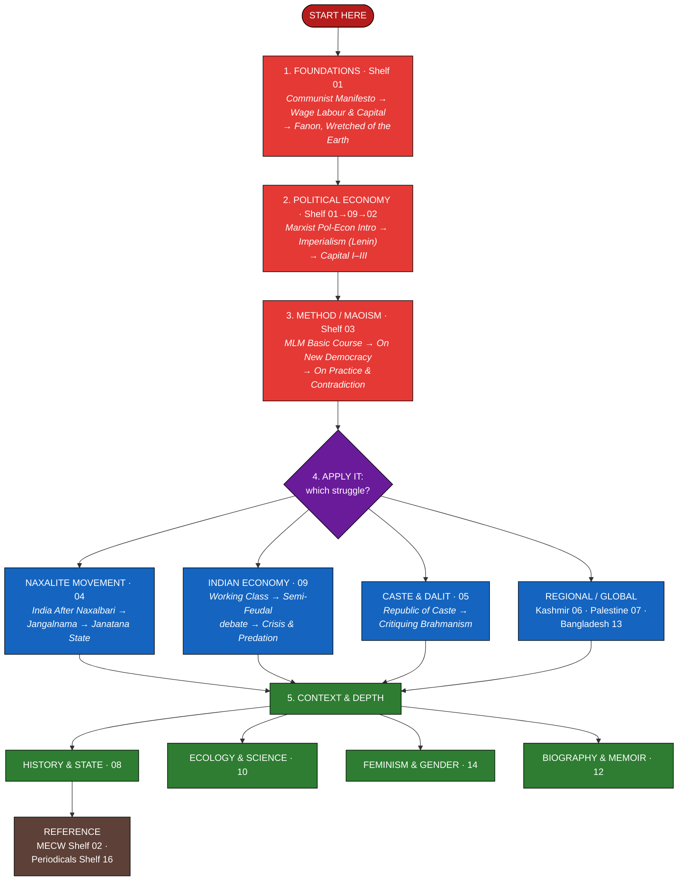

# The Reading Room — A Working Library

A curated digital library of **385 PDF books, pamphlets and periodicals** on Marxism, the Indian and Bangladeshi communist and Naxalite movements, caste, Kashmir, Palestine, history, political economy, ecology, Bengali and world literature — plus a self-contained cybersecurity shelf.

Every file is renamed to its real title, sorted into a numbered subject shelf, tagged with a **reading level**, and given a one-line summary. **A Bengali version of this page is at [README.bn.md](README.bn.md).**

> ## 📥 Download the books
> The PDFs are too large for GitHub (~6.5 GB), so the whole library is hosted on **Google Drive, open to everyone**:
> 
> ### ➤ **[Open the library on Google Drive](https://drive.google.com/drive/folders/1kIpTbRnVZQIO8AFEYrJ9ySVf8qcGhFAc?usp=sharing)**
> 
> The clickable titles in the catalogue below point to local `Books/…` paths — download the `Books` folder from the Drive link above and keep this README beside it, and every link resolves.

**Languages:** 221 English, 164 Bengali &nbsp;•&nbsp; **Levels:** 83 Beginner, 166 Intermediate, 79 Advanced, 50 Reference

> Most works lean left/radical and many are scanned activist editions; *(parentheses)* give the English title of a Bengali book. A few image-only scans had no metadata and are labelled honestly as *Unidentified*.

**Reading-level key** — 🟢 **Beginner** (no background needed) · 🟡 **Intermediate** (some grounding helps) · 🔴 **Advanced** (dense / scholarly) · 📘 **Reference** (look things up, don't read cover-to-cover).

---

## The shelves

| # | Shelf | Items | What's on it |
|---|-------|------:|--------------|
| 01 | [Marxist and Critical Theory Classics](#01--marxist-and-critical-theory-classics) | 36 | Marx, Engels, Lenin, Mao & critical theory - the bedrock |
| 02 | [Marx-Engels Collected Works (MECW)](#02--marxengels-collected-works-mecw) | 50 | The 50-volume Collected Works (incl. *Capital* I-III) |
| 03 | [Maoism and Peoples War](#03--maoism-and-peoples-war) | 28 | Mao, people's war and the modern MLM tradition |
| 04 | [Indian Communist and Naxalite Movement](#04--indian-communist-and-naxalite-movement) | 35 | Naxalbari to Dandakaranya - India's Maoist movement |
| 05 | [Caste, Dalit and Social Justice](#05--caste-dalit-and-social-justice) | 11 | Caste, Dalit history and anti-caste theory |
| 06 | [Kashmir](#06--kashmir) | 13 | Kashmir - chronicles, nationalism, human rights |
| 07 | [Palestine and West Asia](#07--palestine-and-west-asia) | 7 | Palestine - history, programme, literature of exile |
| 08 | [History, State and Politics](#08--history-state-and-politics) | 54 | Wide-angle history, politics, media, law & the state |
| 09 | [Political Economy and Globalization](#09--political-economy-and-globalization) | 21 | Capitalism, imperialism, debt and the Indian economy |
| 10 | [Ecology, Science and Society](#10--ecology-science-and-society) | 13 | Ecology, philosophy of science and rationalism |
| 11 | [Literature and the Arts](#11--literature-and-the-arts) | 45 | Fiction, poetry, song, theatre - Bengali & world |
| 12 | [Biography and Memoir](#12--biography-and-memoir) | 18 | Memoirs and biographies of revolutionaries |
| 13 | [Bangladesh - History and Politics](#13--bangladesh--history-and-politics) | 12 | East Bengal/Bangladesh - 1952, 1971, Bhashani, Sikder |
| 14 | [Feminism and Gender](#14--feminism-and-gender) | 7 | Women in revolution and the theory of liberation |
| 15 | [Cybersecurity and Hacking](#15--cybersecurity-and-hacking) | 17 | Ethical hacking, pen-testing & the dark web (standalone) |
| 16 | [Periodicals, Pamphlets and Reports](#16--periodicals-pamphlets-and-reports) | 18 | Magazines, bulletins, pamphlets and official reports |

---

## Reading maps — where to start

Three independent routes through the library. Follow the numbered spine of whichever one calls you; the side-branches are optional specialisms you can take in any order.

### 🚩 Map 1 — Politics, Theory & History

The main current of the collection. Start with the **Foundations**, get the **method**, then follow a **struggle**, then widen into **context**.

### 🔐 Map 2 — Cybersecurity & Hacking

A standalone technical track. Climb the numbered spine (overview → lab → method → hands-on course), **then** pick a specialty. The dark-web titles are non-technical awareness reading.

```mermaid
flowchart TD
    S([" Beginner<br/>START HERE "]):::s
    S --> A1["1. Hacking - Computer Hacking,<br/>Security &amp; Pen-Testing (Gary Hall)<br/><i>plain-English overview</i>"]:::a
    A1 --> A2["2. Beginning Ethical Hacking<br/>with Kali Linux (Sanjib Sinha)<br/><i>build your lab</i>"]:::a
    A2 --> A3["3. The Basics of Hacking and<br/>Penetration Testing (Engebretson)<br/><i>the methodology</i>"]:::a
    A3 --> A4["4. Penetration Testing - A Hands-On<br/>Introduction (Georgia Weidman)<br/><i>full hands-on course</i>"]:::a
    A4 --> PICK{"Now pick a<br/>specialty"}:::q
    PICK --> WEB["WEB &amp; APIs · intermediate→adv<br/>Hacking APIs (Ball) →<br/>Black Hat GraphQL"]:::b
    PICK --> WIFI["WIRELESS · beginner<br/>Hacking Wireless<br/>Networks for Dummies"]:::b
    PICK --> MOB["MOBILE / ANDROID · advanced<br/>Android Security Internals →<br/>Android Hacker&#39;s Handbook →<br/>The Android Malware Handbook"]:::b
    PICK --> HW["HARDWARE · advanced<br/>The Hardware<br/>Hacking Handbook"]:::b
    WEB --> ADV["CAPSTONE · advanced<br/>From Day Zero to Zero Day<br/><i>find your own 0-days</i>"]:::c
    MOB --> ADV
    HW --> ADV
    DARK["DARK-WEB AWARENESS · read any time, non-technical<br/>Surface / Deep / Dark Web → The Dark Web for the Rational →<br/>The Dark Secrets of Search Engines → The Darkest Web"]:::e
    CURIO["The Anarchist Cookbook — historical curio only, not a syllabus"]:::g
    S -.->|"context / awareness"| DARK
    classDef s fill:#b71c1c,stroke:#000,color:#fff;
    classDef a fill:#37474f,stroke:#000,color:#fff;
    classDef q fill:#6a1b9a,stroke:#000,color:#fff;
    classDef b fill:#1565c0,stroke:#000,color:#fff;
    classDef c fill:#2e7d32,stroke:#000,color:#fff;
    classDef e fill:#455a64,stroke:#000,color:#fff;
    classDef g fill:#5d4037,stroke:#000,color:#fff;
```

### 📖 Map 3 — Literature & the Arts

Read down the middle spine (easy → short stories → novels → experimental), and dip into the Poetry, Song and Craft side-tracks whenever you like.

```mermaid
flowchart TD
    S([" New reader<br/>START HERE "]):::s
    S --> EASY["1. THE EASY WAY IN · beginner<br/><i>Totto-chan</i> (memoir) ·<br/><i>Animal Farm</i> (Bangla) ·<br/><i>Soccer in Sun and Shadow</i>"]:::a
    EASY --> SHORT["2. SHORT STORIES · beginner<br/><i>Best 100 of O. Henry</i> →<br/><i>Best Urdu Stories</i> →<br/><i>Draupadi</i> (Mahasweta Devi)"]:::a
    SHORT --> NOV["3. NOVELS · intermediate<br/><i>Mother</i> (Gorky) →<br/>Best Novels of Manik Bandyopadhyay →<br/><i>From Volga to Ganga</i>"]:::a
    NOV --> HARD["4. ADVANCED / EXPERIMENTAL<br/>Akhtaruzzaman Elias (Collected) →<br/>Subimal Misra Anti-Stories 1, 3, 4"]:::d
    S --> POE["POETRY TRACK · beginner→int<br/>Sukanta Samagra →<br/>Birendra Chattopadhyay →<br/>Subhash Mukhopadhyay →<br/>Bengali Poetry Anthology (Sukumar Sen)"]:::b
    S --> SONG["SONG &amp; MUSIC · beginner<br/>Sumaner Gaan (Kabir Suman) ·<br/>Kon Pothe Gelo Gaan ·<br/>Songs of Revolution"]:::c
    S --> CRAFT["CRAFT &amp; STUDY · intermediate<br/>Creating a Role (Stanislavski) +<br/>An Actor&#39;s Rebirth I–II ·<br/>Jhumur O Charyapad (study)"]:::c
    classDef s fill:#4a148c,stroke:#000,color:#fff;
    classDef a fill:#6a1b9a,stroke:#000,color:#fff;
    classDef b fill:#00695c,stroke:#000,color:#fff;
    classDef c fill:#1565c0,stroke:#000,color:#fff;
    classDef d fill:#ad1457,stroke:#000,color:#fff;
```

> *Note:* the four *Unidentified Bengali Volume* scans and a few one-word titles (*Babar*, *Bajol Bheri*, *Lal Tomsuk*) sit outside the literature map until their contents are confirmed.

---

## The catalogue

Each shelf lists its books with **Level**, **Genre**, **Pages** and a **Summary** of what the book actually contains. Titles are clickable.

### 01 - Marxist and Critical Theory Classics

*The bedrock - Marx, Engels, Lenin, Stalin and Mao in their own words, plus the philosophy and political economy that frame everything else in the library.*

| # | Title | Lang | Level | Genre | Pages | Summary |
|--:|-------|------|-------|-------|------:|---------|
| 1 | [Capital, Volume III - Karl Marx](Books/01%20-%20Marxist%20and%20Critical%20Theory%20Classics/Capital%2C%20Volume%20III%20-%20Karl%20Marx.pdf) | English | 🔴 Advanced | Marxist theory | 645 | Marx's third volume of Capital on capitalist production as a whole (ed. Engels). |
| 2 | [Che Guevara on Socialism and Internationalism](Books/01%20-%20Marxist%20and%20Critical%20Theory%20Classics/Che%20Guevara%20on%20Socialism%20and%20Internationalism.pdf) | English | 🟡 Intermediate | Politics | 94 | Collection of Che Guevara's writings on socialism and internationalism. |
| 3 | [Fascism and Social Revolution - R. Palme Dutt](Books/01%20-%20Marxist%20and%20Critical%20Theory%20Classics/Fascism%20and%20Social%20Revolution%20-%20R.%20Palme%20Dutt.pdf) | English | 🔴 Advanced | Marxist theory | 207 | R. Palme Dutt's classic Marxist analysis of fascism as capitalism in decay. |
| 4 | [Grundrisse - Karl Marx](Books/01%20-%20Marxist%20and%20Critical%20Theory%20Classics/Grundrisse%20-%20Karl%20Marx.pdf) | English | 🔴 Advanced | Marxist theory | 862 | Marx's 1857-61 notebooks, foundations of the critique of political economy. |
| 5 | [History of the Communist Party of the Soviet Union (Bolsheviks), 1939 - Short Course](Books/01%20-%20Marxist%20and%20Critical%20Theory%20Classics/History%20of%20the%20Communist%20Party%20of%20the%20Soviet%20Union%20%28Bolsheviks%29%2C%201939%20-%20Short%20Course.pdf) | English | 🟡 Intermediate | History | 392 | The 1939 Short Course official history of the CPSU(B). |
| 6 | [Idealism as Modernism - Hegelian Variations - Robert Pippin](Books/01%20-%20Marxist%20and%20Critical%20Theory%20Classics/Idealism%20as%20Modernism%20-%20Hegelian%20Variations%20-%20Robert%20Pippin.pdf) | English | 🔴 Advanced | Philosophy | 481 | Pippin's essays defending Hegelian idealism as the core of philosophical modernity. |
| 7 | [Lenin on Trade Unions](Books/01%20-%20Marxist%20and%20Critical%20Theory%20Classics/Lenin%20on%20Trade%20Unions.pdf) | English | 🔴 Advanced | Marxist theory | 580 | Anthology of Lenin's writings on trade unions. |
| 8 | [Marxism on Vedanta (CPI Conference, 1975)](Books/01%20-%20Marxist%20and%20Critical%20Theory%20Classics/Marxism%20on%20Vedanta%20%28CPI%20Conference%2C%201975%29.pdf) | English | 🔴 Advanced | Philosophy | 312 | CPI conference papers critiquing Bani Deshpande's The Universe of Vedanta. |
| 9 | [Marxist Political Economy - An Introductory Course](Books/01%20-%20Marxist%20and%20Critical%20Theory%20Classics/Marxist%20Political%20Economy%20-%20An%20Introductory%20Course.pdf) | English | 🟢 Beginner | Political economy | 140 | Primer course on Marxist political economy from value to imperialism. |
| 10 | [Mastering Bolshevism - Joseph Stalin](Books/01%20-%20Marxist%20and%20Critical%20Theory%20Classics/Mastering%20Bolshevism%20-%20Joseph%20Stalin.pdf) | English | 🔴 Advanced | Marxist theory | 51 | Stalin's 1937 report on party cadres and vigilance. |
| 11 | [On Communist Society - Marx, Engels, Lenin (Progress, 1978)](Books/01%20-%20Marxist%20and%20Critical%20Theory%20Classics/On%20Communist%20Society%20-%20Marx%2C%20Engels%2C%20Lenin%20%28Progress%2C%201978%29.pdf) | English | 🔴 Advanced | Marxist theory | 86 | Progress Publishers anthology on the future communist society. |
| 12 | [On the Struggle Against Revisionism - Lenin (Peking, 1960)](Books/01%20-%20Marxist%20and%20Critical%20Theory%20Classics/On%20the%20Struggle%20Against%20Revisionism%20-%20Lenin%20%28Peking%2C%201960%29.pdf) | English | 🔴 Advanced | Marxist theory | 59 | Lenin texts on combating revisionism, issued for his 90th anniversary. |
| 13 | [Political Economy - A Textbook (USSR Academy of Sciences)](Books/01%20-%20Marxist%20and%20Critical%20Theory%20Classics/Political%20Economy%20-%20A%20Textbook%20%28USSR%20Academy%20of%20Sciences%29.pdf) | English | 🔴 Advanced | Political economy | 623 | The classic 1954 Soviet textbook of political economy. |
| 14 | [Storming the Gates of Heaven](Books/01%20-%20Marxist%20and%20Critical%20Theory%20Classics/Storming%20the%20Gates%20of%20Heaven.pdf) | English | 🟡 Intermediate | History | 580 | Large radical-history volume; specific subject not recorded in file metadata. |
| 15 | [The Condition of the Working Class in England - Friedrich Engels](Books/01%20-%20Marxist%20and%20Critical%20Theory%20Classics/The%20Condition%20of%20the%20Working%20Class%20in%20England%20-%20Friedrich%20Engels.pdf) | English | 🔴 Advanced | Marxist theory | 206 | Engels's 1845 investigation of industrial working-class life in England. |
| 16 | [The Housing Question - Friedrich Engels](Books/01%20-%20Marxist%20and%20Critical%20Theory%20Classics/The%20Housing%20Question%20-%20Friedrich%20Engels.pdf) | English | 🔴 Advanced | Marxist theory | 110 | Engels's 1872 critique of bourgeois and Proudhonist solutions to housing. |
| 17 | [The Wretched of the Earth - Frantz Fanon](Books/01%20-%20Marxist%20and%20Critical%20Theory%20Classics/The%20Wretched%20of%20the%20Earth%20-%20Frantz%20Fanon.pdf) | English | 🔴 Advanced | Anti-colonial theory | 315 | Fanon's foundational text on decolonisation, violence and national liberation. |
| 18 | [অর্থনীতিবাদ প্রসঙ্গে - লেনিন (Lenin on Economism)](Books/01%20-%20Marxist%20and%20Critical%20Theory%20Classics/%E0%A6%85%E0%A6%B0%E0%A7%8D%E0%A6%A5%E0%A6%A8%E0%A7%80%E0%A6%A4%E0%A6%BF%E0%A6%AC%E0%A6%BE%E0%A6%A6%20%E0%A6%AA%E0%A7%8D%E0%A6%B0%E0%A6%B8%E0%A6%99%E0%A7%8D%E0%A6%97%E0%A7%87%20-%20%E0%A6%B2%E0%A7%87%E0%A6%A8%E0%A6%BF%E0%A6%A8%20%28Lenin%20on%20Economism%29.pdf) | Bengali | 🔴 Advanced | Marxist theory | 7 | Lenin on economism, in Bengali. |
| 19 | [কমিউনিস্ট পার্টির সংগঠন (Organisation of the Communist Party)](Books/01%20-%20Marxist%20and%20Critical%20Theory%20Classics/%E0%A6%95%E0%A6%AE%E0%A6%BF%E0%A6%89%E0%A6%A8%E0%A6%BF%E0%A6%B8%E0%A7%8D%E0%A6%9F%20%E0%A6%AA%E0%A6%BE%E0%A6%B0%E0%A7%8D%E0%A6%9F%E0%A6%BF%E0%A6%B0%20%E0%A6%B8%E0%A6%82%E0%A6%97%E0%A6%A0%E0%A6%A8%20%28Organisation%20of%20the%20Communist%20Party%29.pdf) | Bengali | 🟡 Intermediate | Politics | 72 | Bengali manual on communist party organisation. |
| 20 | [কমিউনিস্ট ম্যানিফেস্টো ও সংগ্রামের দিশা (The Communist Manifesto)](Books/01%20-%20Marxist%20and%20Critical%20Theory%20Classics/%E0%A6%95%E0%A6%AE%E0%A6%BF%E0%A6%89%E0%A6%A8%E0%A6%BF%E0%A6%B8%E0%A7%8D%E0%A6%9F%20%E0%A6%AE%E0%A7%8D%E0%A6%AF%E0%A6%BE%E0%A6%A8%E0%A6%BF%E0%A6%AB%E0%A7%87%E0%A6%B8%E0%A7%8D%E0%A6%9F%E0%A7%8B%20%E0%A6%93%20%E0%A6%B8%E0%A6%82%E0%A6%97%E0%A7%8D%E0%A6%B0%E0%A6%BE%E0%A6%AE%E0%A7%87%E0%A6%B0%20%E0%A6%A6%E0%A6%BF%E0%A6%B6%E0%A6%BE%20%28The%20Communist%20Manifesto%29.pdf) | Bengali | 🟢 Beginner | Marxist theory | 53 | Bengali edition of the Communist Manifesto with commentary. |
| 21 | [ধর্ম প্রসঙ্গে - লেনিন (Lenin on Religion)](Books/01%20-%20Marxist%20and%20Critical%20Theory%20Classics/%E0%A6%A7%E0%A6%B0%E0%A7%8D%E0%A6%AE%20%E0%A6%AA%E0%A7%8D%E0%A6%B0%E0%A6%B8%E0%A6%99%E0%A7%8D%E0%A6%97%E0%A7%87%20-%20%E0%A6%B2%E0%A7%87%E0%A6%A8%E0%A6%BF%E0%A6%A8%20%28Lenin%20on%20Religion%29.pdf) | Bengali | 🔴 Advanced | Marxist theory | 48 | Lenin's writings on religion, in Bengali. |
| 22 | [পরিবার, ব্যক্তিগত মালিকানা ও রাষ্ট্রের উৎপত্তি - ফ্রিডরিখ এঙ্গেলস (The Origin of the Family, Private Property and the State)](Books/01%20-%20Marxist%20and%20Critical%20Theory%20Classics/%E0%A6%AA%E0%A6%B0%E0%A6%BF%E0%A6%AC%E0%A6%BE%E0%A6%B0%2C%20%E0%A6%AC%E0%A7%8D%E0%A6%AF%E0%A6%95%E0%A7%8D%E0%A6%A4%E0%A6%BF%E0%A6%97%E0%A6%A4%20%E0%A6%AE%E0%A6%BE%E0%A6%B2%E0%A6%BF%E0%A6%95%E0%A6%BE%E0%A6%A8%E0%A6%BE%20%E0%A6%93%20%E0%A6%B0%E0%A6%BE%E0%A6%B7%E0%A7%8D%E0%A6%9F%E0%A7%8D%E0%A6%B0%E0%A7%87%E0%A6%B0%20%E0%A6%89%E0%A7%8E%E0%A6%AA%E0%A6%A4%E0%A7%8D%E0%A6%A4%E0%A6%BF%20-%20%E0%A6%AB%E0%A7%8D%E0%A6%B0%E0%A6%BF%E0%A6%A1%E0%A6%B0%E0%A6%BF%E0%A6%96%20%E0%A6%8F%E0%A6%99%E0%A7%8D%E0%A6%97%E0%A7%87%E0%A6%B2%E0%A6%B8%20%28The%20Origin%20of%20the%20Family%2C%20Private%20Property%20and%20the%20State%29.pdf) | Bengali | 🟡 Intermediate | Marxist theory | 218 | Bengali edition (Progoti Prokashoni) of Engels's classic tracing how class society, the patriarchal family and the state all arose from changes in property and the mode of production - a cornerstone of Marxist anthropology and feminism. |
| 23 | [প্রকৃতির দ্বান্দ্বিকতা - ফ্রেডরিক এঙ্গেলস (Dialectics of Nature)](Books/01%20-%20Marxist%20and%20Critical%20Theory%20Classics/%E0%A6%AA%E0%A7%8D%E0%A6%B0%E0%A6%95%E0%A7%83%E0%A6%A4%E0%A6%BF%E0%A6%B0%20%E0%A6%A6%E0%A7%8D%E0%A6%AC%E0%A6%BE%E0%A6%A8%E0%A7%8D%E0%A6%A6%E0%A7%8D%E0%A6%AC%E0%A6%BF%E0%A6%95%E0%A6%A4%E0%A6%BE%20-%20%E0%A6%AB%E0%A7%8D%E0%A6%B0%E0%A7%87%E0%A6%A1%E0%A6%B0%E0%A6%BF%E0%A6%95%20%E0%A6%8F%E0%A6%99%E0%A7%8D%E0%A6%97%E0%A7%87%E0%A6%B2%E0%A6%B8%20%28Dialectics%20of%20Nature%29.pdf) | Bengali | 🔴 Advanced | Marxist theory | 220 | Bengali translation of Engels's Dialectics of Nature. |
| 24 | [ফ্যাসিজমের বিরুদ্ধে - ম্যাক্সিম গোর্কি (Against Fascism)](Books/01%20-%20Marxist%20and%20Critical%20Theory%20Classics/%E0%A6%AB%E0%A7%8D%E0%A6%AF%E0%A6%BE%E0%A6%B8%E0%A6%BF%E0%A6%9C%E0%A6%AE%E0%A7%87%E0%A6%B0%20%E0%A6%AC%E0%A6%BF%E0%A6%B0%E0%A7%81%E0%A6%A6%E0%A7%8D%E0%A6%A7%E0%A7%87%20-%20%E0%A6%AE%E0%A7%8D%E0%A6%AF%E0%A6%BE%E0%A6%95%E0%A7%8D%E0%A6%B8%E0%A6%BF%E0%A6%AE%20%E0%A6%97%E0%A7%8B%E0%A6%B0%E0%A7%8D%E0%A6%95%E0%A6%BF%20%28Against%20Fascism%29.pdf) | Bengali | 🟡 Intermediate | Essays | 8 | Maxim Gorky's anti-fascist writings, in Bengali. |
| 25 | [মজুরি-শ্রম ও পুঁজি - কার্ল মার্কস (Wage Labour and Capital)](Books/01%20-%20Marxist%20and%20Critical%20Theory%20Classics/%E0%A6%AE%E0%A6%9C%E0%A7%81%E0%A6%B0%E0%A6%BF-%E0%A6%B6%E0%A7%8D%E0%A6%B0%E0%A6%AE%20%E0%A6%93%20%E0%A6%AA%E0%A7%81%E0%A6%81%E0%A6%9C%E0%A6%BF%20-%20%E0%A6%95%E0%A6%BE%E0%A6%B0%E0%A7%8D%E0%A6%B2%20%E0%A6%AE%E0%A6%BE%E0%A6%B0%E0%A7%8D%E0%A6%95%E0%A6%B8%20%28Wage%20Labour%20and%20Capital%29.pdf) | Bengali | 🟢 Beginner | Marxist theory | 35 | Bengali translation of Marx's short, lucid lectures explaining wages, labour-power, exploitation and capital in everyday terms - one of the easiest doors into his economics, ideal before tackling Capital. |
| 26 | [মার্ক্স-এঙ্গেলস রচনা সংকলন ১ (Marx-Engels Selected Works, Vol.1)](Books/01%20-%20Marxist%20and%20Critical%20Theory%20Classics/%E0%A6%AE%E0%A6%BE%E0%A6%B0%E0%A7%8D%E0%A6%95%E0%A7%8D%E0%A6%B8-%E0%A6%8F%E0%A6%99%E0%A7%8D%E0%A6%97%E0%A7%87%E0%A6%B2%E0%A6%B8%20%E0%A6%B0%E0%A6%9A%E0%A6%A8%E0%A6%BE%20%E0%A6%B8%E0%A6%82%E0%A6%95%E0%A6%B2%E0%A6%A8%20%E0%A7%A7%20%28Marx-Engels%20Selected%20Works%2C%20Vol.1%29.pdf) | Bengali | 🔴 Advanced | Marxist theory | 345 | Bengali selected works of Marx and Engels, vol.1. |
| 27 | [মার্ক্স-এঙ্গেলস রচনা সংকলন ২ (Marx-Engels Selected Works, Vol.2)](Books/01%20-%20Marxist%20and%20Critical%20Theory%20Classics/%E0%A6%AE%E0%A6%BE%E0%A6%B0%E0%A7%8D%E0%A6%95%E0%A7%8D%E0%A6%B8-%E0%A6%8F%E0%A6%99%E0%A7%8D%E0%A6%97%E0%A7%87%E0%A6%B2%E0%A6%B8%20%E0%A6%B0%E0%A6%9A%E0%A6%A8%E0%A6%BE%20%E0%A6%B8%E0%A6%82%E0%A6%95%E0%A6%B2%E0%A6%A8%20%E0%A7%A8%20%28Marx-Engels%20Selected%20Works%2C%20Vol.2%29.pdf) | Bengali | 🔴 Advanced | Marxist theory | 347 | Bengali selected works of Marx and Engels, vol.2. |
| 28 | [মার্ক্সের ক্যাপিটাল - সুপ্রকাশ রায় (Marx's Capital, explained)](Books/01%20-%20Marxist%20and%20Critical%20Theory%20Classics/%E0%A6%AE%E0%A6%BE%E0%A6%B0%E0%A7%8D%E0%A6%95%E0%A7%8D%E0%A6%B8%E0%A7%87%E0%A6%B0%20%E0%A6%95%E0%A7%8D%E0%A6%AF%E0%A6%BE%E0%A6%AA%E0%A6%BF%E0%A6%9F%E0%A6%BE%E0%A6%B2%20-%20%E0%A6%B8%E0%A7%81%E0%A6%AA%E0%A7%8D%E0%A6%B0%E0%A6%95%E0%A6%BE%E0%A6%B6%20%E0%A6%B0%E0%A6%BE%E0%A6%AF%E0%A6%BC%20%28Marx%27s%20Capital%2C%20explained%29.pdf) | Bengali | 🔴 Advanced | Marxist theory | 48 | Suprakash Ray's Bengali exposition of Marx's Capital. |
| 29 | [মাস লাইন - অমূল্য সেন (The Mass Line)](Books/01%20-%20Marxist%20and%20Critical%20Theory%20Classics/%E0%A6%AE%E0%A6%BE%E0%A6%B8%20%E0%A6%B2%E0%A6%BE%E0%A6%87%E0%A6%A8%20-%20%E0%A6%85%E0%A6%AE%E0%A7%82%E0%A6%B2%E0%A7%8D%E0%A6%AF%20%E0%A6%B8%E0%A7%87%E0%A6%A8%20%28The%20Mass%20Line%29.pdf) | Bengali | 🟡 Intermediate | Politics | 11 | Amulya Sen's Bengali essay on the communist mass line. |
| 30 | [রুশ বিপ্লব (The Russian Revolution)](Books/01%20-%20Marxist%20and%20Critical%20Theory%20Classics/%E0%A6%B0%E0%A7%81%E0%A6%B6%20%E0%A6%AC%E0%A6%BF%E0%A6%AA%E0%A7%8D%E0%A6%B2%E0%A6%AC%20%28The%20Russian%20Revolution%29.pdf) | Bengali | 🟡 Intermediate | History | 468 | Bengali history of the 1917 Russian Revolution. |
| 31 | [লেনিন - সমাজতান্ত্রিক বিপ্লব (Lenin on Socialist Revolution)](Books/01%20-%20Marxist%20and%20Critical%20Theory%20Classics/%E0%A6%B2%E0%A7%87%E0%A6%A8%E0%A6%BF%E0%A6%A8%20-%20%E0%A6%B8%E0%A6%AE%E0%A6%BE%E0%A6%9C%E0%A6%A4%E0%A6%BE%E0%A6%A8%E0%A7%8D%E0%A6%A4%E0%A7%8D%E0%A6%B0%E0%A6%BF%E0%A6%95%20%E0%A6%AC%E0%A6%BF%E0%A6%AA%E0%A7%8D%E0%A6%B2%E0%A6%AC%20%28Lenin%20on%20Socialist%20Revolution%29.pdf) | Bengali | 🔴 Advanced | Marxist theory | 674 | Bengali collection of Lenin on the socialist revolution. |
| 32 | [সমাজ ও সভ্যতার ক্রমবিকাশ - রেবতী বর্মণ (Evolution of Society and Civilisation)](Books/01%20-%20Marxist%20and%20Critical%20Theory%20Classics/%E0%A6%B8%E0%A6%AE%E0%A6%BE%E0%A6%9C%20%E0%A6%93%20%E0%A6%B8%E0%A6%AD%E0%A7%8D%E0%A6%AF%E0%A6%A4%E0%A6%BE%E0%A6%B0%20%E0%A6%95%E0%A7%8D%E0%A6%B0%E0%A6%AE%E0%A6%AC%E0%A6%BF%E0%A6%95%E0%A6%BE%E0%A6%B6%20-%20%E0%A6%B0%E0%A7%87%E0%A6%AC%E0%A6%A4%E0%A7%80%20%E0%A6%AC%E0%A6%B0%E0%A7%8D%E0%A6%AE%E0%A6%A3%20%28Evolution%20of%20Society%20and%20Civilisation%29.pdf) | Bengali | 🔴 Advanced | Marxist theory | 201 | Rebati Barman's Bengali primer on historical materialism. |
| 33 | [সমাজতন্ত্র কেন? (Why Socialism?)](Books/01%20-%20Marxist%20and%20Critical%20Theory%20Classics/%E0%A6%B8%E0%A6%AE%E0%A6%BE%E0%A6%9C%E0%A6%A4%E0%A6%A8%E0%A7%8D%E0%A6%A4%E0%A7%8D%E0%A6%B0%20%E0%A6%95%E0%A7%87%E0%A6%A8%20%28Why%20Socialism%29.pdf) | Bengali | 🟢 Beginner | Essay | 18 | A short Bengali pamphlet that argues, in plain language, why socialism answers the failures of capitalism - a quick, persuasive read for newcomers to the idea. |
| 34 | [সাম্রাজ্যবাদ - পুঁজিবাদের সর্বোচ্চ পর্যায় - লেনিন (Imperialism)](Books/01%20-%20Marxist%20and%20Critical%20Theory%20Classics/%E0%A6%B8%E0%A6%BE%E0%A6%AE%E0%A7%8D%E0%A6%B0%E0%A6%BE%E0%A6%9C%E0%A7%8D%E0%A6%AF%E0%A6%AC%E0%A6%BE%E0%A6%A6%20-%20%E0%A6%AA%E0%A7%81%E0%A6%81%E0%A6%9C%E0%A6%BF%E0%A6%AC%E0%A6%BE%E0%A6%A6%E0%A7%87%E0%A6%B0%20%E0%A6%B8%E0%A6%B0%E0%A7%8D%E0%A6%AC%E0%A7%8B%E0%A6%9A%E0%A7%8D%E0%A6%9A%20%E0%A6%AA%E0%A6%B0%E0%A7%8D%E0%A6%AF%E0%A6%BE%E0%A6%AF%E0%A6%BC%20-%20%E0%A6%B2%E0%A7%87%E0%A6%A8%E0%A6%BF%E0%A6%A8%20%28Imperialism%29.pdf) | Bengali | 🔴 Advanced | Marxist theory | 116 | Bengali edition of Lenin's Imperialism, the Highest Stage of Capitalism. |
| 35 | [সাম্রাজ্যবাদ - পুঁজিবাদের সর্বোচ্চ পর্যায় - লেনিন (মূল লেখা ও সূচিসহ সংস্করণ)](Books/01%20-%20Marxist%20and%20Critical%20Theory%20Classics/%E0%A6%B8%E0%A6%BE%E0%A6%AE%E0%A7%8D%E0%A6%B0%E0%A6%BE%E0%A6%9C%E0%A7%8D%E0%A6%AF%E0%A6%AC%E0%A6%BE%E0%A6%A6%20-%20%E0%A6%AA%E0%A7%81%E0%A6%81%E0%A6%9C%E0%A6%BF%E0%A6%AC%E0%A6%BE%E0%A6%A6%E0%A7%87%E0%A6%B0%20%E0%A6%B8%E0%A6%B0%E0%A7%8D%E0%A6%AC%E0%A7%8B%E0%A6%9A%E0%A7%8D%E0%A6%9A%20%E0%A6%AA%E0%A6%B0%E0%A7%8D%E0%A6%AF%E0%A6%BE%E0%A6%AF%E0%A6%BC%20-%20%E0%A6%B2%E0%A7%87%E0%A6%A8%E0%A6%BF%E0%A6%A8%20%28%E0%A6%AE%E0%A7%82%E0%A6%B2%20%E0%A6%B2%E0%A7%87%E0%A6%96%E0%A6%BE%20%E0%A6%93%20%E0%A6%B8%E0%A7%82%E0%A6%9A%E0%A6%BF%E0%A6%B8%E0%A6%B9%20%E0%A6%B8%E0%A6%82%E0%A6%B8%E0%A7%8D%E0%A6%95%E0%A6%B0%E0%A6%A3%29.pdf) | Bengali | 🔴 Advanced | Marxist theory | 59 | Bengali edition of Lenin's Imperialism, the Highest Stage of Capitalism, carrying the full core text with contents - his account of how monopoly, finance capital and the carve-up of the world turn capitalism into imperialism. |
| 36 | [সোভিয়েত সমাজের ইতিহাস (History of Soviet Society)](Books/01%20-%20Marxist%20and%20Critical%20Theory%20Classics/%E0%A6%B8%E0%A7%8B%E0%A6%AD%E0%A6%BF%E0%A6%AF%E0%A6%BC%E0%A7%87%E0%A6%A4%20%E0%A6%B8%E0%A6%AE%E0%A6%BE%E0%A6%9C%E0%A7%87%E0%A6%B0%20%E0%A6%87%E0%A6%A4%E0%A6%BF%E0%A6%B9%E0%A6%BE%E0%A6%B8%20%28History%20of%20Soviet%20Society%29.pdf) | Bengali | 🟡 Intermediate | History | 649 | Bengali history of Soviet society. |

### 02 - Marx-Engels Collected Works (MECW)

*The complete 50-volume Lawrence and Wishart *Collected Works of Marx and Engels* - a reference shelf. Volumes 35-37 are *Capital* I-III.*

| # | Title | Lang | Level | Genre | Pages | Summary |
|--:|-------|------|-------|-------|------:|---------|
| 1 | [Marx-Engels Collected Works, Vol. 01 - Marx 1835-1843](Books/02%20-%20Marx-Engels%20Collected%20Works%20%28MECW%29/Marx-Engels%20Collected%20Works%2C%20Vol.%2001%20-%20Marx%201835-1843.pdf) | English | 📘 Reference | Marxist theory | 839 | Volume 1 of the 50-volume Lawrence and Wishart Collected Works of Marx and Engels. |
| 2 | [Marx-Engels Collected Works, Vol. 02 - Engels 1838-1842](Books/02%20-%20Marx-Engels%20Collected%20Works%20%28MECW%29/Marx-Engels%20Collected%20Works%2C%20Vol.%2002%20-%20Engels%201838-1842.pdf) | English | 📘 Reference | Marxist theory | 702 | Volume 2 of the 50-volume Lawrence and Wishart Collected Works of Marx and Engels. |
| 3 | [Marx-Engels Collected Works, Vol. 03 - Marx 1843-1844 (incl. 1844 Manuscripts)](Books/02%20-%20Marx-Engels%20Collected%20Works%20%28MECW%29/Marx-Engels%20Collected%20Works%2C%20Vol.%2003%20-%20Marx%201843-1844%20%28incl.%201844%20Manuscripts%29.pdf) | English | 📘 Reference | Marxist theory | 693 | Volume 3 of the 50-volume Lawrence and Wishart Collected Works of Marx and Engels. |
| 4 | [Marx-Engels Collected Works, Vol. 04 - Marx and Engels 1844-1845 (The Holy Family)](Books/02%20-%20Marx-Engels%20Collected%20Works%20%28MECW%29/Marx-Engels%20Collected%20Works%2C%20Vol.%2004%20-%20Marx%20and%20Engels%201844-1845%20%28The%20Holy%20Family%29.pdf) | English | 📘 Reference | Marxist theory | 805 | Volume 4 of the 50-volume Lawrence and Wishart Collected Works of Marx and Engels. |
| 5 | [Marx-Engels Collected Works, Vol. 05 - 1845-1847 (The German Ideology)](Books/02%20-%20Marx-Engels%20Collected%20Works%20%28MECW%29/Marx-Engels%20Collected%20Works%2C%20Vol.%2005%20-%201845-1847%20%28The%20German%20Ideology%29.pdf) | English | 📘 Reference | Marxist theory | 684 | Volume 5 of the 50-volume Lawrence and Wishart Collected Works of Marx and Engels. |
| 6 | [Marx-Engels Collected Works, Vol. 06 - 1845-1848 (Poverty of Philosophy)](Books/02%20-%20Marx-Engels%20Collected%20Works%20%28MECW%29/Marx-Engels%20Collected%20Works%2C%20Vol.%2006%20-%201845-1848%20%28Poverty%20of%20Philosophy%29.pdf) | English | 📘 Reference | Marxist theory | 805 | Volume 6 of the 50-volume Lawrence and Wishart Collected Works of Marx and Engels. |
| 7 | [Marx-Engels Collected Works, Vol. 07 - 1848 (The Communist Manifesto era)](Books/02%20-%20Marx-Engels%20Collected%20Works%20%28MECW%29/Marx-Engels%20Collected%20Works%2C%20Vol.%2007%20-%201848%20%28The%20Communist%20Manifesto%20era%29.pdf) | English | 📘 Reference | Marxist theory | 748 | Volume 7 of the 50-volume Lawrence and Wishart Collected Works of Marx and Engels. |
| 8 | [Marx-Engels Collected Works, Vol. 08 - 1848-1849](Books/02%20-%20Marx-Engels%20Collected%20Works%20%28MECW%29/Marx-Engels%20Collected%20Works%2C%20Vol.%2008%20-%201848-1849.pdf) | English | 📘 Reference | Marxist theory | 687 | Volume 8 of the 50-volume Lawrence and Wishart Collected Works of Marx and Engels. |
| 9 | [Marx-Engels Collected Works, Vol. 09 - 1849](Books/02%20-%20Marx-Engels%20Collected%20Works%20%28MECW%29/Marx-Engels%20Collected%20Works%2C%20Vol.%2009%20-%201849.pdf) | English | 📘 Reference | Marxist theory | 692 | Volume 9 of the 50-volume Lawrence and Wishart Collected Works of Marx and Engels. |
| 10 | [Marx-Engels Collected Works, Vol. 10 - 1849-1851](Books/02%20-%20Marx-Engels%20Collected%20Works%20%28MECW%29/Marx-Engels%20Collected%20Works%2C%20Vol.%2010%20-%201849-1851.pdf) | English | 📘 Reference | Marxist theory | 811 | Volume 10 of the 50-volume Lawrence and Wishart Collected Works of Marx and Engels. |
| 11 | [Marx-Engels Collected Works, Vol. 11 - 1851-1853 (18th Brumaire)](Books/02%20-%20Marx-Engels%20Collected%20Works%20%28MECW%29/Marx-Engels%20Collected%20Works%2C%20Vol.%2011%20-%201851-1853%20%2818th%20Brumaire%29.pdf) | English | 📘 Reference | Marxist theory | 796 | Volume 11 of the 50-volume Lawrence and Wishart Collected Works of Marx and Engels. |
| 12 | [Marx-Engels Collected Works, Vol. 12 - 1853-1854](Books/02%20-%20Marx-Engels%20Collected%20Works%20%28MECW%29/Marx-Engels%20Collected%20Works%2C%20Vol.%2012%20-%201853-1854.pdf) | English | 📘 Reference | Marxist theory | 814 | Volume 12 of the 50-volume Lawrence and Wishart Collected Works of Marx and Engels. |
| 13 | [Marx-Engels Collected Works, Vol. 13 - 1854-1855](Books/02%20-%20Marx-Engels%20Collected%20Works%20%28MECW%29/Marx-Engels%20Collected%20Works%2C%20Vol.%2013%20-%201854-1855.pdf) | English | 📘 Reference | Marxist theory | 831 | Volume 13 of the 50-volume Lawrence and Wishart Collected Works of Marx and Engels. |
| 14 | [Marx-Engels Collected Works, Vol. 14 - 1855-1856](Books/02%20-%20Marx-Engels%20Collected%20Works%20%28MECW%29/Marx-Engels%20Collected%20Works%2C%20Vol.%2014%20-%201855-1856.pdf) | English | 📘 Reference | Marxist theory | 863 | Volume 14 of the 50-volume Lawrence and Wishart Collected Works of Marx and Engels. |
| 15 | [Marx-Engels Collected Works, Vol. 15 - 1856-1858](Books/02%20-%20Marx-Engels%20Collected%20Works%20%28MECW%29/Marx-Engels%20Collected%20Works%2C%20Vol.%2015%20-%201856-1858.pdf) | English | 📘 Reference | Marxist theory | 807 | Volume 15 of the 50-volume Lawrence and Wishart Collected Works of Marx and Engels. |
| 16 | [Marx-Engels Collected Works, Vol. 16 - 1858-1860](Books/02%20-%20Marx-Engels%20Collected%20Works%20%28MECW%29/Marx-Engels%20Collected%20Works%2C%20Vol.%2016%20-%201858-1860.pdf) | English | 📘 Reference | Marxist theory | 799 | Volume 16 of the 50-volume Lawrence and Wishart Collected Works of Marx and Engels. |
| 17 | [Marx-Engels Collected Works, Vol. 17 - 1859-1860](Books/02%20-%20Marx-Engels%20Collected%20Works%20%28MECW%29/Marx-Engels%20Collected%20Works%2C%20Vol.%2017%20-%201859-1860.pdf) | English | 📘 Reference | Marxist theory | 703 | Volume 17 of the 50-volume Lawrence and Wishart Collected Works of Marx and Engels. |
| 18 | [Marx-Engels Collected Works, Vol. 18 - 1857-1862](Books/02%20-%20Marx-Engels%20Collected%20Works%20%28MECW%29/Marx-Engels%20Collected%20Works%2C%20Vol.%2018%20-%201857-1862.pdf) | English | 📘 Reference | Marxist theory | 707 | Volume 18 of the 50-volume Lawrence and Wishart Collected Works of Marx and Engels. |
| 19 | [Marx-Engels Collected Works, Vol. 19 - 1861-1864](Books/02%20-%20Marx-Engels%20Collected%20Works%20%28MECW%29/Marx-Engels%20Collected%20Works%2C%20Vol.%2019%20-%201861-1864.pdf) | English | 📘 Reference | Marxist theory | 483 | Volume 19 of the 50-volume Lawrence and Wishart Collected Works of Marx and Engels. |
| 20 | [Marx-Engels Collected Works, Vol. 20 - 1864-1868](Books/02%20-%20Marx-Engels%20Collected%20Works%20%28MECW%29/Marx-Engels%20Collected%20Works%2C%20Vol.%2020%20-%201864-1868.pdf) | English | 📘 Reference | Marxist theory | 614 | Volume 20 of the 50-volume Lawrence and Wishart Collected Works of Marx and Engels. |
| 21 | [Marx-Engels Collected Works, Vol. 21 - 1867-1870](Books/02%20-%20Marx-Engels%20Collected%20Works%20%28MECW%29/Marx-Engels%20Collected%20Works%2C%20Vol.%2021%20-%201867-1870.pdf) | English | 📘 Reference | Marxist theory | 645 | Volume 21 of the 50-volume Lawrence and Wishart Collected Works of Marx and Engels. |
| 22 | [Marx-Engels Collected Works, Vol. 22 - 1870-1871 (The Civil War in France)](Books/02%20-%20Marx-Engels%20Collected%20Works%20%28MECW%29/Marx-Engels%20Collected%20Works%2C%20Vol.%2022%20-%201870-1871%20%28The%20Civil%20War%20in%20France%29.pdf) | English | 📘 Reference | Marxist theory | 818 | Volume 22 of the 50-volume Lawrence and Wishart Collected Works of Marx and Engels. |
| 23 | [Marx-Engels Collected Works, Vol. 23 - 1871-1874](Books/02%20-%20Marx-Engels%20Collected%20Works%20%28MECW%29/Marx-Engels%20Collected%20Works%2C%20Vol.%2023%20-%201871-1874.pdf) | English | 📘 Reference | Marxist theory | 843 | Volume 23 of the 50-volume Lawrence and Wishart Collected Works of Marx and Engels. |
| 24 | [Marx-Engels Collected Works, Vol. 24 - 1874-1883 (Critique of the Gotha Programme)](Books/02%20-%20Marx-Engels%20Collected%20Works%20%28MECW%29/Marx-Engels%20Collected%20Works%2C%20Vol.%2024%20-%201874-1883%20%28Critique%20of%20the%20Gotha%20Programme%29.pdf) | English | 📘 Reference | Marxist theory | 774 | Volume 24 of the 50-volume Lawrence and Wishart Collected Works of Marx and Engels. |
| 25 | [Marx-Engels Collected Works, Vol. 25 - Engels (Anti-Duhring, Dialectics of Nature)](Books/02%20-%20Marx-Engels%20Collected%20Works%20%28MECW%29/Marx-Engels%20Collected%20Works%2C%20Vol.%2025%20-%20Engels%20%28Anti-Duhring%2C%20Dialectics%20of%20Nature%29.pdf) | English | 📘 Reference | Marxist theory | 775 | Volume 25 of the 50-volume Lawrence and Wishart Collected Works of Marx and Engels. |
| 26 | [Marx-Engels Collected Works, Vol. 26 - Engels 1882-1889 (Origin of the Family)](Books/02%20-%20Marx-Engels%20Collected%20Works%20%28MECW%29/Marx-Engels%20Collected%20Works%2C%20Vol.%2026%20-%20Engels%201882-1889%20%28Origin%20of%20the%20Family%29.pdf) | English | 📘 Reference | Marxist theory | 797 | Volume 26 of the 50-volume Lawrence and Wishart Collected Works of Marx and Engels. |
| 27 | [Marx-Engels Collected Works, Vol. 27 - Engels 1890-1895](Books/02%20-%20Marx-Engels%20Collected%20Works%20%28MECW%29/Marx-Engels%20Collected%20Works%2C%20Vol.%2027%20-%20Engels%201890-1895.pdf) | English | 📘 Reference | Marxist theory | 726 | Volume 27 of the 50-volume Lawrence and Wishart Collected Works of Marx and Engels. |
| 28 | [Marx-Engels Collected Works, Vol. 28 - Marx 1857-1861 (Economic Manuscripts)](Books/02%20-%20Marx-Engels%20Collected%20Works%20%28MECW%29/Marx-Engels%20Collected%20Works%2C%20Vol.%2028%20-%20Marx%201857-1861%20%28Economic%20Manuscripts%29.pdf) | English | 📘 Reference | Marxist theory | 615 | Volume 28 of the 50-volume Lawrence and Wishart Collected Works of Marx and Engels. |
| 29 | [Marx-Engels Collected Works, Vol. 29 - Marx 1857-1861](Books/02%20-%20Marx-Engels%20Collected%20Works%20%28MECW%29/Marx-Engels%20Collected%20Works%2C%20Vol.%2029%20-%20Marx%201857-1861.pdf) | English | 📘 Reference | Marxist theory | 615 | Volume 29 of the 50-volume Lawrence and Wishart Collected Works of Marx and Engels. |
| 30 | [Marx-Engels Collected Works, Vol. 30 - Marx 1861-1863](Books/02%20-%20Marx-Engels%20Collected%20Works%20%28MECW%29/Marx-Engels%20Collected%20Works%2C%20Vol.%2030%20-%20Marx%201861-1863.pdf) | English | 📘 Reference | Marxist theory | 538 | Volume 30 of the 50-volume Lawrence and Wishart Collected Works of Marx and Engels. |
| 31 | [Marx-Engels Collected Works, Vol. 31 - Marx 1861-1863](Books/02%20-%20Marx-Engels%20Collected%20Works%20%28MECW%29/Marx-Engels%20Collected%20Works%2C%20Vol.%2031%20-%20Marx%201861-1863.pdf) | English | 📘 Reference | Marxist theory | 622 | Volume 31 of the 50-volume Lawrence and Wishart Collected Works of Marx and Engels. |
| 32 | [Marx-Engels Collected Works, Vol. 32 - Marx 1861-1863](Books/02%20-%20Marx-Engels%20Collected%20Works%20%28MECW%29/Marx-Engels%20Collected%20Works%2C%20Vol.%2032%20-%20Marx%201861-1863.pdf) | English | 📘 Reference | Marxist theory | 587 | Volume 32 of the 50-volume Lawrence and Wishart Collected Works of Marx and Engels. |
| 33 | [Marx-Engels Collected Works, Vol. 33 - Marx 1861-1863](Books/02%20-%20Marx-Engels%20Collected%20Works%20%28MECW%29/Marx-Engels%20Collected%20Works%2C%20Vol.%2033%20-%20Marx%201861-1863.pdf) | English | 📘 Reference | Marxist theory | 550 | Volume 33 of the 50-volume Lawrence and Wishart Collected Works of Marx and Engels. |
| 34 | [Marx-Engels Collected Works, Vol. 34 - Marx 1861-1864](Books/02%20-%20Marx-Engels%20Collected%20Works%20%28MECW%29/Marx-Engels%20Collected%20Works%2C%20Vol.%2034%20-%20Marx%201861-1864.pdf) | English | 📘 Reference | Marxist theory | 558 | Volume 34 of the 50-volume Lawrence and Wishart Collected Works of Marx and Engels. |
| 35 | [Marx-Engels Collected Works, Vol. 35 - Capital, Volume I](Books/02%20-%20Marx-Engels%20Collected%20Works%20%28MECW%29/Marx-Engels%20Collected%20Works%2C%20Vol.%2035%20-%20Capital%2C%20Volume%20I.pdf) | English | 📘 Reference | Marxist theory | 864 | Volume 35 of the 50-volume Lawrence and Wishart Collected Works of Marx and Engels. |
| 36 | [Marx-Engels Collected Works, Vol. 36 - Capital, Volume II](Books/02%20-%20Marx-Engels%20Collected%20Works%20%28MECW%29/Marx-Engels%20Collected%20Works%2C%20Vol.%2036%20-%20Capital%2C%20Volume%20II.pdf) | English | 📘 Reference | Marxist theory | 554 | Volume 36 of the 50-volume Lawrence and Wishart Collected Works of Marx and Engels. |
| 37 | [Marx-Engels Collected Works, Vol. 37 - Capital, Volume III](Books/02%20-%20Marx-Engels%20Collected%20Works%20%28MECW%29/Marx-Engels%20Collected%20Works%2C%20Vol.%2037%20-%20Capital%2C%20Volume%20III.pdf) | English | 📘 Reference | Marxist theory | 992 | Volume 37 of the 50-volume Lawrence and Wishart Collected Works of Marx and Engels. |
| 38 | [Marx-Engels Collected Works, Vol. 38 - Letters 1844-1851](Books/02%20-%20Marx-Engels%20Collected%20Works%20%28MECW%29/Marx-Engels%20Collected%20Works%2C%20Vol.%2038%20-%20Letters%201844-1851.pdf) | English | 📘 Reference | Marxist theory | 747 | Volume 38 of the 50-volume Lawrence and Wishart Collected Works of Marx and Engels. |
| 39 | [Marx-Engels Collected Works, Vol. 39 - Letters 1852-1855](Books/02%20-%20Marx-Engels%20Collected%20Works%20%28MECW%29/Marx-Engels%20Collected%20Works%2C%20Vol.%2039%20-%20Letters%201852-1855.pdf) | English | 📘 Reference | Marxist theory | 796 | Volume 39 of the 50-volume Lawrence and Wishart Collected Works of Marx and Engels. |
| 40 | [Marx-Engels Collected Works, Vol. 40 - Letters 1856-1859](Books/02%20-%20Marx-Engels%20Collected%20Works%20%28MECW%29/Marx-Engels%20Collected%20Works%2C%20Vol.%2040%20-%20Letters%201856-1859.pdf) | English | 📘 Reference | Marxist theory | 778 | Volume 40 of the 50-volume Lawrence and Wishart Collected Works of Marx and Engels. |
| 41 | [Marx-Engels Collected Works, Vol. 41 - Letters 1860-1864](Books/02%20-%20Marx-Engels%20Collected%20Works%20%28MECW%29/Marx-Engels%20Collected%20Works%2C%20Vol.%2041%20-%20Letters%201860-1864.pdf) | English | 📘 Reference | Marxist theory | 783 | Volume 41 of the 50-volume Lawrence and Wishart Collected Works of Marx and Engels. |
| 42 | [Marx-Engels Collected Works, Vol. 42 - Letters 1864-1868](Books/02%20-%20Marx-Engels%20Collected%20Works%20%28MECW%29/Marx-Engels%20Collected%20Works%2C%20Vol.%2042%20-%20Letters%201864-1868.pdf) | English | 📘 Reference | Marxist theory | 807 | Volume 42 of the 50-volume Lawrence and Wishart Collected Works of Marx and Engels. |
| 43 | [Marx-Engels Collected Works, Vol. 43 - Letters 1868-1870](Books/02%20-%20Marx-Engels%20Collected%20Works%20%28MECW%29/Marx-Engels%20Collected%20Works%2C%20Vol.%2043%20-%20Letters%201868-1870.pdf) | English | 📘 Reference | Marxist theory | 797 | Volume 43 of the 50-volume Lawrence and Wishart Collected Works of Marx and Engels. |
| 44 | [Marx-Engels Collected Works, Vol. 44 - Letters 1870-1873](Books/02%20-%20Marx-Engels%20Collected%20Works%20%28MECW%29/Marx-Engels%20Collected%20Works%2C%20Vol.%2044%20-%20Letters%201870-1873.pdf) | English | 📘 Reference | Marxist theory | 821 | Volume 44 of the 50-volume Lawrence and Wishart Collected Works of Marx and Engels. |
| 45 | [Marx-Engels Collected Works, Vol. 45 - Letters 1874-1879](Books/02%20-%20Marx-Engels%20Collected%20Works%20%28MECW%29/Marx-Engels%20Collected%20Works%2C%20Vol.%2045%20-%20Letters%201874-1879.pdf) | English | 📘 Reference | Marxist theory | 622 | Volume 45 of the 50-volume Lawrence and Wishart Collected Works of Marx and Engels. |
| 46 | [Marx-Engels Collected Works, Vol. 46 - Letters 1880-1883](Books/02%20-%20Marx-Engels%20Collected%20Works%20%28MECW%29/Marx-Engels%20Collected%20Works%2C%20Vol.%2046%20-%20Letters%201880-1883.pdf) | English | 📘 Reference | Marxist theory | 633 | Volume 46 of the 50-volume Lawrence and Wishart Collected Works of Marx and Engels. |
| 47 | [Marx-Engels Collected Works, Vol. 47 - Letters 1883-1886](Books/02%20-%20Marx-Engels%20Collected%20Works%20%28MECW%29/Marx-Engels%20Collected%20Works%2C%20Vol.%2047%20-%20Letters%201883-1886.pdf) | English | 📘 Reference | Marxist theory | 746 | Volume 47 of the 50-volume Lawrence and Wishart Collected Works of Marx and Engels. |
| 48 | [Marx-Engels Collected Works, Vol. 48 - Letters 1887-1890](Books/02%20-%20Marx-Engels%20Collected%20Works%20%28MECW%29/Marx-Engels%20Collected%20Works%2C%20Vol.%2048%20-%20Letters%201887-1890.pdf) | English | 📘 Reference | Marxist theory | 669 | Volume 48 of the 50-volume Lawrence and Wishart Collected Works of Marx and Engels. |
| 49 | [Marx-Engels Collected Works, Vol. 49 - Letters 1890-1892](Books/02%20-%20Marx-Engels%20Collected%20Works%20%28MECW%29/Marx-Engels%20Collected%20Works%2C%20Vol.%2049%20-%20Letters%201890-1892.pdf) | English | 📘 Reference | Marxist theory | 742 | Volume 49 of the 50-volume Lawrence and Wishart Collected Works of Marx and Engels. |
| 50 | [Marx-Engels Collected Works, Vol. 50 - Letters 1892-1895](Books/02%20-%20Marx-Engels%20Collected%20Works%20%28MECW%29/Marx-Engels%20Collected%20Works%2C%20Vol.%2050%20-%20Letters%201892-1895.pdf) | English | 📘 Reference | Marxist theory | 684 | Volume 50 of the 50-volume Lawrence and Wishart Collected Works of Marx and Engels. |

### 03 - Maoism and Peoples War

*Mao Zedong, the theory of people's war, and the modern Maoist (MLM) tradition from China to the Philippines, Turkey and Peru.*

| # | Title | Lang | Level | Genre | Pages | Summary |
|--:|-------|------|-------|-------|------:|---------|
| 1 | [A Mirror for Revisionists (CPC, 1963)](Books/03%20-%20Maoism%20and%20Peoples%20War/A%20Mirror%20for%20Revisionists%20%28CPC%2C%201963%29.pdf) | English | 🟡 Intermediate | Political document | 20 | Chinese Communist Party polemic against Soviet revisionism. |
| 2 | [Activist Study (Araling Aktibista / ARAK)](Books/03%20-%20Maoism%20and%20Peoples%20War/Activist%20Study%20%28Araling%20Aktibista%20ARAK%29.pdf) | English | 🟢 Beginner | Political education | 160 | CPP activist study course, FLP edition. |
| 3 | [Basic Principles of Marxism-Leninism - A Primer - Jose Maria Sison](Books/03%20-%20Maoism%20and%20Peoples%20War/Basic%20Principles%20of%20Marxism-Leninism%20-%20A%20Primer%20-%20Jose%20Maria%20Sison.pdf) | English | 🟢 Beginner | Political theory | 176 | Sison's primer on the basic principles of Marxism-Leninism (FLP). |
| 4 | [For the Liberation of Brazil - Carlos Marighella](Books/03%20-%20Maoism%20and%20Peoples%20War/For%20the%20Liberation%20of%20Brazil%20-%20Carlos%20Marighella.pdf) | English | 🔴 Advanced | Political theory | 96 | Marighella's writings, including the Minimanual of the Urban Guerrilla. |
| 5 | [Mao and People's War](Books/03%20-%20Maoism%20and%20Peoples%20War/Mao%20and%20People%27s%20War.pdf) | English | 🔴 Advanced | Political theory | 32 | Short work on Mao Zedong's theory of people's war. |
| 6 | [Mao on Education](Books/03%20-%20Maoism%20and%20Peoples%20War/Mao%20on%20Education.pdf) | English | 🔴 Advanced | Political theory | 28 | Selection of Mao Zedong's writings and remarks on education. |
| 7 | [Maoist Economics and the Revolutionary Road to Communism - The Shanghai Textbook](Books/03%20-%20Maoism%20and%20Peoples%20War/Maoist%20Economics%20and%20the%20Revolutionary%20Road%20to%20Communism%20-%20The%20Shanghai%20Textbook.pdf) | English | 🔴 Advanced | Political economy | 404 | The Shanghai Textbook of socialist political economy, ed. Raymond Lotta. |
| 8 | [Marxism-Leninism-Maoism Basic Course (Revised) - CPI (Maoist)](Books/03%20-%20Maoism%20and%20Peoples%20War/Marxism-Leninism-Maoism%20Basic%20Course%20%28Revised%29%20-%20CPI%20%28Maoist%29.pdf) | English | 🟢 Beginner | Political education | 256 | The MLM Basic Course study text (FLP edition). |
| 9 | [Marxism-Leninism-Maoism Study Readings (MLM 603)](Books/03%20-%20Maoism%20and%20Peoples%20War/Marxism-Leninism-Maoism%20Study%20Readings%20%28MLM%20603%29.pdf) | English | 🔴 Advanced | Political theory | 434 | Compilation of core Marxism-Leninism-Maoism study readings. |
| 10 | [On Chinese Fascism - Zhou Enlai](Books/03%20-%20Maoism%20and%20Peoples%20War/On%20Chinese%20Fascism%20-%20Zhou%20Enlai.pdf) | English | 🟡 Intermediate | Political document | 17 | Zhou Enlai's text analysing fascism in China. |
| 11 | [On the Question of Stalin (Peking, 1963)](Books/03%20-%20Maoism%20and%20Peoples%20War/On%20the%20Question%20of%20Stalin%20%28Peking%2C%201963%29.pdf) | English | 🟡 Intermediate | Political document | 17 | CPC polemic replying to the CPSU's open letter. |
| 12 | [Selected Military Writings of Mao Tse-tung (1963)](Books/03%20-%20Maoism%20and%20Peoples%20War/Selected%20Military%20Writings%20of%20Mao%20Tse-tung%20%281963%29.pdf) | English | 🔴 Advanced | Political theory | 415 | Mao's selected military writings (Peking, 1963). |
| 13 | [Selected Readings of Jose Maria Sison](Books/03%20-%20Maoism%20and%20Peoples%20War/Selected%20Readings%20of%20Jose%20Maria%20Sison.pdf) | English | 🔴 Advanced | Political theory | 496 | Selected writings of the founder of the Communist Party of the Philippines. |
| 14 | [Selected Works of Ibrahim Kaypakkaya](Books/03%20-%20Maoism%20and%20Peoples%20War/Selected%20Works%20of%20Ibrahim%20Kaypakkaya.pdf) | English | 🔴 Advanced | Political theory | 219 | Writings of Ibrahim Kaypakkaya, founder of the Turkish TKP/ML. |
| 15 | [Specific Characteristics of Our People's War - Jose Maria Sison](Books/03%20-%20Maoism%20and%20Peoples%20War/Specific%20Characteristics%20of%20Our%20People%27s%20War%20-%20Jose%20Maria%20Sison.pdf) | English | 🔴 Advanced | Political theory | 80 | Sison on applying people's war to Philippine conditions (FLP). |
| 16 | [The Science of Revolution - Lenny Wolff](Books/03%20-%20Maoism%20and%20Peoples%20War/The%20Science%20of%20Revolution%20-%20Lenny%20Wolff.pdf) | English | 🔴 Advanced | Political theory | 254 | Wolff's exposition of revolutionary communist theory (RCP-USA). |
| 17 | [Which East Is Red? - The Maoist Presence in the USSR and Eastern Europe - Andrew Smith](Books/03%20-%20Maoism%20and%20Peoples%20War/Which%20East%20Is%20Red%20-%20The%20Maoist%20Presence%20in%20the%20USSR%20and%20Eastern%20Europe%20-%20Andrew%20Smith.pdf) | English | 🟡 Intermediate | History | 80 | FLP study of pro-Mao currents in the Soviet bloc, 1956-1980. |
| 18 | [ঐতিহাসিক চীন বিপ্লব (The Historic Chinese Revolution)](Books/03%20-%20Maoism%20and%20Peoples%20War/%E0%A6%90%E0%A6%A4%E0%A6%BF%E0%A6%B9%E0%A6%BE%E0%A6%B8%E0%A6%BF%E0%A6%95%20%E0%A6%9A%E0%A7%80%E0%A6%A8%20%E0%A6%AC%E0%A6%BF%E0%A6%AA%E0%A7%8D%E0%A6%B2%E0%A6%AC%20%28The%20Historic%20Chinese%20Revolution%29.pdf) | Bengali | 🟡 Intermediate | History | 77 | Bengali account of the Chinese revolution. |
| 19 | [চীন: সমাজতান্ত্রিক অর্থনীতির বিকাশ (China - Development of the Socialist Economy)](Books/03%20-%20Maoism%20and%20Peoples%20War/%E0%A6%9A%E0%A7%80%E0%A6%A8%20-%20%E0%A6%B8%E0%A6%AE%E0%A6%BE%E0%A6%9C%E0%A6%A4%E0%A6%BE%E0%A6%A8%E0%A7%8D%E0%A6%A4%E0%A7%8D%E0%A6%B0%E0%A6%BF%E0%A6%95%20%E0%A6%85%E0%A6%B0%E0%A7%8D%E0%A6%A5%E0%A6%A8%E0%A7%80%E0%A6%A4%E0%A6%BF%E0%A6%B0%20%E0%A6%AC%E0%A6%BF%E0%A6%95%E0%A6%BE%E0%A6%B6%20%28China%20-%20Development%20of%20the%20Socialist%20Economy%29.pdf) | Bengali | 🔴 Advanced | Political economy | 44 | Bengali study of the development of the socialist economy in China. |
| 20 | [চীন বিপ্লব প্রসঙ্গে (On the Chinese Revolution - essay)](Books/03%20-%20Maoism%20and%20Peoples%20War/%E0%A6%9A%E0%A7%80%E0%A6%A8%20%E0%A6%AC%E0%A6%BF%E0%A6%AA%E0%A7%8D%E0%A6%B2%E0%A6%AC%20%E0%A6%AA%E0%A7%8D%E0%A6%B0%E0%A6%B8%E0%A6%99%E0%A7%8D%E0%A6%97%E0%A7%87%20%28On%20the%20Chinese%20Revolution%20-%20essay%29.pdf) | Bengali | 🟡 Intermediate | Essay | 40 | Bengali essay on the Chinese revolution. |
| 21 | [নয়া গণতন্ত্র, ১ম পর্ব - মাও সেতুং (On New Democracy, Part 1)](Books/03%20-%20Maoism%20and%20Peoples%20War/%E0%A6%A8%E0%A6%AF%E0%A6%BC%E0%A6%BE%20%E0%A6%97%E0%A6%A3%E0%A6%A4%E0%A6%A8%E0%A7%8D%E0%A6%A4%E0%A7%8D%E0%A6%B0%2C%20%E0%A7%A7%E0%A6%AE%20%E0%A6%AA%E0%A6%B0%E0%A7%8D%E0%A6%AC%20-%20%E0%A6%AE%E0%A6%BE%E0%A6%93%20%E0%A6%B8%E0%A7%87%E0%A6%A4%E0%A7%81%E0%A6%82%20%28On%20New%20Democracy%2C%20Part%201%29.pdf) | Bengali | 🔴 Advanced | Political theory | 8 | Bengali edition of Mao's On New Democracy, part 1. |
| 22 | [নয়াগণতন্ত্র প্রসঙ্গে - মাও সেতুং (On New Democracy)](Books/03%20-%20Maoism%20and%20Peoples%20War/%E0%A6%A8%E0%A6%AF%E0%A6%BC%E0%A6%BE%E0%A6%97%E0%A6%A3%E0%A6%A4%E0%A6%A8%E0%A7%8D%E0%A6%A4%E0%A7%8D%E0%A6%B0%20%E0%A6%AA%E0%A7%8D%E0%A6%B0%E0%A6%B8%E0%A6%99%E0%A7%8D%E0%A6%97%E0%A7%87%20-%20%E0%A6%AE%E0%A6%BE%E0%A6%93%20%E0%A6%B8%E0%A7%87%E0%A6%A4%E0%A7%81%E0%A6%82%20%28On%20New%20Democracy%29.pdf) | Bengali | 🔴 Advanced | Political theory | 45 | Mao's On New Democracy, in Bengali. |
| 23 | [পেরুতে সূর্য (Sun Over Peru)](Books/03%20-%20Maoism%20and%20Peoples%20War/%E0%A6%AA%E0%A7%87%E0%A6%B0%E0%A7%81%E0%A6%A4%E0%A7%87%20%E0%A6%B8%E0%A7%82%E0%A6%B0%E0%A7%8D%E0%A6%AF%20%28Sun%20Over%20Peru%29.pdf) | Bengali | 🟡 Intermediate | History | 321 | Bengali account of the Communist Party of Peru and the Peruvian people's war. |
| 24 | [মাও - অনুশীলন ও দ্বন্দ্ব (Mao - On Practice and Contradiction)](Books/03%20-%20Maoism%20and%20Peoples%20War/%E0%A6%AE%E0%A6%BE%E0%A6%93%20-%20%E0%A6%85%E0%A6%A8%E0%A7%81%E0%A6%B6%E0%A7%80%E0%A6%B2%E0%A6%A8%20%E0%A6%93%20%E0%A6%A6%E0%A7%8D%E0%A6%AC%E0%A6%A8%E0%A7%8D%E0%A6%A6%E0%A7%8D%E0%A6%AC%20%28Mao%20-%20On%20Practice%20and%20Contradiction%29.pdf) | Bengali | 🔴 Advanced | Political theory | 30 | Bengali edition of Mao's On Practice and On Contradiction. |
| 25 | [মাও রেডবুক (Quotations from Chairman Mao - Little Red Book)](Books/03%20-%20Maoism%20and%20Peoples%20War/%E0%A6%AE%E0%A6%BE%E0%A6%93%20%E0%A6%B0%E0%A7%87%E0%A6%A1%E0%A6%AC%E0%A7%81%E0%A6%95%20%28Quotations%20from%20Chairman%20Mao%20-%20Little%20Red%20Book%29.pdf) | Bengali | 🟢 Beginner | Political theory | 191 | Bengali edition of Quotations from Chairman Mao Zedong. |
| 26 | [মাও সে-তুং নির্বাচিত রচনাবলী ১-৩ (Selected Works of Mao Zedong, Vols 1-3)](Books/03%20-%20Maoism%20and%20Peoples%20War/%E0%A6%AE%E0%A6%BE%E0%A6%93%20%E0%A6%B8%E0%A7%87-%E0%A6%A4%E0%A7%81%E0%A6%82%20%E0%A6%A8%E0%A6%BF%E0%A6%B0%E0%A7%8D%E0%A6%AC%E0%A6%BE%E0%A6%9A%E0%A6%BF%E0%A6%A4%20%E0%A6%B0%E0%A6%9A%E0%A6%A8%E0%A6%BE%E0%A6%AC%E0%A6%B2%E0%A7%80%20%E0%A7%A7-%E0%A7%A9%20%28Selected%20Works%20of%20Mao%20Zedong%2C%20Vols%201-3%29.pdf) | Bengali | 🔴 Advanced | Political theory | 1465 | Bengali edition of the Selected Works of Mao Zedong, volumes 1-3. |
| 27 | [মার্কসবাদ লেনিনবাদ মাওবাদ (Marxism-Leninism-Maoism)](Books/03%20-%20Maoism%20and%20Peoples%20War/%E0%A6%AE%E0%A6%BE%E0%A6%B0%E0%A7%8D%E0%A6%95%E0%A6%B8%E0%A6%AC%E0%A6%BE%E0%A6%A6%20%E0%A6%B2%E0%A7%87%E0%A6%A8%E0%A6%BF%E0%A6%A8%E0%A6%AC%E0%A6%BE%E0%A6%A6%20%E0%A6%AE%E0%A6%BE%E0%A6%93%E0%A6%AC%E0%A6%BE%E0%A6%A6%20%28Marxism-Leninism-Maoism%29.pdf) | Bengali | 🔴 Advanced | Political theory | 122 | Bengali primer on the synthesised doctrine of Marxism-Leninism-Maoism. |
| 28 | [সোভিয়েত অর্থনীতির সমালোচনা - মাও সেতুং (A Critique of Soviet Economics)](Books/03%20-%20Maoism%20and%20Peoples%20War/%E0%A6%B8%E0%A7%8B%E0%A6%AD%E0%A6%BF%E0%A6%AF%E0%A6%BC%E0%A7%87%E0%A6%A4%20%E0%A6%85%E0%A6%B0%E0%A7%8D%E0%A6%A5%E0%A6%A8%E0%A7%80%E0%A6%A4%E0%A6%BF%E0%A6%B0%20%E0%A6%B8%E0%A6%AE%E0%A6%BE%E0%A6%B2%E0%A7%8B%E0%A6%9A%E0%A6%A8%E0%A6%BE%20-%20%E0%A6%AE%E0%A6%BE%E0%A6%93%20%E0%A6%B8%E0%A7%87%E0%A6%A4%E0%A7%81%E0%A6%82%20%28A%20Critique%20of%20Soviet%20Economics%29.pdf) | Bengali | 🔴 Advanced | Political economy | 114 | Bengali edition of Mao's critique of Soviet economics. |

### 04 - Indian Communist and Naxalite Movement

*The Indian communist and Naxalite/Maoist movement - from the 1948 thesis and Naxalbari to Dandakaranya, told through history, reportage and party documents.*

| # | Title | Lang | Level | Genre | Pages | Summary |
|--:|-------|------|-------|-------|------:|---------|
| 1 | [Amar Bari Tomar Bari Naxalbari](Books/04%20-%20Indian%20Communist%20and%20Naxalite%20Movement/Amar%20Bari%20Tomar%20Bari%20Naxalbari.pdf) | English | 🟡 Intermediate | History | 162 | Illustrated account of the Naxalbari uprising and its legacy. |
| 2 | [APRSU - A Glorious Saga of Student Struggle](Books/04%20-%20Indian%20Communist%20and%20Naxalite%20Movement/APRSU%20-%20A%20Glorious%20Saga%20of%20Student%20Struggle.pdf) | English | 🟡 Intermediate | History | 82 | History of the Andhra Pradesh Radical Students' Union. |
| 3 | [Bhojpur - Naxalism in the Plains of Bihar - Mukherjee and Yadav](Books/04%20-%20Indian%20Communist%20and%20Naxalite%20Movement/Bhojpur%20-%20Naxalism%20in%20the%20Plains%20of%20Bihar%20-%20Mukherjee%20and%20Yadav.pdf) | English | 🟡 Intermediate | History | 176 | Study of the Naxalite armed peasant struggle in Bhojpur, Bihar. |
| 4 | [Conversion of Parliamentarism to Social Fascism - An Indian Experience - Siraj](Books/04%20-%20Indian%20Communist%20and%20Naxalite%20Movement/Conversion%20of%20Parliamentarism%20to%20Social%20Fascism%20-%20An%20Indian%20Experience%20-%20Siraj.pdf) | English | 🟡 Intermediate | Politics | 152 | Critique of the CPI(M)'s parliamentary road in West Bengal. |
| 5 | [Days and Nights in the Heartland of Rebellion - Gautam Navlakha](Books/04%20-%20Indian%20Communist%20and%20Naxalite%20Movement/Days%20and%20Nights%20in%20the%20Heartland%20of%20Rebellion%20-%20Gautam%20Navlakha.pdf) | English | 🟡 Intermediate | Reportage | 33 | Navlakha's first-hand account of travelling with Maoist guerrillas. |
| 6 | [India After Naxalbari - Unfinished History - Bernard D'Mello](Books/04%20-%20Indian%20Communist%20and%20Naxalite%20Movement/India%20After%20Naxalbari%20-%20Unfinished%20History%20-%20Bernard%20D%27Mello.pdf) | English | 🟡 Intermediate | History | 434 | D'Mello's history of India's Naxalite/Maoist movement and its political context. |
| 7 | [Janatana State - The Maoists' Praxis in Dandakaranya - Pani](Books/04%20-%20Indian%20Communist%20and%20Naxalite%20Movement/Janatana%20State%20-%20The%20Maoists%27%20Praxis%20in%20Dandakaranya%20-%20Pani.pdf) | English | 🟡 Intermediate | Reportage | 291 | Pani's account of the Maoist people's government in Dandakaranya. |
| 8 | [Jangalnama - Travels in a Maoist Guerrilla Zone - Satnam (Bharti tr.)](Books/04%20-%20Indian%20Communist%20and%20Naxalite%20Movement/Jangalnama%20-%20Travels%20in%20a%20Maoist%20Guerrilla%20Zone%20-%20Satnam%20%28Bharti%20tr.%29.pdf) | English | 🟡 Intermediate | Reportage | 215 | Vishav Bharti's English translation of Satnam's Jangalnama. |
| 9 | [Jangalnama - Travels in a Maoist Guerrilla Zone - Satnam](Books/04%20-%20Indian%20Communist%20and%20Naxalite%20Movement/Jangalnama%20-%20Travels%20in%20a%20Maoist%20Guerrilla%20Zone%20-%20Satnam.pdf) | English | 🟡 Intermediate | Reportage | 111 | Satnam's first-hand account of life among Maoist guerrillas in Dandakaranya. |
| 10 | [Naxalbari and the Chinese Press - A Select Anthology](Books/04%20-%20Indian%20Communist%20and%20Naxalite%20Movement/Naxalbari%20and%20the%20Chinese%20Press%20-%20A%20Select%20Anthology.pdf) | English | 🟡 Intermediate | History | 95 | Anthology of Chinese press coverage of the 1967 Naxalbari uprising. |
| 11 | [Naxalbari Is Not Just the Name of a Village! - 25 Years of the Naxalite Movement (AIRSF)](Books/04%20-%20Indian%20Communist%20and%20Naxalite%20Movement/Naxalbari%20Is%20Not%20Just%20the%20Name%20of%20a%20Village%21%20-%2025%20Years%20of%20the%20Naxalite%20Movement%20%28AIRSF%29.pdf) | English | 🟡 Intermediate | History | 116 | AIRSF retrospective marking 25 years of the Naxalite movement. |
| 12 | [Outline History of the Communist Party of India - Before Naxalbari](Books/04%20-%20Indian%20Communist%20and%20Naxalite%20Movement/Outline%20History%20of%20the%20Communist%20Party%20of%20India%20-%20Before%20Naxalbari.pdf) | English | 🟡 Intermediate | History | 288 | Survey history of the CPI up to the Naxalbari split. |
| 13 | [Parallel Government in Dandakaranya - C. Vanaja](Books/04%20-%20Indian%20Communist%20and%20Naxalite%20Movement/Parallel%20Government%20in%20Dandakaranya%20-%20C.%20Vanaja.pdf) | English | 🟡 Intermediate | Reportage | 23 | Short study of the Maoist parallel government in Dandakaranya. |
| 14 | [Political Thesis 1948 - Communist Party of India](Books/04%20-%20Indian%20Communist%20and%20Naxalite%20Movement/Political%20Thesis%201948%20-%20Communist%20Party%20of%20India.pdf) | English | 🟡 Intermediate | Party document | 65 | The CPI's 1948 (Ranadive-line) thesis calling for armed insurrection after independence. |
| 15 | [Red Hammer over Calcutta University 1984-1987 - Santosh Bhattacharyya](Books/04%20-%20Indian%20Communist%20and%20Naxalite%20Movement/Red%20Hammer%20over%20Calcutta%20University%201984-1987%20-%20Santosh%20Bhattacharyya.pdf) | English | 🟡 Intermediate | Memoir and history | 722 | Account of leftist turmoil at Calcutta University, 1984-87. |
| 16 | [Singur - APDR Report](Books/04%20-%20Indian%20Communist%20and%20Naxalite%20Movement/Singur%20-%20APDR%20Report.pdf) | English | 🟢 Beginner | Report | 86 | Association for Protection of Democratic Rights report on Singur. |
| 17 | [Singur to Lalgarh via Nandigram - Amit Bhattacharyya](Books/04%20-%20Indian%20Communist%20and%20Naxalite%20Movement/Singur%20to%20Lalgarh%20via%20Nandigram%20-%20Amit%20Bhattacharyya.pdf) | English | 🟡 Intermediate | History | 67 | People's resistance to displacement at Singur, Nandigram and Lalgarh. |
| 18 | [Spring Thunder - Naxalbari and After](Books/04%20-%20Indian%20Communist%20and%20Naxalite%20Movement/Spring%20Thunder%20-%20Naxalbari%20and%20After.pdf) | English | 🟡 Intermediate | History | 100 | Account of the Naxalbari Spring Thunder uprising and its aftermath. |
| 19 | [The World Turned Upside Down - Imperialist vs People's Development - Amit Bhattacharyya](Books/04%20-%20Indian%20Communist%20and%20Naxalite%20Movement/The%20World%20Turned%20Upside%20Down%20-%20Imperialist%20vs%20People%27s%20Development%20-%20Amit%20Bhattacharyya.pdf) | English | 🔴 Advanced | Political economy | 288 | Contrasts imperialist and people's models of development (FLP). |
| 20 | [Three Writings (Naxalite movement)](Books/04%20-%20Indian%20Communist%20and%20Naxalite%20Movement/Three%20Writings%20%28Naxalite%20movement%29.pdf) | English | 🟡 Intermediate | Political document | 34 | Pamphlet collecting three revolutionary writings. |
| 21 | [আজাদ - একটি হত্যা (Azad - A Killing)](Books/04%20-%20Indian%20Communist%20and%20Naxalite%20Movement/%E0%A6%86%E0%A6%9C%E0%A6%BE%E0%A6%A6%20-%20%E0%A6%8F%E0%A6%95%E0%A6%9F%E0%A6%BF%20%E0%A6%B9%E0%A6%A4%E0%A7%8D%E0%A6%AF%E0%A6%BE%20%28Azad%20-%20A%20Killing%29.pdf) | Bengali | 🟡 Intermediate | Politics | 106 | Bengali account of the killing of Maoist leader Cherukuri Rajkumar Azad. |
| 22 | [ওয়ারলি কৃষকদের বিদ্রোহ (The Warli Peasants' Revolt)](Books/04%20-%20Indian%20Communist%20and%20Naxalite%20Movement/%E0%A6%93%E0%A6%AF%E0%A6%BC%E0%A6%BE%E0%A6%B0%E0%A6%B2%E0%A6%BF%20%E0%A6%95%E0%A7%83%E0%A6%B7%E0%A6%95%E0%A6%A6%E0%A7%87%E0%A6%B0%20%E0%A6%AC%E0%A6%BF%E0%A6%A6%E0%A7%8D%E0%A6%B0%E0%A7%8B%E0%A6%B9%20%28The%20Warli%20Peasants%27%20Revolt%29.pdf) | Bengali | 🟡 Intermediate | History | 246 | History of the Warli adivasi peasant revolt led by communists in 1940s Maharashtra. |
| 23 | [কমরেড সুশীল রায়ের চিঠি বুদ্ধদেব ভট্টাচার্যকে](Books/04%20-%20Indian%20Communist%20and%20Naxalite%20Movement/%E0%A6%95%E0%A6%AE%E0%A6%B0%E0%A7%87%E0%A6%A1%20%E0%A6%B8%E0%A7%81%E0%A6%B6%E0%A7%80%E0%A6%B2%20%E0%A6%B0%E0%A6%BE%E0%A6%AF%E0%A6%BC%E0%A7%87%E0%A6%B0%20%E0%A6%9A%E0%A6%BF%E0%A6%A0%E0%A6%BF%20%E0%A6%AC%E0%A7%81%E0%A6%A6%E0%A7%8D%E0%A6%A7%E0%A6%A6%E0%A7%87%E0%A6%AC%20%E0%A6%AD%E0%A6%9F%E0%A7%8D%E0%A6%9F%E0%A6%BE%E0%A6%9A%E0%A6%BE%E0%A6%B0%E0%A7%8D%E0%A6%AF%E0%A6%95%E0%A7%87.pdf) | Bengali | 🟡 Intermediate | Politics | 15 | Open letter from imprisoned Maoist leader Sushil Roy to the West Bengal CM. |
| 24 | [গ্রামে চলো - স্বর্ণ মিত্র (Go to the Villages)](Books/04%20-%20Indian%20Communist%20and%20Naxalite%20Movement/%E0%A6%97%E0%A7%8D%E0%A6%B0%E0%A6%BE%E0%A6%AE%E0%A7%87%20%E0%A6%9A%E0%A6%B2%E0%A7%8B%20-%20%E0%A6%B8%E0%A7%8D%E0%A6%AC%E0%A6%B0%E0%A7%8D%E0%A6%A3%20%E0%A6%AE%E0%A6%BF%E0%A6%A4%E0%A7%8D%E0%A6%B0%20%28Go%20to%20the%20Villages%29.pdf) | Bengali | 🟡 Intermediate | Politics | 128 | Swarna Mitra's Bengali call to revolutionary village work. |
| 25 | [চারু মজুমদার রচনা সংগ্রহ (Collected Writings of Charu Majumdar)](Books/04%20-%20Indian%20Communist%20and%20Naxalite%20Movement/%E0%A6%9A%E0%A6%BE%E0%A6%B0%E0%A7%81%20%E0%A6%AE%E0%A6%9C%E0%A7%81%E0%A6%AE%E0%A6%A6%E0%A6%BE%E0%A6%B0%20%E0%A6%B0%E0%A6%9A%E0%A6%A8%E0%A6%BE%20%E0%A6%B8%E0%A6%82%E0%A6%97%E0%A7%8D%E0%A6%B0%E0%A6%B9%20%28Collected%20Writings%20of%20Charu%20Majumdar%29.pdf) | Bengali | 🟡 Intermediate | Politics | 323 | Collected writings of Charu Majumdar, founder of CPI(ML). |
| 26 | [জনতন রাজ্য - দন্ডকারণ্যে মাওবাদীদের অনুশীলন (Janatana Sarkar - Bengali)](Books/04%20-%20Indian%20Communist%20and%20Naxalite%20Movement/%E0%A6%9C%E0%A6%A8%E0%A6%A4%E0%A6%A8%20%E0%A6%B0%E0%A6%BE%E0%A6%9C%E0%A7%8D%E0%A6%AF%20-%20%E0%A6%A6%E0%A6%A8%E0%A7%8D%E0%A6%A1%E0%A6%95%E0%A6%BE%E0%A6%B0%E0%A6%A3%E0%A7%8D%E0%A6%AF%E0%A7%87%20%E0%A6%AE%E0%A6%BE%E0%A6%93%E0%A6%AC%E0%A6%BE%E0%A6%A6%E0%A7%80%E0%A6%A6%E0%A7%87%E0%A6%B0%20%E0%A6%85%E0%A6%A8%E0%A7%81%E0%A6%B6%E0%A7%80%E0%A6%B2%E0%A6%A8%20%28Janatana%20Sarkar%20-%20Bengali%29.pdf) | Bengali | 🟡 Intermediate | Reportage | 145 | Bengali edition of Pani's account of the Maoist people's government in Dandakaranya. |
| 27 | [তেলেঙ্গানা বিপ্লব (The Telangana Armed Struggle)](Books/04%20-%20Indian%20Communist%20and%20Naxalite%20Movement/%E0%A6%A4%E0%A7%87%E0%A6%B2%E0%A7%87%E0%A6%99%E0%A7%8D%E0%A6%97%E0%A6%BE%E0%A6%A8%E0%A6%BE%20%E0%A6%AC%E0%A6%BF%E0%A6%AA%E0%A7%8D%E0%A6%B2%E0%A6%AC%20%28The%20Telangana%20Armed%20Struggle%29.pdf) | Bengali | 🟡 Intermediate | History | 66 | Bengali history of the 1946-51 Telangana peasant armed struggle. |
| 28 | [পায়ে পায়ে কমরেডদের সঙ্গে (Step by Step with the Comrades)](Books/04%20-%20Indian%20Communist%20and%20Naxalite%20Movement/%E0%A6%AA%E0%A6%BE%E0%A6%AF%E0%A6%BC%E0%A7%87%20%E0%A6%AA%E0%A6%BE%E0%A6%AF%E0%A6%BC%E0%A7%87%20%E0%A6%95%E0%A6%AE%E0%A6%B0%E0%A7%87%E0%A6%A1%E0%A6%A6%E0%A7%87%E0%A6%B0%20%E0%A6%B8%E0%A6%99%E0%A7%8D%E0%A6%97%E0%A7%87%20%28Step%20by%20Step%20with%20the%20Comrades%29.pdf) | Bengali | 🟡 Intermediate | Reportage | 57 | Bengali memoir of time spent with revolutionary comrades. |
| 29 | [বাংলায় বিপ্লব (Revolution in Bengal)](Books/04%20-%20Indian%20Communist%20and%20Naxalite%20Movement/%E0%A6%AC%E0%A6%BE%E0%A6%82%E0%A6%B2%E0%A6%BE%E0%A6%AF%E0%A6%BC%20%E0%A6%AC%E0%A6%BF%E0%A6%AA%E0%A7%8D%E0%A6%B2%E0%A6%AC%20%28Revolution%20in%20Bengal%29.pdf) | Bengali | 🟡 Intermediate | History | 380 | Bengali history of revolutionary movements in Bengal. |
| 30 | [ভিয়েতনাম ও কলকাতা (Vietnam and Calcutta)](Books/04%20-%20Indian%20Communist%20and%20Naxalite%20Movement/%E0%A6%AD%E0%A6%BF%E0%A6%AF%E0%A6%BC%E0%A7%87%E0%A6%A4%E0%A6%A8%E0%A6%BE%E0%A6%AE%20%E0%A6%93%20%E0%A6%95%E0%A6%B2%E0%A6%95%E0%A6%BE%E0%A6%A4%E0%A6%BE%20%28Vietnam%20and%20Calcutta%29.pdf) | Bengali | 🟡 Intermediate | History | 41 | Bengali account linking Vietnam solidarity and Calcutta's radical 1960s-70s. |
| 31 | [রক্তে লেখা ইতিহাস - কাশীপুর-বরানগর হত্যাকাণ্ড](Books/04%20-%20Indian%20Communist%20and%20Naxalite%20Movement/%E0%A6%B0%E0%A6%95%E0%A7%8D%E0%A6%A4%E0%A7%87%20%E0%A6%B2%E0%A7%87%E0%A6%96%E0%A6%BE%20%E0%A6%87%E0%A6%A4%E0%A6%BF%E0%A6%B9%E0%A6%BE%E0%A6%B8%20-%20%E0%A6%95%E0%A6%BE%E0%A6%B6%E0%A7%80%E0%A6%AA%E0%A7%81%E0%A6%B0-%E0%A6%AC%E0%A6%B0%E0%A6%BE%E0%A6%A8%E0%A6%97%E0%A6%B0%20%E0%A6%B9%E0%A6%A4%E0%A7%8D%E0%A6%AF%E0%A6%BE%E0%A6%95%E0%A6%BE%E0%A6%A3%E0%A7%8D%E0%A6%A1.pdf) | Bengali | 🟡 Intermediate | History | 24 | Bengali account of the 1971 Cossipore-Baranagar massacre of Naxalites. |
| 32 | [সরোজ দত্ত রচনা সংকলন ১ (Collected Works of Saroj Dutta, Vol.1)](Books/04%20-%20Indian%20Communist%20and%20Naxalite%20Movement/%E0%A6%B8%E0%A6%B0%E0%A7%8B%E0%A6%9C%20%E0%A6%A6%E0%A6%A4%E0%A7%8D%E0%A6%A4%20%E0%A6%B0%E0%A6%9A%E0%A6%A8%E0%A6%BE%20%E0%A6%B8%E0%A6%82%E0%A6%95%E0%A6%B2%E0%A6%A8%20%E0%A7%A7%20%28Collected%20Works%20of%20Saroj%20Dutta%2C%20Vol.1%29.pdf) | Bengali | 🟢 Beginner | Anthology | 103 | Writings of Naxalite poet-ideologue Saroj Dutta, vol.1. |
| 33 | [সাতে সত্তরে নদীয়া (Nadia in the Seventies)](Books/04%20-%20Indian%20Communist%20and%20Naxalite%20Movement/%E0%A6%B8%E0%A6%BE%E0%A6%A4%E0%A7%87%20%E0%A6%B8%E0%A6%A4%E0%A7%8D%E0%A6%A4%E0%A6%B0%E0%A7%87%20%E0%A6%A8%E0%A6%A6%E0%A7%80%E0%A6%AF%E0%A6%BC%E0%A6%BE%20%28Nadia%20in%20the%20Seventies%29.pdf) | Bengali | 🟡 Intermediate | History | 256 | Local history of the Naxalite upsurge and state repression in Nadia district, West Bengal, in the 1970s. |
| 34 | [সি এম-এর রাজনীতি (The Politics of Charu Majumdar)](Books/04%20-%20Indian%20Communist%20and%20Naxalite%20Movement/%E0%A6%B8%E0%A6%BF%20%E0%A6%8F%E0%A6%AE-%E0%A6%8F%E0%A6%B0%20%E0%A6%B0%E0%A6%BE%E0%A6%9C%E0%A6%A8%E0%A7%80%E0%A6%A4%E0%A6%BF%20%28The%20Politics%20of%20Charu%20Majumdar%29.pdf) | Bengali | 🟡 Intermediate | Politics | 12 | Bengali essay on the politics of Charu Majumdar. |
| 35 | [সেন্দ্রা - কে শিকার, কে শিকারি (Sendra)](Books/04%20-%20Indian%20Communist%20and%20Naxalite%20Movement/%E0%A6%B8%E0%A7%87%E0%A6%A8%E0%A7%8D%E0%A6%A6%E0%A7%8D%E0%A6%B0%E0%A6%BE%20-%20%E0%A6%95%E0%A7%87%20%E0%A6%B6%E0%A6%BF%E0%A6%95%E0%A6%BE%E0%A6%B0%2C%20%E0%A6%95%E0%A7%87%20%E0%A6%B6%E0%A6%BF%E0%A6%95%E0%A6%BE%E0%A6%B0%E0%A6%BF%20%28Sendra%29.pdf) | Bengali | 🟡 Intermediate | Reportage | 16 | Bengali account of the adivasi Sendra hunt festival and who is hunter or hunted. |

### 05 - Caste, Dalit and Social Justice

*Caste as the axis of Indian social oppression - Dalit history, anti-caste theory and first-person testimony.*

| # | Title | Lang | Level | Genre | Pages | Summary |
|--:|-------|------|-------|-------|------:|---------|
| 1 | [Caste, Class and Politics in West Bengal](Books/05%20-%20Caste%2C%20Dalit%20and%20Social%20Justice/Caste%2C%20Class%20and%20Politics%20in%20West%20Bengal.pdf) | English | 🟡 Intermediate | Sociology | 7 | Study of the interlinkage of caste, class and politics in a West Bengal village. |
| 2 | [Critiquing Brahmanism - K. Murali (Ajith)](Books/05%20-%20Caste%2C%20Dalit%20and%20Social%20Justice/Critiquing%20Brahmanism%20-%20K.%20Murali%20%28Ajith%29.pdf) | English | 🔴 Advanced | Caste studies | 128 | Ajith's essays on Brahminism, caste and the Indian revolution (FLP). |
| 3 | [For the Solution of the Caste Question - Ranganayakamma](Books/05%20-%20Caste%2C%20Dalit%20and%20Social%20Justice/For%20the%20Solution%20of%20the%20Caste%20Question%20-%20Ranganayakamma.pdf) | English | 🔴 Advanced | Caste studies | 432 | Marxist examination of caste and the path to its abolition. |
| 4 | [Republic of Caste - Anand Teltumbde](Books/05%20-%20Caste%2C%20Dalit%20and%20Social%20Justice/Republic%20of%20Caste%20-%20Anand%20Teltumbde.pdf) | English | 🔴 Advanced | Caste studies | 219 | Teltumbde on caste, neoliberalism and the failure of anti-caste politics in India. |
| 5 | [The Persistence of Caste - The Khairlanji Murders and India's Hidden Apartheid - Anand Teltumbde](Books/05%20-%20Caste%2C%20Dalit%20and%20Social%20Justice/The%20Persistence%20of%20Caste%20-%20The%20Khairlanji%20Murders%20and%20India%27s%20Hidden%20Apartheid%20-%20Anand%20Teltumbde.pdf) | English | 🔴 Advanced | Caste studies | 98 | Teltumbde's anatomy of the Khairlanji massacre and caste atrocity. |
| 6 | [Why Did the Brahmins Give Up Beef-Eating? - D. N. Jha](Books/05%20-%20Caste%2C%20Dalit%20and%20Social%20Justice/Why%20Did%20the%20Brahmins%20Give%20Up%20Beef-Eating%20-%20D.%20N.%20Jha.pdf) | English | 🟡 Intermediate | History | 36 | D. N. Jha on beef-eating in ancient India and the making of the sacred cow. |
| 7 | [অপ্রকাশিত মরিচঝাঁপি (Marichjhapi - The Untold Story)](Books/05%20-%20Caste%2C%20Dalit%20and%20Social%20Justice/%E0%A6%85%E0%A6%AA%E0%A7%8D%E0%A6%B0%E0%A6%95%E0%A6%BE%E0%A6%B6%E0%A6%BF%E0%A6%A4%20%E0%A6%AE%E0%A6%B0%E0%A6%BF%E0%A6%9A%E0%A6%9D%E0%A6%BE%E0%A6%81%E0%A6%AA%E0%A6%BF%20%28Marichjhapi%20-%20The%20Untold%20Story%29.pdf) | Bengali | 🟡 Intermediate | History | 430 | Bengali account of the 1979 Marichjhapi massacre of Dalit refugees in the Sundarbans. |
| 8 | [ইতিবৃত্তে চণ্ডাল জীবন - মনোরঞ্জন ব্যাপারী (Interrogating My Chandal Life)](Books/05%20-%20Caste%2C%20Dalit%20and%20Social%20Justice/%E0%A6%87%E0%A6%A4%E0%A6%BF%E0%A6%AC%E0%A7%83%E0%A6%A4%E0%A7%8D%E0%A6%A4%E0%A7%87%20%E0%A6%9A%E0%A6%A3%E0%A7%8D%E0%A6%A1%E0%A6%BE%E0%A6%B2%20%E0%A6%9C%E0%A7%80%E0%A6%AC%E0%A6%A8%20-%20%E0%A6%AE%E0%A6%A8%E0%A7%8B%E0%A6%B0%E0%A6%9E%E0%A7%8D%E0%A6%9C%E0%A6%A8%20%E0%A6%AC%E0%A7%8D%E0%A6%AF%E0%A6%BE%E0%A6%AA%E0%A6%BE%E0%A6%B0%E0%A7%80%20%28Interrogating%20My%20Chandal%20Life%29.pdf) | Bengali | 🟢 Beginner | Memoir | 661 | Manoranjan Byapari's celebrated Dalit autobiography. |
| 9 | [জাতিসাম্যে মার্কসবাদ (Marxism on Caste Equality)](Books/05%20-%20Caste%2C%20Dalit%20and%20Social%20Justice/%E0%A6%9C%E0%A6%BE%E0%A6%A4%E0%A6%BF%E0%A6%B8%E0%A6%BE%E0%A6%AE%E0%A7%8D%E0%A6%AF%E0%A7%87%20%E0%A6%AE%E0%A6%BE%E0%A6%B0%E0%A7%8D%E0%A6%95%E0%A6%B8%E0%A6%AC%E0%A6%BE%E0%A6%A6%20%28Marxism%20on%20Caste%20Equality%29.pdf) | Bengali | 🟡 Intermediate | Caste and theory | 24 | Bengali Marxist treatment of caste and the struggle for equality. |
| 10 | [নমশূদ্রের ইতিহাস - বিপুল কুমার রায় (History of the Namasudras)](Books/05%20-%20Caste%2C%20Dalit%20and%20Social%20Justice/%E0%A6%A8%E0%A6%AE%E0%A6%B6%E0%A7%82%E0%A6%A6%E0%A7%8D%E0%A6%B0%E0%A7%87%E0%A6%B0%20%E0%A6%87%E0%A6%A4%E0%A6%BF%E0%A6%B9%E0%A6%BE%E0%A6%B8%20-%20%E0%A6%AC%E0%A6%BF%E0%A6%AA%E0%A7%81%E0%A6%B2%20%E0%A6%95%E0%A7%81%E0%A6%AE%E0%A6%BE%E0%A6%B0%20%E0%A6%B0%E0%A6%BE%E0%A6%AF%E0%A6%BC%20%28History%20of%20the%20Namasudras%29.pdf) | Bengali | 🟡 Intermediate | Caste and history | 121 | History of the Namasudra Dalit community of Bengal. |
| 11 | [প্রশ্নোত্তরে জাতি-বর্ণ ব্যবস্থা ও সংরক্ষণ (Caste and Reservation, in Q&A)](Books/05%20-%20Caste%2C%20Dalit%20and%20Social%20Justice/%E0%A6%AA%E0%A7%8D%E0%A6%B0%E0%A6%B6%E0%A7%8D%E0%A6%A8%E0%A7%8B%E0%A6%A4%E0%A7%8D%E0%A6%A4%E0%A6%B0%E0%A7%87%20%E0%A6%9C%E0%A6%BE%E0%A6%A4%E0%A6%BF-%E0%A6%AC%E0%A6%B0%E0%A7%8D%E0%A6%A3%20%E0%A6%AC%E0%A7%8D%E0%A6%AF%E0%A6%AC%E0%A6%B8%E0%A7%8D%E0%A6%A5%E0%A6%BE%20%E0%A6%93%20%E0%A6%B8%E0%A6%82%E0%A6%B0%E0%A6%95%E0%A7%8D%E0%A6%B7%E0%A6%A3%20%28Caste%20and%20Reservation%2C%20in%20Q%26A%29.pdf) | Bengali | 🔴 Advanced | Caste studies | 23 | Bengali question-and-answer primer on caste and reservations. |

### 06 - Kashmir

*Kashmir - its classical chronicles, its nationalism, and the human-rights literature of the conflict.*

| # | Title | Lang | Level | Genre | Pages | Summary |
|--:|-------|------|-------|-------|------:|---------|
| 1 | [Framing Geelani, Hanging Afzal - Nandita Haksar](Books/06%20-%20Kashmir/Framing%20Geelani%2C%20Hanging%20Afzal%20-%20Nandita%20Haksar.pdf) | English | 🟡 Intermediate | Politics and law | 350 | Haksar on the Parliament-attack case, Afzal Guru and the politics of patriotism. |
| 2 | [JKLF - Jammu Kashmir Ideology (Document I)](Books/06%20-%20Kashmir/JKLF%20-%20Jammu%20Kashmir%20Ideology%20%28Document%20I%29.pdf) | English | 🟢 Beginner | Pamphlet | 24 | Jammu Kashmir Liberation Front document on its nationalist ideology. |
| 3 | [JKLF - Jammu Kashmir Ideology (Document II)](Books/06%20-%20Kashmir/JKLF%20-%20Jammu%20Kashmir%20Ideology%20%28Document%20II%29.pdf) | English | 🟢 Beginner | Pamphlet | 42 | Jammu Kashmir Liberation Front statement of its ideology and aims. |
| 4 | [JKLF - Statement (Team JKLF)](Books/06%20-%20Kashmir/JKLF%20-%20Statement%20%28Team%20JKLF%29.pdf) | English | 🟢 Beginner | Pamphlet | 4 | Short Jammu Kashmir Liberation Front published statement. |
| 5 | [Kings of Kashmira (Rajatarangini), Vol. 1 - Kalhana](Books/06%20-%20Kashmir/Kings%20of%20Kashmira%20%28Rajatarangini%29%2C%20Vol.%201%20-%20Kalhana.pdf) | English | 🟡 Intermediate | History | 336 | English translation of Kalhana's classical chronicle of Kashmir's kings, vol.1. |
| 6 | [Kings of Kashmira (Rajatarangini), Vol. 3 - Kalhana](Books/06%20-%20Kashmir/Kings%20of%20Kashmira%20%28Rajatarangini%29%2C%20Vol.%203%20-%20Kalhana.pdf) | English | 🟡 Intermediate | History | 464 | English translation of Kalhana's Rajatarangini, vol.3. |
| 7 | [Of Gardens and Graves - Kashmir, Poetry, Politics - Suvir Kaul](Books/06%20-%20Kashmir/Of%20Gardens%20and%20Graves%20-%20Kashmir%2C%20Poetry%2C%20Politics%20-%20Suvir%20Kaul.pdf) | English | 🟡 Intermediate | Essays and poetry | 257 | Essays plus translated Kashmiri poems on militarisation, grief and politics in the Valley. |
| 8 | [Paradise on Fire - Syed Ali Geelani and the Struggle for Freedom in Kashmir - Abdul Hakeem](Books/06%20-%20Kashmir/Paradise%20on%20Fire%20-%20Syed%20Ali%20Geelani%20and%20the%20Struggle%20for%20Freedom%20in%20Kashmir%20-%20Abdul%20Hakeem.pdf) | English | 🟡 Intermediate | Biography and politics | 190 | Biographical political account of Kashmiri leader Syed Ali Geelani. |
| 9 | [Shabir Shah - The Voice of Conscience](Books/06%20-%20Kashmir/Shabir%20Shah%20-%20The%20Voice%20of%20Conscience.pdf) | English | 🟡 Intermediate | Biography | 289 | Biographical political account of Kashmiri leader Shabir Shah. |
| 10 | [The Hanging of Afzal Guru and the Attack on the Indian Parliament - Arundhati Roy (ed.)](Books/06%20-%20Kashmir/The%20Hanging%20of%20Afzal%20Guru%20and%20the%20Attack%20on%20the%20Indian%20Parliament%20-%20Arundhati%20Roy%20%28ed.%29.pdf) | English | 🟡 Intermediate | Politics and law | 265 | Essays questioning the trial and execution of Afzal Guru. |
| 11 | [The Many Faces of Kashmiri Nationalism - Nandita Haksar](Books/06%20-%20Kashmir/The%20Many%20Faces%20of%20Kashmiri%20Nationalism%20-%20Nandita%20Haksar.pdf) | English | 🟡 Intermediate | History | 361 | Kashmiri nationalism through the lives of Sampat Prakash and Afzal Guru. |
| 12 | [কাশ্মীর - সিদ্ধার্থ গুহ (Kashmir)](Books/06%20-%20Kashmir/%E0%A6%95%E0%A6%BE%E0%A6%B6%E0%A7%8D%E0%A6%AE%E0%A7%80%E0%A6%B0%20-%20%E0%A6%B8%E0%A6%BF%E0%A6%A6%E0%A7%8D%E0%A6%A7%E0%A6%BE%E0%A6%B0%E0%A7%8D%E0%A6%A5%20%E0%A6%97%E0%A7%81%E0%A6%B9%20%28Kashmir%29.pdf) | Bengali | 🟡 Intermediate | Politics and history | 201 | Siddhartha Guha's Bengali book on Kashmir. |
| 13 | [কাশ্মীরের কৃষক ও শ্রমিক আন্দোলন (Kashmir - Peasant and Worker Movements)](Books/06%20-%20Kashmir/%E0%A6%95%E0%A6%BE%E0%A6%B6%E0%A7%8D%E0%A6%AE%E0%A7%80%E0%A6%B0%E0%A7%87%E0%A6%B0%20%E0%A6%95%E0%A7%83%E0%A6%B7%E0%A6%95%20%E0%A6%93%20%E0%A6%B6%E0%A7%8D%E0%A6%B0%E0%A6%AE%E0%A6%BF%E0%A6%95%20%E0%A6%86%E0%A6%A8%E0%A7%8D%E0%A6%A6%E0%A7%8B%E0%A6%B2%E0%A6%A8%20%28Kashmir%20-%20Peasant%20and%20Worker%20Movements%29.pdf) | Bengali | 🟡 Intermediate | History | 7 | Bengali short history of Kashmir and its peasant-worker movements. |

### 07 - Palestine and West Asia

*Palestine and West Asia - history, political programme and the literature of exile.*

| # | Title | Lang | Level | Genre | Pages | Summary |
|--:|-------|------|-------|-------|------:|---------|
| 1 | [Politics and Palestinian Literature in Exile - Joseph R. Farag](Books/07%20-%20Palestine%20and%20West%20Asia/Politics%20and%20Palestinian%20Literature%20in%20Exile%20-%20Joseph%20R.%20Farag.pdf) | English | 🟡 Intermediate | Literary study | 272 | Farag on exile, politics and the Palestinian short story. |
| 2 | [Strategy for the Liberation of Palestine - PFLP (1969)](Books/07%20-%20Palestine%20and%20West%20Asia/Strategy%20for%20the%20Liberation%20of%20Palestine%20-%20PFLP%20%281969%29.pdf) | English | 🟡 Intermediate | Political document | 75 | The PFLP's 1969 strategic programme for the Palestinian revolution. |
| 3 | [The Folktales of Palestine - Cultural Identity and Memory - Farah Aboubakr](Books/07%20-%20Palestine%20and%20West%20Asia/The%20Folktales%20of%20Palestine%20-%20Cultural%20Identity%20and%20Memory%20-%20Farah%20Aboubakr.pdf) | English | 🟡 Intermediate | Cultural studies | 257 | Palestinian folktales as vehicles of cultural identity and memory. |
| 4 | [The Hundred Years' War on Palestine - Rashid Khalidi](Books/07%20-%20Palestine%20and%20West%20Asia/The%20Hundred%20Years%27%20War%20on%20Palestine%20-%20Rashid%20Khalidi.pdf) | English | 🟡 Intermediate | History | 324 | Khalidi's history of settler colonialism and resistance in Palestine, 1917-2017. |
| 5 | [প্যালেস্টাইনের গল্প, কবিতা, প্রবন্ধ (Palestinian Stories, Poems and Essays)](Books/07%20-%20Palestine%20and%20West%20Asia/%E0%A6%AA%E0%A7%8D%E0%A6%AF%E0%A6%BE%E0%A6%B2%E0%A7%87%E0%A6%B8%E0%A7%8D%E0%A6%9F%E0%A6%BE%E0%A6%87%E0%A6%A8%E0%A7%87%E0%A6%B0%20%E0%A6%97%E0%A6%B2%E0%A7%8D%E0%A6%AA%2C%20%E0%A6%95%E0%A6%AC%E0%A6%BF%E0%A6%A4%E0%A6%BE%2C%20%E0%A6%AA%E0%A7%8D%E0%A6%B0%E0%A6%AC%E0%A6%A8%E0%A7%8D%E0%A6%A7%20%28Palestinian%20Stories%2C%20Poems%20and%20Essays%29.pdf) | Bengali | 🟢 Beginner | Anthology | 128 | Bengali anthology of Palestinian fiction, poetry and essays. |
| 6 | [প্রোটোকলস অব জায়োনিজম (On Zionism)](Books/07%20-%20Palestine%20and%20West%20Asia/%E0%A6%AA%E0%A7%8D%E0%A6%B0%E0%A7%8B%E0%A6%9F%E0%A7%8B%E0%A6%95%E0%A6%B2%E0%A6%B8%20%E0%A6%85%E0%A6%AC%20%E0%A6%9C%E0%A6%BE%E0%A6%AF%E0%A6%BC%E0%A7%8B%E0%A6%A8%E0%A6%BF%E0%A6%9C%E0%A6%AE%20%28On%20Zionism%29.pdf) | Bengali | 🟡 Intermediate | Politics | 168 | Bengali book critically examining Zionism and its politics. |
| 7 | [বনি ইসরায়েল থেকে আজকের ইহুদি (From the Children of Israel to Today's Jews)](Books/07%20-%20Palestine%20and%20West%20Asia/%E0%A6%AC%E0%A6%A8%E0%A6%BF%20%E0%A6%87%E0%A6%B8%E0%A6%B0%E0%A6%BE%E0%A6%AF%E0%A6%BC%E0%A7%87%E0%A6%B2%20%E0%A6%A5%E0%A7%87%E0%A6%95%E0%A7%87%20%E0%A6%86%E0%A6%9C%E0%A6%95%E0%A7%87%E0%A6%B0%20%E0%A6%87%E0%A6%B9%E0%A7%81%E0%A6%A6%E0%A6%BF%20%28From%20the%20Children%20of%20Israel%20to%20Today%27s%20Jews%29.pdf) | Bengali | 🟡 Intermediate | History | 155 | Bengali history of the Jewish people from antiquity to the present. |

### 08 - History, State and Politics

*Wide-angle history and politics - India and the world, communalism, media, law and the state.*

| # | Title | Lang | Level | Genre | Pages | Summary |
|--:|-------|------|-------|-------|------:|---------|
| 1 | [A Feast of Vultures - The Hidden Business of Democracy in India - Josy Joseph](Books/08%20-%20History%2C%20State%20and%20Politics/A%20Feast%20of%20Vultures%20-%20The%20Hidden%20Business%20of%20Democracy%20in%20India%20-%20Josy%20Joseph.pdf) | English | 🟡 Intermediate | Investigative journalism | 196 | Josy Joseph exposes corruption and crony networks beneath Indian democracy. |
| 2 | [Communalisation of Education - The History Textbooks Controversy - Delhi Historians' Group](Books/08%20-%20History%2C%20State%20and%20Politics/Communalisation%20of%20Education%20-%20The%20History%20Textbooks%20Controversy%20-%20Delhi%20Historians%27%20Group.pdf) | English | 🟡 Intermediate | Education and history | 66 | Historians' rebuttal to the saffronisation of NCERT history textbooks. |
| 3 | [Constitution of the Workers' and Peasants' Party of Bengal (1928)](Books/08%20-%20History%2C%20State%20and%20Politics/Constitution%20of%20the%20Workers%27%20and%20Peasants%27%20Party%20of%20Bengal%20%281928%29.pdf) | English | 🟡 Intermediate | Party document | 6 | The 1928 constitution of an early Indian left formation, the WPP of Bengal. |
| 4 | [Development Challenges in Extremist Affected Areas (Planning Commission, 2008)](Books/08%20-%20History%2C%20State%20and%20Politics/Development%20Challenges%20in%20Extremist%20Affected%20Areas%20%28Planning%20Commission%2C%202008%29.pdf) | English | 🟡 Intermediate | Government report | 95 | Indian Planning Commission expert-group report on the roots of Naxalite conflict. |
| 5 | [Fraud, Famine and Fascism - The Ukrainian Genocide Myth - Douglas Tottle](Books/08%20-%20History%2C%20State%20and%20Politics/Fraud%2C%20Famine%20and%20Fascism%20-%20The%20Ukrainian%20Genocide%20Myth%20-%20Douglas%20Tottle.pdf) | English | 🟡 Intermediate | History | 176 | Tottle's contested book challenging the Holodomor genocide narrative. |
| 6 | [Gujarat Files - Anatomy of a Cover Up - Rana Ayyub](Books/08%20-%20History%2C%20State%20and%20Politics/Gujarat%20Files%20-%20Anatomy%20of%20a%20Cover%20Up%20-%20Rana%20Ayyub.pdf) | English | 🟡 Intermediate | Investigative journalism | 167 | Rana Ayyub's sting investigation into the 2002 Gujarat violence. |
| 7 | [India Waits - Jan Myrdal](Books/08%20-%20History%2C%20State%20and%20Politics/India%20Waits%20-%20Jan%20Myrdal.pdf) | English | 🟡 Intermediate | Reportage | 408 | Jan Myrdal's reflective travelogue and political portrait of India. |
| 8 | [India, Pictorial and Descriptive](Books/08%20-%20History%2C%20State%20and%20Politics/India%2C%20Pictorial%20and%20Descriptive.pdf) | English | 🟡 Intermediate | History and travel | 236 | Illustrated 19th-century descriptive account of India. |
| 9 | [Interview Volume (SB, January)](Books/08%20-%20History%2C%20State%20and%20Politics/Interview%20Volume%20%28SB%2C%20January%29.pdf) | English | 🟡 Intermediate | Interview | 316 | Long interview transcript volume; subject not recorded in the file metadata. |
| 10 | [Khaki and the Ethnic Violence in India](Books/08%20-%20History%2C%20State%20and%20Politics/Khaki%20and%20the%20Ethnic%20Violence%20in%20India.pdf) | English | 🟡 Intermediate | Politics | 141 | Study of the police/paramilitary role in communal and ethnic violence in India. |
| 11 | [Making History - Karnataka's People and Their Past, Vol. I - Saki](Books/08%20-%20History%2C%20State%20and%20Politics/Making%20History%20-%20Karnataka%27s%20People%20and%20Their%20Past%2C%20Vol.%20I%20-%20Saki.pdf) | English | 🟡 Intermediate | History | 634 | People's history of Karnataka, volume I. |
| 12 | [Making History - Karnataka's People and Their Past, Vol. II - Saki](Books/08%20-%20History%2C%20State%20and%20Politics/Making%20History%20-%20Karnataka%27s%20People%20and%20Their%20Past%2C%20Vol.%20II%20-%20Saki.pdf) | English | 🟡 Intermediate | History | 255 | People's history of Karnataka, vol. II: colonial shock and armed struggle (1800-1857). |
| 13 | [Manufacturing Consent - Herman and Chomsky](Books/08%20-%20History%2C%20State%20and%20Politics/Manufacturing%20Consent%20-%20Herman%20and%20Chomsky.pdf) | English | 🟡 Intermediate | Media studies | 407 | Herman and Chomsky's propaganda model of the mass media. |
| 14 | [Notes on Indian History (664-1858) - Karl Marx](Books/08%20-%20History%2C%20State%20and%20Politics/Notes%20on%20Indian%20History%20%28664-1858%29%20-%20Karl%20Marx.pdf) | English | 🟡 Intermediate | History | 186 | Marx's chronological notes on Indian history. |
| 15 | [Southern India](Books/08%20-%20History%2C%20State%20and%20Politics/Southern%20India.pdf) | English | 🟡 Intermediate | History and travel | 361 | Early 20th-century descriptive volume on southern India. |
| 16 | [The Civilization of India - Romesh Chunder Dutt](Books/08%20-%20History%2C%20State%20and%20Politics/The%20Civilization%20of%20India%20-%20Romesh%20Chunder%20Dutt.pdf) | English | 🟡 Intermediate | History | 160 | R. C. Dutt's classic survey of Indian civilisation. |
| 17 | [The Culture of Terrorism - Noam Chomsky](Books/08%20-%20History%2C%20State%20and%20Politics/The%20Culture%20of%20Terrorism%20-%20Noam%20Chomsky.pdf) | English | 🟡 Intermediate | Politics | 333 | Chomsky on US foreign policy, Iran-Contra and state terror. |
| 18 | [The Globalization of World Politics - Baylis, Smith and Owens](Books/08%20-%20History%2C%20State%20and%20Politics/The%20Globalization%20of%20World%20Politics%20-%20Baylis%2C%20Smith%20and%20Owens.pdf) | English | 🔴 Advanced | International relations | 1278 | Standard textbook introduction to international relations. |
| 19 | [The History of Albania - A Brief Survey - Kristo Frasheri](Books/08%20-%20History%2C%20State%20and%20Politics/The%20History%20of%20Albania%20-%20A%20Brief%20Survey%20-%20Kristo%20Frasheri.pdf) | English | 🟡 Intermediate | History | 175 | Concise survey history of Albania (Tirana, 1964). |
| 20 | [The Huey P. Newton Reader](Books/08%20-%20History%2C%20State%20and%20Politics/The%20Huey%20P.%20Newton%20Reader.pdf) | English | 🟡 Intermediate | Politics | 351 | Selected writings and speeches of Black Panther co-founder Huey P. Newton. |
| 21 | [The Italian Resistance - Fascists, Guerrillas and the Allies - Tom Behan](Books/08%20-%20History%2C%20State%20and%20Politics/The%20Italian%20Resistance%20-%20Fascists%2C%20Guerrillas%20and%20the%20Allies%20-%20Tom%20Behan.pdf) | English | 🟡 Intermediate | History | 273 | Tom Behan's history of the Italian partisan resistance. |
| 22 | [The Penguin History of Early India - Romila Thapar](Books/08%20-%20History%2C%20State%20and%20Politics/The%20Penguin%20History%20of%20Early%20India%20-%20Romila%20Thapar.pdf) | English | 🟡 Intermediate | History | 599 | Thapar's authoritative history of India from its origins to 1300 CE. |
| 23 | [The Political Writings of Bhagat Singh - ed. Chaman Lal](Books/08%20-%20History%2C%20State%20and%20Politics/The%20Political%20Writings%20of%20Bhagat%20Singh%20-%20ed.%20Chaman%20Lal.pdf) | English | 🟡 Intermediate | Politics | 273 | Bhagat Singh's essays and prison writings. |
| 24 | [The Right to Information Act, 2005](Books/08%20-%20History%2C%20State%20and%20Politics/The%20Right%20to%20Information%20Act%2C%202005.pdf) | English | 🟡 Intermediate | Law | 32 | Text of India's Right to Information Act, 2005. |
| 25 | [The Tragic Partition of Bengal - Suniti Kumar Ghosh](Books/08%20-%20History%2C%20State%20and%20Politics/The%20Tragic%20Partition%20of%20Bengal%20-%20Suniti%20Kumar%20Ghosh.pdf) | English | 🟡 Intermediate | History | 430 | Suniti Kumar Ghosh on the politics of Bengal's partition. |
| 26 | [অপ্রকাশিত রাজনৈতিক ইতিহাস - ভূপেন্দ্রনাথ দত্ত (Unpublished Political History)](Books/08%20-%20History%2C%20State%20and%20Politics/%E0%A6%85%E0%A6%AA%E0%A7%8D%E0%A6%B0%E0%A6%95%E0%A6%BE%E0%A6%B6%E0%A6%BF%E0%A6%A4%20%E0%A6%B0%E0%A6%BE%E0%A6%9C%E0%A6%A8%E0%A7%88%E0%A6%A4%E0%A6%BF%E0%A6%95%20%E0%A6%87%E0%A6%A4%E0%A6%BF%E0%A6%B9%E0%A6%BE%E0%A6%B8%20-%20%E0%A6%AD%E0%A7%82%E0%A6%AA%E0%A7%87%E0%A6%A8%E0%A7%8D%E0%A6%A6%E0%A7%8D%E0%A6%B0%E0%A6%A8%E0%A6%BE%E0%A6%A5%20%E0%A6%A6%E0%A6%A4%E0%A7%8D%E0%A6%A4%20%28Unpublished%20Political%20History%29.pdf) | Bengali | 🟡 Intermediate | History | 376 | Bhupendranath Dutta's unpublished political history of India's freedom struggle. |
| 27 | [অরুন্ধতী রায়-এর পরমানন্দ ও আজকের ভারত (On Arundhati Roy and Today's India)](Books/08%20-%20History%2C%20State%20and%20Politics/%E0%A6%85%E0%A6%B0%E0%A7%81%E0%A6%A8%E0%A7%8D%E0%A6%A7%E0%A6%A4%E0%A7%80%20%E0%A6%B0%E0%A6%BE%E0%A6%AF%E0%A6%BC-%E0%A6%8F%E0%A6%B0%20%E0%A6%AA%E0%A6%B0%E0%A6%AE%E0%A6%BE%E0%A6%A8%E0%A6%A8%E0%A7%8D%E0%A6%A6%20%E0%A6%93%20%E0%A6%86%E0%A6%9C%E0%A6%95%E0%A7%87%E0%A6%B0%20%E0%A6%AD%E0%A6%BE%E0%A6%B0%E0%A6%A4%20%28On%20Arundhati%20Roy%20and%20Today%27s%20India%29.pdf) | Bengali | 🟡 Intermediate | Essay | 10 | Bengali cultural-magazine essay on Arundhati Roy and contemporary India. |
| 28 | [আজকের এ ভারত (India Today)](Books/08%20-%20History%2C%20State%20and%20Politics/%E0%A6%86%E0%A6%9C%E0%A6%95%E0%A7%87%E0%A6%B0%20%E0%A6%8F%20%E0%A6%AD%E0%A6%BE%E0%A6%B0%E0%A6%A4%20%28India%20Today%29.pdf) | Bengali | 🟡 Intermediate | Politics | 35 | Bengali political commentary on contemporary India. |
| 29 | [আধুনিক ভারত (Modern India, 1885-1947)](Books/08%20-%20History%2C%20State%20and%20Politics/%E0%A6%86%E0%A6%A7%E0%A7%81%E0%A6%A8%E0%A6%BF%E0%A6%95%20%E0%A6%AD%E0%A6%BE%E0%A6%B0%E0%A6%A4%20%28Modern%20India%2C%201885-1947%29.pdf) | Bengali | 🟡 Intermediate | History | 405 | Bengali survey history of modern India from 1885. |
| 30 | [আপনাকে বলছি স্যার - সলিল বিশ্বাস](Books/08%20-%20History%2C%20State%20and%20Politics/%E0%A6%86%E0%A6%AA%E0%A6%A8%E0%A6%BE%E0%A6%95%E0%A7%87%20%E0%A6%AC%E0%A6%B2%E0%A6%9B%E0%A6%BF%20%E0%A6%B8%E0%A7%8D%E0%A6%AF%E0%A6%BE%E0%A6%B0%20-%20%E0%A6%B8%E0%A6%B2%E0%A6%BF%E0%A6%B2%20%E0%A6%AC%E0%A6%BF%E0%A6%B6%E0%A7%8D%E0%A6%AC%E0%A6%BE%E0%A6%B8.pdf) | Bengali | 🟡 Intermediate | Essays | 132 | Salil Biswas's Bengali essays addressed to authority. |
| 31 | [কর্পোরেট মিডিয়ার যুদ্ধ ও তথ্য বাণিজ্য (Corporate Media's War and the Information Trade)](Books/08%20-%20History%2C%20State%20and%20Politics/%E0%A6%95%E0%A6%B0%E0%A7%8D%E0%A6%AA%E0%A7%8B%E0%A6%B0%E0%A7%87%E0%A6%9F%20%E0%A6%AE%E0%A6%BF%E0%A6%A1%E0%A6%BF%E0%A6%AF%E0%A6%BC%E0%A6%BE%E0%A6%B0%20%E0%A6%AF%E0%A7%81%E0%A6%A6%E0%A7%8D%E0%A6%A7%20%E0%A6%93%20%E0%A6%A4%E0%A6%A5%E0%A7%8D%E0%A6%AF%20%E0%A6%AC%E0%A6%BE%E0%A6%A3%E0%A6%BF%E0%A6%9C%E0%A7%8D%E0%A6%AF%20%28Corporate%20Media%27s%20War%20and%20the%20Information%20Trade%29.pdf) | Bengali | 🟡 Intermediate | Media studies | 213 | Bengali critique of corporate media, propaganda and the information business. |
| 32 | [কাকে বলে ইতিহাস (What Is History?)](Books/08%20-%20History%2C%20State%20and%20Politics/%E0%A6%95%E0%A6%BE%E0%A6%95%E0%A7%87%20%E0%A6%AC%E0%A6%B2%E0%A7%87%20%E0%A6%87%E0%A6%A4%E0%A6%BF%E0%A6%B9%E0%A6%BE%E0%A6%B8%20%28What%20Is%20History%29.pdf) | Bengali | 🟡 Intermediate | History and theory | 210 | Bengali treatment of the philosophy of history. |
| 33 | [কালাপানির হাতছানি - বিলেতে বাঙালির ইতিহাস (History of Bengalis in Britain)](Books/08%20-%20History%2C%20State%20and%20Politics/%E0%A6%95%E0%A6%BE%E0%A6%B2%E0%A6%BE%E0%A6%AA%E0%A6%BE%E0%A6%A8%E0%A6%BF%E0%A6%B0%20%E0%A6%B9%E0%A6%BE%E0%A6%A4%E0%A6%9B%E0%A6%BE%E0%A6%A8%E0%A6%BF%20-%20%E0%A6%AC%E0%A6%BF%E0%A6%B2%E0%A7%87%E0%A6%A4%E0%A7%87%20%E0%A6%AC%E0%A6%BE%E0%A6%99%E0%A6%BE%E0%A6%B2%E0%A6%BF%E0%A6%B0%20%E0%A6%87%E0%A6%A4%E0%A6%BF%E0%A6%B9%E0%A6%BE%E0%A6%B8%20%28History%20of%20Bengalis%20in%20Britain%29.pdf) | Bengali | 🟡 Intermediate | History | 315 | Bengali history of Bengali migrants and travellers in Britain. |
| 34 | [গান্ধীবাদের স্বরূপ (The Nature of Gandhism)](Books/08%20-%20History%2C%20State%20and%20Politics/%E0%A6%97%E0%A6%BE%E0%A6%A8%E0%A7%8D%E0%A6%A7%E0%A7%80%E0%A6%AC%E0%A6%BE%E0%A6%A6%E0%A7%87%E0%A6%B0%20%E0%A6%B8%E0%A7%8D%E0%A6%AC%E0%A6%B0%E0%A7%82%E0%A6%AA%20%28The%20Nature%20of%20Gandhism%29.pdf) | Bengali | 🟡 Intermediate | Political essay | 81 | Critical Marxist examination of Gandhian ideology and its class character. |
| 35 | [তরুণের আহ্বান - নেতাজী সুভাষচন্দ্র বসু (The Call of Youth)](Books/08%20-%20History%2C%20State%20and%20Politics/%E0%A6%A4%E0%A6%B0%E0%A7%81%E0%A6%A3%E0%A7%87%E0%A6%B0%20%E0%A6%86%E0%A6%B9%E0%A7%8D%E0%A6%AC%E0%A6%BE%E0%A6%A8%20-%20%E0%A6%A8%E0%A7%87%E0%A6%A4%E0%A6%BE%E0%A6%9C%E0%A7%80%20%E0%A6%B8%E0%A7%81%E0%A6%AD%E0%A6%BE%E0%A6%B7%E0%A6%9A%E0%A6%A8%E0%A7%8D%E0%A6%A6%E0%A7%8D%E0%A6%B0%20%E0%A6%AC%E0%A6%B8%E0%A7%81%20%28The%20Call%20of%20Youth%29.pdf) | Bengali | 🟡 Intermediate | Politics | 149 | Netaji Subhas Chandra Bose's The Call of Youth. |
| 36 | [পঞ্চাশের মন্বন্তর ও চার্চিলের ষড়যন্ত্র - মধুশ্রী মুখোপাধ্যায় (Churchill's Secret War)](Books/08%20-%20History%2C%20State%20and%20Politics/%E0%A6%AA%E0%A6%9E%E0%A7%8D%E0%A6%9A%E0%A6%BE%E0%A6%B6%E0%A7%87%E0%A6%B0%20%E0%A6%AE%E0%A6%A8%E0%A7%8D%E0%A6%AC%E0%A6%A8%E0%A7%8D%E0%A6%A4%E0%A6%B0%20%E0%A6%93%20%E0%A6%9A%E0%A6%BE%E0%A6%B0%E0%A7%8D%E0%A6%9A%E0%A6%BF%E0%A6%B2%E0%A7%87%E0%A6%B0%20%E0%A6%B7%E0%A6%A1%E0%A6%BC%E0%A6%AF%E0%A6%A8%E0%A7%8D%E0%A6%A4%E0%A7%8D%E0%A6%B0%20-%20%E0%A6%AE%E0%A6%A7%E0%A7%81%E0%A6%B6%E0%A7%8D%E0%A6%B0%E0%A7%80%20%E0%A6%AE%E0%A7%81%E0%A6%96%E0%A7%8B%E0%A6%AA%E0%A6%BE%E0%A6%A7%E0%A7%8D%E0%A6%AF%E0%A6%BE%E0%A6%AF%E0%A6%BC%20%28Churchill%27s%20Secret%20War%29.pdf) | Bengali | 🟡 Intermediate | History | 352 | Bengali edition of Madhusree Mukerjee on Churchill and the 1943 Bengal famine. |
| 37 | [পুরাকাল ও পক্ষপাত - রোমিলা থাপর (The Past and Prejudice)](Books/08%20-%20History%2C%20State%20and%20Politics/%E0%A6%AA%E0%A7%81%E0%A6%B0%E0%A6%BE%E0%A6%95%E0%A6%BE%E0%A6%B2%20%E0%A6%93%20%E0%A6%AA%E0%A6%95%E0%A7%8D%E0%A6%B7%E0%A6%AA%E0%A6%BE%E0%A6%A4%20-%20%E0%A6%B0%E0%A7%8B%E0%A6%AE%E0%A6%BF%E0%A6%B2%E0%A6%BE%20%E0%A6%A5%E0%A6%BE%E0%A6%AA%E0%A6%B0%20%28The%20Past%20and%20Prejudice%29.pdf) | Bengali | 🟡 Intermediate | History | 72 | Bengali translation of Romila Thapar's The Past and Prejudice. |
| 38 | [প্রাচীন ভারতে গণিকা - সুকুমারী ভট্টাচার্য (Courtesans in Ancient India)](Books/08%20-%20History%2C%20State%20and%20Politics/%E0%A6%AA%E0%A7%8D%E0%A6%B0%E0%A6%BE%E0%A6%9A%E0%A7%80%E0%A6%A8%20%E0%A6%AD%E0%A6%BE%E0%A6%B0%E0%A6%A4%E0%A7%87%20%E0%A6%97%E0%A6%A3%E0%A6%BF%E0%A6%95%E0%A6%BE%20-%20%E0%A6%B8%E0%A7%81%E0%A6%95%E0%A7%81%E0%A6%AE%E0%A6%BE%E0%A6%B0%E0%A7%80%20%E0%A6%AD%E0%A6%9F%E0%A7%8D%E0%A6%9F%E0%A6%BE%E0%A6%9A%E0%A6%BE%E0%A6%B0%E0%A7%8D%E0%A6%AF%20%28Courtesans%20in%20Ancient%20India%29.pdf) | Bengali | 🟡 Intermediate | History | 20 | Sukumari Bhattacharji on courtesans in ancient India. |
| 39 | [বাংলা বিভাজনের অর্থনীতি-রাজনীতি (Economy and Politics of Bengal's Partition)](Books/08%20-%20History%2C%20State%20and%20Politics/%E0%A6%AC%E0%A6%BE%E0%A6%82%E0%A6%B2%E0%A6%BE%20%E0%A6%AC%E0%A6%BF%E0%A6%AD%E0%A6%BE%E0%A6%9C%E0%A6%A8%E0%A7%87%E0%A6%B0%20%E0%A6%85%E0%A6%B0%E0%A7%8D%E0%A6%A5%E0%A6%A8%E0%A7%80%E0%A6%A4%E0%A6%BF-%E0%A6%B0%E0%A6%BE%E0%A6%9C%E0%A6%A8%E0%A7%80%E0%A6%A4%E0%A6%BF%20%28Economy%20and%20Politics%20of%20Bengal%27s%20Partition%29.pdf) | Bengali | 🟡 Intermediate | History | 190 | Bengali study of the forces behind the partition of Bengal. |
| 40 | [বাল্মীকির রাম - ফিরে দেখা (Valmiki's Rama Revisited)](Books/08%20-%20History%2C%20State%20and%20Politics/%E0%A6%AC%E0%A6%BE%E0%A6%B2%E0%A7%8D%E0%A6%AE%E0%A7%80%E0%A6%95%E0%A6%BF%E0%A6%B0%20%E0%A6%B0%E0%A6%BE%E0%A6%AE%20-%20%E0%A6%AB%E0%A6%BF%E0%A6%B0%E0%A7%87%20%E0%A6%A6%E0%A7%87%E0%A6%96%E0%A6%BE%20%28Valmiki%27s%20Rama%20Revisited%29.pdf) | Bengali | 🟡 Intermediate | Literature and history | 38 | Bengali critical re-reading of Rama in Valmiki's Ramayana. |
| 41 | [বিদ্যাসাগর - নানা প্রসঙ্গ - রামকৃষ্ণ ভট্টাচার্য](Books/08%20-%20History%2C%20State%20and%20Politics/%E0%A6%AC%E0%A6%BF%E0%A6%A6%E0%A7%8D%E0%A6%AF%E0%A6%BE%E0%A6%B8%E0%A6%BE%E0%A6%97%E0%A6%B0%20-%20%E0%A6%A8%E0%A6%BE%E0%A6%A8%E0%A6%BE%20%E0%A6%AA%E0%A7%8D%E0%A6%B0%E0%A6%B8%E0%A6%99%E0%A7%8D%E0%A6%97%20-%20%E0%A6%B0%E0%A6%BE%E0%A6%AE%E0%A6%95%E0%A7%83%E0%A6%B7%E0%A7%8D%E0%A6%A3%20%E0%A6%AD%E0%A6%9F%E0%A7%8D%E0%A6%9F%E0%A6%BE%E0%A6%9A%E0%A6%BE%E0%A6%B0%E0%A7%8D%E0%A6%AF.pdf) | Bengali | 🟡 Intermediate | Biography and essays | 167 | Ramkrishna Bhattacharya's essays on Ishwar Chandra Vidyasagar. |
| 42 | [ভারতের কৃষক-বিদ্রোহ ও গণতান্ত্রিক সংগ্রাম - সুপ্রকাশ রায়](Books/08%20-%20History%2C%20State%20and%20Politics/%E0%A6%AD%E0%A6%BE%E0%A6%B0%E0%A6%A4%E0%A7%87%E0%A6%B0%20%E0%A6%95%E0%A7%83%E0%A6%B7%E0%A6%95-%E0%A6%AC%E0%A6%BF%E0%A6%A6%E0%A7%8D%E0%A6%B0%E0%A7%8B%E0%A6%B9%20%E0%A6%93%20%E0%A6%97%E0%A6%A3%E0%A6%A4%E0%A6%BE%E0%A6%A8%E0%A7%8D%E0%A6%A4%E0%A7%8D%E0%A6%B0%E0%A6%BF%E0%A6%95%20%E0%A6%B8%E0%A6%82%E0%A6%97%E0%A7%8D%E0%A6%B0%E0%A6%BE%E0%A6%AE%20-%20%E0%A6%B8%E0%A7%81%E0%A6%AA%E0%A7%8D%E0%A6%B0%E0%A6%95%E0%A6%BE%E0%A6%B6%20%E0%A6%B0%E0%A6%BE%E0%A6%AF%E0%A6%BC.pdf) | Bengali | 🟡 Intermediate | History | 480 | Suprakash Ray's classic Bengali history of Indian peasant revolts. |
| 43 | [ভারতের দ্বিতীয় স্বাধীনতার সংগ্রাম, খণ্ড ১ - ভূপেন্দ্রনাথ দত্ত](Books/08%20-%20History%2C%20State%20and%20Politics/%E0%A6%AD%E0%A6%BE%E0%A6%B0%E0%A6%A4%E0%A7%87%E0%A6%B0%20%E0%A6%A6%E0%A7%8D%E0%A6%AC%E0%A6%BF%E0%A6%A4%E0%A7%80%E0%A6%AF%E0%A6%BC%20%E0%A6%B8%E0%A7%8D%E0%A6%AC%E0%A6%BE%E0%A6%A7%E0%A7%80%E0%A6%A8%E0%A6%A4%E0%A6%BE%E0%A6%B0%20%E0%A6%B8%E0%A6%82%E0%A6%97%E0%A7%8D%E0%A6%B0%E0%A6%BE%E0%A6%AE%2C%20%E0%A6%96%E0%A6%A3%E0%A7%8D%E0%A6%A1%20%E0%A7%A7%20-%20%E0%A6%AD%E0%A7%82%E0%A6%AA%E0%A7%87%E0%A6%A8%E0%A7%8D%E0%A6%A6%E0%A7%8D%E0%A6%B0%E0%A6%A8%E0%A6%BE%E0%A6%A5%20%E0%A6%A6%E0%A6%A4%E0%A7%8D%E0%A6%A4.pdf) | Bengali | 🟡 Intermediate | History | 242 | Bhupendranath Dutta's political history of India's second freedom struggle, vol.1. |
| 44 | [ভারতের শ্রমিক আন্দোলনের ইতিহাস - গোপাল ঘোষ](Books/08%20-%20History%2C%20State%20and%20Politics/%E0%A6%AD%E0%A6%BE%E0%A6%B0%E0%A6%A4%E0%A7%87%E0%A6%B0%20%E0%A6%B6%E0%A7%8D%E0%A6%B0%E0%A6%AE%E0%A6%BF%E0%A6%95%20%E0%A6%86%E0%A6%A8%E0%A7%8D%E0%A6%A6%E0%A7%8B%E0%A6%B2%E0%A6%A8%E0%A7%87%E0%A6%B0%20%E0%A6%87%E0%A6%A4%E0%A6%BF%E0%A6%B9%E0%A6%BE%E0%A6%B8%20-%20%E0%A6%97%E0%A7%8B%E0%A6%AA%E0%A6%BE%E0%A6%B2%20%E0%A6%98%E0%A7%8B%E0%A6%B7.pdf) | Bengali | 🟡 Intermediate | History | 152 | Gopal Ghosh's Bengali history of the Indian labour movement. |
| 45 | [ভারতের শ্রমিক আন্দোলনের ইতিহাস - সুকোমল সেন](Books/08%20-%20History%2C%20State%20and%20Politics/%E0%A6%AD%E0%A6%BE%E0%A6%B0%E0%A6%A4%E0%A7%87%E0%A6%B0%20%E0%A6%B6%E0%A7%8D%E0%A6%B0%E0%A6%AE%E0%A6%BF%E0%A6%95%20%E0%A6%86%E0%A6%A8%E0%A7%8D%E0%A6%A6%E0%A7%8B%E0%A6%B2%E0%A6%A8%E0%A7%87%E0%A6%B0%20%E0%A6%87%E0%A6%A4%E0%A6%BF%E0%A6%B9%E0%A6%BE%E0%A6%B8%20-%20%E0%A6%B8%E0%A7%81%E0%A6%95%E0%A7%8B%E0%A6%AE%E0%A6%B2%20%E0%A6%B8%E0%A7%87%E0%A6%A8.pdf) | Bengali | 🟡 Intermediate | History | 272 | Sukomal Sen's Bengali history of the Indian working-class movement. |
| 46 | [ভালো মানুষের গল্প এবং অরবিন্দ কেজরিওয়াল](Books/08%20-%20History%2C%20State%20and%20Politics/%E0%A6%AD%E0%A6%BE%E0%A6%B2%E0%A7%8B%20%E0%A6%AE%E0%A6%BE%E0%A6%A8%E0%A7%81%E0%A6%B7%E0%A7%87%E0%A6%B0%20%E0%A6%97%E0%A6%B2%E0%A7%8D%E0%A6%AA%20%E0%A6%8F%E0%A6%AC%E0%A6%82%20%E0%A6%85%E0%A6%B0%E0%A6%AC%E0%A6%BF%E0%A6%A8%E0%A7%8D%E0%A6%A6%20%E0%A6%95%E0%A7%87%E0%A6%9C%E0%A6%B0%E0%A6%BF%E0%A6%93%E0%A6%AF%E0%A6%BC%E0%A6%BE%E0%A6%B2.pdf) | Bengali | 🟡 Intermediate | Politics | 9 | Bengali political critique of Arvind Kejriwal and the AAP. |
| 47 | [ভাষা, দক্ষিণ চব্বিশ পরগণা ও বিবিধ নিবন্ধ](Books/08%20-%20History%2C%20State%20and%20Politics/%E0%A6%AD%E0%A6%BE%E0%A6%B7%E0%A6%BE%2C%20%E0%A6%A6%E0%A6%95%E0%A7%8D%E0%A6%B7%E0%A6%BF%E0%A6%A3%20%E0%A6%9A%E0%A6%AC%E0%A7%8D%E0%A6%AC%E0%A6%BF%E0%A6%B6%20%E0%A6%AA%E0%A6%B0%E0%A6%97%E0%A6%A3%E0%A6%BE%20%E0%A6%93%20%E0%A6%AC%E0%A6%BF%E0%A6%AC%E0%A6%BF%E0%A6%A7%20%E0%A6%A8%E0%A6%BF%E0%A6%AC%E0%A6%A8%E0%A7%8D%E0%A6%A7.pdf) | Bengali | 🟡 Intermediate | Essays | 90 | Bengali essays on dialect, the South 24 Parganas region and allied themes. |
| 48 | [মহাবিদ্রোহ (The Great Rebellion of 1857)](Books/08%20-%20History%2C%20State%20and%20Politics/%E0%A6%AE%E0%A6%B9%E0%A6%BE%E0%A6%AC%E0%A6%BF%E0%A6%A6%E0%A7%8D%E0%A6%B0%E0%A7%8B%E0%A6%B9%20%28The%20Great%20Rebellion%20of%201857%29.pdf) | Bengali | 🟡 Intermediate | History | 150 | Bengali history of the 1857 revolt. |
| 49 | [মানবাধিকার ও রবীন্দ্রনাথ (Human Rights and Tagore)](Books/08%20-%20History%2C%20State%20and%20Politics/%E0%A6%AE%E0%A6%BE%E0%A6%A8%E0%A6%AC%E0%A6%BE%E0%A6%A7%E0%A6%BF%E0%A6%95%E0%A6%BE%E0%A6%B0%20%E0%A6%93%20%E0%A6%B0%E0%A6%AC%E0%A7%80%E0%A6%A8%E0%A7%8D%E0%A6%A6%E0%A7%8D%E0%A6%B0%E0%A6%A8%E0%A6%BE%E0%A6%A5%20%28Human%20Rights%20and%20Tagore%29.pdf) | Bengali | 🟡 Intermediate | Essay | 16 | Reading the idea of human rights through Rabindranath Tagore's thought. |
| 50 | [সন্ত্রাসবাদীর প্রতি (To the Terrorist)](Books/08%20-%20History%2C%20State%20and%20Politics/%E0%A6%B8%E0%A6%A8%E0%A7%8D%E0%A6%A4%E0%A7%8D%E0%A6%B0%E0%A6%BE%E0%A6%B8%E0%A6%AC%E0%A6%BE%E0%A6%A6%E0%A7%80%E0%A6%B0%20%E0%A6%AA%E0%A7%8D%E0%A6%B0%E0%A6%A4%E0%A6%BF%20%28To%20the%20Terrorist%29.pdf) | Bengali | 🟡 Intermediate | Politics | 47 | Bengali political tract addressed to the revolutionary terrorist tradition. |
| 51 | [সাঁওতাল গণসংগ্রামের ইতিহাস (History of the Santhal People's Struggle)](Books/08%20-%20History%2C%20State%20and%20Politics/%E0%A6%B8%E0%A6%BE%E0%A6%81%E0%A6%93%E0%A6%A4%E0%A6%BE%E0%A6%B2%20%E0%A6%97%E0%A6%A3%E0%A6%B8%E0%A6%82%E0%A6%97%E0%A7%8D%E0%A6%B0%E0%A6%BE%E0%A6%AE%E0%A7%87%E0%A6%B0%20%E0%A6%87%E0%A6%A4%E0%A6%BF%E0%A6%B9%E0%A6%BE%E0%A6%B8%20%28History%20of%20the%20Santhal%20People%27s%20Struggle%29.pdf) | Bengali | 🟡 Intermediate | History | 156 | Bengali history of the Santhal rebellion and adivasi struggles. |
| 52 | [সাম্প্রদায়িক রাজনীতি ও সংঘ পরিবার - সব্যসাচী গোস্বামী](Books/08%20-%20History%2C%20State%20and%20Politics/%E0%A6%B8%E0%A6%BE%E0%A6%AE%E0%A7%8D%E0%A6%AA%E0%A7%8D%E0%A6%B0%E0%A6%A6%E0%A6%BE%E0%A6%AF%E0%A6%BC%E0%A6%BF%E0%A6%95%20%E0%A6%B0%E0%A6%BE%E0%A6%9C%E0%A6%A8%E0%A7%80%E0%A6%A4%E0%A6%BF%20%E0%A6%93%20%E0%A6%B8%E0%A6%82%E0%A6%98%20%E0%A6%AA%E0%A6%B0%E0%A6%BF%E0%A6%AC%E0%A6%BE%E0%A6%B0%20-%20%E0%A6%B8%E0%A6%AC%E0%A7%8D%E0%A6%AF%E0%A6%B8%E0%A6%BE%E0%A6%9A%E0%A7%80%20%E0%A6%97%E0%A7%8B%E0%A6%B8%E0%A7%8D%E0%A6%AC%E0%A6%BE%E0%A6%AE%E0%A7%80.pdf) | Bengali | 🟡 Intermediate | Politics | 128 | Sabyasachi Goswami on communal politics and the RSS/Sangh Parivar. |
| 53 | [স্বাধীনতা সংগ্রামে বাংলার ছাত্রসমাজ - গৌতম চট্টোপাধ্যায়](Books/08%20-%20History%2C%20State%20and%20Politics/%E0%A6%B8%E0%A7%8D%E0%A6%AC%E0%A6%BE%E0%A6%A7%E0%A7%80%E0%A6%A8%E0%A6%A4%E0%A6%BE%20%E0%A6%B8%E0%A6%82%E0%A6%97%E0%A7%8D%E0%A6%B0%E0%A6%BE%E0%A6%AE%E0%A7%87%20%E0%A6%AC%E0%A6%BE%E0%A6%82%E0%A6%B2%E0%A6%BE%E0%A6%B0%20%E0%A6%9B%E0%A6%BE%E0%A6%A4%E0%A7%8D%E0%A6%B0%E0%A6%B8%E0%A6%AE%E0%A6%BE%E0%A6%9C%20-%20%E0%A6%97%E0%A7%8C%E0%A6%A4%E0%A6%AE%20%E0%A6%9A%E0%A6%9F%E0%A7%8D%E0%A6%9F%E0%A7%8B%E0%A6%AA%E0%A6%BE%E0%A6%A7%E0%A7%8D%E0%A6%AF%E0%A6%BE%E0%A6%AF%E0%A6%BC.pdf) | Bengali | 🟡 Intermediate | History | 57 | Gautam Chattopadhyay on Bengal's students in the freedom struggle. |
| 54 | [১৮৫৭ স্বাধীনতা যুদ্ধের উপাখ্যান (The Saga of the 1857 War of Independence)](Books/08%20-%20History%2C%20State%20and%20Politics/%E0%A7%A7%E0%A7%AE%E0%A7%AB%E0%A7%AD%20%E0%A6%B8%E0%A7%8D%E0%A6%AC%E0%A6%BE%E0%A6%A7%E0%A7%80%E0%A6%A8%E0%A6%A4%E0%A6%BE%20%E0%A6%AF%E0%A7%81%E0%A6%A6%E0%A7%8D%E0%A6%A7%E0%A7%87%E0%A6%B0%20%E0%A6%89%E0%A6%AA%E0%A6%BE%E0%A6%96%E0%A7%8D%E0%A6%AF%E0%A6%BE%E0%A6%A8%20%28The%20Saga%20of%20the%201857%20War%20of%20Independence%29.pdf) | Bengali | 🟡 Intermediate | History |  | Bengali narrative of the 1857 revolt (encrypted file). |

### 09 - Political Economy and Globalization

*How capitalism and imperialism actually work - debt, neoliberalism, the Indian economy and the global order.*

| # | Title | Lang | Level | Genre | Pages | Summary |
|--:|-------|------|-------|-------|------:|---------|
| 1 | [Aspects of India's Economy, Nos. 75 and 76 (RUPE)](Books/09%20-%20Political%20Economy%20and%20Globalization/Aspects%20of%20India%27s%20Economy%2C%20Nos.%2075%20and%2076%20%28RUPE%29.pdf) | English | 🔴 Advanced | Political economy | 96 | RUPE journal issue on the farm laws and India's agrarian economy. |
| 2 | [Bankocracy - Eric Toussaint](Books/09%20-%20Political%20Economy%20and%20Globalization/Bankocracy%20-%20Eric%20Toussaint.pdf) | English | 🔴 Advanced | Political economy | 227 | Toussaint's critique of banks, debt and the 2008 financial crisis. |
| 3 | [Crisis and Predation - India, COVID-19 and Global Finance (RUPE)](Books/09%20-%20Political%20Economy%20and%20Globalization/Crisis%20and%20Predation%20-%20India%2C%20COVID-19%20and%20Global%20Finance%20%28RUPE%29.pdf) | English | 🔴 Advanced | Political economy | 215 | RUPE study of the Indian economy, COVID-19 and global finance. |
| 4 | [Debt, the IMF, and the World Bank - Eric Toussaint](Books/09%20-%20Political%20Economy%20and%20Globalization/Debt%2C%20the%20IMF%2C%20and%20the%20World%20Bank%20-%20Eric%20Toussaint.pdf) | English | 🔴 Advanced | Political economy | 365 | Primer on sovereign debt, the IMF and World Bank in the Global South. |
| 5 | [Development with Dignity - Amit Bhaduri](Books/09%20-%20Political%20Economy%20and%20Globalization/Development%20with%20Dignity%20-%20Amit%20Bhaduri.pdf) | English | 🔴 Advanced | Political economy | 47 | Bhaduri's argument for full-employment, people-centred development. |
| 6 | [Economic Crisis, War and Revolution (New Vistas, 2004)](Books/09%20-%20Political%20Economy%20and%20Globalization/Economic%20Crisis%2C%20War%20and%20Revolution%20%28New%20Vistas%2C%202004%29.pdf) | English | 🔴 Advanced | Political economy | 107 | New Vistas pamphlet linking capitalist crisis to war and revolution. |
| 7 | [Enough Is Enough - Building a Sustainable Economy](Books/09%20-%20Political%20Economy%20and%20Globalization/Enough%20Is%20Enough%20-%20Building%20a%20Sustainable%20Economy.pdf) | English | 🔴 Advanced | Political economy | 29 | Tract for a steady-state, post-growth economy. |
| 8 | [India's Working Class and Its Prospects, Part I (RUPE)](Books/09%20-%20Political%20Economy%20and%20Globalization/India%27s%20Working%20Class%20and%20Its%20Prospects%2C%20Part%20I%20%28RUPE%29.pdf) | English | 🔴 Advanced | Political economy | 94 | RUPE special issue on the composition and condition of India's working class. |
| 9 | [India's Working Class and Its Prospects, Part II (RUPE)](Books/09%20-%20Political%20Economy%20and%20Globalization/India%27s%20Working%20Class%20and%20Its%20Prospects%2C%20Part%20II%20%28RUPE%29.pdf) | English | 🔴 Advanced | Political economy | 108 | RUPE special issue, part II: labour under neoliberalism and organising. |
| 10 | [Lenin's Theory of Imperialism Today - Samuel T. King (PhD thesis)](Books/09%20-%20Political%20Economy%20and%20Globalization/Lenin%27s%20Theory%20of%20Imperialism%20Today%20-%20Samuel%20T.%20King%20%28PhD%20thesis%29.pdf) | English | 🔴 Advanced | Political economy | 351 | Thesis reviving Lenin's imperialism theory to explain the global rich-poor divide. |
| 11 | [Planet of Slums - Mike Davis](Books/09%20-%20Political%20Economy%20and%20Globalization/Planet%20of%20Slums%20-%20Mike%20Davis.pdf) | English | 🟡 Intermediate | Urban studies | 232 | Mike Davis on explosive global slum growth and informal urban life under neoliberalism. |
| 12 | [Profit Over People - Neoliberalism and Global Order - Noam Chomsky](Books/09%20-%20Political%20Economy%20and%20Globalization/Profit%20Over%20People%20-%20Neoliberalism%20and%20Global%20Order%20-%20Noam%20Chomsky.pdf) | English | 🟡 Intermediate | Politics | 143 | Chomsky's critique of neoliberalism and corporate power. |
| 13 | [Reflections on the Nature of the Indian Bourgeoisie - Amiya Kumar Bagchi](Books/09%20-%20Political%20Economy%20and%20Globalization/Reflections%20on%20the%20Nature%20of%20the%20Indian%20Bourgeoisie%20-%20Amiya%20Kumar%20Bagchi.pdf) | English | 🟡 Intermediate | Essay | 17 | Bagchi's 1991 essay on the character of the Indian bourgeoisie. |
| 14 | [The Indian Big Bourgeoisie](Books/09%20-%20Political%20Economy%20and%20Globalization/The%20Indian%20Big%20Bourgeoisie.pdf) | English | 🔴 Advanced | Political economy | 311 | Study of the structure and power of India's big bourgeoisie. |
| 15 | [The Liberal Virus - Samir Amin](Books/09%20-%20Political%20Economy%20and%20Globalization/The%20Liberal%20Virus%20-%20Samir%20Amin.pdf) | English | 🔴 Advanced | Political economy | 64 | Samir Amin's critique of liberal ideology and US-led globalisation. |
| 16 | [The Lie of Global Prosperity - Seth Donnelly](Books/09%20-%20Political%20Economy%20and%20Globalization/The%20Lie%20of%20Global%20Prosperity%20-%20Seth%20Donnelly.pdf) | English | 🔴 Advanced | Political economy | 108 | Donnelly debunks rosy neoliberal poverty statistics. |
| 17 | [Towards Understanding Semi-Colonial Semi-Feudal India](Books/09%20-%20Political%20Economy%20and%20Globalization/Towards%20Understanding%20Semi-Colonial%20Semi-Feudal%20India.pdf) | English | 🔴 Advanced | Political economy | 142 | Essays theorising India as a semi-colonial, semi-feudal social formation. |
| 18 | [ছোটদের রাজনীতি ও অর্থনীতি (Politics and Economics for Young Readers)](Books/09%20-%20Political%20Economy%20and%20Globalization/%E0%A6%9B%E0%A7%8B%E0%A6%9F%E0%A6%A6%E0%A7%87%E0%A6%B0%20%E0%A6%B0%E0%A6%BE%E0%A6%9C%E0%A6%A8%E0%A7%80%E0%A6%A4%E0%A6%BF%20%E0%A6%93%20%E0%A6%85%E0%A6%B0%E0%A7%8D%E0%A6%A5%E0%A6%A8%E0%A7%80%E0%A6%A4%E0%A6%BF%20%28Politics%20and%20Economics%20for%20Young%20Readers%29.pdf) | Bengali | 🟢 Beginner | Political primer | 207 | An accessible Bengali primer that introduces the basics of politics and economics from a left perspective, written plainly for younger or first-time readers - a gentle on-ramp to the heavier theory on the other shelves. |
| 19 | [ভারতীয় অর্থনীতি - কোবাদ ঘান্দী (The Indian Economy)](Books/09%20-%20Political%20Economy%20and%20Globalization/%E0%A6%AD%E0%A6%BE%E0%A6%B0%E0%A6%A4%E0%A7%80%E0%A6%AF%E0%A6%BC%20%E0%A6%85%E0%A6%B0%E0%A7%8D%E0%A6%A5%E0%A6%A8%E0%A7%80%E0%A6%A4%E0%A6%BF%20-%20%E0%A6%95%E0%A7%8B%E0%A6%AC%E0%A6%BE%E0%A6%A6%20%E0%A6%98%E0%A6%BE%E0%A6%A8%E0%A7%8D%E0%A6%A6%E0%A7%80%20%28The%20Indian%20Economy%29.pdf) | Bengali | 🔴 Advanced | Political economy | 26 | Kobad Ghandy's Bengali essay on the Indian economy. |
| 20 | [ভারতীয় কৃষি - আধা-সামন্ততান্ত্রিক নাকি পুঁজিবাদী? (Indian Agriculture - Semi-Feudal or Capitalist?)](Books/09%20-%20Political%20Economy%20and%20Globalization/%E0%A6%AD%E0%A6%BE%E0%A6%B0%E0%A6%A4%E0%A7%80%E0%A6%AF%E0%A6%BC%20%E0%A6%95%E0%A7%83%E0%A6%B7%E0%A6%BF%20-%20%E0%A6%86%E0%A6%A7%E0%A6%BE-%E0%A6%B8%E0%A6%BE%E0%A6%AE%E0%A6%A8%E0%A7%8D%E0%A6%A4%E0%A6%A4%E0%A6%BE%E0%A6%A8%E0%A7%8D%E0%A6%A4%E0%A7%8D%E0%A6%B0%E0%A6%BF%E0%A6%95%20%E0%A6%A8%E0%A6%BE%E0%A6%95%E0%A6%BF%20%E0%A6%AA%E0%A7%81%E0%A6%81%E0%A6%9C%E0%A6%BF%E0%A6%AC%E0%A6%BE%E0%A6%A6%E0%A7%80%20%28Indian%20Agriculture%20-%20Semi-Feudal%20or%20Capitalist%29.pdf) | Bengali | 🔴 Advanced | Political economy | 17 | Bengali contribution to the mode-of-production debate on Indian agriculture. |
| 21 | [ভারতের আধা-সামন্ততন্ত্র ও সাম্রাজ্যবাদী লুণ্ঠন](Books/09%20-%20Political%20Economy%20and%20Globalization/%E0%A6%AD%E0%A6%BE%E0%A6%B0%E0%A6%A4%E0%A7%87%E0%A6%B0%20%E0%A6%86%E0%A6%A7%E0%A6%BE-%E0%A6%B8%E0%A6%BE%E0%A6%AE%E0%A6%A8%E0%A7%8D%E0%A6%A4%E0%A6%A4%E0%A6%A8%E0%A7%8D%E0%A6%A4%E0%A7%8D%E0%A6%B0%20%E0%A6%93%20%E0%A6%B8%E0%A6%BE%E0%A6%AE%E0%A7%8D%E0%A6%B0%E0%A6%BE%E0%A6%9C%E0%A7%8D%E0%A6%AF%E0%A6%AC%E0%A6%BE%E0%A6%A6%E0%A7%80%20%E0%A6%B2%E0%A7%81%E0%A6%A3%E0%A7%8D%E0%A6%A0%E0%A6%A8.pdf) | Bengali | 🔴 Advanced | Political economy | 76 | Bengali analysis of semi-feudalism and imperialist exploitation in India. |

### 10 - Ecology, Science and Society

*Ecology, the history and philosophy of science, and rationalism - the natural world and how we know it.*

| # | Title | Lang | Level | Genre | Pages | Summary |
|--:|-------|------|-------|-------|------:|---------|
| 1 | [Class Struggle and Mental Health - Live to Fight Another Day (libcom.org)](Books/10%20-%20Ecology%2C%20Science%20and%20Society/Class%20Struggle%20and%20Mental%20Health%20-%20Live%20to%20Fight%20Another%20Day%20%28libcom.org%29.pdf) | English | 🟡 Intermediate | Essays | 40 | Anthology connecting mental health, capitalism and activist self-care. |
| 2 | [Einstein and the Philosophical Problems of 20th-Century Physics](Books/10%20-%20Ecology%2C%20Science%20and%20Society/Einstein%20and%20the%20Philosophical%20Problems%20of%2020th-Century%20Physics.pdf) | English | 🔴 Advanced | Philosophy of science | 520 | Soviet-school essays on Einstein and the philosophy of modern physics. |
| 3 | [Energy and Civilization - A History - Vaclav Smil](Books/10%20-%20Ecology%2C%20Science%20and%20Society/Energy%20and%20Civilization%20-%20A%20History%20-%20Vaclav%20Smil.pdf) | English | 🟡 Intermediate | History of science | 564 | Smil's panoramic history of energy use across human civilisation. |
| 4 | [Fight for the Forest - Chico Mendes in His Own Words](Books/10%20-%20Ecology%2C%20Science%20and%20Society/Fight%20for%20the%20Forest%20-%20Chico%20Mendes%20in%20His%20Own%20Words.pdf) | English | 🟡 Intermediate | Ecology | 56 | Brazilian rubber-tapper unionist Chico Mendes on defending the Amazon. |
| 5 | [In the World of Binary Stars - V. M. Lipunov (Science for Everyone)](Books/10%20-%20Ecology%2C%20Science%20and%20Society/In%20the%20World%20of%20Binary%20Stars%20-%20V.%20M.%20Lipunov%20%28Science%20for%20Everyone%29.pdf) | English | 🟡 Intermediate | Astronomy | 332 | Mir Science for Everyone popular astrophysics title on binary stars. |
| 6 | [Karl Marx's Ecosocialism - Kohei Saito](Books/10%20-%20Ecology%2C%20Science%20and%20Society/Karl%20Marx%27s%20Ecosocialism%20-%20Kohei%20Saito.pdf) | English | 🔴 Advanced | Eco-Marxism | 299 | Saito's reconstruction of Marx's ecology and the metabolic rift. |
| 7 | [Marx's Ecology - Materialism and Nature - John Bellamy Foster](Books/10%20-%20Ecology%2C%20Science%20and%20Society/Marx%27s%20Ecology%20-%20Materialism%20and%20Nature%20-%20John%20Bellamy%20Foster.pdf) | English | 🔴 Advanced | Eco-Marxism | 319 | Foster's recovery of the ecological materialism in Marx's thought. |
| 8 | [Nature, Culture, Imperialism - Essays on the Environmental History of South Asia](Books/10%20-%20Ecology%2C%20Science%20and%20Society/Nature%2C%20Culture%2C%20Imperialism%20-%20Essays%20on%20the%20Environmental%20History%20of%20South%20Asia.pdf) | English | 🟡 Intermediate | Environmental history | 190 | Arnold and Guha (eds.) essays on the environmental history of South Asia. |
| 9 | [Science in Saffron - Skeptical Essays on History of Science - Meera Nanda](Books/10%20-%20Ecology%2C%20Science%20and%20Society/Science%20in%20Saffron%20-%20Skeptical%20Essays%20on%20History%20of%20Science%20-%20Meera%20Nanda.pdf) | English | 🟡 Intermediate | History of science | 205 | Meera Nanda debunks claims of ancient Hindu scientific achievement. |
| 10 | [The Ecology of Freedom - Murray Bookchin](Books/10%20-%20Ecology%2C%20Science%20and%20Society/The%20Ecology%20of%20Freedom%20-%20Murray%20Bookchin.pdf) | English | 🔴 Advanced | Social ecology | 264 | Bookchin's work on hierarchy, domination and an ecological society. |
| 11 | [The Life and Work of Dr. R. H. Richharia - Bharat Dogra](Books/10%20-%20Ecology%2C%20Science%20and%20Society/The%20Life%20and%20Work%20of%20Dr.%20R.%20H.%20Richharia%20-%20Bharat%20Dogra.pdf) | English | 🟡 Intermediate | Biography and science | 58 | On the rice scientist who defended Indian farmers' seed heritage. |
| 12 | [বিশ্বাসের ভাইরাস (The Virus of Belief)](Books/10%20-%20Ecology%2C%20Science%20and%20Society/%E0%A6%AC%E0%A6%BF%E0%A6%B6%E0%A7%8D%E0%A6%AC%E0%A6%BE%E0%A6%B8%E0%A7%87%E0%A6%B0%20%E0%A6%AD%E0%A6%BE%E0%A6%87%E0%A6%B0%E0%A6%BE%E0%A6%B8%20%28The%20Virus%20of%20Belief%29.pdf) | Bengali | 🟢 Beginner | Rationalism | 246 | Bengali rationalist book challenging blind faith and superstition. |
| 13 | [ভূত ভগবান শয়তান বনাম ডা. কোভুর (Ghosts, God, Satan vs Dr. Kovoor)](Books/10%20-%20Ecology%2C%20Science%20and%20Society/%E0%A6%AD%E0%A7%82%E0%A6%A4%20%E0%A6%AD%E0%A6%97%E0%A6%AC%E0%A6%BE%E0%A6%A8%20%E0%A6%B6%E0%A6%AF%E0%A6%BC%E0%A6%A4%E0%A6%BE%E0%A6%A8%20%E0%A6%AC%E0%A6%A8%E0%A6%BE%E0%A6%AE%20%E0%A6%A1%E0%A6%BE.%20%E0%A6%95%E0%A7%8B%E0%A6%AD%E0%A7%81%E0%A6%B0%20%28Ghosts%2C%20God%2C%20Satan%20vs%20Dr.%20Kovoor%29.pdf) | Bengali | 🟢 Beginner | Rationalism | 264 | Bengali rationalist work pitting Dr. Abraham Kovoor against the supernatural. |

### 11 - Literature and the Arts

*Fiction, poetry, song, theatre and literary study - mostly Bengali, with world classics in translation.*

| # | Title | Lang | Level | Genre | Pages | Summary |
|--:|-------|------|-------|-------|------:|---------|
| 1 | [All This Burning Earth - Selected Writings of Sean Bonney](Books/11%20-%20Literature%20and%20the%20Arts/All%20This%20Burning%20Earth%20-%20Selected%20Writings%20of%20Sean%20Bonney.pdf) | English | 🟢 Beginner | Poetry | 76 | Selected radical poetry and writings of Sean Bonney. |
| 2 | [Creating a Role - Konstantin Stanislavski](Books/11%20-%20Literature%20and%20the%20Arts/Creating%20a%20Role%20-%20Konstantin%20Stanislavski.pdf) | English | 🟡 Intermediate | Theatre | 296 | Stanislavski's classic on the actor's process of building a character. |
| 3 | [Soccer in Sun and Shadow - Eduardo Galeano](Books/11%20-%20Literature%20and%20the%20Arts/Soccer%20in%20Sun%20and%20Shadow%20-%20Eduardo%20Galeano.pdf) | English | 🟢 Beginner | Sport and essays | 305 | Galeano's lyrical history of football, its beauty and its politics. |
| 4 | [Unidentified Bengali Volume I (banglabooks.in scan)](Books/11%20-%20Literature%20and%20the%20Arts/Unidentified%20Bengali%20Volume%20I%20%28banglabooks.in%20scan%29.pdf) | Bengali | ⚪ - | Bengali book | 274 | Scanned Bengali book with no metadata or OCR text; subject not identifiable from the file. |
| 5 | [Unidentified Bengali Volume II (scan)](Books/11%20-%20Literature%20and%20the%20Arts/Unidentified%20Bengali%20Volume%20II%20%28scan%29.pdf) | Bengali | ⚪ - | Bengali book | 594 | Large scanned Bengali volume with no metadata or extractable text. |
| 6 | [Unidentified Bengali Volume III (scan)](Books/11%20-%20Literature%20and%20the%20Arts/Unidentified%20Bengali%20Volume%20III%20%28scan%29.pdf) | Bengali | ⚪ - | Bengali book | 43 | Scanned Bengali document with no metadata or extractable text. |
| 7 | [Unidentified Bengali Volume IV (scan)](Books/11%20-%20Literature%20and%20the%20Arts/Unidentified%20Bengali%20Volume%20IV%20%28scan%29.pdf) | Bengali | ⚪ - | Bengali book | 363 | Large scanned Bengali volume with no metadata or extractable text. |
| 8 | [অরণ্য কন্যা (Daughter of the Forest)](Books/11%20-%20Literature%20and%20the%20Arts/%E0%A6%85%E0%A6%B0%E0%A6%A3%E0%A7%8D%E0%A6%AF%20%E0%A6%95%E0%A6%A8%E0%A7%8D%E0%A6%AF%E0%A6%BE%20%28Daughter%20of%20the%20Forest%29.pdf) | Bengali | 🟢 Beginner | Novel | 128 | Bengali novel set among forest and adivasi life. |
| 9 | [অ্যানিম্যাল ফার্ম - জর্জ অরওয়েল (Animal Farm)](Books/11%20-%20Literature%20and%20the%20Arts/%E0%A6%85%E0%A7%8D%E0%A6%AF%E0%A6%BE%E0%A6%A8%E0%A6%BF%E0%A6%AE%E0%A7%8D%E0%A6%AF%E0%A6%BE%E0%A6%B2%20%E0%A6%AB%E0%A6%BE%E0%A6%B0%E0%A7%8D%E0%A6%AE%20-%20%E0%A6%9C%E0%A6%B0%E0%A7%8D%E0%A6%9C%20%E0%A6%85%E0%A6%B0%E0%A6%93%E0%A6%AF%E0%A6%BC%E0%A7%87%E0%A6%B2%20%28Animal%20Farm%29.pdf) | Bengali | 🟢 Beginner | Novel | 82 | Bengali translation of George Orwell's Animal Farm. |
| 10 | [আখতারুজ্জামান ইলিয়াস রচনাসমগ্র ১ (Collected Works of Akhtaruzzaman Elias, Vol.1)](Books/11%20-%20Literature%20and%20the%20Arts/%E0%A6%86%E0%A6%96%E0%A6%A4%E0%A6%BE%E0%A6%B0%E0%A7%81%E0%A6%9C%E0%A7%8D%E0%A6%9C%E0%A6%BE%E0%A6%AE%E0%A6%BE%E0%A6%A8%20%E0%A6%87%E0%A6%B2%E0%A6%BF%E0%A6%AF%E0%A6%BC%E0%A6%BE%E0%A6%B8%20%E0%A6%B0%E0%A6%9A%E0%A6%A8%E0%A6%BE%E0%A6%B8%E0%A6%AE%E0%A6%97%E0%A7%8D%E0%A6%B0%20%E0%A7%A7%20%28Collected%20Works%20of%20Akhtaruzzaman%20Elias%2C%20Vol.1%29.pdf) | Bengali | 🔴 Advanced | Fiction | 409 | Collected works of the major Bangladeshi novelist Akhtaruzzaman Elias, vol.1. |
| 11 | [উত্তরকালের গল্পসংগ্রহ - মানিক বন্দ্যোপাধ্যায় (Later Stories)](Books/11%20-%20Literature%20and%20the%20Arts/%E0%A6%89%E0%A6%A4%E0%A7%8D%E0%A6%A4%E0%A6%B0%E0%A6%95%E0%A6%BE%E0%A6%B2%E0%A7%87%E0%A6%B0%20%E0%A6%97%E0%A6%B2%E0%A7%8D%E0%A6%AA%E0%A6%B8%E0%A6%82%E0%A6%97%E0%A7%8D%E0%A6%B0%E0%A6%B9%20-%20%E0%A6%AE%E0%A6%BE%E0%A6%A8%E0%A6%BF%E0%A6%95%20%E0%A6%AC%E0%A6%A8%E0%A7%8D%E0%A6%A6%E0%A7%8D%E0%A6%AF%E0%A7%8B%E0%A6%AA%E0%A6%BE%E0%A6%A7%E0%A7%8D%E0%A6%AF%E0%A6%BE%E0%A6%AF%E0%A6%BC%20%28Later%20Stories%29.pdf) | Bengali | 🟢 Beginner | Short stories | 474 | Later short stories of Manik Bandyopadhyay. |
| 12 | [এই ভাই - সুভাষ মুখোপাধ্যায় (Poems)](Books/11%20-%20Literature%20and%20the%20Arts/%E0%A6%8F%E0%A6%87%20%E0%A6%AD%E0%A6%BE%E0%A6%87%20-%20%E0%A6%B8%E0%A7%81%E0%A6%AD%E0%A6%BE%E0%A6%B7%20%E0%A6%AE%E0%A7%81%E0%A6%96%E0%A7%8B%E0%A6%AA%E0%A6%BE%E0%A6%A7%E0%A7%8D%E0%A6%AF%E0%A6%BE%E0%A6%AF%E0%A6%BC%20%28Poems%29.pdf) | Bengali | 🟢 Beginner | Poetry | 45 | Poems of Subhash Mukhopadhyay. |
| 13 | [কোন পথে গেল গান - কবীর সুমন (Kon Pothe Gelo Gaan)](Books/11%20-%20Literature%20and%20the%20Arts/%E0%A6%95%E0%A7%8B%E0%A6%A8%20%E0%A6%AA%E0%A6%A5%E0%A7%87%20%E0%A6%97%E0%A7%87%E0%A6%B2%20%E0%A6%97%E0%A6%BE%E0%A6%A8%20-%20%E0%A6%95%E0%A6%AC%E0%A7%80%E0%A6%B0%20%E0%A6%B8%E0%A7%81%E0%A6%AE%E0%A6%A8%20%28Kon%20Pothe%20Gelo%20Gaan%29.pdf) | Bengali | 🟡 Intermediate | Music and essays |  | Kabir Suman on the trajectory of modern Bengali song (encrypted file). |
| 14 | [ঝুমুর ও চর্যাপদ - কিরীটি মাহাত (Jhumur O Charyapad)](Books/11%20-%20Literature%20and%20the%20Arts/%E0%A6%9D%E0%A7%81%E0%A6%AE%E0%A7%81%E0%A6%B0%20%E0%A6%93%20%E0%A6%9A%E0%A6%B0%E0%A7%8D%E0%A6%AF%E0%A6%BE%E0%A6%AA%E0%A6%A6%20-%20%E0%A6%95%E0%A6%BF%E0%A6%B0%E0%A7%80%E0%A6%9F%E0%A6%BF%20%E0%A6%AE%E0%A6%BE%E0%A6%B9%E0%A6%BE%E0%A6%A4%20%28Jhumur%20O%20Charyapad%29.pdf) | Bengali | 🟡 Intermediate | Literary study | 158 | On Jhumur folk songs and the Charyapada, the earliest Bengali verse. |
| 15 | [টোট্টো-চান - তেতসুকো কুরোয়ানাগি (Totto-chan)](Books/11%20-%20Literature%20and%20the%20Arts/%E0%A6%9F%E0%A7%8B%E0%A6%9F%E0%A7%8D%E0%A6%9F%E0%A7%8B-%E0%A6%9A%E0%A6%BE%E0%A6%A8%20-%20%E0%A6%A4%E0%A7%87%E0%A6%A4%E0%A6%B8%E0%A7%81%E0%A6%95%E0%A7%8B%20%E0%A6%95%E0%A7%81%E0%A6%B0%E0%A7%8B%E0%A6%AF%E0%A6%BC%E0%A6%BE%E0%A6%A8%E0%A6%BE%E0%A6%97%E0%A6%BF%20%28Totto-chan%29.pdf) | Bengali | 🟢 Beginner | Memoir | 157 | Bengali translation of Tetsuko Kuroyanagi's Totto-chan, the Little Girl at the Window. |
| 16 | [ঢেউয়ে ঢেউয়ে তলোয়ার - চেরাবান্দারাজু (Dheu e Dheu e Talowar)](Books/11%20-%20Literature%20and%20the%20Arts/%E0%A6%A2%E0%A7%87%E0%A6%89%E0%A6%AF%E0%A6%BC%E0%A7%87%20%E0%A6%A2%E0%A7%87%E0%A6%89%E0%A6%AF%E0%A6%BC%E0%A7%87%20%E0%A6%A4%E0%A6%B2%E0%A7%8B%E0%A6%AF%E0%A6%BC%E0%A6%BE%E0%A6%B0%20-%20%E0%A6%9A%E0%A7%87%E0%A6%B0%E0%A6%BE%E0%A6%AC%E0%A6%BE%E0%A6%A8%E0%A7%8D%E0%A6%A6%E0%A6%BE%E0%A6%B0%E0%A6%BE%E0%A6%9C%E0%A7%81%20%28Dheu%20e%20Dheu%20e%20Talowar%29.pdf) | Bengali | 🟢 Beginner | Poetry | 42 | Bengali translation of revolutionary poet Cherabanda Raju's verse. |
| 17 | [দ্বেষ - বীরেন্দ্র চট্টোপাধ্যায় (Dwesh)](Books/11%20-%20Literature%20and%20the%20Arts/%E0%A6%A6%E0%A7%8D%E0%A6%AC%E0%A7%87%E0%A6%B7%20-%20%E0%A6%AC%E0%A7%80%E0%A6%B0%E0%A7%87%E0%A6%A8%E0%A7%8D%E0%A6%A6%E0%A7%8D%E0%A6%B0%20%E0%A6%9A%E0%A6%9F%E0%A7%8D%E0%A6%9F%E0%A7%8B%E0%A6%AA%E0%A6%BE%E0%A6%A7%E0%A7%8D%E0%A6%AF%E0%A6%BE%E0%A6%AF%E0%A6%BC%20%28Dwesh%29.pdf) | Bengali | 🟢 Beginner | Poetry | 2 | Poem by Birendra Chattopadhyay. |
| 18 | [দ্রৌপদী — মহাশ্বেতা দেবী (Draupadi)](Books/11%20-%20Literature%20and%20the%20Arts/%E0%A6%A6%E0%A7%8D%E0%A6%B0%E0%A7%8C%E0%A6%AA%E0%A6%A6%E0%A7%80%20%E2%80%94%20%E0%A6%AE%E0%A6%B9%E0%A6%BE%E0%A6%B6%E0%A7%8D%E0%A6%AC%E0%A7%87%E0%A6%A4%E0%A6%BE%20%E0%A6%A6%E0%A7%87%E0%A6%AC%E0%A7%80%20%28Draupadi%29.pdf) | Bengali | 🟢 Beginner | Short story | 11 | Mahasweta Devi's iconic story of Dopdi Mejhen, a Santhal woman insurgent defiant under custodial torture. |
| 19 | [না বলতে শিখুন (Learn to Say No)](Books/11%20-%20Literature%20and%20the%20Arts/%E0%A6%A8%E0%A6%BE%20%E0%A6%AC%E0%A6%B2%E0%A6%A4%E0%A7%87%20%E0%A6%B6%E0%A6%BF%E0%A6%96%E0%A7%81%E0%A6%A8%20%28Learn%20to%20Say%20No%29.pdf) | Bengali | 🟢 Beginner | Self-help | 177 | Bengali self-help book on assertiveness. |
| 20 | [নির্বাচিত কবিতা - বীরেন্দ্র চট্টোপাধ্যায় (Selected Poems)](Books/11%20-%20Literature%20and%20the%20Arts/%E0%A6%A8%E0%A6%BF%E0%A6%B0%E0%A7%8D%E0%A6%AC%E0%A6%BE%E0%A6%9A%E0%A6%BF%E0%A6%A4%20%E0%A6%95%E0%A6%AC%E0%A6%BF%E0%A6%A4%E0%A6%BE%20-%20%E0%A6%AC%E0%A7%80%E0%A6%B0%E0%A7%87%E0%A6%A8%E0%A7%8D%E0%A6%A6%E0%A7%8D%E0%A6%B0%20%E0%A6%9A%E0%A6%9F%E0%A7%8D%E0%A6%9F%E0%A7%8B%E0%A6%AA%E0%A6%BE%E0%A6%A7%E0%A7%8D%E0%A6%AF%E0%A6%BE%E0%A6%AF%E0%A6%BC%20%28Selected%20Poems%29.pdf) | Bengali | 🟢 Beginner | Poetry | 168 | Selected poems of radical Bengali poet Birendra Chattopadhyay. |
| 21 | [পাগলা কুত্তা ও অন্যান্য গল্প (The Mad Dog and Other Stories)](Books/11%20-%20Literature%20and%20the%20Arts/%E0%A6%AA%E0%A6%BE%E0%A6%97%E0%A6%B2%E0%A6%BE%20%E0%A6%95%E0%A7%81%E0%A6%A4%E0%A7%8D%E0%A6%A4%E0%A6%BE%20%E0%A6%93%20%E0%A6%85%E0%A6%A8%E0%A7%8D%E0%A6%AF%E0%A6%BE%E0%A6%A8%E0%A7%8D%E0%A6%AF%20%E0%A6%97%E0%A6%B2%E0%A7%8D%E0%A6%AA%20%28The%20Mad%20Dog%20and%20Other%20Stories%29.pdf) | Bengali | 🟢 Beginner | Short stories | 114 | Bengali short-story collection. |
| 22 | [বন্দী জেগে আছো - সুনীল গঙ্গোপাধ্যায় (Bondi Jege Achho)](Books/11%20-%20Literature%20and%20the%20Arts/%E0%A6%AC%E0%A6%A8%E0%A7%8D%E0%A6%A6%E0%A7%80%20%E0%A6%9C%E0%A7%87%E0%A6%97%E0%A7%87%20%E0%A6%86%E0%A6%9B%E0%A7%8B%20-%20%E0%A6%B8%E0%A7%81%E0%A6%A8%E0%A7%80%E0%A6%B2%20%E0%A6%97%E0%A6%99%E0%A7%8D%E0%A6%97%E0%A7%8B%E0%A6%AA%E0%A6%BE%E0%A6%A7%E0%A7%8D%E0%A6%AF%E0%A6%BE%E0%A6%AF%E0%A6%BC%20%28Bondi%20Jege%20Achho%29.pdf) | Bengali | 🟢 Beginner | Poetry | 43 | Poetry collection by Sunil Gangopadhyay. |
| 23 | [বাংলা কবিতার সমুচ্চয় ১ - সুকুমার সেন (Anthology of Bengali Poetry, Vol.1)](Books/11%20-%20Literature%20and%20the%20Arts/%E0%A6%AC%E0%A6%BE%E0%A6%82%E0%A6%B2%E0%A6%BE%20%E0%A6%95%E0%A6%AC%E0%A6%BF%E0%A6%A4%E0%A6%BE%E0%A6%B0%20%E0%A6%B8%E0%A6%AE%E0%A7%81%E0%A6%9A%E0%A7%8D%E0%A6%9A%E0%A6%AF%E0%A6%BC%20%E0%A7%A7%20-%20%E0%A6%B8%E0%A7%81%E0%A6%95%E0%A7%81%E0%A6%AE%E0%A6%BE%E0%A6%B0%20%E0%A6%B8%E0%A7%87%E0%A6%A8%20%28Anthology%20of%20Bengali%20Poetry%2C%20Vol.1%29.pdf) | Bengali | 🟢 Beginner | Poetry anthology | 522 | Sukumar Sen's edited anthology of Bengali poetry, volume one. |
| 24 | [বাজল ভেরী (Bajol Bheri)](Books/11%20-%20Literature%20and%20the%20Arts/%E0%A6%AC%E0%A6%BE%E0%A6%9C%E0%A6%B2%20%E0%A6%AD%E0%A7%87%E0%A6%B0%E0%A7%80%20%28Bajol%20Bheri%29.pdf) | Bengali | ⚪ - | Literature | 49 | Bengali literary work (scanned, details not recorded). |
| 25 | [বাবর (Babar)](Books/11%20-%20Literature%20and%20the%20Arts/%E0%A6%AC%E0%A6%BE%E0%A6%AC%E0%A6%B0%20%28Babar%29.pdf) | Bengali | ⚪ - | Bengali book | 459 | Bengali volume digitised from a National Library scan; subject not recorded in the file metadata. |
| 26 | [বিপ্লবের গান (Songs of Revolution)](Books/11%20-%20Literature%20and%20the%20Arts/%E0%A6%AC%E0%A6%BF%E0%A6%AA%E0%A7%8D%E0%A6%B2%E0%A6%AC%E0%A7%87%E0%A6%B0%20%E0%A6%97%E0%A6%BE%E0%A6%A8%20%28Songs%20of%20Revolution%29.pdf) | Bengali | 🟢 Beginner | Songs | 338 | Bengali collection of revolutionary songs. |
| 27 | [ভলগা থেকে গঙ্গা - রাহুল সাংকৃত্যায়ন (From Volga to Ganga)](Books/11%20-%20Literature%20and%20the%20Arts/%E0%A6%AD%E0%A6%B2%E0%A6%97%E0%A6%BE%20%E0%A6%A5%E0%A7%87%E0%A6%95%E0%A7%87%20%E0%A6%97%E0%A6%99%E0%A7%8D%E0%A6%97%E0%A6%BE%20-%20%E0%A6%B0%E0%A6%BE%E0%A6%B9%E0%A7%81%E0%A6%B2%20%E0%A6%B8%E0%A6%BE%E0%A6%82%E0%A6%95%E0%A7%83%E0%A6%A4%E0%A7%8D%E0%A6%AF%E0%A6%BE%E0%A6%AF%E0%A6%BC%E0%A6%A8%20%28From%20Volga%20to%20Ganga%29.pdf) | Bengali | 🟢 Beginner | Historical fiction | 372 | Bengali translation of Rahul Sankrityayan's sweeping historical story-cycle. |
| 28 | [ভেদ-বিভেদ, দাঙ্গা, দেশভাগ ও সাম্প্রদায়িকতাবিরোধী সর্বভারতীয় গল্প](Books/11%20-%20Literature%20and%20the%20Arts/%E0%A6%AD%E0%A7%87%E0%A6%A6-%E0%A6%AC%E0%A6%BF%E0%A6%AD%E0%A7%87%E0%A6%A6%2C%20%E0%A6%A6%E0%A6%BE%E0%A6%99%E0%A7%8D%E0%A6%97%E0%A6%BE%2C%20%E0%A6%A6%E0%A7%87%E0%A6%B6%E0%A6%AD%E0%A6%BE%E0%A6%97%20%E0%A6%93%20%E0%A6%B8%E0%A6%BE%E0%A6%AE%E0%A7%8D%E0%A6%AA%E0%A7%8D%E0%A6%B0%E0%A6%A6%E0%A6%BE%E0%A6%AF%E0%A6%BC%E0%A6%BF%E0%A6%95%E0%A6%A4%E0%A6%BE%E0%A6%AC%E0%A6%BF%E0%A6%B0%E0%A7%8B%E0%A6%A7%E0%A7%80%20%E0%A6%B8%E0%A6%B0%E0%A7%8D%E0%A6%AC%E0%A6%AD%E0%A6%BE%E0%A6%B0%E0%A6%A4%E0%A7%80%E0%A6%AF%E0%A6%BC%20%E0%A6%97%E0%A6%B2%E0%A7%8D%E0%A6%AA.pdf) | Bengali | 🟢 Beginner | Short stories | 580 | All-India anthology of anti-communal stories on partition and riots. |
| 29 | [মা - ম্যাক্সিম গোর্কি (Mother)](Books/11%20-%20Literature%20and%20the%20Arts/%E0%A6%AE%E0%A6%BE%20-%20%E0%A6%AE%E0%A7%8D%E0%A6%AF%E0%A6%BE%E0%A6%95%E0%A7%8D%E0%A6%B8%E0%A6%BF%E0%A6%AE%20%E0%A6%97%E0%A7%8B%E0%A6%B0%E0%A7%8D%E0%A6%95%E0%A6%BF%20%28Mother%29.pdf) | Bengali | 🟢 Beginner | Novel | 422 | Bengali translation of Maxim Gorky's revolutionary novel Mother. |
| 30 | [মানিক বন্দ্যোপাধ্যায়ের শ্রেষ্ঠ উপন্যাস (Best Novels of Manik Bandyopadhyay)](Books/11%20-%20Literature%20and%20the%20Arts/%E0%A6%AE%E0%A6%BE%E0%A6%A8%E0%A6%BF%E0%A6%95%20%E0%A6%AC%E0%A6%A8%E0%A7%8D%E0%A6%A6%E0%A7%8D%E0%A6%AF%E0%A7%8B%E0%A6%AA%E0%A6%BE%E0%A6%A7%E0%A7%8D%E0%A6%AF%E0%A6%BE%E0%A6%AF%E0%A6%BC%E0%A7%87%E0%A6%B0%20%E0%A6%B6%E0%A7%8D%E0%A6%B0%E0%A7%87%E0%A6%B7%E0%A7%8D%E0%A6%A0%20%E0%A6%89%E0%A6%AA%E0%A6%A8%E0%A7%8D%E0%A6%AF%E0%A6%BE%E0%A6%B8%20%28Best%20Novels%20of%20Manik%20Bandyopadhyay%29.pdf) | Bengali | 🟢 Beginner | Novels | 380 | Selected novels of Manik Bandyopadhyay. |
| 31 | [যে গল্পের শেষ নেই (The Story That Never Ends)](Books/11%20-%20Literature%20and%20the%20Arts/%E0%A6%AF%E0%A7%87%20%E0%A6%97%E0%A6%B2%E0%A7%8D%E0%A6%AA%E0%A7%87%E0%A6%B0%20%E0%A6%B6%E0%A7%87%E0%A6%B7%20%E0%A6%A8%E0%A7%87%E0%A6%87%20%28The%20Story%20That%20Never%20Ends%29.pdf) | Bengali | 🟢 Beginner | Fiction | 113 | Bengali story collection / novel (scanned, no metadata). |
| 32 | [যেদের দেওয়ালে পিঠ দিয়ে - কৌশিক ব্যানার্জী](Books/11%20-%20Literature%20and%20the%20Arts/%E0%A6%AF%E0%A7%87%E0%A6%A6%E0%A7%87%E0%A6%B0%20%E0%A6%A6%E0%A7%87%E0%A6%93%E0%A6%AF%E0%A6%BC%E0%A6%BE%E0%A6%B2%E0%A7%87%20%E0%A6%AA%E0%A6%BF%E0%A6%A0%20%E0%A6%A6%E0%A6%BF%E0%A6%AF%E0%A6%BC%E0%A7%87%20-%20%E0%A6%95%E0%A7%8C%E0%A6%B6%E0%A6%BF%E0%A6%95%20%E0%A6%AC%E0%A7%8D%E0%A6%AF%E0%A6%BE%E0%A6%A8%E0%A6%BE%E0%A6%B0%E0%A7%8D%E0%A6%9C%E0%A7%80.pdf) | Bengali | 🟡 Intermediate | Literature | 51 | Bengali literary work by Koushik Banerjee. |
| 33 | [রচনা সংকলন (Selected Writings)](Books/11%20-%20Literature%20and%20the%20Arts/%E0%A6%B0%E0%A6%9A%E0%A6%A8%E0%A6%BE%20%E0%A6%B8%E0%A6%82%E0%A6%95%E0%A6%B2%E0%A6%A8%20%28Selected%20Writings%29.pdf) | Bengali | 🟢 Beginner | Anthology | 265 | Bengali selected-writings anthology (author not recorded in file). |
| 34 | [রুনু সাদা না রুনু কালো (Runu - White or Black)](Books/11%20-%20Literature%20and%20the%20Arts/%E0%A6%B0%E0%A7%81%E0%A6%A8%E0%A7%81%20%E0%A6%B8%E0%A6%BE%E0%A6%A6%E0%A6%BE%20%E0%A6%A8%E0%A6%BE%20%E0%A6%B0%E0%A7%81%E0%A6%A8%E0%A7%81%20%E0%A6%95%E0%A6%BE%E0%A6%B2%E0%A7%8B%20%28Runu%20-%20White%20or%20Black%29.pdf) | Bengali | 🟢 Beginner | Fiction | 29 | Bengali short fiction. |
| 35 | [লাল তমসুক (Lal Tomsuk)](Books/11%20-%20Literature%20and%20the%20Arts/%E0%A6%B2%E0%A6%BE%E0%A6%B2%20%E0%A6%A4%E0%A6%AE%E0%A6%B8%E0%A7%81%E0%A6%95%20%28Lal%20Tomsuk%29.pdf) | Bengali | ⚪ - | Novel | 405 | Bengali novel. |
| 36 | [শিল্পীর নবজন্ম, খণ্ড ১ - স্তানিস্লাভস্কি (An Actor's Rebirth, Vol.1)](Books/11%20-%20Literature%20and%20the%20Arts/%E0%A6%B6%E0%A6%BF%E0%A6%B2%E0%A7%8D%E0%A6%AA%E0%A7%80%E0%A6%B0%20%E0%A6%A8%E0%A6%AC%E0%A6%9C%E0%A6%A8%E0%A7%8D%E0%A6%AE%2C%20%E0%A6%96%E0%A6%A3%E0%A7%8D%E0%A6%A1%20%E0%A7%A7%20-%20%E0%A6%B8%E0%A7%8D%E0%A6%A4%E0%A6%BE%E0%A6%A8%E0%A6%BF%E0%A6%B8%E0%A7%8D%E0%A6%B2%E0%A6%BE%E0%A6%AD%E0%A6%B8%E0%A7%8D%E0%A6%95%E0%A6%BF%20%28An%20Actor%27s%20Rebirth%2C%20Vol.1%29.pdf) | Bengali | 🟡 Intermediate | Theatre | 218 | Bengali translation of Stanislavski's work on acting, vol.1. |
| 37 | [শিল্পীর নবজন্ম, খণ্ড ২ - স্তানিস্লাভস্কি (An Actor's Rebirth, Vol.2)](Books/11%20-%20Literature%20and%20the%20Arts/%E0%A6%B6%E0%A6%BF%E0%A6%B2%E0%A7%8D%E0%A6%AA%E0%A7%80%E0%A6%B0%20%E0%A6%A8%E0%A6%AC%E0%A6%9C%E0%A6%A8%E0%A7%8D%E0%A6%AE%2C%20%E0%A6%96%E0%A6%A3%E0%A7%8D%E0%A6%A1%20%E0%A7%A8%20-%20%E0%A6%B8%E0%A7%8D%E0%A6%A4%E0%A6%BE%E0%A6%A8%E0%A6%BF%E0%A6%B8%E0%A7%8D%E0%A6%B2%E0%A6%BE%E0%A6%AD%E0%A6%B8%E0%A7%8D%E0%A6%95%E0%A6%BF%20%28An%20Actor%27s%20Rebirth%2C%20Vol.2%29.pdf) | Bengali | 🟡 Intermediate | Theatre | 198 | Bengali translation of Stanislavski's work on acting, vol.2. |
| 38 | [শ্রেষ্ঠ উর্দু গল্প, ১ম খণ্ড (Best Urdu Stories, Vol.1)](Books/11%20-%20Literature%20and%20the%20Arts/%E0%A6%B6%E0%A7%8D%E0%A6%B0%E0%A7%87%E0%A6%B7%E0%A7%8D%E0%A6%A0%20%E0%A6%89%E0%A6%B0%E0%A7%8D%E0%A6%A6%E0%A7%81%20%E0%A6%97%E0%A6%B2%E0%A7%8D%E0%A6%AA%2C%20%E0%A7%A7%E0%A6%AE%20%E0%A6%96%E0%A6%A3%E0%A7%8D%E0%A6%A1%20%28Best%20Urdu%20Stories%2C%20Vol.1%29.pdf) | Bengali | 🟢 Beginner | Short stories | 81 | Bengali translations of the best Urdu short stories, vol.1. |
| 39 | [সুকান্ত সমগ্র (Complete Works of Sukanta Bhattacharya)](Books/11%20-%20Literature%20and%20the%20Arts/%E0%A6%B8%E0%A7%81%E0%A6%95%E0%A6%BE%E0%A6%A8%E0%A7%8D%E0%A6%A4%20%E0%A6%B8%E0%A6%AE%E0%A6%97%E0%A7%8D%E0%A6%B0%20%28Complete%20Works%20of%20Sukanta%20Bhattacharya%29.pdf) | Bengali | 🟢 Beginner | Poetry | 255 | Collected works of revolutionary Bengali poet Sukanta Bhattacharya. |
| 40 | [সুবিমল মিশ্র অ্যান্টি-গল্পসংগ্রহ ১ (Subimal Misra Anti-Stories, Vol.1)](Books/11%20-%20Literature%20and%20the%20Arts/%E0%A6%B8%E0%A7%81%E0%A6%AC%E0%A6%BF%E0%A6%AE%E0%A6%B2%20%E0%A6%AE%E0%A6%BF%E0%A6%B6%E0%A7%8D%E0%A6%B0%20%E0%A6%85%E0%A7%8D%E0%A6%AF%E0%A6%BE%E0%A6%A8%E0%A7%8D%E0%A6%9F%E0%A6%BF-%E0%A6%97%E0%A6%B2%E0%A7%8D%E0%A6%AA%E0%A6%B8%E0%A6%82%E0%A6%97%E0%A7%8D%E0%A6%B0%E0%A6%B9%20%E0%A7%A7%20%28Subimal%20Misra%20Anti-Stories%2C%20Vol.1%29.pdf) | Bengali | 🔴 Advanced | Short stories | 295 | Experimental anti-establishment stories of Subimal Misra, vol.1. |
| 41 | [সুবিমল মিশ্র অ্যান্টি-গল্পসংগ্রহ ৩ (Subimal Misra Anti-Stories, Vol.3)](Books/11%20-%20Literature%20and%20the%20Arts/%E0%A6%B8%E0%A7%81%E0%A6%AC%E0%A6%BF%E0%A6%AE%E0%A6%B2%20%E0%A6%AE%E0%A6%BF%E0%A6%B6%E0%A7%8D%E0%A6%B0%20%E0%A6%85%E0%A7%8D%E0%A6%AF%E0%A6%BE%E0%A6%A8%E0%A7%8D%E0%A6%9F%E0%A6%BF-%E0%A6%97%E0%A6%B2%E0%A7%8D%E0%A6%AA%E0%A6%B8%E0%A6%82%E0%A6%97%E0%A7%8D%E0%A6%B0%E0%A6%B9%20%E0%A7%A9%20%28Subimal%20Misra%20Anti-Stories%2C%20Vol.3%29.pdf) | Bengali | 🔴 Advanced | Short stories | 470 | Experimental anti-establishment stories of Subimal Misra, vol.3. |
| 42 | [সুবিমল মিশ্র অ্যান্টি-গল্পসংগ্রহ ৪ (Subimal Misra Anti-Stories, Vol.4)](Books/11%20-%20Literature%20and%20the%20Arts/%E0%A6%B8%E0%A7%81%E0%A6%AC%E0%A6%BF%E0%A6%AE%E0%A6%B2%20%E0%A6%AE%E0%A6%BF%E0%A6%B6%E0%A7%8D%E0%A6%B0%20%E0%A6%85%E0%A7%8D%E0%A6%AF%E0%A6%BE%E0%A6%A8%E0%A7%8D%E0%A6%9F%E0%A6%BF-%E0%A6%97%E0%A6%B2%E0%A7%8D%E0%A6%AA%E0%A6%B8%E0%A6%82%E0%A6%97%E0%A7%8D%E0%A6%B0%E0%A6%B9%20%E0%A7%AA%20%28Subimal%20Misra%20Anti-Stories%2C%20Vol.4%29.pdf) | Bengali | 🔴 Advanced | Short stories | 378 | Experimental anti-establishment stories of Subimal Misra, vol.4. |
| 43 | [সুমনের গান ৮ - কবীর সুমন (Sumaner Gaan 8)](Books/11%20-%20Literature%20and%20the%20Arts/%E0%A6%B8%E0%A7%81%E0%A6%AE%E0%A6%A8%E0%A7%87%E0%A6%B0%20%E0%A6%97%E0%A6%BE%E0%A6%A8%20%E0%A7%AE%20-%20%E0%A6%95%E0%A6%AC%E0%A7%80%E0%A6%B0%20%E0%A6%B8%E0%A7%81%E0%A6%AE%E0%A6%A8%20%28Sumaner%20Gaan%208%29.pdf) | Bengali | 🟢 Beginner | Songs and lyrics | 62 | Volume of song lyrics and notation by singer-songwriter Kabir Suman. |
| 44 | [সেরা একশো - ও. হেনরি (Best Hundred Stories of O. Henry)](Books/11%20-%20Literature%20and%20the%20Arts/%E0%A6%B8%E0%A7%87%E0%A6%B0%E0%A6%BE%20%E0%A6%8F%E0%A6%95%E0%A6%B6%E0%A7%8B%20-%20%E0%A6%93.%20%E0%A6%B9%E0%A7%87%E0%A6%A8%E0%A6%B0%E0%A6%BF%20%28Best%20Hundred%20Stories%20of%20O.%20Henry%29.pdf) | Bengali | 🟢 Beginner | Short stories | 310 | Bengali translation of one hundred selected O. Henry stories. |
| 45 | [স্পাই স্টোরিজ ২ (Spy Stories, Vol.2)](Books/11%20-%20Literature%20and%20the%20Arts/%E0%A6%B8%E0%A7%8D%E0%A6%AA%E0%A6%BE%E0%A6%87%20%E0%A6%B8%E0%A7%8D%E0%A6%9F%E0%A7%8B%E0%A6%B0%E0%A6%BF%E0%A6%9C%20%E0%A7%A8%20%28Spy%20Stories%2C%20Vol.2%29.pdf) | Bengali | 🟢 Beginner | Fiction |  | Bengali spy-story collection (encrypted file). |

### 12 - Biography and Memoir

*Lives - memoirs and biographies of revolutionaries, prisoners and witnesses.*

| # | Title | Lang | Level | Genre | Pages | Summary |
|--:|-------|------|-------|-------|------:|---------|
| 1 | [Baba Bujha Singh - From Ghadar to Naxalbari - Ajmer Sidhu](Books/12%20-%20Biography%20and%20Memoir/Baba%20Bujha%20Singh%20-%20From%20Ghadar%20to%20Naxalbari%20-%20Ajmer%20Sidhu.pdf) | English | 🟡 Intermediate | Biography | 218 | Biography of revolutionary Baba Bujha Singh, from Ghadar to Naxalbari. |
| 2 | [Baba Sohan Singh Bhakna - Founder of the Ghadar Party](Books/12%20-%20Biography%20and%20Memoir/Baba%20Sohan%20Singh%20Bhakna%20-%20Founder%20of%20the%20Ghadar%20Party.pdf) | English | 🟡 Intermediate | Biography | 114 | Biography of Baba Sohan Singh Bhakna, founder of the Ghadar Party. |
| 3 | [Black Warrant - Confessions of a Tihar Jailer - Gupta and Choudhury](Books/12%20-%20Biography%20and%20Memoir/Black%20Warrant%20-%20Confessions%20of%20a%20Tihar%20Jailer%20-%20Gupta%20and%20Choudhury.pdf) | English | 🟢 Beginner | Memoir | 235 | Memoir of a Tihar Jail official on executions, inmates and prison life. |
| 4 | [Charu Majumdar - The Dreamer Rebel - Ashoke Mukhopadhyay](Books/12%20-%20Biography%20and%20Memoir/Charu%20Majumdar%20-%20The%20Dreamer%20Rebel%20-%20Ashoke%20Mukhopadhyay.pdf) | English | 🟡 Intermediate | Biography | 133 | Biography of Charu Majumdar, founder-ideologue of the CPI(ML) and Naxalbari. |
| 5 | [Fractured Freedom - A Prison Memoir - Kobad Ghandy](Books/12%20-%20Biography%20and%20Memoir/Fractured%20Freedom%20-%20A%20Prison%20Memoir%20-%20Kobad%20Ghandy.pdf) | English | 🟢 Beginner | Memoir | 259 | Maoist intellectual Kobad Ghandy's memoir of prison, politics and loss. |
| 6 | [Kerala's Naxalbari - Ajitha: Memoirs of a Young Revolutionary](Books/12%20-%20Biography%20and%20Memoir/Kerala%27s%20Naxalbari%20-%20Ajitha%20-%20Memoirs%20of%20a%20Young%20Revolutionary.pdf) | English | 🟢 Beginner | Memoir | 241 | Ajitha's memoir of the Naxalite movement in Kerala. |
| 7 | [Next to Stalin - Notes of a Bodyguard - A. T. Rybin](Books/12%20-%20Biography%20and%20Memoir/Next%20to%20Stalin%20-%20Notes%20of%20a%20Bodyguard%20-%20A.%20T.%20Rybin.pdf) | English | 🟢 Beginner | Memoir | 59 | Reminiscences of Stalin by his long-serving bodyguard. |
| 8 | [The Motorcycle Diaries - Che Guevara](Books/12%20-%20Biography%20and%20Memoir/The%20Motorcycle%20Diaries%20-%20Che%20Guevara.pdf) | English | 🟢 Beginner | Memoir | 152 | Che Guevara's youthful travel diary across South America that shaped his politics. |
| 9 | [The Scalpel, the Sword - The Story of Doctor Norman Bethune - Allan and Gordon](Books/12%20-%20Biography%20and%20Memoir/The%20Scalpel%2C%20the%20Sword%20-%20The%20Story%20of%20Doctor%20Norman%20Bethune%20-%20Allan%20and%20Gordon.pdf) | English | 🟡 Intermediate | Biography | 201 | Biography of Dr. Norman Bethune, surgeon and internationalist. |
| 10 | [আমার কারাজীবনী - উল্লাসকর দত্ত (My Prison Life)](Books/12%20-%20Biography%20and%20Memoir/%E0%A6%86%E0%A6%AE%E0%A6%BE%E0%A6%B0%20%E0%A6%95%E0%A6%BE%E0%A6%B0%E0%A6%BE%E0%A6%9C%E0%A7%80%E0%A6%AC%E0%A6%A8%E0%A7%80%20-%20%E0%A6%89%E0%A6%B2%E0%A7%8D%E0%A6%B2%E0%A6%BE%E0%A6%B8%E0%A6%95%E0%A6%B0%20%E0%A6%A6%E0%A6%A4%E0%A7%8D%E0%A6%A4%20%28My%20Prison%20Life%29.pdf) | Bengali | 🟢 Beginner | Memoir | 119 | Revolutionary Ullaskar Dutta's memoir of imprisonment in the Andamans. |
| 11 | [আমি সুভাষ বলছি - শৈলেশ দে (Ami Subhash Bolchi)](Books/12%20-%20Biography%20and%20Memoir/%E0%A6%86%E0%A6%AE%E0%A6%BF%20%E0%A6%B8%E0%A7%81%E0%A6%AD%E0%A6%BE%E0%A6%B7%20%E0%A6%AC%E0%A6%B2%E0%A6%9B%E0%A6%BF%20-%20%E0%A6%B6%E0%A7%88%E0%A6%B2%E0%A7%87%E0%A6%B6%20%E0%A6%A6%E0%A7%87%20%28Ami%20Subhash%20Bolchi%29.pdf) | Bengali | 🟡 Intermediate | Biography | 1100 | Shoilesh Dey's biographical work on Subhas Chandra Bose. |
| 12 | [কমরেড অনু - অনুরাধা গান্ধী স্মারকগ্রন্থ (Comrade Anuradha Ghandy Memorial Volume)](Books/12%20-%20Biography%20and%20Memoir/%E0%A6%95%E0%A6%AE%E0%A6%B0%E0%A7%87%E0%A6%A1%20%E0%A6%85%E0%A6%A8%E0%A7%81%20-%20%E0%A6%85%E0%A6%A8%E0%A7%81%E0%A6%B0%E0%A6%BE%E0%A6%A7%E0%A6%BE%20%E0%A6%97%E0%A6%BE%E0%A6%A8%E0%A7%8D%E0%A6%A7%E0%A7%80%20%E0%A6%B8%E0%A7%8D%E0%A6%AE%E0%A6%BE%E0%A6%B0%E0%A6%95%E0%A6%97%E0%A7%8D%E0%A6%B0%E0%A6%A8%E0%A7%8D%E0%A6%A5%20%28Comrade%20Anuradha%20Ghandy%20Memorial%20Volume%29.pdf) | Bengali | 🟡 Intermediate | Biography | 71 | Memorial volume for Maoist leader Anuradha Ghandy. |
| 13 | [চে: স্মৃতিকথা - ফিদেল কাস্ত্রো (Che - A Memoir by Fidel Castro)](Books/12%20-%20Biography%20and%20Memoir/%E0%A6%9A%E0%A7%87%20-%20%E0%A6%B8%E0%A7%8D%E0%A6%AE%E0%A7%83%E0%A6%A4%E0%A6%BF%E0%A6%95%E0%A6%A5%E0%A6%BE%20-%20%E0%A6%AB%E0%A6%BF%E0%A6%A6%E0%A7%87%E0%A6%B2%20%E0%A6%95%E0%A6%BE%E0%A6%B8%E0%A7%8D%E0%A6%A4%E0%A7%8D%E0%A6%B0%E0%A7%8B%20%28Che%20-%20A%20Memoir%20by%20Fidel%20Castro%29.pdf) | Bengali | 🟢 Beginner | Memoir | 191 | Fidel Castro's reminiscences of Che Guevara, in Bengali translation. |
| 14 | [নির্বাসিতের আত্মকথা (Autobiography of an Exile)](Books/12%20-%20Biography%20and%20Memoir/%E0%A6%A8%E0%A6%BF%E0%A6%B0%E0%A7%8D%E0%A6%AC%E0%A6%BE%E0%A6%B8%E0%A6%BF%E0%A6%A4%E0%A7%87%E0%A6%B0%20%E0%A6%86%E0%A6%A4%E0%A7%8D%E0%A6%AE%E0%A6%95%E0%A6%A5%E0%A6%BE%20%28Autobiography%20of%20an%20Exile%29.pdf) | Bengali | 🟢 Beginner | Memoir | 182 | Bengali prison/exile memoir from the anti-colonial revolutionary tradition. |
| 15 | [পত্রাবলী - নেতাজী সুভাষচন্দ্র বসু (Letters of Netaji)](Books/12%20-%20Biography%20and%20Memoir/%E0%A6%AA%E0%A6%A4%E0%A7%8D%E0%A6%B0%E0%A6%BE%E0%A6%AC%E0%A6%B2%E0%A7%80%20-%20%E0%A6%A8%E0%A7%87%E0%A6%A4%E0%A6%BE%E0%A6%9C%E0%A7%80%20%E0%A6%B8%E0%A7%81%E0%A6%AD%E0%A6%BE%E0%A6%B7%E0%A6%9A%E0%A6%A8%E0%A7%8D%E0%A6%A6%E0%A7%8D%E0%A6%B0%20%E0%A6%AC%E0%A6%B8%E0%A7%81%20%28Letters%20of%20Netaji%29.pdf) | Bengali | 🟡 Intermediate | Letters | 326 | Collected letters of Netaji Subhas Chandra Bose. |
| 16 | [ফাঁসির মঞ্চ থেকে - জুলিয়াস ফুচিক (Notes from the Gallows)](Books/12%20-%20Biography%20and%20Memoir/%E0%A6%AB%E0%A6%BE%E0%A6%81%E0%A6%B8%E0%A6%BF%E0%A6%B0%20%E0%A6%AE%E0%A6%9E%E0%A7%8D%E0%A6%9A%20%E0%A6%A5%E0%A7%87%E0%A6%95%E0%A7%87%20-%20%E0%A6%9C%E0%A7%81%E0%A6%B2%E0%A6%BF%E0%A6%AF%E0%A6%BC%E0%A6%BE%E0%A6%B8%20%E0%A6%AB%E0%A7%81%E0%A6%9A%E0%A6%BF%E0%A6%95%20%28Notes%20from%20the%20Gallows%29.pdf) | Bengali | 🟢 Beginner | Memoir | 84 | Bengali translation of Julius Fucik's anti-Nazi prison testament. |
| 17 | [ভগৎ সিং (Bhagat Singh)](Books/12%20-%20Biography%20and%20Memoir/%E0%A6%AD%E0%A6%97%E0%A7%8E%20%E0%A6%B8%E0%A6%BF%E0%A6%82%20%28Bhagat%20Singh%29.pdf) | Bengali | 🟡 Intermediate | Biography | 95 | Bengali biography and writings of Bhagat Singh. |
| 18 | [স্বাধীনতার খোঁজে - কোবাদ ঘান্দী (In Search of Freedom)](Books/12%20-%20Biography%20and%20Memoir/%E0%A6%B8%E0%A7%8D%E0%A6%AC%E0%A6%BE%E0%A6%A7%E0%A7%80%E0%A6%A8%E0%A6%A4%E0%A6%BE%E0%A6%B0%20%E0%A6%96%E0%A7%8B%E0%A6%81%E0%A6%9C%E0%A7%87%20-%20%E0%A6%95%E0%A7%8B%E0%A6%AC%E0%A6%BE%E0%A6%A6%20%E0%A6%98%E0%A6%BE%E0%A6%A8%E0%A7%8D%E0%A6%A6%E0%A7%80%20%28In%20Search%20of%20Freedom%29.pdf) | Bengali | 🟢 Beginner | Memoir | 41 | Kobad Ghandy's reflections in Bengali, companion to Fractured Freedom. |

### 13 - Bangladesh - History and Politics

*Bangladesh / East Bengal - the Language Movement, the 1971 Liberation War, Bhashani and Siraj Sikder.*

| # | Title | Lang | Level | Genre | Pages | Summary |
|--:|-------|------|-------|-------|------:|---------|
| 1 | [একাত্তরের নিবন্ধ সংকলন ('71 - Collected Essays)](Books/13%20-%20Bangladesh%20-%20History%20and%20Politics/%E0%A6%8F%E0%A6%95%E0%A6%BE%E0%A6%A4%E0%A7%8D%E0%A6%A4%E0%A6%B0%E0%A7%87%E0%A6%B0%20%E0%A6%A8%E0%A6%BF%E0%A6%AC%E0%A6%A8%E0%A7%8D%E0%A6%A7%20%E0%A6%B8%E0%A6%82%E0%A6%95%E0%A6%B2%E0%A6%A8%20%28%2771%20-%20Collected%20Essays%29.pdf) | Bengali | 🟡 Intermediate | Essays | 88 | Collection of essays on Bangladesh's 1971 Liberation War. |
| 2 | [কমরেড সিরাজ সিকদার এবং পেয়ারাবাগান যুদ্ধের রাজনীতি - ইবনে মমতাজ](Books/13%20-%20Bangladesh%20-%20History%20and%20Politics/%E0%A6%95%E0%A6%AE%E0%A6%B0%E0%A7%87%E0%A6%A1%20%E0%A6%B8%E0%A6%BF%E0%A6%B0%E0%A6%BE%E0%A6%9C%20%E0%A6%B8%E0%A6%BF%E0%A6%95%E0%A6%A6%E0%A6%BE%E0%A6%B0%20%E0%A6%8F%E0%A6%AC%E0%A6%82%20%E0%A6%AA%E0%A7%87%E0%A6%AF%E0%A6%BC%E0%A6%BE%E0%A6%B0%E0%A6%BE%E0%A6%AC%E0%A6%BE%E0%A6%97%E0%A6%BE%E0%A6%A8%20%E0%A6%AF%E0%A7%81%E0%A6%A6%E0%A7%8D%E0%A6%A7%E0%A7%87%E0%A6%B0%20%E0%A6%B0%E0%A6%BE%E0%A6%9C%E0%A6%A8%E0%A7%80%E0%A6%A4%E0%A6%BF%20-%20%E0%A6%87%E0%A6%AC%E0%A6%A8%E0%A7%87%20%E0%A6%AE%E0%A6%AE%E0%A6%A4%E0%A6%BE%E0%A6%9C.pdf) | Bengali | 🟡 Intermediate | History | 66 | Ibne Momtaz on Siraj Sikder and the politics of the Peyarabagan armed struggle. |
| 3 | [জুলাই বিপ্লবের ৫০০ দিন - বিএনপির অপকর্মের খতিয়ান](Books/13%20-%20Bangladesh%20-%20History%20and%20Politics/%E0%A6%9C%E0%A7%81%E0%A6%B2%E0%A6%BE%E0%A6%87%20%E0%A6%AC%E0%A6%BF%E0%A6%AA%E0%A7%8D%E0%A6%B2%E0%A6%AC%E0%A7%87%E0%A6%B0%20%E0%A7%AB%E0%A7%A6%E0%A7%A6%20%E0%A6%A6%E0%A6%BF%E0%A6%A8%20-%20%E0%A6%AC%E0%A6%BF%E0%A6%8F%E0%A6%A8%E0%A6%AA%E0%A6%BF%E0%A6%B0%20%E0%A6%85%E0%A6%AA%E0%A6%95%E0%A6%B0%E0%A7%8D%E0%A6%AE%E0%A7%87%E0%A6%B0%20%E0%A6%96%E0%A6%A4%E0%A6%BF%E0%A6%AF%E0%A6%BC%E0%A6%BE%E0%A6%A8.pdf) | Bengali | 🟡 Intermediate | Politics | 418 | Bangladeshi political tract cataloguing the BNP's record. |
| 4 | [পূর্ব বাঙলার ভাষা আন্দোলন ও তৎকালীন রাজনীতি ১ - বদরুদ্দীন উমর](Books/13%20-%20Bangladesh%20-%20History%20and%20Politics/%E0%A6%AA%E0%A7%82%E0%A6%B0%E0%A7%8D%E0%A6%AC%20%E0%A6%AC%E0%A6%BE%E0%A6%99%E0%A6%B2%E0%A6%BE%E0%A6%B0%20%E0%A6%AD%E0%A6%BE%E0%A6%B7%E0%A6%BE%20%E0%A6%86%E0%A6%A8%E0%A7%8D%E0%A6%A6%E0%A7%8B%E0%A6%B2%E0%A6%A8%20%E0%A6%93%20%E0%A6%A4%E0%A7%8E%E0%A6%95%E0%A6%BE%E0%A6%B2%E0%A7%80%E0%A6%A8%20%E0%A6%B0%E0%A6%BE%E0%A6%9C%E0%A6%A8%E0%A7%80%E0%A6%A4%E0%A6%BF%20%E0%A7%A7%20-%20%E0%A6%AC%E0%A6%A6%E0%A6%B0%E0%A7%81%E0%A6%A6%E0%A7%8D%E0%A6%A6%E0%A7%80%E0%A6%A8%20%E0%A6%89%E0%A6%AE%E0%A6%B0.pdf) | Bengali | 🟡 Intermediate | History | 405 | Badruddin Umar's classic history of the 1952 Bengali Language Movement, vol.1. |
| 5 | [মওলানা ভাসানীর রচনা (Writings of Maulana Bhashani)](Books/13%20-%20Bangladesh%20-%20History%20and%20Politics/%E0%A6%AE%E0%A6%93%E0%A6%B2%E0%A6%BE%E0%A6%A8%E0%A6%BE%20%E0%A6%AD%E0%A6%BE%E0%A6%B8%E0%A6%BE%E0%A6%A8%E0%A7%80%E0%A6%B0%20%E0%A6%B0%E0%A6%9A%E0%A6%A8%E0%A6%BE%20%28Writings%20of%20Maulana%20Bhashani%29.pdf) | Bengali | 🟡 Intermediate | Politics | 234 | Collected writings of Maulana Abdul Hamid Khan Bhashani. |
| 6 | [মাওবাদী অগ্রযোদ্ধা (Maoist Vanguard Fighters - Bangladesh)](Books/13%20-%20Bangladesh%20-%20History%20and%20Politics/%E0%A6%AE%E0%A6%BE%E0%A6%93%E0%A6%AC%E0%A6%BE%E0%A6%A6%E0%A7%80%20%E0%A6%85%E0%A6%97%E0%A7%8D%E0%A6%B0%E0%A6%AF%E0%A7%8B%E0%A6%A6%E0%A7%8D%E0%A6%A7%E0%A6%BE%20%28Maoist%20Vanguard%20Fighters%20-%20Bangladesh%29.pdf) | Bengali | 🟡 Intermediate | Biographical | 62 | Brief lives of martyred comrades of the Maoist movement in Bangladesh. |
| 7 | [মুক্তিযুদ্ধ ও চারু মজুমদার - নেসার আহমেদ (Liberation War and Charu Majumdar)](Books/13%20-%20Bangladesh%20-%20History%20and%20Politics/%E0%A6%AE%E0%A7%81%E0%A6%95%E0%A7%8D%E0%A6%A4%E0%A6%BF%E0%A6%AF%E0%A7%81%E0%A6%A6%E0%A7%8D%E0%A6%A7%20%E0%A6%93%20%E0%A6%9A%E0%A6%BE%E0%A6%B0%E0%A7%81%20%E0%A6%AE%E0%A6%9C%E0%A7%81%E0%A6%AE%E0%A6%A6%E0%A6%BE%E0%A6%B0%20-%20%E0%A6%A8%E0%A7%87%E0%A6%B8%E0%A6%BE%E0%A6%B0%20%E0%A6%86%E0%A6%B9%E0%A6%AE%E0%A7%87%E0%A6%A6%20%28Liberation%20War%20and%20Charu%20Majumdar%29.pdf) | Bengali | 🟡 Intermediate | Essays | 108 | Nesar Ahmed (ed.), essays on the 1971 Liberation War and Charu Majumdar. |
| 8 | [যুগে যুগে মওলানা ভাসানীর সংগ্রাম - শাহ আহমদ রেজা](Books/13%20-%20Bangladesh%20-%20History%20and%20Politics/%E0%A6%AF%E0%A7%81%E0%A6%97%E0%A7%87%20%E0%A6%AF%E0%A7%81%E0%A6%97%E0%A7%87%20%E0%A6%AE%E0%A6%93%E0%A6%B2%E0%A6%BE%E0%A6%A8%E0%A6%BE%20%E0%A6%AD%E0%A6%BE%E0%A6%B8%E0%A6%BE%E0%A6%A8%E0%A7%80%E0%A6%B0%20%E0%A6%B8%E0%A6%82%E0%A6%97%E0%A7%8D%E0%A6%B0%E0%A6%BE%E0%A6%AE%20-%20%E0%A6%B6%E0%A6%BE%E0%A6%B9%20%E0%A6%86%E0%A6%B9%E0%A6%AE%E0%A6%A6%20%E0%A6%B0%E0%A7%87%E0%A6%9C%E0%A6%BE.pdf) | Bengali | 🟡 Intermediate | Biography | 146 | Shah Ahmed Reza on the political struggles of Maulana Bhashani. |
| 9 | [সিরাজ সিকদার রচনা - পূর্ববাংলা শ্রমিক আন্দোলনের সমালোচনা](Books/13%20-%20Bangladesh%20-%20History%20and%20Politics/%E0%A6%B8%E0%A6%BF%E0%A6%B0%E0%A6%BE%E0%A6%9C%20%E0%A6%B8%E0%A6%BF%E0%A6%95%E0%A6%A6%E0%A6%BE%E0%A6%B0%20%E0%A6%B0%E0%A6%9A%E0%A6%A8%E0%A6%BE%20-%20%E0%A6%AA%E0%A7%82%E0%A6%B0%E0%A7%8D%E0%A6%AC%E0%A6%AC%E0%A6%BE%E0%A6%82%E0%A6%B2%E0%A6%BE%20%E0%A6%B6%E0%A7%8D%E0%A6%B0%E0%A6%AE%E0%A6%BF%E0%A6%95%20%E0%A6%86%E0%A6%A8%E0%A7%8D%E0%A6%A6%E0%A7%8B%E0%A6%B2%E0%A6%A8%E0%A7%87%E0%A6%B0%20%E0%A6%B8%E0%A6%AE%E0%A6%BE%E0%A6%B2%E0%A7%8B%E0%A6%9A%E0%A6%A8%E0%A6%BE.pdf) | Bengali | 🟡 Intermediate | Political writing | 19 | Siraj Sikder's critique of the line of the East Bengal Workers' Movement. |
| 10 | [সিরাজ সিকদার রচনা - পূর্ববাংলার সমাজের শ্রেণীবিশ্লেষণ (Class Analysis of East Bengal Society)](Books/13%20-%20Bangladesh%20-%20History%20and%20Politics/%E0%A6%B8%E0%A6%BF%E0%A6%B0%E0%A6%BE%E0%A6%9C%20%E0%A6%B8%E0%A6%BF%E0%A6%95%E0%A6%A6%E0%A6%BE%E0%A6%B0%20%E0%A6%B0%E0%A6%9A%E0%A6%A8%E0%A6%BE%20-%20%E0%A6%AA%E0%A7%82%E0%A6%B0%E0%A7%8D%E0%A6%AC%E0%A6%AC%E0%A6%BE%E0%A6%82%E0%A6%B2%E0%A6%BE%E0%A6%B0%20%E0%A6%B8%E0%A6%AE%E0%A6%BE%E0%A6%9C%E0%A7%87%E0%A6%B0%20%E0%A6%B6%E0%A7%8D%E0%A6%B0%E0%A7%87%E0%A6%A3%E0%A7%80%E0%A6%AC%E0%A6%BF%E0%A6%B6%E0%A7%8D%E0%A6%B2%E0%A7%87%E0%A6%B7%E0%A6%A3%20%28Class%20Analysis%20of%20East%20Bengal%20Society%29.pdf) | Bengali | 🟡 Intermediate | Political writing | 10 | Siraj Sikder's class analysis of East Bengal (Bangladesh) society. |
| 11 | [সিরাজ সিকদার রচনা - পূর্ববাংলার সামাজিক বিকাশের বর্তমান পর্যায়ে](Books/13%20-%20Bangladesh%20-%20History%20and%20Politics/%E0%A6%B8%E0%A6%BF%E0%A6%B0%E0%A6%BE%E0%A6%9C%20%E0%A6%B8%E0%A6%BF%E0%A6%95%E0%A6%A6%E0%A6%BE%E0%A6%B0%20%E0%A6%B0%E0%A6%9A%E0%A6%A8%E0%A6%BE%20-%20%E0%A6%AA%E0%A7%82%E0%A6%B0%E0%A7%8D%E0%A6%AC%E0%A6%AC%E0%A6%BE%E0%A6%82%E0%A6%B2%E0%A6%BE%E0%A6%B0%20%E0%A6%B8%E0%A6%BE%E0%A6%AE%E0%A6%BE%E0%A6%9C%E0%A6%BF%E0%A6%95%20%E0%A6%AC%E0%A6%BF%E0%A6%95%E0%A6%BE%E0%A6%B6%E0%A7%87%E0%A6%B0%20%E0%A6%AC%E0%A6%B0%E0%A7%8D%E0%A6%A4%E0%A6%AE%E0%A6%BE%E0%A6%A8%20%E0%A6%AA%E0%A6%B0%E0%A7%8D%E0%A6%AF%E0%A6%BE%E0%A6%AF%E0%A6%BC%E0%A7%87.pdf) | Bengali | 🟡 Intermediate | Political writing | 10 | Siraj Sikder on the current stage of East Bengal's social development. |
| 12 | [সিরাজ সিকদার রাজনৈতিক রচনা সংকলন (Collected Political Writings of Siraj Sikder)](Books/13%20-%20Bangladesh%20-%20History%20and%20Politics/%E0%A6%B8%E0%A6%BF%E0%A6%B0%E0%A6%BE%E0%A6%9C%20%E0%A6%B8%E0%A6%BF%E0%A6%95%E0%A6%A6%E0%A6%BE%E0%A6%B0%20%E0%A6%B0%E0%A6%BE%E0%A6%9C%E0%A6%A8%E0%A7%88%E0%A6%A4%E0%A6%BF%E0%A6%95%20%E0%A6%B0%E0%A6%9A%E0%A6%A8%E0%A6%BE%20%E0%A6%B8%E0%A6%82%E0%A6%95%E0%A6%B2%E0%A6%A8%20%28Collected%20Political%20Writings%20of%20Siraj%20Sikder%29.pdf) | Bengali | 🟡 Intermediate | Politics | 308 | Collected political writings of Siraj Sikder, founder of the Purba Banglar Sarbahara Party. |

### 14 - Feminism and Gender

*Feminism and gender - women in revolutionary movements and the theory of women's liberation.*

| # | Title | Lang | Level | Genre | Pages | Summary |
|--:|-------|------|-------|-------|------:|---------|
| 1 | [Prostitution Is Sexual Violence (New Vistas)](Books/14%20-%20Feminism%20and%20Gender/Prostitution%20Is%20Sexual%20Violence%20%28New%20Vistas%29.pdf) | English | 🟢 Beginner | Gender | 15 | New Vistas feminist pamphlet arguing prostitution is sexual violence. |
| 2 | [Prostitution Is Sexual Violence (New Vistas, 2004 reprint)](Books/14%20-%20Feminism%20and%20Gender/Prostitution%20Is%20Sexual%20Violence%20%28New%20Vistas%2C%202004%20reprint%29.pdf) | English | 🟢 Beginner | Gender | 10 | New Vistas 2004 reprint of the pamphlet on prostitution as sexual violence. |
| 3 | [Revolutionary Feminism - Communist Interventions, Vol. III](Books/14%20-%20Feminism%20and%20Gender/Revolutionary%20Feminism%20-%20Communist%20Interventions%2C%20Vol.%20III.pdf) | English | 🔴 Advanced | Feminist theory | 438 | Communist Research Cluster reader of revolutionary feminist texts. |
| 4 | [The Revolutionary Women's Movement in India (New Vistas, 2004)](Books/14%20-%20Feminism%20and%20Gender/The%20Revolutionary%20Women%27s%20Movement%20in%20India%20%28New%20Vistas%2C%202004%29.pdf) | English | 🟡 Intermediate | Gender and history | 26 | New Vistas pamphlet on the revolutionary women's movement in India. |
| 5 | [Women in Peasant Movements - Tebhaga, Naxalite and After - Debal K. Singha Roy](Books/14%20-%20Feminism%20and%20Gender/Women%20in%20Peasant%20Movements%20-%20Tebhaga%2C%20Naxalite%20and%20After%20-%20Debal%20K.%20Singha%20Roy.pdf) | English | 🟡 Intermediate | Gender and history | 169 | Women's participation in the Tebhaga and Naxalite peasant movements. |
| 6 | [Women in the Chinese Revolution 1921-50 (New Vistas)](Books/14%20-%20Feminism%20and%20Gender/Women%20in%20the%20Chinese%20Revolution%201921-50%20%28New%20Vistas%29.pdf) | English | 🟡 Intermediate | Gender and history | 18 | New Vistas pamphlet on women in the Chinese revolution and socialist China. |
| 7 | [নকশাল দ্রোহে নারী - নেসার আহমেদ (Women in the Naxalite Revolt)](Books/14%20-%20Feminism%20and%20Gender/%E0%A6%A8%E0%A6%95%E0%A6%B6%E0%A6%BE%E0%A6%B2%20%E0%A6%A6%E0%A7%8D%E0%A6%B0%E0%A7%8B%E0%A6%B9%E0%A7%87%20%E0%A6%A8%E0%A6%BE%E0%A6%B0%E0%A7%80%20-%20%E0%A6%A8%E0%A7%87%E0%A6%B8%E0%A6%BE%E0%A6%B0%20%E0%A6%86%E0%A6%B9%E0%A6%AE%E0%A7%87%E0%A6%A6%20%28Women%20in%20the%20Naxalite%20Revolt%29.pdf) | Bengali | 🟡 Intermediate | Gender and history | 363 | Nesar Ahmed on the role of women in the Naxalite movement. |

### 15 - Cybersecurity and Hacking

*A self-contained technical shelf - ethical hacking, penetration testing, Android and API security, and the dark web.*

| # | Title | Lang | Level | Genre | Pages | Summary |
|--:|-------|------|-------|-------|------:|---------|
| 1 | [Android Hacker's Handbook - Drake et al.](Books/15%20-%20Cybersecurity%20and%20Hacking/Android%20Hacker%27s%20Handbook%20-%20Drake%20et%20al.pdf) | English | 🔴 Advanced | Cybersecurity | 577 | Comprehensive reference on Android internals and exploitation. |
| 2 | [Android Security Internals - Nikolay Elenkov](Books/15%20-%20Cybersecurity%20and%20Hacking/Android%20Security%20Internals%20-%20Nikolay%20Elenkov.pdf) | English | 🔴 Advanced | Cybersecurity | 434 | In-depth guide to Android's security architecture. |
| 3 | [Beginning Ethical Hacking with Kali Linux - Sanjib Sinha](Books/15%20-%20Cybersecurity%20and%20Hacking/Beginning%20Ethical%20Hacking%20with%20Kali%20Linux%20-%20Sanjib%20Sinha.pdf) | English | 🟢 Beginner | Cybersecurity | 426 | Introductory guide to ethical hacking and penetration testing using Kali Linux. |
| 4 | [Black Hat GraphQL - Attacking Next-Generation APIs - Aleks and Farhi](Books/15%20-%20Cybersecurity%20and%20Hacking/Black%20Hat%20GraphQL%20-%20Attacking%20Next-Generation%20APIs%20-%20Aleks%20and%20Farhi.pdf) | English | 🔴 Advanced | Cybersecurity | 413 | Offensive and defensive testing of GraphQL APIs. |
| 5 | [From Day Zero to Zero Day - Eugene Lim](Books/15%20-%20Cybersecurity%20and%20Hacking/From%20Day%20Zero%20to%20Zero%20Day%20-%20Eugene%20Lim.pdf) | English | 🔴 Advanced | Cybersecurity | 321 | Guide to finding zero-day vulnerabilities. |
| 6 | [Hacking - Computer Hacking, Security and Penetration Testing - Gary Hall](Books/15%20-%20Cybersecurity%20and%20Hacking/Hacking%20-%20Computer%20Hacking%2C%20Security%20and%20Penetration%20Testing%20-%20Gary%20Hall.pdf) | English | 🟢 Beginner | Cybersecurity | 134 | Beginner's overview of hacking, security testing and basic wireless security. |
| 7 | [Hacking APIs - Breaking Web Application Programming Interfaces - Corey J. Ball](Books/15%20-%20Cybersecurity%20and%20Hacking/Hacking%20APIs%20-%20Breaking%20Web%20Application%20Programming%20Interfaces%20-%20Corey%20J.%20Ball.pdf) | English | 🟡 Intermediate | Cybersecurity | 363 | Practical guide to discovering and exploiting API vulnerabilities. |
| 8 | [Hacking Wireless Networks for Dummies - Beaver and Davis](Books/15%20-%20Cybersecurity%20and%20Hacking/Hacking%20Wireless%20Networks%20for%20Dummies%20-%20Beaver%20and%20Davis.pdf) | English | 🟢 Beginner | Cybersecurity | 388 | Practical guide to testing and securing wireless networks. |
| 9 | [Penetration Testing - A Hands-On Introduction to Hacking - Georgia Weidman](Books/15%20-%20Cybersecurity%20and%20Hacking/Penetration%20Testing%20-%20A%20Hands-On%20Introduction%20to%20Hacking%20-%20Georgia%20Weidman.pdf) | English | 🟡 Intermediate | Cybersecurity | 531 | Hands-on introduction to penetration testing. |
| 10 | [The Anarchist Cookbook - William Powell](Books/15%20-%20Cybersecurity%20and%20Hacking/The%20Anarchist%20Cookbook%20-%20William%20Powell.pdf) | English | 🟢 Beginner | Miscellany | 160 | The notorious 1971 underground manual (of historical interest only). |
| 11 | [The Android Malware Handbook - Han et al.](Books/15%20-%20Cybersecurity%20and%20Hacking/The%20Android%20Malware%20Handbook%20-%20Han%20et%20al.pdf) | English | 🔴 Advanced | Cybersecurity | 332 | Detecting and analysing Android malware with machine learning. |
| 12 | [The Basics of Hacking and Penetration Testing (2nd ed.) - Patrick Engebretson](Books/15%20-%20Cybersecurity%20and%20Hacking/The%20Basics%20of%20Hacking%20and%20Penetration%20Testing%20%282nd%20ed.%29%20-%20Patrick%20Engebretson.pdf) | English | 🟢 Beginner | Cybersecurity | 283 | Hands-on introduction to the penetration-testing workflow with Kali Linux. |
| 13 | [The Dark Secrets of the Search Engines - F. G. B. de Azevedo](Books/15%20-%20Cybersecurity%20and%20Hacking/The%20Dark%20Secrets%20of%20the%20Search%20Engines%20-%20F.%20G.%20B.%20de%20Azevedo.pdf) | English | 🟢 Beginner | Technology | 130 | Popular book on how search engines work and what they hide from users. |
| 14 | [The Dark Web for the Rational - linkcabin](Books/15%20-%20Cybersecurity%20and%20Hacking/The%20Dark%20Web%20for%20the%20Rational%20-%20linkcabin.pdf) | English | 🟢 Beginner | Cybersecurity | 86 | Plain-language guide to understanding and navigating the dark web. |
| 15 | [The Darkest Web - Eileen Ormsby](Books/15%20-%20Cybersecurity%20and%20Hacking/The%20Darkest%20Web%20-%20Eileen%20Ormsby.pdf) | English | 🟢 Beginner | True crime and tech | 147 | Investigative account of dark-web drug markets, hitman scams and law enforcement. |
| 16 | [The Hardware Hacking Handbook - van Woudenberg and O'Flynn](Books/15%20-%20Cybersecurity%20and%20Hacking/The%20Hardware%20Hacking%20Handbook%20-%20van%20Woudenberg%20and%20O%27Flynn.pdf) | English | 🔴 Advanced | Cybersecurity | 178 | Breaking embedded hardware - fault injection and side-channel attacks. |
| 17 | [The Surface, Deep and Dark Web (OLLI Presentation)](Books/15%20-%20Cybersecurity%20and%20Hacking/The%20Surface%2C%20Deep%20and%20Dark%20Web%20%28OLLI%20Presentation%29.pdf) | English | 🟢 Beginner | Cybersecurity | 54 | Introductory presentation on the surface web, deep web, dark web and bitcoin. |

### 16 - Periodicals, Pamphlets and Reports

*Magazines, bulletins, pamphlets and official reports - the periodical literature of the movements above.*

| # | Title | Lang | Level | Genre | Pages | Summary |
|--:|-------|------|-------|-------|------:|---------|
| 1 | [A World to Win No.6 - An Afghan Revolutionary (SAMA)](Books/16%20-%20Periodicals%2C%20Pamphlets%20and%20Reports/A%20World%20to%20Win%20No.6%20-%20An%20Afghan%20Revolutionary%20%28SAMA%29.pdf) | English | 🟢 Beginner | Periodical | 9 | Interview with a SAMA militant on the anti-Soviet struggle in Afghanistan. |
| 2 | [Ang Bayan - 21 July 2021 (CPP)](Books/16%20-%20Periodicals%2C%20Pamphlets%20and%20Reports/Ang%20Bayan%20-%2021%20July%202021%20%28CPP%29.pdf) | English | 🟢 Beginner | Periodical | 9 | English edition of Ang Bayan, organ of the Communist Party of the Philippines. |
| 3 | [Ang Bayan - 21 June 2021 (CPP)](Books/16%20-%20Periodicals%2C%20Pamphlets%20and%20Reports/Ang%20Bayan%20-%2021%20June%202021%20%28CPP%29.pdf) | English | 🟢 Beginner | Periodical | 10 | English edition of Ang Bayan, organ of the Communist Party of the Philippines. |
| 4 | [Economic and Political Weekly - Vol.60 No.22 (31 May 2025)](Books/16%20-%20Periodicals%2C%20Pamphlets%20and%20Reports/Economic%20and%20Political%20Weekly%20-%20Vol.60%20No.22%20%2831%20May%202025%29.pdf) | English | 🟢 Beginner | Periodical | 106 | Issue of the journal Economic and Political Weekly. |
| 5 | [Nazariya Magazine - Land Struggles in India (Issue 2)](Books/16%20-%20Periodicals%2C%20Pamphlets%20and%20Reports/Nazariya%20Magazine%20-%20Land%20Struggles%20in%20India%20%28Issue%202%29.pdf) | English | 🟢 Beginner | Magazine | 80 | Nazariya issue on land struggles, green revolution and agrarian relations. |
| 6 | [Peasant Agitation Against Farm Acts - Not Their Fight Alone (RUPE)](Books/16%20-%20Periodicals%2C%20Pamphlets%20and%20Reports/Peasant%20Agitation%20Against%20Farm%20Acts%20-%20Not%20Their%20Fight%20Alone%20%28RUPE%29.pdf) | English | 🟢 Beginner | Pamphlet | 15 | RUPE pamphlet on the 2020-21 farmers' movement against the three farm laws. |
| 7 | [Twelfth Session of the CC of the SED (Berlin, 1969)](Books/16%20-%20Periodicals%2C%20Pamphlets%20and%20Reports/Twelfth%20Session%20of%20the%20CC%20of%20the%20SED%20%28Berlin%2C%201969%29.pdf) | English | 🟡 Intermediate | Party document | 100 | Proceedings of the Socialist Unity Party of Germany CC, Dec 1969. |
| 8 | [What Happened at the Park](Books/16%20-%20Periodicals%2C%20Pamphlets%20and%20Reports/What%20Happened%20at%20the%20Park.pdf) | English | 🟢 Beginner | Pamphlet | 11 | Short illustrated political pamphlet. |
| 9 | [কৃষক আন্দোলনের পঞ্চম ফ্রন্ট (Fifth Front of the Farmers' Movement)](Books/16%20-%20Periodicals%2C%20Pamphlets%20and%20Reports/%E0%A6%95%E0%A7%83%E0%A6%B7%E0%A6%95%20%E0%A6%86%E0%A6%A8%E0%A7%8D%E0%A6%A6%E0%A7%8B%E0%A6%B2%E0%A6%A8%E0%A7%87%E0%A6%B0%20%E0%A6%AA%E0%A6%9E%E0%A7%8D%E0%A6%9A%E0%A6%AE%20%E0%A6%AB%E0%A7%8D%E0%A6%B0%E0%A6%A8%E0%A7%8D%E0%A6%9F%20%28Fifth%20Front%20of%20the%20Farmers%27%20Movement%29.pdf) | Bengali | 🟢 Beginner | Pamphlet | 4 | Bengali pamphlet from the 2020-21 farmers' movement, voices from the Palwal border. |
| 10 | [চতুর্থ শিল্প বিপ্লব ও ছাত্র আন্দোলন (The Fourth Industrial Revolution and the Student Movement)](Books/16%20-%20Periodicals%2C%20Pamphlets%20and%20Reports/%E0%A6%9A%E0%A6%A4%E0%A7%81%E0%A6%B0%E0%A7%8D%E0%A6%A5%20%E0%A6%B6%E0%A6%BF%E0%A6%B2%E0%A7%8D%E0%A6%AA%20%E0%A6%AC%E0%A6%BF%E0%A6%AA%E0%A7%8D%E0%A6%B2%E0%A6%AC%20%E0%A6%93%20%E0%A6%9B%E0%A6%BE%E0%A6%A4%E0%A7%8D%E0%A6%B0%20%E0%A6%86%E0%A6%A8%E0%A7%8D%E0%A6%A6%E0%A7%8B%E0%A6%B2%E0%A6%A8%20%28The%20Fourth%20Industrial%20Revolution%20and%20the%20Student%20Movement%29.pdf) | Bengali | 🟢 Beginner | Pamphlet | 13 | Bengali pamphlet on the fourth industrial revolution and student politics. |
| 11 | [দাবানল ২০১৩ (Dabanal 2013)](Books/16%20-%20Periodicals%2C%20Pamphlets%20and%20Reports/%E0%A6%A6%E0%A6%BE%E0%A6%AC%E0%A6%BE%E0%A6%A8%E0%A6%B2%20%E0%A7%A8%E0%A7%A6%E0%A7%A7%E0%A7%A9%20%28Dabanal%202013%29.pdf) | Bengali | 🟢 Beginner | Magazine |  | Bengali little-magazine issue (2013); file encrypted, contents not extractable. |
| 12 | [দেশপ্রেমী - জানুয়ারি ২০২১ (Deshopremi, Jan 2021)](Books/16%20-%20Periodicals%2C%20Pamphlets%20and%20Reports/%E0%A6%A6%E0%A7%87%E0%A6%B6%E0%A6%AA%E0%A7%8D%E0%A6%B0%E0%A7%87%E0%A6%AE%E0%A7%80%20-%20%E0%A6%9C%E0%A6%BE%E0%A6%A8%E0%A7%81%E0%A6%AF%E0%A6%BC%E0%A6%BE%E0%A6%B0%E0%A6%BF%20%E0%A7%A8%E0%A7%A6%E0%A7%A8%E0%A7%A7%20%28Deshopremi%2C%20Jan%202021%29.pdf) | Bengali | 🟢 Beginner | Magazine | 47 | Issue of the Bengali magazine Deshopremi. |
| 13 | [দ্রোহজ (Drohoj)](Books/16%20-%20Periodicals%2C%20Pamphlets%20and%20Reports/%E0%A6%A6%E0%A7%8D%E0%A6%B0%E0%A7%8B%E0%A6%B9%E0%A6%9C%20%28Drohoj%29.pdf) | Bengali | 🟢 Beginner | Magazine | 49 | Issue of a Bengali radical little-magazine. |
| 14 | [দ্রোহস্বর - সেপ্টেম্বর সংখ্যা (Drohoswar)](Books/16%20-%20Periodicals%2C%20Pamphlets%20and%20Reports/%E0%A6%A6%E0%A7%8D%E0%A6%B0%E0%A7%8B%E0%A6%B9%E0%A6%B8%E0%A7%8D%E0%A6%AC%E0%A6%B0%20-%20%E0%A6%B8%E0%A7%87%E0%A6%AA%E0%A7%8D%E0%A6%9F%E0%A7%87%E0%A6%AE%E0%A7%8D%E0%A6%AC%E0%A6%B0%20%E0%A6%B8%E0%A6%82%E0%A6%96%E0%A7%8D%E0%A6%AF%E0%A6%BE%20%28Drohoswar%29.pdf) | Bengali | 🟢 Beginner | Magazine | 37 | Issue of the Bengali radical little-magazine Drohoswar. |
| 15 | [মে দিবসের ইতিহাস (History of May Day)](Books/16%20-%20Periodicals%2C%20Pamphlets%20and%20Reports/%E0%A6%AE%E0%A7%87%20%E0%A6%A6%E0%A6%BF%E0%A6%AC%E0%A6%B8%E0%A7%87%E0%A6%B0%20%E0%A6%87%E0%A6%A4%E0%A6%BF%E0%A6%B9%E0%A6%BE%E0%A6%B8%20%28History%20of%20May%20Day%29.pdf) | Bengali | 🟡 Intermediate | History | 109 | Bengali pamphlet on the origins and history of International Workers' Day. |
| 16 | [সংহতি বুলেটিন ১৫ (Movement Bulletin No.15)](Books/16%20-%20Periodicals%2C%20Pamphlets%20and%20Reports/%E0%A6%B8%E0%A6%82%E0%A6%B9%E0%A6%A4%E0%A6%BF%20%E0%A6%AC%E0%A7%81%E0%A6%B2%E0%A7%87%E0%A6%9F%E0%A6%BF%E0%A6%A8%20%E0%A7%A7%E0%A7%AB%20%28Movement%20Bulletin%20No.15%29.pdf) | Bengali | 🟢 Beginner | Bulletin | 16 | Issue of a Bengali movement bulletin. |
| 17 | [সংহতি বুলেটিন ৫ (Movement Bulletin No.5)](Books/16%20-%20Periodicals%2C%20Pamphlets%20and%20Reports/%E0%A6%B8%E0%A6%82%E0%A6%B9%E0%A6%A4%E0%A6%BF%20%E0%A6%AC%E0%A7%81%E0%A6%B2%E0%A7%87%E0%A6%9F%E0%A6%BF%E0%A6%A8%20%E0%A7%AB%20%28Movement%20Bulletin%20No.5%29.pdf) | Bengali | 🟢 Beginner | Bulletin | 24 | Issue of a Bengali movement bulletin. |
| 18 | [সহযোদ্ধা সংখ্যা ৫ (Sahojoddha No.5)](Books/16%20-%20Periodicals%2C%20Pamphlets%20and%20Reports/%E0%A6%B8%E0%A6%B9%E0%A6%AF%E0%A7%8B%E0%A6%A6%E0%A7%8D%E0%A6%A7%E0%A6%BE%20%E0%A6%B8%E0%A6%82%E0%A6%96%E0%A7%8D%E0%A6%AF%E0%A6%BE%20%E0%A7%AB%20%28Sahojoddha%20No.5%29.pdf) | Bengali | 🟢 Beginner | Magazine | 50 | Cultural organ of the Purba Banglar Sarbahara Party, issue 5. |

---

## Notes

- The catalogue is **generated from data**, so titles, links and counts always match what is on disk.
- **Duplicates have been removed** — every title here is unique.
- A few files are **encrypted or image-only scans** with no extractable text; these are catalogued from their filenames and flagged in the summary.
- **Reading levels are a guide, not a gate** — read whatever grabs you.

---

## About the curator

I'm **theuglyhaxor**. This library grew out of two long-running obsessions — radical politics and history on one side, security research and hacking on the other — and a simple belief that good books should be easy to find and free to read.

What you see here is the shelf I actually read from: Marx and the Marxist tradition, the Indian and Bangladeshi communist and Naxalite movements, caste and Dalit writing, Kashmir and Palestine, Bengali literature, and a working cybersecurity library. I cleaned it up, gave every file its real title, sorted it by subject, tagged reading levels, and drew the maps above so a newcomer can find a way in instead of drowning in a folder of hundreds of PDFs.

If any of it is useful to you, say hello on the links below.

<!-- Personalise this freely: add your real name, what you do, where you're based, why you built this. -->

---

## Connect — theuglyhaxor

   

| Platform | Handle |
|----------|--------|
| X (Twitter) | [@theuglyhaxor](https://x.com/theuglyhaxor) |
| Facebook | [theuglyhaxor](https://facebook.com/theuglyhaxor) |
| LinkedIn | [theuglyhaxor](https://linkedin.com/in/theuglyhaxor) |
| YouTube | [@theuglyhaxor](https://youtube.com/@theuglyhaxor) |

*If you find this library useful, a follow is appreciated. Books are shared for education and study.*
